<!--~~~~~~~~~~~~~~~~~~~~~~~~~~~~~~~~~~~~~~~~~~~~~~~~~~~~~~~~~~~~~~~~~~~~~~~~~~~~~~~~~~~~~~~~~~~~-->
<!--~~~~~~~~~~~~~~~~~~~~~~~~~~~~ html-basics.md of html5-template ~~~~~~~~~~~~~~~~~~~~~~~~~~~~~~-->
<h1 id=#html-basics">HTML Basics - for INDEX.HTML</h1>
<!--~~~~~~~~~~~~~~~~~~~~~~~~~~~~~~~~~~~~~~~~~~~~~~~~~~~~~~~~~~~~~~~~~~~~~~~~~~~~~~~~~~~~~~~~~~~~-->
<h2 id="#topics">Related Topics</h2>
<!--~~~~~~~~~~~~~~~~~~~~~~~~~~~~~~~~~~~~~~~~~~~~~~~~~~~~~~~~~~~~~~~~~~~~~~~~~~~~~~~~~~~~~~~~~~~~-->
<ul>
  <li><a href="#html5-events.md">HTML5 Events List</a></li>
  <li><a href="#html5-tags.md">HTML5 Tags</a></li>
  <li><a href="https://github.com/learning-zone/css-basics" 
    target="_blank" rel="noopener noreferrer">CSS Basics</a></li>
  <li><a href="https://github.com/learning-zone/javascript-basics" 
    target="_blank" rel="noopener noreferrer">JavaScript Basics</a></li>
</ul>

<br/>
<!--~~~~~~~~~~~~~~~~~~~~~~~~~~~~~~~~~~~~~~~~~~~~~~~~~~~~~~~~~~~~~~~~~~~~~~~~~~~~~~~~~~~~~~~~~~~~-->
<h2><a id="toc">Table of Contents</a></h2>
<!--~~~~~~~~~~~~~~~~~~~~~~~~~~~~~~~~~~~~~~~~~~~~~~~~~~~~~~~~~~~~~~~~~~~~~~~~~~~~~~~~~~~~~~~~~~~~-->
<ol>
  <li><a href="#1-intro">Introduction</a></li>
  <li><a href="#2-html-tags">HTML Tags</a></li>
  <li><a href="#3-html-events">HTML Events</a></li>
  <li><a href="#4-html-forms">HTML Events</a></li>
  <li><a href="#5-html-tables">HTML Tables</a></li>
  <li><a href="#6-html-lists">HTML Lists</a></li>
  <li><a href="#7-html-iframe">HTML iFrame</a></li>
  <li><a href="#8-html-url">HTML URL</a></li>
  <li><a href="#9-html-svg">HTML SVG</a></li>
  <li><a href="#10-html-canvas">HTML Canvas</a></li>
  <li><a href="#11-html-storage">HTML Storage</a></li>
  <li><a href="#12-html-apis">HTML APIs</a></li>
  <li><a href="#13-html-dragndrop">HTML Drag'n Drop</a></li>
  <li><a href="#14-html-webworker">HTML Web Worker</a></li>
  <li><a href="#15-html-access">HTML Accessibility</a></li>
  <li><a href="#16-misc">Miscellaneous</a></li>
</ol>
<!--~~~~~~~~~~~~~~~~~~~~~~~~~~~~~~~~~~~~~~~~~~~~~~~~~~~~~~~~~~~~~~~~~~~~~~~~~~~~~~~~~~~~~~~~~~~~-->
<h2 id="1-intro">01. Introduction</h2>
<!--~~~~~~~~~~~~~~~~~~~~~~~~~~~~~~~~~~~~~~~~~~~~~~~~~~~~~~~~~~~~~~~~~~~~~~~~~~~~~~~~~~~~~~~~~~~~-->
<h2>Q. What is difference between HTML and XHTML?</h2>
<!--~~~~~~~~~~~~~~~~~~~~~~~~~~~~~~~~~~~~~~~~~~~~~~~~~~~~~~~~~~~~~~~~~~~~~~~~~~~~~~~~~~~~~~~~~~~~-->
<p>The Extensible Hypertext Markup Language, or XHTML, has two important notes for front 
end developers.</p>

<ol type="1">
  <li>It needs to be well formed, meaning all elements need to be closed and nested 
    correctly or you will return errors.</li>
  <li>Since it is more strict than HTML is requires less pre-processing by the browser, 
    which may improve your sites performance.</li>
</ol>
<!--~~~~~~~~~~~~~~~~~~~~~~~~~~~~~~~~~~~~~~~~~~~~~~~~~~~~~~~~~~~~~~~~~~~~~~~~~~~~~~~~~~~~~~~~~~~~-->
<h2>Q. What are the building blocks of HTML5?</h2>
<!--~~~~~~~~~~~~~~~~~~~~~~~~~~~~~~~~~~~~~~~~~~~~~~~~~~~~~~~~~~~~~~~~~~~~~~~~~~~~~~~~~~~~~~~~~~~~-->
<ul>
  <li><mark><b>Semantics</b></mark>: allowing you to describe more precisely what your 
    content is.</li>
  <li><mark><b>Connectivity</b></mark>: allowing you to communicate with the server in 
    new and innovative ways.</li>
  <li><mark><b>Offline and storage</b></mark>: allowing webpages to store data on the 
    client-side locally and operate offline more efficiently.</li>
  <li><mark><b>Multimedia</b></mark>: making video and audio first-class citizens in 
    the Open Web.</li>
  <li><mark><b>2D/3D graphics and effects</b></mark>: allowing a much more diverse 
    range of presentation options.</li>
  <li><mark><b>Performance and integration</b></mark>: providing greater speed 
    optimization and better usage of computer hardware.</li>
  <li><mark><b>Device access</b></mark>: allowing for the usage of various input 
    and output devices.</li>
  <li><mark><b>Styling</b></mark>: letting authors write more sophisticated themes.</li>
</ul>

<div align="right">
  <b><a href="#toc">↥ back to top</a></b>
</div>
<!--~~~~~~~~~~~~~~~~~~~~~~~~~~~~~~~~~~~~~~~~~~~~~~~~~~~~~~~~~~~~~~~~~~~~~~~~~~~~~~~~~~~~~~~~~~~~-->
<h2>Q. What are the semantic tags available in html5?</h2>
<!--~~~~~~~~~~~~~~~~~~~~~~~~~~~~~~~~~~~~~~~~~~~~~~~~~~~~~~~~~~~~~~~~~~~~~~~~~~~~~~~~~~~~~~~~~~~~-->
<p>HTML5 semantic tags define the function and the category of your text, simplifying the 
work for browsers and search engines, as well as developers.</p>

<p>HTML5 offers new semantic elements to define different parts of a web page:</p>

<ul>
  <li>&lt;article&gt;</li>
  <li>&lt;aside&gt;</li>
  <li>&lt;details&gt;</li>
  <li>&lt;figcaption&gt;</li>
  <li>&lt;figure&gt;</li>
  <li>&lt;footer&gt;</li>
  <li>&lt;header&gt;</li>
  <li>&lt;main&gt;</li>
  <li>&lt;mark&gt;</li>
  <li>&lt;nav&gt;</li>
  <li>&lt;section&gt;</li>
  <li>&lt;summary&gt;</li>
  <li>&lt;time&gt;</li>
</ul>
<!--~~~~~~~~~~~~~~~~~~~~~~~~~~~~~~~~~~~~~~~~~~-->
<h4>Syntax:</h4>
<!--~~~~~~~~~~~~~~~~~~~~~~~~~~~~~~~~~~~~~~~~~~-->

```html
<!DOCTYPE html> 

<html>
  <head>
    <meta charset = "utf-8"/>
    <title>...</title>
  </head>

  <body>
    <header>...</header>
    <nav>...</nav>

    <article>
      <section>
            ... 
      </section>
    </article>
    <aside>...</aside>

    <footer>...</footer>
  </body>
</html>
```

<div align="right">
  <b><a href="#toc">↥ back to top</a></b>
</div>
<!--~~~~~~~~~~~~~~~~~~~~~~~~~~~~~~~~~~~~~~~~~~~~~~~~~~~~~~~~~~~~~~~~~~~~~~~~~~~~~~~~~~~~~~~~~~~~-->
<h2>Q. Why you would like to use semantic tag?</h2>
<!--~~~~~~~~~~~~~~~~~~~~~~~~~~~~~~~~~~~~~~~~~~~~~~~~~~~~~~~~~~~~~~~~~~~~~~~~~~~~~~~~~~~~~~~~~~~~-->
<ul>
  <li>Search Engine Optimization, accessibility, repurposing, light code.</li>
  <li>Many visually impaired person rely on browser speech and semantic tag helps to 
    interpret page content clearly.</li>
  <li>Search engine needs to understand page content to rank and semantic tag helps.</li>
  <li>Semantic code aids accessibility. Specially, many people whose eyes are not good 
    rely on speech browsers to read pages to them. These programs cannot interpret 
    pages very well unless they are clearly explained.</li>
  <li>Help Search engines to better understand pages. Search engine need to understand 
    what your content is about when rank you properly on search engines. Semantic code 
    tends to improve your placement on search engines, as it is easier for the "search 
    engine spiders" to understand.</li>
  <li>It&apos;s easier to read and edit, which saves time and money during maintenance.</li>
</ul>

<div align="right">
  <b><a href="#toc">↥ back to top</a></b>
</div>
<!--~~~~~~~~~~~~~~~~~~~~~~~~~~~~~~~~~~~~~~~~~~~~~~~~~~~~~~~~~~~~~~~~~~~~~~~~~~~~~~~~~~~~~~~~~~~~-->
<h2>Q. What does a &lt;DOCTYPE html&gt; do?</h2>
<!--~~~~~~~~~~~~~~~~~~~~~~~~~~~~~~~~~~~~~~~~~~~~~~~~~~~~~~~~~~~~~~~~~~~~~~~~~~~~~~~~~~~~~~~~~~~~-->
<p>A DOCTYPE is always associated to a <mark><b>DTD</b></mark> ( <mark><b>Document 
Type Definition</b></mark> ). A DTD defines how documents of a certain type should be 
structured (i.e. a <mark><b>button</b></mark> can contain a <mark><b>span</b></mark> 
but not a <mark><b>div</b></mark>), whereas a DOCTYPE declares what DTD a document 
supposedly respects (i.e. this document respects the HTML DTD). For webpages, the 
DOCTYPE declaration is required. It is used to tell user agents what version of the 
HTML specifications your document respects.</p>

<p>Once a user agent has recognized a correct DOCTYPE, it will trigger the 
<mark><b>no-quirks mode</b></mark> matching this DOCTYPE forreading the document. 
If a user agent doesn't recognize a correct DOCTYPE, it will trigger the <mark>quirks mode</mark>.</p>

<div align="right">
  <b><a href="#toc">↥ back to top</a></b>
</div>
<!--~~~~~~~~~~~~~~~~~~~~~~~~~~~~~~~~~~~~~~~~~~~~~~~~~~~~~~~~~~~~~~~~~~~~~~~~~~~~~~~~~~~~~~~~~~~~-->
<h2>Q. What happens when DOCTYPE is not given?</h2>
<!--~~~~~~~~~~~~~~~~~~~~~~~~~~~~~~~~~~~~~~~~~~~~~~~~~~~~~~~~~~~~~~~~~~~~~~~~~~~~~~~~~~~~~~~~~~~~-->
<p>The web page is rendered in quirks mode. The web browsers engines use quirks mode to support 
older browsers which does not follow the <b>W3C specifications</b>. In quirks mode CSS class 
and id names are case insensitive. In standards mode they are case sensitive.</p>

<div align="right">
  <b><a href="#toc">↥ back to top</a></b>
</div>
<!--~~~~~~~~~~~~~~~~~~~~~~~~~~~~~~~~~~~~~~~~~~~~~~~~~~~~~~~~~~~~~~~~~~~~~~~~~~~~~~~~~~~~~~~~~~~~-->
<h2>Q. What are the new form elements in HTML5?</h2>
<!--~~~~~~~~~~~~~~~~~~~~~~~~~~~~~~~~~~~~~~~~~~-->
<p>There are five new form elements in the HTML5 forms specification: &lt;datalist&gt;, &lt;output&gt;, 
&lt;progress&gt;, and &lt;meter&gt;. </p>
<!--~~~~~~~~~~~~~~~~~~~~~~~~~~~~~~~~~~~~~~~~~~-->
<h4>1. Datalist Tag</h4>
<!--~~~~~~~~~~~~~~~~~~~~~~~~~~~~~~~~~~~~~~~~~~-->
<p>Allows to attach a list of suggestions to a text input element. As soon as the user begins 
to type in the text field, the list of suggestions appears and the user can choose from the 
suggestions with the mouse.</p>

```html
<p>Enter your favorite browser name:</p>
<input type="text" list="browsers" name="favorite_browser">
<datalist id="browsers">
  <option value="Firefox">
  <option value="Chrome">    
  <option value="Internet Explorer">
  <option value="Opera">
  <option value="Safari">
</datalist>
```

<!--~~~~~~~~~~~~~~~~~~~~~~~~~~~~~~~~~~~~~~~~~~-->
<h4>2. Meter Tag</h4>
<!--~~~~~~~~~~~~~~~~~~~~~~~~~~~~~~~~~~~~~~~~~~-->
<p>Indicates a numeric value that falls within a range. The tag supports a number of attributes:
value: If you don&apos;t specify a value, the first numeric value inside the &lt;meter></meter&gt; 
pair becomes the value.</p>

<ul>
  <li><b>max</b>: The maximum possible value of the item.</li>
  <li><b>min</b>: The minimum possible value of the item.</li>
  <li><b>high</b>: If the value can be defined as a range, this is the high end of the range.</li>
  <li><b>low</b>: If the value can defined as a range, this is the low end of that range.</li>
  <li><b>optimum</b>: The optimal value of the element.</li>
</ul>

```html
<p>Disk Usage: <meter value="0.2">20%</meter></p>
<p>Total Score: <meter value="6" min="0" max="10">6 out of 10</meter></p>
<p>Pollution Level: <meter low="60" high="80" max="100" value="85">Very High</meter></p>
```

<!--~~~~~~~~~~~~~~~~~~~~~~~~~~~~~~~~~~~~~~~~~~-->
<h4>3. Output Tag</h4>
<!--~~~~~~~~~~~~~~~~~~~~~~~~~~~~~~~~~~~~~~~~~~-->
<p>It indicates a section of the page that can be modified by a script (usually 
JavaScript).</p>

```html
<form oninput="result.value=parseInt(a.value)+parseInt(b.value)">
  <input type="range" id="a" value="50"> +
  <input type="number" id="b" value="100"> =
  <output name="result" for="a b"></output>
</form>
```

<!--~~~~~~~~~~~~~~~~~~~~~~~~~~~~~~~~~~~~~~~~~~-->
<h4>4. Progress Tag</h4>
<!--~~~~~~~~~~~~~~~~~~~~~~~~~~~~~~~~~~~~~~~~~~-->

<p>Indicates how much of a task has been completed (often marked as a percentage). It is 
expected to be modified through JavaScript code.</p>

```html
<p>Progress: <progress id="bar" value="0" max="100"><span>0</span>%</progress></p>

<script type="text/javascript">
  var i = 0;
  var progressBar = document.getElementById("bar");

  function countNumbers() {
    if(i < 100) {
      i = i + 1;
      progressBar.value = i;
      // For browsers that don't support progress tag
      progressBar.getElementsByTagName("span")[0].textContent = i;
    }

    // Wait for sometime before running this script again
    setTimeout("countNumbers()", 100);
  }
  countNumbers();
</script>
```

<div align="right">
  <b><a href="#toc">↥ back to top</a></b>
</div>
<!--~~~~~~~~~~~~~~~~~~~~~~~~~~~~~~~~~~~~~~~~~~-->
<h3 id="new-form-elements">List New form elements introduced in html5</h3>
<!--~~~~~~~~~~~~~~~~~~~~~~~~~~~~~~~~~~~~~~~~~~-->
<div role="region" tabindex="0">
  <table>
    <caption>List New form elements introduced in html5</caption>
    <thead>
      <tr>
        <th>S1.No</th>
        <th>Element</th>
        <th>Description</th>
      </tr>
    </thead>
    <tbody>
      <tr>
        <td>01.</td>
        <td>color</td>
        <td>Gives the end user a native color picker to choose a color.</td>
      </tr>
      <tr>
        <td>02.</td>
        <td>date</td>
        <td>Offers a datepicker.</td>
      </tr>
      <tr>
        <td>03.</td>
        <td>datetime</td>
        <td>An element to choose both date and time.</td>
      </tr>
      <tr>
        <td>04.</td>
        <td>datetime-local</td>
        <td>An element to choose both date and time, with local settings support.</td>
      </tr>
      <tr>
        <td>05.</td>
        <td>email</td>
        <td>A field for entering e-mail address(es).</td>
      </tr>
      <tr>
        <td>06.</td>
        <td>month</td>
        <td>Choose a full month.</td>
      </tr>
      <tr>
        <td>07.</td>
        <td>number</td>
        <td>Picking a number.</td>
      </tr>
      <tr>
        <td>08.</td>
        <td>range</td>
        <td>Offers a slider to set to a certain value/position.</td>
      </tr>
      <tr>
        <td>09.</td>
        <td>search</td>
        <td>A field for search queries.</td>
      </tr>
      <tr>
        <td>10.</td>
        <td>tel</td>
        <td>Choosing a telephone number.</td>
      </tr>
      <tr>
        <td>11.</td>
        <td>time</td>
        <td>Input a certain time.</td>
      </tr>
      <tr>
        <td>12.</td>
        <td>url</td>
        <td>Entering a URL.</td>
      </tr>
      <tr>
        <td>13.</td>
        <td>week</td>
        <td>Picking a specific week.</td>
      </tr>
    </tbody>
  </table>
</div>
<!--~~~~~~~~~~~~~~~~~~~~~~~~~~~~~~~~~~~~~~~~~~-->
<h5>Example:</h5>
<!--~~~~~~~~~~~~~~~~~~~~~~~~~~~~~~~~~~~~~~~~~~-->

```html
<input type="color" value="#b97a57">
<input type="date" value="2020-06-08">
<input type="datetime" value="2020-06-09T20:35:34.32">
<input type="datetime-local" value="2020-06-09T22:41">
<input type="email" value="robert@robertnyman.com">
<input type="month" value="2020-06">
<input type="number" value="4">
<input type="range" value="15">

<!-- Note: If not set, default attribute values are min="0", max="100", step="1". -->
<input type="search" value="[Any search text]">
<input type="tel" value="[Any numeric value]">

<!-- Note: Most web browsers seem to let through any value at this time. -->
<input type="time" value="22:38">
<input type="url" value="https://www.google.com/">

<!-- Note: requires a protocol like http://, ftp:// etc in the beginning. -->
<input type="week" value="2020-W24">
```

<div align="right">
  <b><a href="#toc">↥ back to top</a></b>
</div>
<!--~~~~~~~~~~~~~~~~~~~~~~~~~~~~~~~~~~~~~~~~~~-->
<h5>Example to create a HTML form with below constraints</h5>
<!--~~~~~~~~~~~~~~~~~~~~~~~~~~~~~~~~~~~~~~~~~~-->
<ul>
  <li>Accept User Name, Email, Country and Subject,</li>
  <li>Validate the fields,</li>
  <li>Store data into local Storage,</li>
  <li>Fetch user data and display on right side of the page.</li>
</ul>

```html
<!DOCTYPE html>
<html>
<head>
  <meta charset="UTF-8">
  <meta http-equiv="X-UA-Compatible" content="IE=edge">
  <meta name="viewport" content="width=device-width, initial-scale=1.0">
  <style>
    body {font-family: Arial, Helvetica, sans-serif;}
    * {box-sizing: border-box;}

    input[type=text], input[type=email], select, textarea {
      width: 100%;
      padding: 12px;
      border: 1px solid #ccc;
      border-radius: 4px;
      box-sizing: border-box;
      margin-top: 6px;
      margin-bottom: 16px;
      resize: vertical;
    }
  
    input[type=submit] {
      background-color: #0e8af7;
      color: white;
      padding: 12px 20px;
      border: none;
      border-radius: 4px;
      cursor: pointer;
    }
  
    input[type=submit]:hover {
      background-color: #1181e3;
    }
  
    .container {
      border-radius: 5px;
      background-color: #f2f2f2;
      padding: 20px;
    }
  </style>
</head>
<body>
```

<!--~~~~~~~~~~~~~~~~~~~~~~~~~~~~~~~~~~~~~~~~~~-->
<h3>Contact Form</h3>
<!--~~~~~~~~~~~~~~~~~~~~~~~~~~~~~~~~~~~~~~~~~~-->

```
<div class="container">
  <form name="contactForm" onsubmit="return validateForm()" method="post">
    <label for="fname">Name</label>
    <input type="text" id="user_name" name="user_name" placeholder="Your name.." required>

    <label for="lname">Email ID</label>
    <input type="email" id="email" name="email" placeholder="Your Email Address.." required>

    <label for="country">Country</label>
    <select id="country" name="country" required>
      <option value="">--- SELECT ---</option>
      <option value="australia">Australia</option>
      <option value="canada">Canada</option>
      <option value="india">India</option>
      <option value="usa">USA</option>
    </select>

    <label for="subject">Subject</label>
    <textarea id="subject" name="subject" placeholder="Write something.." style="height:200px"></textarea>

    <input type="submit" value="Submit">
  </form>
</div>
  <script>
    function validateForm() {
      let name = document.forms["contactForm"]["user_name"].value;
      let email = document.forms["contactForm"]["email"].value;
      let country = document.forms["contactForm"]["country"].value;
      let subject = document.forms["contactForm"]["subject"].value;

      if (name === "" || email === "" || country === "") {
        alert("All the fields are mandatory");
        return false;
      } else { 
        // Create a JSON Object
        const userData = {
          name: name,
          email: email,
          country: country,
          subject: subject
        };

        // Store the object into storage
        localStorage.setItem("userData", JSON.stringify(userData));

        // Retrieve the object from the storage
        const data = localStorage.getItem("userData");
        console.log("data: ", JSON.parse(data));
        
        return false;
      }
    }
  </script>
</body>
</html>
```

<div align="right">
  <b><a href="#toc">↥ back to top</a></b>
</div>
<!--~~~~~~~~~~~~~~~~~~~~~~~~~~~~~~~~~~~~~~~~~~~~~~~~~~~~~~~~~~~~~~~~~~~~~~~~~~~~~~~~~~~~~~~~~~~~-->
<h2>Q. What is the difference between <mark><b>span</b></mark> tag and <mark><b>div</b></mark> tag?</h2>
<!--~~~~~~~~~~~~~~~~~~~~~~~~~~~~~~~~~~~~~~~~~~~~~~~~~~~~~~~~~~~~~~~~~~~~~~~~~~~~~~~~~~~~~~~~~~~~-->
<p>The primary difference between div and span tag is their default behavior. By default, 
a &lt;div&gt; is a <b>block-level-element</b> and a &lt;span&gt; is an <b>inline element</b>.</p>

<ul>
  <li><b>&lt;div&gt;</b> is a block level element which means it will render it on 
    it&apos;s own line with a width of a 100% of the parent element.</li>
  <li><b>&lt;span&gt;</b> is an inline element which means it will render on the same 
    line as the previous element, if it is also an inline element, and it's width 
    will be determined by it&apos;s content.</li>
</ul>

```html
<div>Demo Text, with <span>some other</span> text.</div>
```

<div align="right">
  <b><a href="#toc">↥ back to top</a></b>
</div>
<!--~~~~~~~~~~~~~~~~~~~~~~~~~~~~~~~~~~~~~~~~~~~~~~~~~~~~~~~~~~~~~~~~~~~~~~~~~~~~~~~~~~~~~~~~~~~~-->
<h2>Q. What are optional closing tags?</h2>
<!--~~~~~~~~~~~~~~~~~~~~~~~~~~~~~~~~~~~~~~~~~~~~~~~~~~~~~~~~~~~~~~~~~~~~~~~~~~~~~~~~~~~~~~~~~~~~-->
<p>&lt;p&gt;, &lt;li&gt;, &lt;td&gt;, &lt;tr&gt;, &lt;th&gt;, &lt;html&gt;, &lt;body&gt;, etc. don&apos;t 
have to provide an end tag. Whenever a browser hits a new tag it automatically end the 
previous tag.</p>

<div align="right">
  <b><a href="#toc">↥ back to top</a></b>
</div>
<!--~~~~~~~~~~~~~~~~~~~~~~~~~~~~~~~~~~~~~~~~~~~~~~~~~~~~~~~~~~~~~~~~~~~~~~~~~~~~~~~~~~~~~~~~~~~~-->
<h2>Q. What is a self closing tag?</h2>
<!--~~~~~~~~~~~~~~~~~~~~~~~~~~~~~~~~~~~~~~~~~~~~~~~~~~~~~~~~~~~~~~~~~~~~~~~~~~~~~~~~~~~~~~~~~~~~-->
<p>In HTML5 it is not strictly necessary to close certain HTML tags. The tags that aren&apos;t 
required to have specific closing tags are called “self closing” tags.</p>

<p>An example of a self closing tag is something like a line break (&lt;br /&gt;) or the meta tag 
(&lt;meta&gt;). This means that the following are both acceptable:</p>

```html
<meta charset="UTF-8">
...
<meta charset="UTF-8" />
```

<!--~~~~~~~~~~~~~~~~~~~~~~~~~~~~~~~~~~~~~~~~~~~~~~~~~~~~~~~~~~~~~~~~~~~~~~~~~~~~~~~~~~~~~~~~~~~~-->
<h2>Q. Explain the difference between block elements and inline elements?</h2>
<!--~~~~~~~~~~~~~~~~~~~~~~~~~~~~~~~~~~~~~~~~~~~~~~~~~~~~~~~~~~~~~~~~~~~~~~~~~~~~~~~~~~~~~~~~~~~~-->
<ul>
  <li>block elements &lt;h1&gt;, &lt;p&gt;, &lt;ul&gt;, &lt;ol&gt;, &lt;li&gt;,</li>
  <li>inline elements &lt;span&gt;, &lt;a&gt;, &lt;strong&gt;, &lt;i&gt;, &lt;img&gt;</li>
</ul>

<div align="right">
  <b><a href="#toc">↥ back to top</a></b>
</div>
<!--~~~~~~~~~~~~~~~~~~~~~~~~~~~~~~~~~~~~~~~~~~~~~~~~~~~~~~~~~~~~~~~~~~~~~~~~~~~~~~~~~~~~~~~~~~~~-->
<h2>Q. What are semantic and non-semantic elements?</h2>
<!--~~~~~~~~~~~~~~~~~~~~~~~~~~~~~~~~~~~~~~~~~~~~~~~~~~~~~~~~~~~~~~~~~~~~~~~~~~~~~~~~~~~~~~~~~~~~-->
<ul>
  <li><b><mark>Semantic elements</mark></b>: clearly describes its meaning to both the 
  browser and the developer.<br>
  For example: &lt;form&gt;, &lt;table&gt;,  &lt;article&gt;, &lt;aside&gt;, &lt;details&gt;, 
  &lt;figcaption&gt;, &lt;figure&gt;, &lt;footer&gt;, &lt;header&gt;, &lt;main&gt;, &lt;mark&gt;, 
  &lt;nav&gt;, &lt;section&gt;, &lt;summary&gt;, &lt;time&gt; clearly defines its content.</li>
  <li><b><mark>Non-semantic elements</mark></b>: &lt;div&gt; and &lt;span&gt; tells nothing 
  about its content.</li>
</ul>

<div align="right">
  <b><a href="#toc">↥ back to top</a></b>
</div>
<!--~~~~~~~~~~~~~~~~~~~~~~~~~~~~~~~~~~~~~~~~~~~~~~~~~~~~~~~~~~~~~~~~~~~~~~~~~~~~~~~~~~~~~~~~~~~~-->
<h2>Q. What is the purpose of <mark>main</mark> element?</h2>
<!--~~~~~~~~~~~~~~~~~~~~~~~~~~~~~~~~~~~~~~~~~~~~~~~~~~~~~~~~~~~~~~~~~~~~~~~~~~~~~~~~~~~~~~~~~~~~-->
<p>The HTML &lt;main&gt; element represents the dominant content of the &lt;body&gt; of a 
document. The main content area consists of content that is directly related to or expands 
upon the central topic of a document, or the central functionality of an application.</p>

```html
<main role="main">
  <p>Geckos are a group of usually small, usually nocturnal lizards. 
    They are found on every continent except Australia.</p>
  <p>Many species of gecko have adhesive toe pads which enable them to climb walls and even windows.</p>
</main>
```

<p><i>Note: A document mustn&apos;t have more than one &lt;main&gt; element that doesn't 
have the hidden attribute specified.</i></p>

<div align="right">
  <b><a href="#toc">↥ back to top</a></b>
</div>
<!--~~~~~~~~~~~~~~~~~~~~~~~~~~~~~~~~~~~~~~~~~~~~~~~~~~~~~~~~~~~~~~~~~~~~~~~~~~~~~~~~~~~~~~~~~~~~-->
<h2>Q. What are the semantic meanings for &lt;section&gt;, &lt;article&gt;, &lt;aside&gt;, 
&lt;nav&gt;, &lt;header&gt;, &lt;footer&gt; and how should each be used in structuring html markup?</h2>
<!--~~~~~~~~~~~~~~~~~~~~~~~~~~~~~~~~~~~~~~~~~~~~~~~~~~~~~~~~~~~~~~~~~~~~~~~~~~~~~~~~~~~~~~~~~~~~-->
<ul>
  <li>&lt;header&gt; is used to contain introductory and navigational information about a section 
    of the page. This can include the section heading, the author&apos;s name, time and date 
    of publication, table of contents, or other navigational information.</li>
  <li>&lt;article&gt; is meant to house a self-contained composition that can logically be 
    independently recreated outside of the page without losing it&apos;s meaining. 
    Individual blog posts or news stories are good examples.</li>
  <li>&lt;section&gt; is a flexible container for holding content that shares a common 
    informational theme or purpose.</li>
  <li>&lt;footer&gt; is used to hold information that should appear at the end of a section 
    of content and contain additional information about the section. Author&apos;s name, 
    copyright information, and related links are typical examples of such content.</li>
</ul>

<div align="right">
  <b><a href="#toc">↥ back to top</a></b>
</div>
<!--~~~~~~~~~~~~~~~~~~~~~~~~~~~~~~~~~~~~~~~~~~~~~~~~~~~~~~~~~~~~~~~~~~~~~~~~~~~~~~~~~~~~~~~~~~~~-->
<h2>Q. When should you use <mark><b>section</b></mark>, <mark><b>div</b></mark> or <mark><b>article</b></mark>?</h2>
<!--~~~~~~~~~~~~~~~~~~~~~~~~~~~~~~~~~~~~~~~~~~~~~~~~~~~~~~~~~~~~~~~~~~~~~~~~~~~~~~~~~~~~~~~~~~~~-->
<ul>
  <li><b><mark>&lt;section&gt;</mark></b>, group of content inside is related to a single 
    theme, and should appear as an entry in an outline of the page. It&apos;s a chunk of 
    related content, like a subsection of a long article, a major part of the page (eg 
    the news section on the homepage), or a page in a webapp&apos;s tabbed interface. A 
    section normally has a heading (title) and maybe a footer too.</li>
  <li><b><mark>&lt;article&gt;</mark></b>, represents a complete, or self-contained, 
    composition in a document, page, application, or site and that is, in principle, 
    independently distributable or reusable, e.g. in syndication. This could be a forum 
    post, a magazine or newspaper article, a blog entry, a user-submitted comment, an 
    interactive widget or gadget, or any other independent item of content.</li>
  <li><b><mark>&lt;div&gt;</mark></b>, on the other hand, does not convey any meaning, 
    aside from any found in its class, lang and title attributes.</li>
</ul>

<div align="right">
  <b><a href="#toc">↥ back to top</a></b>
</div>
<!--~~~~~~~~~~~~~~~~~~~~~~~~~~~~~~~~~~~~~~~~~~~~~~~~~~~~~~~~~~~~~~~~~~~~~~~~~~~~~~~~~~~~~~~~~~~~-->
<h2>Q. Can a web page contain multiple &lt;header&gt; elements? What about &lt;footer&gt; elements?</h2>
<!--~~~~~~~~~~~~~~~~~~~~~~~~~~~~~~~~~~~~~~~~~~~~~~~~~~~~~~~~~~~~~~~~~~~~~~~~~~~~~~~~~~~~~~~~~~~~-->
<p>Yes, header elements can be used multiple times in documents. A &lt;header&gt; tag 
must be present for all articles, sections, and pages, although a &lt;footer&gt; tag 
is not necessary.</p>
<!--~~~~~~~~~~~~~~~~~~~~~~~~~~~~~~~~~~~~~~~~~~-->
<h4>From W3C standards</h4>
<!--~~~~~~~~~~~~~~~~~~~~~~~~~~~~~~~~~~~~~~~~~~-->
<p>A header element is intended to usually contain the section's heading (an h1–h6 element or an hgroup 
element), but this is not required. The header element can also be used to wrap a section's table of 
contents, a search form, or any relevant logos.</p>

```html
The footer element represents a footer for its nearest ancestor sectioning content or sectioning root 
element. A footer typically contains information about its section such as who wrote it, links to related 
documents, copyright data, and the like.
```

<div align="right">
  <b><a href="#toc">↥ back to top</a></b>
</div>
<!--~~~~~~~~~~~~~~~~~~~~~~~~~~~~~~~~~~~~~~~~~~~~~~~~~~~~~~~~~~~~~~~~~~~~~~~~~~~~~~~~~~~~~~~~~~~~-->
<h2>Q. What are the physical tags and logical tags in HTML?</h2>
<!--~~~~~~~~~~~~~~~~~~~~~~~~~~~~~~~~~~~~~~~~~~~~~~~~~~~~~~~~~~~~~~~~~~~~~~~~~~~~~~~~~~~~~~~~~~~~-->

<!--~~~~~~~~~~~~~~~~~~~~~~~~~~~~~~~~~~~~~~~~~~-->
<h4>1. Physical Tags:</h4>
<!--~~~~~~~~~~~~~~~~~~~~~~~~~~~~~~~~~~~~~~~~~~-->
<p>Physical tags are used to indicate how a particular character is to be formatted. Any 
physical style tag may contain any item allowed in text, including conventional text, 
images, line breaks, etc.</p>
<!--~~~~~~~~~~~~~~~~~~~~~~~~~~~~~~~~~~~~~~~~~~-->
<h5>Example:</h5>
<!--~~~~~~~~~~~~~~~~~~~~~~~~~~~~~~~~~~~~~~~~~~-->
<div role="region" tabindex="0">
  <table>
    <caption>Physical Tags</caption>
    <thead>
      <tr>
        <th>Tags</th>
        <th>Description</th>
      </tr>
    </thead>
    <tbody>
      <tr>
        <td>&lt;sup&gt;</td>
        <td>Superscript is usually used for showing elements above base-line.</td>
      </tr>
      <tr>
        <td>&lt;sub&gt;</td>
        <td>The subscript is used for alternate baseline.</td>
      </tr>
      <tr>
        <td>&lt;i&gt;</td>
        <td>An Italic tag is used to define a text with a special meaning.</td>
      </tr>
      <tr>
        <td>&lt;big&gt;</td>
        <td>Big tag increase the font size by 1 (Note: You can not use the big tag in HTML 5).</td>
      </tr>
      <tr>
        <td>&lt;small&gt;</td>
        <td>A small tag defines the small text, and it is used while writing copyright.</td>
      </tr>
      <tr>
        <td>&lt;b&gt;</td>
        <td>Bold increases the importance of the text because bold tag covert the text into bold size.</td>
      </tr>
      <tr>
        <td>&lt;u&gt;</td>
        <td>It is used to underline the text.</td>
      </tr>
      <tr>
        <td>&lt;tt&gt;</td>
        <td>Teletype text gives the default font-family which is monospace.</td>
      </tr>
      <tr>
        <td>&lt;strike&gt;</td>
        <td>It is an editing markup that tells the reader to ignore the text passage.</td>
      </tr>
    </tbody>
  </table>
</div>
<!--~~~~~~~~~~~~~~~~~~~~~~~~~~~~~~~~~~~~~~~~~~-->
<h4>2. Logical Tags:</h4>
<!--~~~~~~~~~~~~~~~~~~~~~~~~~~~~~~~~~~~~~~~~~~-->
<p>Logical tags are used to tell the browser what kind of text is written inside the tags. 
Logical tags are also known as Structural tags because they specify the structure of the 
document. Logical tags are used to indicate to the visually impaired person that there is 
something more important in the text or to emphasize the text ie, logical tags can be 
used for styling purposes as well as to give special importance to text content.</p>
<!--~~~~~~~~~~~~~~~~~~~~~~~~~~~~~~~~~~~~~~~~~~-->
<h5>Example:</h5>
<!--~~~~~~~~~~~~~~~~~~~~~~~~~~~~~~~~~~~~~~~~~~-->
<div role="region" tabindex="0">
  <table>
    <caption>Logical Tags</caption>
    <thead>
      <tr>
        <th>Tags</th>
        <th>Description</th>
      </tr>
    </thead>
    <tbody>
      <tr>
        <td>&lt;abbr&gt;</td>
        <td>Defines the abbreviation of text.</td>
      </tr>
      <tr>
        <td>&lt;acronym&gt;</td>
        <td>Defines the acronym.</td>
      </tr>
      <tr>
        <td>&lt;address&gt;</td>
        <td>Contact information of a person or an organization.</td>
      </tr>
      <tr>
        <td>&lt;cite&gt;</td>
        <td>Defines citation. It displays the text in italic format.</td>
      </tr>
      <tr>
        <td>&lt;code&gt;</td>
        <td>Defines the piece of computer code.</td>
      </tr>
      <tr>
        <td>&lt;blockquote&gt;</td>
        <td>Defines a long quotation.</td>
      </tr>
      <tr>
        <td>&lt;del&gt;</td>
        <td>Defines the deleted text and is used to mark a portion of text which has been deleted from the document.</td>
      </tr>
      <tr>
        <td>&lt;dfn&gt;</td>
        <td>Defines the definition element and is used to representing a defining instance in HTML.</td>
      </tr>
      <tr>
        <td>&lt;ins&gt;</td>
        <td>Defines inserted text.</td>
      </tr>
      <tr>
        <td>&lt;kbd&gt; </td>
        <td>Defines keyboard input text.</td>
      </tr>
      <tr>
        <td>&lt;pre&gt;</td>
        <td>Defines the block of preformatted text which preserves the text spaces, line breaks, tabs, and other formatting characters which are ignored by web browsers.</td>
      </tr>
      <tr>
        <td>&lt;q&gt;</td>
        <td>Defines the short quotation.</td>
      </tr>
      <tr>
        <td>&lt;samp&gt;</td>
        <td>Defines the sample output text from a computer program.</td>
      </tr>
      <tr>
        <td>&lt;strong&gt;</td>
        <td>Defines strong text i.e. show the importance of the text.</td>
      </tr>
      <tr>
        <td>&lt;var&gt;</td>
        <td>Defines the variable in a mathematical equation or in the computer program.</td>
      </tr>
    </tbody>
  </table>
</div>

<div align="right">
  <b><a href="#toc">↥ back to top</a></b>
</div>
<!--~~~~~~~~~~~~~~~~~~~~~~~~~~~~~~~~~~~~~~~~~~~~~~~~~~~~~~~~~~~~~~~~~~~~~~~~~~~~~~~~~~~~~~~~~~~~-->
<h2>Q. What is Character Encoding?</h2>
<!--~~~~~~~~~~~~~~~~~~~~~~~~~~~~~~~~~~~~~~~~~~~~~~~~~~~~~~~~~~~~~~~~~~~~~~~~~~~~~~~~~~~~~~~~~~~~-->
<p>Character encoding is a method of converting bytes into characters. To validate or 
display an HTML document properly, a program must choose a proper character encoding. 
This is specified in the tag:</p>

```html
<meta charset="utf-8"/>
```

<ul>
  <li><b><mark>UTF-8</mark></b>: A Unicode Translation Format that comes in 8-bit units 
    that is, it comes in bytes. A character in UTF8 can be from 1 to 4 bytes long, making 
    UTF8 variable width.</li>
</ul>

<div align="right">
  <b><a href="#toc">↥ back to top</a></b>
</div>
<!--~~~~~~~~~~~~~~~~~~~~~~~~~~~~~~~~~~~~~~~~~~~~~~~~~~~~~~~~~~~~~~~~~~~~~~~~~~~~~~~~~~~~~~~~~~~~-->
<h2>Q. What is the purpose of meta tags?</h2>
<!--~~~~~~~~~~~~~~~~~~~~~~~~~~~~~~~~~~~~~~~~~~~~~~~~~~~~~~~~~~~~~~~~~~~~~~~~~~~~~~~~~~~~~~~~~~~~-->
<p>The META elements can be used to include name/value pairs describing properties of the 
HTML document, such as author, expiry date, a list of keywords, document author etc.</p>

```html
<!DOCTYPE html>
<html>
  <head>
    <!--Recommended Meta Tags-->
    <meta charset="utf-8">
    <meta name="language" content="english"> 
    <meta http-equiv="content-type" content="text/html">
    <meta name="author" content="Author Name">
    <meta name="designer" content="Designer Name">
    <meta name="publisher" content="Publisher Name">
    <meta name="no-email-collection" content="name@email.com">
    <meta http-equiv="X-UA-Compatible" content="IE=edge"/>

    <!--Search Engine Optimization Meta Tags-->
    <meta name="description" content="Project Description">
    <meta name="keywords" content="Software Engineer,Product Manager,Project Manager,Data Scientist">
    <meta name="robots" content="index,follow">
    <meta name="revisit-after" content="7 days">
    <meta name="distribution" content="web">
    <meta name="robots" content="noodp">
        
    <!--Optional Meta Tags-->
    <meta name="distribution" content="web">
    <meta name="web_author" content="">
    <meta name="rating" content="">
    <meta name="subject" content="Personal">
    <meta name="title" content=" - Official Website.">
    <meta name="copyright" content="Copyright 2020">
    <meta name="reply-to" content="">
    <meta name="abstract" content="">
    <meta name="city" content="Bangalore">
    <meta name="country" content="INDIA">
    <meta name="distribution" content="">
    <meta name="classification" content="">
    
    <!--Meta Tags for HTML pages on Mobile-->
    <meta name="format-detection" content="telephone=yes"/>
    <meta name="HandheldFriendly" content="true"/> 
    <meta name="viewport" content="width=device-width, initial-scale=1.0"/> 
    <meta name="apple-mobile-web-app-capable" content="yes" />
        
    <!--http-equiv Tags-->
    <meta http-equiv="Content-Style-Type" content="text/css">
    <meta http-equiv="Content-Script-Type" content="text/javascript">
      
    <title>HTML5 Meta Tags</title>
  </head>
  <body>
       ...
  </body>
</html>
```

<div align="right">
  <b><a href="#toc">↥ back to top</a></b>
</div>
<!--~~~~~~~~~~~~~~~~~~~~~~~~~~~~~~~~~~~~~~~~~~~~~~~~~~~~~~~~~~~~~~~~~~~~~~~~~~~~~~~~~~~~~~~~~~~~-->
<h2>Q. What does <mark><b>async</b></mark> and <mark><b>defer</b></mark> refer in script tag?</h2>
<!--~~~~~~~~~~~~~~~~~~~~~~~~~~~~~~~~~~~~~~~~~~~~~~~~~~~~~~~~~~~~~~~~~~~~~~~~~~~~~~~~~~~~~~~~~~~~-->
<!--~~~~~~~~~~~~~~~~~~~~~~~~~~~~~~~~~~~~~~~~~~-->
<h4>1. Async:</h4>
<!--~~~~~~~~~~~~~~~~~~~~~~~~~~~~~~~~~~~~~~~~~~-->
<p>Downloads the script file during HTML parsing and will pause the HTML parser to execute 
it when it has finished downloading.</p>
<!--~~~~~~~~~~~~~~~~~~~~~~~~~~~~~~~~~~~~~~~~~~-->
<h5>Example:</h5>
<!--~~~~~~~~~~~~~~~~~~~~~~~~~~~~~~~~~~~~~~~~~~-->

```html
<!-- 
    With async (asynchronous), browser will continue to load the HTML 
    page and render it while the browser load and execute the script at the same time. 
-->
<!-- Google Analytics is usually added like this -->
<script async src="https://google-analytics.com/analytics.js"></script>
```

<!--~~~~~~~~~~~~~~~~~~~~~~~~~~~~~~~~~~~~~~~~~~-->
<h4>2. Defer:</h4>
<!--~~~~~~~~~~~~~~~~~~~~~~~~~~~~~~~~~~~~~~~~~~-->
<p>Defer downloads the script file during HTML parsing and will only execute it after the 
HTML parser has completed. Not all browsers support this.</p>
<!--~~~~~~~~~~~~~~~~~~~~~~~~~~~~~~~~~~~~~~~~~~-->
<h5>Example:</h5>
<!--~~~~~~~~~~~~~~~~~~~~~~~~~~~~~~~~~~~~~~~~~~-->

```html
<!-- 
    With defer, browser will run your script when the page finished parsing. 
    (not necessary finishing downloading all image files. This is good.) 
-->
<script defer src="myscript.js"></script>
```

<p>The async attribute is used to indicate to the browser that the script file can be 
executed asynchronously. The HTML parser does not need to pause at the point it 
reaches the script tag to fetch and execute, the execution can happen whenever the 
script becomes ready after being fetched in parallel with the document parsing.</p>

<p>The defer attribute tells the browser to only execute the script file once the HTML 
document has been fully parsed.</p>
<!--~~~~~~~~~~~~~~~~~~~~~~~~~~~~~~~~~~~~~~~~~~-->
<h5>Example:</h5>
<!--~~~~~~~~~~~~~~~~~~~~~~~~~~~~~~~~~~~~~~~~~~-->

```html
<!-- 
    Without async or defer, browser will run your script immediately, 
    before rendering the elements. 
-->
<script src="myscript.js"></script>
```

<div align="right">
  <b><a href="#toc">↥ back to top</a></b>
</div>
<!--~~~~~~~~~~~~~~~~~~~~~~~~~~~~~~~~~~~~~~~~~~~~~~~~~~~~~~~~~~~~~~~~~~~~~~~~~~~~~~~~~~~~~~~~~~~~-->
<h2>Q. What is <mark><b>localStorage</b></mark> in html5?</h2>
<!--~~~~~~~~~~~~~~~~~~~~~~~~~~~~~~~~~~~~~~~~~~~~~~~~~~~~~~~~~~~~~~~~~~~~~~~~~~~~~~~~~~~~~~~~~~~~-->
<p>The <mark><b>localStorage</b></mark> read-only property of the window interface allows 
you to access a Storage object for the Document&apos;s origin; the stored data is saved 
across browser sessions.</p>
<!--~~~~~~~~~~~~~~~~~~~~~~~~~~~~~~~~~~~~~~~~~~-->
<h5>Example:</h5>
<!--~~~~~~~~~~~~~~~~~~~~~~~~~~~~~~~~~~~~~~~~~~-->

```js
// Store
localStorage.setItem("name", "Kanti Ahluwalia");

// Retrieve
localStorage.getItem("name"); // Kanti Ahluwalia
```

<div align="right">
  <b><a href="#toc">↥ back to top</a></b>
</div>
<!--~~~~~~~~~~~~~~~~~~~~~~~~~~~~~~~~~~~~~~~~~~~~~~~~~~~~~~~~~~~~~~~~~~~~~~~~~~~~~~~~~~~~~~~~~~~~-->
<h2>Q. What is sessionStorage in html5?</h2>
<!--~~~~~~~~~~~~~~~~~~~~~~~~~~~~~~~~~~~~~~~~~~~~~~~~~~~~~~~~~~~~~~~~~~~~~~~~~~~~~~~~~~~~~~~~~~~~-->
<p>The <mark><b>sessionStorage</b></mark> object is equal to the localStorage object, 
except that it stores the data for only one session. The data is deleted when the user 
closes the specific browser tab.</p>
<!--~~~~~~~~~~~~~~~~~~~~~~~~~~~~~~~~~~~~~~~~~~-->
<h5>Example:</h5>
<!--~~~~~~~~~~~~~~~~~~~~~~~~~~~~~~~~~~~~~~~~~~-->

```js
// Save data to sessionStorage
sessionStorage.setItem('key', 'value');

// Get saved data from sessionStorage
let data = sessionStorage.getItem('key');

// Remove saved data from sessionStorage
sessionStorage.removeItem('key');

// Remove all saved data from sessionStorage
sessionStorage.clear();
```

<div align="right">
  <b><a href="#toc">↥ back to top</a></b>
</div>
<!--~~~~~~~~~~~~~~~~~~~~~~~~~~~~~~~~~~~~~~~~~~~~~~~~~~~~~~~~~~~~~~~~~~~~~~~~~~~~~~~~~~~~~~~~~~~~-->
<h2>Q. What is cookies in html5?</h2>
<!--~~~~~~~~~~~~~~~~~~~~~~~~~~~~~~~~~~~~~~~~~~~~~~~~~~~~~~~~~~~~~~~~~~~~~~~~~~~~~~~~~~~~~~~~~~~~-->
<p>A cookie is an amount of information that persists between a server-side and a client-side. 
A web browser stores this information at the time of browsing.</p>

<p>A cookie contains the information as a string generally in the form of a name-value pair 
separated by semi-colons. It maintains the state of a user and remembers the user&apos;s 
information among all the web pages.</p>

<!--~~~~~~~~~~~~~~~~~~~~~~~~~~~~~~~~~~~~~~~~~~-->
<h5>Example 01: Create a Cookie</h5>
<!--~~~~~~~~~~~~~~~~~~~~~~~~~~~~~~~~~~~~~~~~~~-->

```js
// create a cookie
document.cookie = "username=Anjali Batta";

// cookie with expiry date
document.cookie = "username=Anjali Batta; expires=Thu, 18 Dec 2022 12:00:00 UTC";
```

<!--~~~~~~~~~~~~~~~~~~~~~~~~~~~~~~~~~~~~~~~~~~-->
<h5>Example 02: Cookie with expiry date</h5>
<!--~~~~~~~~~~~~~~~~~~~~~~~~~~~~~~~~~~~~~~~~~~-->

```js
// cookie with expiry date
document.cookie = "username=Anjali Batta; expires=Thu, 18 Dec 2022 12:00:00 UTC";
```

<!--~~~~~~~~~~~~~~~~~~~~~~~~~~~~~~~~~~~~~~~~~~-->
<h5>Example 03: Read Cookie</h5>
<!--~~~~~~~~~~~~~~~~~~~~~~~~~~~~~~~~~~~~~~~~~~-->

```js
let myCookies = document.cookie;

console.log(myCookies);
```

<!--~~~~~~~~~~~~~~~~~~~~~~~~~~~~~~~~~~~~~~~~~~-->
<h5>Example 04: Update Cookie</h5>
<!--~~~~~~~~~~~~~~~~~~~~~~~~~~~~~~~~~~~~~~~~~~-->

```js
document.cookie = "username=John Smith; expires=Thu, 18 Dec 2022 12:00:00 UTC; path=/";
```

<!--~~~~~~~~~~~~~~~~~~~~~~~~~~~~~~~~~~~~~~~~~~-->
<h5>Example 05: Delete Cookie</h5>
<!--~~~~~~~~~~~~~~~~~~~~~~~~~~~~~~~~~~~~~~~~~~-->

```js
document.cookie = "username=; expires=Thu, 01 Jan 1970 00:00:00 UTC; path=/;";
```

<div align="right">
  <b><a href="#toc">↥ back to top</a></b>
</div>
<!--~~~~~~~~~~~~~~~~~~~~~~~~~~~~~~~~~~~~~~~~~~~~~~~~~~~~~~~~~~~~~~~~~~~~~~~~~~~~~~~~~~~~~~~~~~~~-->
<h2>Q. Describe the difference between a <b><mark>cookie</mark></b>, <b><mark>sessionStorage</mark></b> 
and <b><mark>localStorage</mark></b>?</h2>
<!--~~~~~~~~~~~~~~~~~~~~~~~~~~~~~~~~~~~~~~~~~~~~~~~~~~~~~~~~~~~~~~~~~~~~~~~~~~~~~~~~~~~~~~~~~~~~-->
<div role="region" tabindex="0">
  <table>
    <caption>The difference between cookies, localStorage, and sessionStorage</caption>
    <thead>
      <tr>
        <th></th>
        <th><mark>cookie</mark></th>
        <th><mark>localStorage</mark></th>
        <th><mark>sessionStorage</mark></th>
      </tr>
    </thead>
    <tbody>
      <tr>
        <td>Initiator</td>
        <td>Client or server. Server can use <mark>Set-Cookie</mark> header</td>
        <td>Client</td>
        <td>Client</td>
      </tr>
      <tr>
        <td>Expiry</td>
        <td>Manually set</td>
        <td>Forever</td>
        <td>On tab close.</td>
      </tr>
      <tr>
        <td>Persistent across browser sessions</td>
        <td>Depends on whether expiration is set</td>
        <td>Yes</td>
        <td>No</td>
      </tr>
      <tr>
        <td>Capacity (per domain)</td>
        <td>4k</td>
        <td>5mb</td>
        <td>5mb</td>
      </tr>
      <tr>
        <td>Accessibility</td>
        <td>Any window</td>
        <td>Same tab</td>
        <td>Same tab</td>
      </tr>
      <tr>
        <td>Sent to server with every HTTP request</td>
        <td> Cookes are automatically being sent via <mark>Cookie</mark> header</td>
        <td>No</td>
        <td>No</td>
    </tbody>
  </table>
</div>

<p><i>Note: If the user decides to clear browsing data via whatever mechanism provided by 
the browser, this will clear out any <mark><b>cookie</b></mark>, <mark><b>localStorage</b></mark>, 
or <mark><b>sessionStorage</b></mark> stored. 
It&apos;s important to keep this in mind when designing for local persistance, especially 
when comparing to alternatives such as server side storing in a database or similar (which 
of course will persist despite user actions).</i></p>

<div align="right">
  <b><a href="#toc">↥ back to top</a></b>
</div>
<!--~~~~~~~~~~~~~~~~~~~~~~~~~~~~~~~~~~~~~~~~~~~~~~~~~~~~~~~~~~~~~~~~~~~~~~~~~~~~~~~~~~~~~~~~~~~~-->
<h2>Q. Does localStorage throw error after reaches maximum limits?</h2>
<!--~~~~~~~~~~~~~~~~~~~~~~~~~~~~~~~~~~~~~~~~~~~~~~~~~~~~~~~~~~~~~~~~~~~~~~~~~~~~~~~~~~~~~~~~~~~~-->
<p>Yes</p>
<!--~~~~~~~~~~~~~~~~~~~~~~~~~~~~~~~~~~~~~~~~~~-->
<h5>Example:</h5>
<!--~~~~~~~~~~~~~~~~~~~~~~~~~~~~~~~~~~~~~~~~~~-->

```html
<!DOCTYPE HTML>
<html>
  <head>
    <title>HTML5 localStorage</title>
  </head>
  <body>
    <script type="text/javascript">
      try {
        if(window.localStorage){ // Check if the localStorage object exists
          var result = "";
          var characters  = 'ABCDEFGHIJKLMNOPQRSTUVWXYZabcdefghijklmnopqrstuvwxyz0123456789';
          var charactersLength = characters.length;
          for(var i = 0; i < 10000; i++) {
            result += characters.charAt(Math.floor(Math.random() * charactersLength));
            localStorage.setItem("key"+i, result);
          }
        } else {
          alert("Sorry, your browser do not support localStorage.");
        }
      } catch(e) {
        console.log('Exception: '+e);
      }
      </script>
   </body>
</html>
```

<h5>Output:</h5>

```js
Exception: QuotaExceededError: Failed to execute 'setItem' on 'Storage': 
           Setting the value of 'key3230' exceeded the quota.
```

<div align="right">
  <b><a href="#toc">↥ back to top</a></b>
</div>
<!--~~~~~~~~~~~~~~~~~~~~~~~~~~~~~~~~~~~~~~~~~~~~~~~~~~~~~~~~~~~~~~~~~~~~~~~~~~~~~~~~~~~~~~~~~~~~-->
<h2>Q. Why to use IndexedDB instead of WebSQL in HTML5?</h2>
<!--~~~~~~~~~~~~~~~~~~~~~~~~~~~~~~~~~~~~~~~~~~~~~~~~~~~~~~~~~~~~~~~~~~~~~~~~~~~~~~~~~~~~~~~~~~~~-->
<!--~~~~~~~~~~~~~~~~~~~~~~~~~~~~~~~~~~~~~~~~~~-->
<h3>1. WebSQL</h3>
<!--~~~~~~~~~~~~~~~~~~~~~~~~~~~~~~~~~~~~~~~~~~-->
<p>It is an API that is only supported in Chrome and Safari (and Android and iOS by extension). 
It provides an asynchronous, transactional interface to <mark>SQLite</mark>. Since 2010, it 
has been deprecated in favor of <mark><b>IndexedDB</b></mark>.</p>
<!--~~~~~~~~~~~~~~~~~~~~~~~~~~~~~~~~~~~~~~~~~~-->
<h4>Advantages</h4>
<!--~~~~~~~~~~~~~~~~~~~~~~~~~~~~~~~~~~~~~~~~~~-->
<ul>
  <li>Supported on major mobile browsers (Android Browser, Mobile Safari, Opera Mobile) as 
    well as several desktop browsers (Chrome, Safari, Opera).</li>
  <li>Good performance generally, being an asynchronous API. Database interaction won't 
    lock up the user interface. (Synchronous API is also available for WebWorkers.)</li>
  <li>Good search performance, since data can be indexed according to search keys.</li>
  <li>Robust, since it supports a transactional database model.</li>
  <li>Easier to maintain integrity of data, due to rigid data structure.</li>
</ul>
<!--~~~~~~~~~~~~~~~~~~~~~~~~~~~~~~~~~~~~~~~~~~-->
<h4>Disadvantages</h4>
<!--~~~~~~~~~~~~~~~~~~~~~~~~~~~~~~~~~~~~~~~~~~-->
<ul>
  <li>Deprecated. Will not be supported on IE or Firefox, and will probably be phased out 
    from the other browsers at some stage.</li>
  <li>Steep learning curve, requiring knowledge of relational databases and SQL.</li>
  <li>Suffers from object-relational impedance mismatch.</li>
  <li>Diminishes agility, as database schema must be defined upfront, with all records in a 
    table matching the same structure.</li>
</ul>
<!--~~~~~~~~~~~~~~~~~~~~~~~~~~~~~~~~~~~~~~~~~~-->
<h3>2. IndexedDB</h3>
<!--~~~~~~~~~~~~~~~~~~~~~~~~~~~~~~~~~~~~~~~~~~-->
<p>It is the successor to both <b>LocalStorage</b> and <b>WebSQL</b>, designed to replace 
them as the “one true” browser database. It exposes an asynchronous API that supposedly 
avoids blocking the DOM, but as we&apos;ll see below, it doesn&apos;t necessarily live 
up to the hype. Browser support is extremely spotty, with only Chrome and Firefox having 
fully usable implementations.</p>
<!--~~~~~~~~~~~~~~~~~~~~~~~~~~~~~~~~~~~~~~~~~~-->
<h4>Advantages</h4>
<!--~~~~~~~~~~~~~~~~~~~~~~~~~~~~~~~~~~~~~~~~~~-->
<ul>
  <li>Good performance generally, being an asynchronous API. Database interaction won't lock 
    up the user interface. (Synchronous API is also available for WebWorkers.)</li>
  <li>Good search performance, since data can be indexed according to search keys.</li>
  <li>Supports versioning.</li>
  <li>Robust, since it supports a transactional database model.</li>
  <li>Fairly easy learning curve, due to a simple data model.</li>
  <li>Decent browser support: Chrome, Firefox, mobile FF, IE10.</li>
</ul>
<!--~~~~~~~~~~~~~~~~~~~~~~~~~~~~~~~~~~~~~~~~~~-->
<h4>Disadvantages</h4>
<!--~~~~~~~~~~~~~~~~~~~~~~~~~~~~~~~~~~~~~~~~~~-->
<ul>
  <li>Very complex API resulting in large amounts of nested callbacks.</li>
</ul>

<div align="right">
  <b><a href="#toc">↥ back to top</a></b>
</div>
<!--~~~~~~~~~~~~~~~~~~~~~~~~~~~~~~~~~~~~~~~~~~~~~~~~~~~~~~~~~~~~~~~~~~~~~~~~~~~~~~~~~~~~~~~~~~~~-->
<h2>Q. Explain Application Cache in HTML5. OR What is a manifest file in HTML?</h2>
<!--~~~~~~~~~~~~~~~~~~~~~~~~~~~~~~~~~~~~~~~~~~~~~~~~~~~~~~~~~~~~~~~~~~~~~~~~~~~~~~~~~~~~~~~~~~~~-->
<p>HTML5 provides an application caching mechanism that lets web-based applications run 
offline. Developers can use the Application Cache (AppCache) interface to specify 
resources that the browser should cache and make available to offline users. 
Applications that are cached load and work correctly even if users click the refresh 
button when they are offline.</p>

<p>Using an application cache gives an application the following benefits:</p>
<ul>
  <li><b><mark>Offline browsing</mark></b>: users can navigate a site even when they are offline.
  <li><b><mark>Speed</mark></b>: cached resources are local, and therefore load faster.
  <li><b><mark>Reduced server load</mark></b>: the browser only downloads resources that have 
  changed from the server.</li>
</ul>

<!--~~~~~~~~~~~~~~~~~~~~~~~~~~~~~~~~~~~~~~~~~~-->
<h5>Syntax:</h5>
<!--~~~~~~~~~~~~~~~~~~~~~~~~~~~~~~~~~~~~~~~~~~-->

```html
<html manifest="example.appcache">
  ...
</html>
```

<p><i>Note: Using the application caching feature described here is at this point highly 
discouraged; it&apos;s in the process of being removed from the Web platform. Use 
<mark><b>Service Workers</b></mark> instead. In fact as of Firefox 44, when AppCache is used to 
provide offline support for a page a warning message is now displayed in the console 
advising developers to use Service workers instead (bug 1204581).</i></p>

<div align="right">
  <b><a href="#toc">↥ back to top</a></b>
</div>
<!--~~~~~~~~~~~~~~~~~~~~~~~~~~~~~~~~~~~~~~~~~~~~~~~~~~~~~~~~~~~~~~~~~~~~~~~~~~~~~~~~~~~~~~~~~~~~-->
<h2>Q. What is the purpose of cache busting and how can you achieve it?</h2>
<!--~~~~~~~~~~~~~~~~~~~~~~~~~~~~~~~~~~~~~~~~~~~~~~~~~~~~~~~~~~~~~~~~~~~~~~~~~~~~~~~~~~~~~~~~~~~~-->
<p>Browsers have a cache to temporarily store files on websites so they don&apos;t need 
to be re-downloaded again when switching between pages or reloading the same page. The 
server is set up to send headers that tell the browser to store the file for a given 
amount of time. This greatly increases website speed and preserves bandwidth.</p>

<p>However, it can cause problems when the website has been changed by developers because 
the user's cache still references old files. This can either leave them with old 
functionality or break a website if the cached CSS and JavaScript files are referencing 
elements that no longer exist, have moved or have been renamed.</p>

<p><b><mark>Cache busting</mark></b> is the process of forcing the browser to download the 
new files. This is done by naming the file something different to the old file.</p>

<p>A common technique to force the browser to re-download the file is to append a query 
string to the end of the file.</p>

```html
<!-- src="js/script.js" => src="js/script.js?v=2" -->
<script src="js/script.js?v=2"></script>
```

<p>The browser considers it a different file but prevents the need to change the file name.</p>

<div align="right">
  <b><a href="#toc">↥ back to top</a></b>
</div>
<!--~~~~~~~~~~~~~~~~~~~~~~~~~~~~~~~~~~~~~~~~~~~~~~~~~~~~~~~~~~~~~~~~~~~~~~~~~~~~~~~~~~~~~~~~~~~~-->
<h2>Q. What ARIA and screenreaders are, and how to make a website accessible?</h2>
<!--~~~~~~~~~~~~~~~~~~~~~~~~~~~~~~~~~~~~~~~~~~~~~~~~~~~~~~~~~~~~~~~~~~~~~~~~~~~~~~~~~~~~~~~~~~~~-->
<p>Screen readers are software programs that  provide assistive technologies that allow 
people with disabilities (such as no sight, sound or mouse-ing ability) to use web 
applications. You can make your sites more accessible by following ARIA standards such 
as semantic HTML, alt attributes and using [role=button] in the expected ways.</p>

<div align="right">
  <b><a href="#toc">↥ back to top</a></b>
</div>

<!--~~~~~~~~~~~~~~~~~~~~~~~~~~~~~~~~~~~~~~~~~~~~~~~~~~~~~~~~~~~~~~~~~~~~~~~~~~~~~~~~~~~~~~~~~~~~-->
<h2>Q. How to use <b>data-</b> attribute in html5?</h2>
<!--~~~~~~~~~~~~~~~~~~~~~~~~~~~~~~~~~~~~~~~~~~~~~~~~~~~~~~~~~~~~~~~~~~~~~~~~~~~~~~~~~~~~~~~~~~~~-->
<p>Any attribute on any element whose attribute name starts with <mark><b>data-</b></mark> 
is a data attribute. The <b>data-*</b> attributes gives us the ability to embed custom data attributes 
on all HTML elements. The stored (custom) data can then be used in the page&apos;s 
JavaScript to create a more engaging user experience.</p>
<!--~~~~~~~~~~~~~~~~~~~~~~~~~~~~~~~~~~~~~~~~~~-->
<h5>Example:</h5>
<!--~~~~~~~~~~~~~~~~~~~~~~~~~~~~~~~~~~~~~~~~~~-->

```html
<article
  id="electric-cars"
  data-columns="10"
  data-index-number="100"
  data-parent="cars"

  <h1>Electric Cars</h1>
</article>
```

```js
/**
 * Access data attribute
 */
const article = document.getElementById("electric-cars");

article.dataset.columns; // "10"
article.dataset.indexNumber; // "100"
article.dataset.parent; // "cars"
```

<p><b>&#9885; <a href="https://codesandbox.io/s/html-data-attribute-llxlkn?file=/script.js">
Try this example on CodeSandbox</a></b></p>

<div align="right">
  <b><a href="#toc">↥ back to top</a></b>
</div>
<!--~~~~~~~~~~~~~~~~~~~~~~~~~~~~~~~~~~~~~~~~~~~~~~~~~~~~~~~~~~~~~~~~~~~~~~~~~~~~~~~~~~~~~~~~~~~~-->
<h2>Q. What is the purpose of the <mark>alt</mark> attribute on images?</h2>
<!--~~~~~~~~~~~~~~~~~~~~~~~~~~~~~~~~~~~~~~~~~~~~~~~~~~~~~~~~~~~~~~~~~~~~~~~~~~~~~~~~~~~~~~~~~~~~-->
<p>The <b><mark>alt</mark></b> attribute provides alternative information for an image if a user cannot view it.</p>
<p>The <b><mark>alt</mark></b> attribute should be used to describe any images except those which only serve a 
decorative purposes, in which case it should be left empty.</p>

```html

```

<div align="right">
  <b><a href="#toc">↥ back to top</a></b>
</div>
<!--~~~~~~~~~~~~~~~~~~~~~~~~~~~~~~~~~~~~~~~~~~~~~~~~~~~~~~~~~~~~~~~~~~~~~~~~~~~~~~~~~~~~~~~~~~~~-->
<h2>Q. What does </mark>enctype='multipart/form-data'</mark> mean?</h2>
<!--~~~~~~~~~~~~~~~~~~~~~~~~~~~~~~~~~~~~~~~~~~~~~~~~~~~~~~~~~~~~~~~~~~~~~~~~~~~~~~~~~~~~~~~~~~~~-->

The enctype attribute specifies how the form-data should be encoded when submitting it to the server.

<!--~~~~~~~~~~~~~~~~~~~~~~~~~~~~~~~~~~~~~~~~~~-->
<h5>Example: 01</h5>
<!--~~~~~~~~~~~~~~~~~~~~~~~~~~~~~~~~~~~~~~~~~~-->

```html
<form action="fileupload.php" method="post" enctype="multipart/form-data"> 
  <p>Please select the file you would like to upload.</p> 
  <input type="file" name="upload"> 
  <br> 
  <input type="submit" value="Upload File">
</form>
```

<!--~~~~~~~~~~~~~~~~~~~~~~~~~~~~~~~~~~~~~~~~~~-->
<h5>Example: 02</h5>
<!--~~~~~~~~~~~~~~~~~~~~~~~~~~~~~~~~~~~~~~~~~~-->

```html
<form action="/urlencoded?token=A87412B" method="POST" enctype="application/x-www-form-urlencoded">
  <input type="text" name="username" value=""/>
  <input type="text" name="password" value=""/>
  <input type="submit" value="Submit" />
</form>
```

<!--~~~~~~~~~~~~~~~~~~~~~~~~~~~~~~~~~~~~~~~~~~-->
<h5>Example: 03</h5>
<!--~~~~~~~~~~~~~~~~~~~~~~~~~~~~~~~~~~~~~~~~~~-->

```html
<form action="action.do" method="get" enctype="text/plain">
  Name: <input type="text" name="name" />
  Phone: <input type="number" name="phone" />
  <input type="submit" value="Submit" />
</form>
```

<div role="region" tabindex="0">
  <table>
    <caption>The EventSource Object</caption>
    <thead>
      <tr>
        <th>S1.No</th>
        <th>Value</th>
        <th>Description</th>
      </tr>
    </thead>
    <tbody>
      <tr>
        <td>01.</td>
        <td>application/x-www-form-urlencoded</td>
        <td>Default. All characters are encoded before sent (spaces are converted to "+" symbols, and 
		  special characters are converted to ASCII HEX values).</td>
      </tr>
      <tr>
        <td>02.</td>
        <td>multipart/form-data</td>
        <td>No characters are encoded. This value is required when you are using forms that have a file upload control.</td>
      </tr>
      <tr>
        <td>03.</td>
        <td>text/plain</td>
        <td>Spaces are converted to "+" symbols, but no special characters are encoded.</td>
      </tr>
    </tbody>
  </table>
</div>

<div align="right">
  <b><a href="#toc">↥ back to top</a></b>
</div>
<!--~~~~~~~~~~~~~~~~~~~~~~~~~~~~~~~~~~~~~~~~~~~~~~~~~~~~~~~~~~~~~~~~~~~~~~~~~~~~~~~~~~~~~~~~~~~~-->
<h2>Q. What is difference between Select and Datalist?</h2>
<!--~~~~~~~~~~~~~~~~~~~~~~~~~~~~~~~~~~~~~~~~~~~~~~~~~~~~~~~~~~~~~~~~~~~~~~~~~~~~~~~~~~~~~~~~~~~~-->
<p>For the select element, the user is required to select one of the options you&apos;ve 
given. For the datalist element, it is suggested that the user select one of the options 
you&apos;ve given, but he can actually enter anything he wants in the input.</p>
<!--~~~~~~~~~~~~~~~~~~~~~~~~~~~~~~~~~~~~~~~~~~-->
<h4>1. Select:</h4>
<!--~~~~~~~~~~~~~~~~~~~~~~~~~~~~~~~~~~~~~~~~~~-->

```html
<select name="browser">
  <option value="firefox">Firefox</option>
  <option value="ie">IE</option>
  <option value="chrome">Chrome</option>
  <option value="opera">Opera</option>
  <option value="safari">Safari</option>
</select>
```

<!--~~~~~~~~~~~~~~~~~~~~~~~~~~~~~~~~~~~~~~~~~~-->
<h4>2. Datalist:</h4>
<!--~~~~~~~~~~~~~~~~~~~~~~~~~~~~~~~~~~~~~~~~~~-->

```html
<input type="text" list="browsers">
<datalist id="browsers">
  <option value="Firefox">
  <option value="IE">
  <option value="Chrome">
  <option value="Opera">
  <option value="Safari">
</datalist>
```

<div align="right">
  <b><a href="#toc">↥ back to top</a></b>
</div>
<!--~~~~~~~~~~~~~~~~~~~~~~~~~~~~~~~~~~~~~~~~~~~~~~~~~~~~~~~~~~~~~~~~~~~~~~~~~~~~~~~~~~~~~~~~~~~~-->
<h2>Q. Explain some of the pros and cons for CSS animations versus JavaScript animations?</h2>
<!--~~~~~~~~~~~~~~~~~~~~~~~~~~~~~~~~~~~~~~~~~~~~~~~~~~~~~~~~~~~~~~~~~~~~~~~~~~~~~~~~~~~~~~~~~~~~-->
<p>Regarding optimization and responsiveness the debate bounces back and forth but, the 
concept is:</p>

* CSS animations allows the browser to choose where the animation processing is done, CPU or the GPU. 
  (Central or Graphics Processing Unit)

* That said, adding many layers to a document will eventually have a performance hit.

* JS animation means more code for the user to download and for the developer to maintain.

* Applying multiple animation types on an element is harder with CSS since all transforming power is 
  in one property transform

* CSS animations being declarative are not programmable therefore limited in capability.

<div align="right">
  <b><a href="#toc">↥ back to top</a></b>
</div>
<!--~~~~~~~~~~~~~~~~~~~~~~~~~~~~~~~~~~~~~~~~~~~~~~~~~~~~~~~~~~~~~~~~~~~~~~~~~~~~~~~~~~~~~~~~~~~~-->
<h2>Q. What does CORS stand for and what issue does it address?</h2>
<!--~~~~~~~~~~~~~~~~~~~~~~~~~~~~~~~~~~~~~~~~~~~~~~~~~~~~~~~~~~~~~~~~~~~~~~~~~~~~~~~~~~~~~~~~~~~~-->
<p>Cross-Origin Resource Sharing (CORS) is a W3C spec that allows cross-domain communication 
from the browser. By building on top of the XMLHttpRequest object, CORS allows developers 
to work with the same idioms as same-domain requests. CORS gives web servers cross-domain 
access controls, which enable secure cross-domain data transfers.</p>

<div align="right">
  <b><a href="#toc">↥ back to top</a></b>
</div>
<!--~~~~~~~~~~~~~~~~~~~~~~~~~~~~~~~~~~~~~~~~~~~~~~~~~~~~~~~~~~~~~~~~~~~~~~~~~~~~~~~~~~~~~~~~~~~~-->
<h2>Q. Can you describe the difference between progressive enhancement and graceful degradation?</h2>
<!--~~~~~~~~~~~~~~~~~~~~~~~~~~~~~~~~~~~~~~~~~~~~~~~~~~~~~~~~~~~~~~~~~~~~~~~~~~~~~~~~~~~~~~~~~~~~-->
<ul>
  <li>Graceful degradation is when you initially serve the best possible user experience, 
    with all modern functionality, but use feature detection to “gracefully degrade” parts 
    of your application with a fallback or polyfill.</li>
  <li>Progressive enhancement ensures a page works at the lowest expected abilities of browsers. 
    So if you have a JavaScript web application that enhances a persons ability to send 
    information to a database with features like ajax – at the very least you need to provide 
    the ability for a person to send that same information without JavaScript enabled. In this 
    case a simple form with full-page refresh will do what you need.</li>
</ul>

<div align="right">
  <b><a href="#toc">↥ back to top</a></b>
</div>
<!--~~~~~~~~~~~~~~~~~~~~~~~~~~~~~~~~~~~~~~~~~~~~~~~~~~~~~~~~~~~~~~~~~~~~~~~~~~~~~~~~~~~~~~~~~~~~-->
<h2>Q. What is the DOM? How does the DOM work?</h2>
<!--~~~~~~~~~~~~~~~~~~~~~~~~~~~~~~~~~~~~~~~~~~~~~~~~~~~~~~~~~~~~~~~~~~~~~~~~~~~~~~~~~~~~~~~~~~~~-->
<p>The DOM (Document Object Model) is a cross-platform API that treats HTML documents as a 
tree structure consisting of nodes. These nodes (such as elements and text nodes) are 
objects that can be programmatically manipulated and any visible changes made to them 
are reflected live in the document. In a browser, this API is available to JavaScript 
where DOM nodes can be manipulated to change their styles, contents, placement in the 
document, or interacted with through event listeners.</p>
<ul>
  <li>The DOM was designed to be independent of any particular programming language, making 
    the structural representation of the document available from a single, consistent API.</li>
  <li>document.getElementById() and document.querySelector() are common functions for selecting DOM nodes.</li>
  <li>Setting the innerHTML property to a new value runs the string through the HTML parser, 
  offering an easy way to append dynamic HTML content to a node.</li>
</ul>
<div align="right">
  <b><a href="#toc">↥ back to top</a></b>
</div>
<!--~~~~~~~~~~~~~~~~~~~~~~~~~~~~~~~~~~~~~~~~~~~~~~~~~~~~~~~~~~~~~~~~~~~~~~~~~~~~~~~~~~~~~~~~~~~~-->
<h2>Q. How does the browser rendering engine work?</h2>
<!--~~~~~~~~~~~~~~~~~~~~~~~~~~~~~~~~~~~~~~~~~~~~~~~~~~~~~~~~~~~~~~~~~~~~~~~~~~~~~~~~~~~~~~~~~~~~-->
<p>In order to render content the browser has to go through a series of steps:</p>

<ul>
  <li>Document Object Model(DOM)</li>
  <li>CSS object model(CSSOM)</li>
  <li>Render Tree</li>
  <li>Layout</li>
  <li>Paint</li>
</ul>

<p align="center">
  
</p>

<div align="right">
  <b><a href="#toc">↥ back to top</a></b>
</div>
<!--~~~~~~~~~~~~~~~~~~~~~~~~~~~~~~~~~~~~~~~~~~~~~~~~~~~~~~~~~~~~~~~~~~~~~~~~~~~~~~~~~~~~~~~~~~~~-->
<h2>Q. What is the difference between standards mode and quirks mode?</h2>
<!--~~~~~~~~~~~~~~~~~~~~~~~~~~~~~~~~~~~~~~~~~~~~~~~~~~~~~~~~~~~~~~~~~~~~~~~~~~~~~~~~~~~~~~~~~~~~-->
<p>In <b>Quirks mode</b>, layout emulates nonstandard behavior in Navigator 4 and Internet 
Explorer 5. This is essential in order to support websites that were built before the 
widespread adoption of web standards. In <b>Standards mode</b>, the behavior is described 
by the HTML and CSS specifications.</p>

<p>For HTML documents, browsers use a &lt;!DOCTYPE html&gt; in the beginning of the document 
to decide whether to handle it in quirks mode or standards mode.</p>

```html
<!DOCTYPE html>
<html lang="en">
  <head>
    <meta charset=UTF-8>
    <title>Hello World!</title>
  </head>
  <body>
  </body>
</html>
```

<div align="right">
  <b><a href="#toc">↥ back to top</a></b>
</div>

<!--~~~~~~~~~~~~~~~~~~~~~~~~~~~~~~~~~~~~~~~~~~~~~~~~~~~~~~~~~~~~~~~~~~~~~~~~~~~~~~~~~~~~~~~~~~~~-->
<h2>Q. What is Critical Rendering Path?</h2>
<!--~~~~~~~~~~~~~~~~~~~~~~~~~~~~~~~~~~~~~~~~~~~~~~~~~~~~~~~~~~~~~~~~~~~~~~~~~~~~~~~~~~~~~~~~~~~~-->
<ul>
  <li>Constructing the DOM Tree</li>
  <li>Constructing the CSSOM Tree</li>
  <li>Running JavaScript - parser blocking resource</li>
  <li>Creating the Render Tree</li>
  <li>Generating the Layout</li>
  <li>Painting</li>
</ul>

<div align="right">
  <b><a href="#toc">↥ back to top</a></b>
</div>
<!--~~~~~~~~~~~~~~~~~~~~~~~~~~~~~~~~~~~~~~~~~~~~~~~~~~~~~~~~~~~~~~~~~~~~~~~~~~~~~~~~~~~~~~~~~~~~-->
<h2>Q. What are the Benefits of Server Side Rendering (SSR) Over Client Side Rendering (CSR)?</h2>
<!--~~~~~~~~~~~~~~~~~~~~~~~~~~~~~~~~~~~~~~~~~~~~~~~~~~~~~~~~~~~~~~~~~~~~~~~~~~~~~~~~~~~~~~~~~~~~-->
<ul>
  <li>We are using server side rendering for two reasons:
    <ul>
      <li>performance benefit for our customers</li>
      <li>Consistent SEO performance</li>
    </ul>
  </li>
  <li>The main difference is that for SSR your server&apos;s response to the browser is the 
    HTML of your page that is ready to be rendered, while for CSR the browser gets a pretty 
    empty document with links to your javascript. That means for SSR your browser will start 
    rendering the HTML from your server without having to wait for all the JavaScript to be 
    downloaded and executed.</li>
  <li>for SSR, the user can start viewing the page while all of that is happening. For the CSR 
    world, you need to wait for all of the above to happen and then have the virtual dom moved 
    to the browser dom for the page to be viewable.</li>
</ul>

<div align="right">
  <b><a href="#toc">↥ back to top</a></b>
</div>
<!--~~~~~~~~~~~~~~~~~~~~~~~~~~~~~~~~~~~~~~~~~~~~~~~~~~~~~~~~~~~~~~~~~~~~~~~~~~~~~~~~~~~~~~~~~~~~-->
<h2>Q. Name 3 ways to decrease page load?</h2>
<!--~~~~~~~~~~~~~~~~~~~~~~~~~~~~~~~~~~~~~~~~~~~~~~~~~~~~~~~~~~~~~~~~~~~~~~~~~~~~~~~~~~~~~~~~~~~~-->
<ol>
  <li>LocalStorage</li>
  <li>Caching resources</li>
  <li>DNS-prefetch (sample below)</li>
  <li>Keep resources on a CDN</li>
</ol>
<div align="right">
  <b><a href="#toc">↥ back to top</a></b>
</div>
<!--~~~~~~~~~~~~~~~~~~~~~~~~~~~~~~~~~~~~~~~~~~~~~~~~~~~~~~~~~~~~~~~~~~~~~~~~~~~~~~~~~~~~~~~~~~~~-->
<h2>Q. Ways to improve website performance</h2>
<!--~~~~~~~~~~~~~~~~~~~~~~~~~~~~~~~~~~~~~~~~~~~~~~~~~~~~~~~~~~~~~~~~~~~~~~~~~~~~~~~~~~~~~~~~~~~~-->
<ul>
  <li><b><mark>Minimize HTTP Requests</mark></b>
    <ul>
      <li>Sites are mainly slow because of too many (or too large) HTTP requests. We can eliminate unnecessary request;
        <ul>
          <li>Combine files: js to a file, css to a file.</li>
          <li>CSS sprites: CSS Sprites are the preferred method for reducing the number of image requests. 
		    Combine your background images into a single image and use the CSS background-image and 
			background-position properties to display the desired image segment.</li>
        </ul>
      </li>
    </ul>
  </li>
  <li><b><mark>Use a Content Delivery Network CDN</mark></b>
    <ul>
      <li>A CDN is essentially many optimized servers around the world that deliver web content to users 
	    based on their geographic location. This means big performance improvements for site users. 
		Because, say, if a person accessing your site in India, they will be retrieving web content 
		from a server nearby</li>
    </ul>
  </li>
  <li><b><mark>Optimize Images:</mark></b>
    <ul>
      <li>image sizes make a huge difference to site speed. The larger content/images, the slower the site. we could:
        <ul>
          <li>Changing the resolution: reducing the “quality” of the image (and thereby the file size)</li>
          <li>Compressing the picture: increasing the efficiency of image data storage</li>
          <li>Cropping the picture: when cropping, you are cutting out unneeded areas and thus making 
		    the image smaller in size</li>
        </ul>
      </li>
    </ul>
  </li>
  <li><b><mark>Put Scripts at the Bottom:</mark></b>
    <ul>
      <li>Javascript files can load after the rest of your page. The simplest solution is to place 
	    your external Javascript files at the bottom of your page, just before the close of your 
		body tag. Now more of your site can load before your scripts. Another method that allows 
		even more control is to use the defer or async attributes when placing external .js files 
		on your site.
        <ul>
          <li>Async tags load the scripts while the rest of the page loads, but this means scripts 
		    can be loaded out of order. Basically, lighter files load first. This might be fine for 
			some scripts, but can be disastrous for others.</li>
          <li>The defer attribute loads your scripts after your content has finished loading. It also 
		    runs the scripts in order. Just make sure your scripts run so late without breaking your 
			site.</li>
        </ul>
      </li>
    </ul>
  </li>
  <li><b><mark>Add an Expires or a Cache-Control Header</mark></b>
    <ul>
      <li>Web page designs are getting richer and richer, which means more scripts, stylesheets, 
	    images, and Flash in the page. A first-time visitor to your page may have to make several 
		HTTP requests, but by using the Expires header you make those components cacheable. This 
		avoids unnecessary HTTP requests on subsequent page views. Expires headers are most often 
		used with images, but they should be used on all components including scripts, stylesheets, 
		and Flash components.</li>
    </ul>
  </li>
  <li><b><mark>Gzip Components</mark></b>
    <ul>
      <li>Compression reduces response times by reducing the size of the HTTP response. Gzipping generally reduces the response size by about 70%.</li>
    </ul>
  </li>
  <li><b><mark>Put Stylesheets at the Top:</mark></b>
    <ul>
      <li>This is because putting stylesheets in the HEAD allows the page to render progressively.</li>
    </ul>
  </li>
  <li><b><mark>Avoid CSS Expressions</mark></b></li>
  <li><b><mark>Use GET for AJAX Requests:</mark></b>
    <ul>
      <li>Ajax is that it provides instantaneous feedback to the user because it requests information asynchronously from the backend web server</li>
    </ul>
  </li>
  <li><b><mark>Make JavaScript and CSS External:</mark></b>
    <ul>
      <li>Using external files in the real world generally produces faster pages because the JavaScript and CSS files are cached by the browser. JavaScript and CSS that are inlined in HTML documents get downloaded every time the HTML document is requested. This reduces the number of HTTP requests that are needed, but increases the size of the HTML document. On the other hand, if the JavaScript and CSS are in external files cached by the browser, the size of the HTML document is reduced without increasing the number of HTTP requests.</li>
    </ul>
  </li>
  <li><b><mark>Use get to ajax request:</mark></b>
    <ul>
      <li>POST is implemented in the browsers as a two-step process: sending the headers first, then sending data. So it's best to use GET, which only takes one TCP packet to send (unless you have a lot of cookies).</li>
    </ul>
  </li>
  <li><b><mark>No 404s:</mark></b>
    <ul>
      <li>HTTP requests are expensive so making an HTTP request and getting a useless response (i.e. 404 Not Found) is totally unnecessary and will slow down the user experience without any benefit.</li>
    </ul>
  </li>
  <li><b><mark>Reduce Cookie Size:</mark></b>
    <ul>
      <li>HTTP cookies are used for a variety of reasons such as authentication and personalization. Information about cookies is exchanged in the HTTP headers between web servers and browsers. It's important to keep the size of cookies as low as possible to minimize the impact on the user's response time.</li>
    </ul>
  </li>
</ul>

<ul>
  <li><b><mark>Reduce DNS Lookups</mark></b>
    <ul>
	<li>This can be achieved through various strategies, including;
      <ul>
        <li>using a fast DNS provider,</li>
        <li>reducing the number of hostnames, and<li>
		<li>leveraging DNS caching and prefetching.</li>
	  </ul>
	</li>
    </ul>
  </li>
  <li><b><mark>Minify JavaScript and CSS</mark></b></li>
  <li><b><mark>Avoid Redirects</mark></b></li>
  <li><b><mark>Remove Duplicate Scripts</mark></b></li>
  <li><b><mark>Configure Etags</mark></b></li>
  <li><b><mark>Make Ajax Cacheable</mark></b></li>
  <li><b><mark>Post-load Components</mark></b></li>
  <li><b><mark>Preload Components</mark></b></li>
  <li><b><mark>Reduce the Number of DOM Elements</mark></b></li>
  <li><b><mark>Minimize the Number of iframes</mark></b></li>
  <li><b><mark>Minimize DOM Access</mark></b></li>
  <li><b><mark>Optimize CSS Sprites</mark></b></li>
  <li><b><mark>Don't Scale Images in HTML</mark></b></li>
  <li><b><mark>Make favicon.ico Small and Cacheable</mark></b></li>
  <li><b><mark>Avoid Empty Image src</mark></b></li>
</ul>

<div align="right">
  <b><a href="#toc">↥ back to top</a></b>
</div>
<!--~~~~~~~~~~~~~~~~~~~~~~~~~~~~~~~~~~~~~~~~~~~~~~~~~~~~~~~~~~~~~~~~~~~~~~~~~~~~~~~~~~~~~~~~~~~~-->
<h2>Q. Comparison of browsers engines like Chrome, Firefox, Internet explorer, Safari?</h2>
<!--~~~~~~~~~~~~~~~~~~~~~~~~~~~~~~~~~~~~~~~~~~~~~~~~~~~~~~~~~~~~~~~~~~~~~~~~~~~~~~~~~~~~~~~~~~~~-->
<ul>
  <li>Chrome: 
    <ul>
      <li>Layout rendering engine <b>Webkit</b>.</li> 
      <li>JavaScript engine <b>V8</b></li>
    </ul>
  </li>
  <li>Firefox: 
    <ul>
      <li>Layout rendering engine <b>Gecko</b>.</li>
      <li>JavaScript engine <b>Spider monkey</b></li>
    </ul>
  </li>
  <li>Internet explorer: 
    <ul>
      <li>Layout rendering engine <b>Trident</b>.</li>
      <li>JavaScript  engine <b>Chakra</b></li>
    </ul>
  </li>
  <li>Safari:
    <ul>
      <li>Layout rendering engine <b>Webkit</b>.</li>
      <li>JavaScript engine JavascriptCore i.e <b>Nitro</b></li>
    </ul>
  </li>
</ul>
<div align="right">
  <b><a href="#toc">↥ back to top</a></b>
</div>
<!--~~~~~~~~~~~~~~~~~~~~~~~~~~~~~~~~~~~~~~~~~~~~~~~~~~~~~~~~~~~~~~~~~~~~~~~~~~~~~~~~~~~~~~~~~~~~-->
<h2>Q. What does the lang attribute in html do?</h2>
<!--~~~~~~~~~~~~~~~~~~~~~~~~~~~~~~~~~~~~~~~~~~~~~~~~~~~~~~~~~~~~~~~~~~~~~~~~~~~~~~~~~~~~~~~~~~~~-->
<ul>
  <li>Helps in styling pages by using them in css <mark>:lang()</mark> pseudo class Spelling and grammar 
    checkers Languade detection by search engines.</li>
</ul>

<div align="right">
  <b><a href="#toc">↥ back to top</a></b>
</div>
<!--~~~~~~~~~~~~~~~~~~~~~~~~~~~~~~~~~~~~~~~~~~~~~~~~~~~~~~~~~~~~~~~~~~~~~~~~~~~~~~~~~~~~~~~~~~~~-->
<h2>Q. What is desktop first and mobile first design approach?</h2>
<!--~~~~~~~~~~~~~~~~~~~~~~~~~~~~~~~~~~~~~~~~~~~~~~~~~~~~~~~~~~~~~~~~~~~~~~~~~~~~~~~~~~~~~~~~~~~~-->
<ul>
  <li>Desktop first :<br>
    General selectors and styles designed to make the site look good on DESKTOP 
    screens defined globally. But they affect all devices, and must be overridden 
    by max-width media queries targeting minimum screen size.</li>
  <li>Mobile First :<br>
    General selectors and styles designed to make the site look good on small 
    MOBILE screens go here. But they affect all devices, and must be overridden 
    by min-width media queries targeting maximum screen size.</li>
</ul>
<p>In desktop first approach the media queries will be written with respect to max-width whereas 
in mobile first approach media queries will be written with respect to min-width.</p>

<div align="right">
  <b><a href="#toc">↥ back to top</a></b>
</div>
<!--~~~~~~~~~~~~~~~~~~~~~~~~~~~~~~~~~~~~~~~~~~~~~~~~~~~~~~~~~~~~~~~~~~~~~~~~~~~~~~~~~~~~~~~~~~~~-->
<h2>Q. What are <mark>data-</mark> attributes good for?</h2>
<!--~~~~~~~~~~~~~~~~~~~~~~~~~~~~~~~~~~~~~~~~~~~~~~~~~~~~~~~~~~~~~~~~~~~~~~~~~~~~~~~~~~~~~~~~~~~~-->
<p>The HTML5 data attribute lets you assign custom data to an element. When we want to 
store more information/data about the element when no suitable HTML5 element or 
attribute exists.</p>

<div align="right">
  <b><a href="#toc">↥ back to top</a></b>
</div>
<!--~~~~~~~~~~~~~~~~~~~~~~~~~~~~~~~~~~~~~~~~~~~~~~~~~~~~~~~~~~~~~~~~~~~~~~~~~~~~~~~~~~~~~~~~~~~~-->
<h2>Q. Explain the difference between layout, painting and compositing?</h2>
<!--~~~~~~~~~~~~~~~~~~~~~~~~~~~~~~~~~~~~~~~~~~~~~~~~~~~~~~~~~~~~~~~~~~~~~~~~~~~~~~~~~~~~~~~~~~~~-->

<!--~~~~~~~~~~~~~~~~~~~~~~~~~~~~~~~~~~~~~~~~~~-->
<h4>1. JavaScript:</h4>
<!--~~~~~~~~~~~~~~~~~~~~~~~~~~~~~~~~~~~~~~~~~~-->
<p>Typically JavaScript is used to handle work that will result in visual changes, 
whether it&apos;s jQuery&apos;s animate function, sorting a data set, or adding 
DOM elements to the page. It doesn&apos;t have to be JavaScript that triggers a 
visual change, though: CSS Animations, Transitions, and the Web Animations API 
are also commonly used.</p>
<!--~~~~~~~~~~~~~~~~~~~~~~~~~~~~~~~~~~~~~~~~~~-->
<h4>2. Style:</h4>
<!--~~~~~~~~~~~~~~~~~~~~~~~~~~~~~~~~~~~~~~~~~~-->
<p>This is the process of figuring out which CSS rules apply to which elements 
based on matching selectors, for example, .headline or .nav > .nav__item. 
From there, once rules are known, they are applied and the final styles for 
each element are calculated.</p>
<!--~~~~~~~~~~~~~~~~~~~~~~~~~~~~~~~~~~~~~~~~~~-->
<h4>3. Layout:</h4>
<!--~~~~~~~~~~~~~~~~~~~~~~~~~~~~~~~~~~~~~~~~~~-->
<p>Once the browser knows which rules apply to an element it can begin to calculate 
how much space it takes up and where it is on screen. The web&apos;s layout model 
means that one element can affect others, for example the width of the &lt;body&gt; 
element typically affects its children&apos;s widths and so on all the way up and 
down the tree, so the process can be quite involved for the browser.</p>
<!--~~~~~~~~~~~~~~~~~~~~~~~~~~~~~~~~~~~~~~~~~~-->
<h4>4. Paint:</h4>
<!--~~~~~~~~~~~~~~~~~~~~~~~~~~~~~~~~~~~~~~~~~~-->
<p>Painting is the process of filling in pixels. It involves drawing out text, colors, 
images, borders, and shadows, essentially every visual part of the elements. The 
drawing is typically done onto multiple surfaces, often called layers.</p>
<!--~~~~~~~~~~~~~~~~~~~~~~~~~~~~~~~~~~~~~~~~~~-->
<h4>5. Compositing:</h4>
<!--~~~~~~~~~~~~~~~~~~~~~~~~~~~~~~~~~~~~~~~~~~-->
<p>Since the parts of the page were drawn into potentially multiple layers they need 
to be drawn to the screen in the correct order so that the page renders correctly. 
This is especially important for elements that overlap another, since a mistake 
could result in one element appearing over the top of another incorrectly.</p>

<div align="right">
  <b><a href="#toc">↥ back to top</a></b>
</div>
<!--~~~~~~~~~~~~~~~~~~~~~~~~~~~~~~~~~~~~~~~~~~~~~~~~~~~~~~~~~~~~~~~~~~~~~~~~~~~~~~~~~~~~~~~~~~~~-->
<h2>Q. Explain about HTML Layout Engines used by browsers?</h2>
<!--~~~~~~~~~~~~~~~~~~~~~~~~~~~~~~~~~~~~~~~~~~~~~~~~~~~~~~~~~~~~~~~~~~~~~~~~~~~~~~~~~~~~~~~~~~~~-->
<div role="region" tabindex="0">
  <table>
    <caption>HTML Layout Engines used by browsers</caption>
    <thead>
      <tr>
        <th>Engine</th>
        <th>Status</th>
        <th>Embedded in</th>
      </tr>
    </thead>
    <tbody>
      <tr>
        <td>WebKit</td>
        <td>Active</td>
        <td>Safari browser, plus all browsers hosted on the iOS App Store.</td>
      </tr>
      <tr>
        <td>Blink</td>
        <td>Active</td>
        <td>Google Chrome and all other Chromium-based browsers like Opera and Microsoft Edge.</td>
      </tr>
      <tr>
        <td>Gecko</td>
        <td>Active</td>
        <td>Firefox browser and Thunderbird email client, plus forks like SeaMonkey and Waterfox</td>
      </tr>
      <tr>
        <td>edgeHTML</td>
        <td>Discontinued</td>
        <td>formerly in the Microsoft Edge browser.</td>
      </tr>
      <tr>
        <td>Trident</td>
        <td>Discontinued</td>
        <td>Internet Explorer browser and Microsoft Outlook email client.</td>
      </tr>
    </tbody>
  </table>
</div>

<div align="right">
  <b><a href="#toc">↥ back to top</a></b>
</div>
<!--~~~~~~~~~~~~~~~~~~~~~~~~~~~~~~~~~~~~~~~~~~~~~~~~~~~~~~~~~~~~~~~~~~~~~~~~~~~~~~~~~~~~~~~~~~~~-->
<h2>Q. How to make page responsive?</h2>
<!--~~~~~~~~~~~~~~~~~~~~~~~~~~~~~~~~~~~~~~~~~~~~~~~~~~~~~~~~~~~~~~~~~~~~~~~~~~~~~~~~~~~~~~~~~~~~-->
<p>Responsive Web Design is about using HTML and CSS to automatically resize, hide, shrink, 
or enlarge, a website, to make it look good on all devices (desktops, tablets, and phones).</p>
<!--~~~~~~~~~~~~~~~~~~~~~~~~~~~~~~~~~~~~~~~~~~-->
<h4>1. Setting the viewport:</h4>
<!--~~~~~~~~~~~~~~~~~~~~~~~~~~~~~~~~~~~~~~~~~~-->

```html
<meta name="viewport" content="width=device-width, initial-scale=1.0">
```

<!--~~~~~~~~~~~~~~~~~~~~~~~~~~~~~~~~~~~~~~~~~~-->
<h4>2. Responsive Images:</h4>
<!--~~~~~~~~~~~~~~~~~~~~~~~~~~~~~~~~~~~~~~~~~~-->
<p>If the CSS width property is set to 100%, the image will be responsive and scale up and down.</p>

```html

```

<!--~~~~~~~~~~~~~~~~~~~~~~~~~~~~~~~~~~~~~~~~~~-->
<h4>3. Show different Images depending on Browser Width:</h4>
<!--~~~~~~~~~~~~~~~~~~~~~~~~~~~~~~~~~~~~~~~~~~-->
<p>The HTML &lt;picture&gt; element allows you to define different images for different 
browser window sizes.</p>

```html
<picture>
  <source srcset="img_small.jpg" media="(max-width: 600px)">
  <source srcset="img_large.jpg" media="(max-width: 1500px)">
  <source srcset="img.jpg">
  
</picture>
```

<div align="right">
  <b><a href="#toc">↥ back to top</a></b>
</div>
<!--~~~~~~~~~~~~~~~~~~~~~~~~~~~~~~~~~~~~~~~~~~-->
<h4>4. Responsive Text Size:</h4>
<!--~~~~~~~~~~~~~~~~~~~~~~~~~~~~~~~~~~~~~~~~~~-->
<p>The text size can be set with a "vw" unit, which means the "viewport width". That way 
the text size will follow the size of the browser window.</p>

```html
<h1 style="font-size:10vw">Hello World</h1>
```

<!--~~~~~~~~~~~~~~~~~~~~~~~~~~~~~~~~~~~~~~~~~~-->
<h4>5. Media Queries:</h4>
<!--~~~~~~~~~~~~~~~~~~~~~~~~~~~~~~~~~~~~~~~~~~-->
<p>Using media queries you can define completely different styles for different browser sizes.</p>

```css
/* Use a media query to add a breakpoint at 800px: */
@media screen and (max-width: 800px) {
  .left, .main, .right {
    width: 100%; /* The width is 100%, when the viewport is 800px or smaller */
  }
}
```

<div align="right">
  <b><a href="#toc">↥ back to top</a></b>
</div>
<!--~~~~~~~~~~~~~~~~~~~~~~~~~~~~~~~~~~~~~~~~~~~~~~~~~~~~~~~~~~~~~~~~~~~~~~~~~~~~~~~~~~~~~~~~~~~~-->
<h2>Q. Does the following trigger http request at the time of page load?</h2>
<!--~~~~~~~~~~~~~~~~~~~~~~~~~~~~~~~~~~~~~~~~~~~~~~~~~~~~~~~~~~~~~~~~~~~~~~~~~~~~~~~~~~~~~~~~~~~~-->

```html


<div style="display: none;">
  
</div>
```

<p>Yes</p>

<div align="right">
  <b><a href="#toc">↥ back to top</a></b>
</div>
<!--~~~~~~~~~~~~~~~~~~~~~~~~~~~~~~~~~~~~~~~~~~~~~~~~~~~~~~~~~~~~~~~~~~~~~~~~~~~~~~~~~~~~~~~~~~~~-->
<h2>Q. List the API available in HTML5?</h2>
<!--~~~~~~~~~~~~~~~~~~~~~~~~~~~~~~~~~~~~~~~~~~~~~~~~~~~~~~~~~~~~~~~~~~~~~~~~~~~~~~~~~~~~~~~~~~~~-->
<!--~~~~~~~~~~~~~~~~~~~~~~~~~~~~~~~~~~~~~~~~~~-->
<h4>1. High Resolution Time API</h4>
<!--~~~~~~~~~~~~~~~~~~~~~~~~~~~~~~~~~~~~~~~~~~-->
<p>The High Resolution Time API provides the current time in sub-millisecond resolution and 
such that it is not subject to system clock skew or adjustments.</p>

<p>It exposes only one method, that belongs to the <mark>window.performance</mark> object, 
called <mark>now()</mark>. It returns a <mark>DOMHighResTimeStamp</mark> representing the 
current time in milliseconds. The timestamp is very accurate, with precision to a thousandth 
of a millisecond, allowing for accurate tests of the performance of our code.</p>

```javascript
var time = performance.now();
```

<!--~~~~~~~~~~~~~~~~~~~~~~~~~~~~~~~~~~~~~~~~~~-->
<h4>2. User Timing API</h4>
<!--~~~~~~~~~~~~~~~~~~~~~~~~~~~~~~~~~~~~~~~~~~-->
<p>It allows us to accurately measure and report the performance of a section of JavaScript 
code. It deals with two main concepts: mark and measure. The former represents an instant 
(timestamp), while the latter represents the time elapsed between two marks.</p>

```javascript
performance.mark("startFoo");
// A time consuming function
foo();
performance.mark("endFoo");

performance.measure("durationFoo", "startFoo", "endFoo");
```

<div align="right">
  <b><a href="#toc">↥ back to top</a></b>
</div>
<!--~~~~~~~~~~~~~~~~~~~~~~~~~~~~~~~~~~~~~~~~~~-->
<h4>3. Network Information API</h4>
<!--~~~~~~~~~~~~~~~~~~~~~~~~~~~~~~~~~~~~~~~~~~-->
<p>This API belongs to the connection property of the <mark>window.navigator</mark> object. 
It exposes two read-only properties: <mark>bandwidth</mark> and <mark>metered</mark>. The 
former is a number representing an estimation of the current bandwidth, while the latter 
is a Boolean whose value is true if the user&apos;s connection is subject to limitation 
and bandwidth usage, and false otherwise.</p>
<div role="region" tabindex="0">
  <table>
    <caption>Attribute Values: Network Information API</caption>
    <thead>
      <tr>
        <th>S1.No</th>
        <th>API</th>
        <th>Description</th>
      </tr>
    </thead>
    <tbody>
      <tr>
        <td>01.</td>
        <td>navigator.connection.type</td>
        <td>Network Type</td>
      </tr>
      <tr>
        <td>02.</td>
        <td>navigator.connection.downlink</td>
        <td>Effective bandwidth estimate ( downlink )</td>
      </tr>
      <tr>
        <td>03.</td>
        <td>navigator.connection.rtt</td>
        <td>Effective round-trip time estimate ( rtt )</td>
      </tr>
      <tr>
        <td>04.</td>
        <td>navigator.connection.downlinkMax</td>
        <td>Upper bound on the downlink speed of the first network hop ( downlinkMax )</td>
      </tr>
      <tr>
        <td>05.</td>
        <td>navigator.connection.effectiveType</td>
        <td>Effective connection type</td>
      </tr>
      <tr>
        <td>06.</td>
        <td>navigator.connection.saveData</td>
        <td>True if the user has requested a reduced data usage mode from the user agent ( saveData )</td>
      </tr>
    </tbody>
  </table>
</div>
<!--~~~~~~~~~~~~~~~~~~~~~~~~~~~~~~~~~~~~~~~~~~-->
<h4>4. Vibration API</h4>
<!--~~~~~~~~~~~~~~~~~~~~~~~~~~~~~~~~~~~~~~~~~~-->
<p>It exposes only one method, <mark>vibrate()</mark>, that belongs to the <mark>window.navigator</mark> 
object. This method accepts one parameter specifying the duration of the vibration in milliseconds. The 
parameter can be either an integer or an array of integers. In the second case, it&apos;s interpreted 
as alternating vibration times and pauses.</p>

```javascript
// Vibrate once for 2 seconds
navigator.vibrate(2000);
```

<div align="right">
  <b><a href="#toc">↥ back to top</a></b>
</div>
<!--~~~~~~~~~~~~~~~~~~~~~~~~~~~~~~~~~~~~~~~~~~-->
<h4>5. Battery Status API</h4>
<!--~~~~~~~~~~~~~~~~~~~~~~~~~~~~~~~~~~~~~~~~~~-->
<p>The Battery Status API exposes four properties (<mark>charging</mark>, <mark>chargingTime</mark>, 
<mark>discharingTime</mark>, and <mark>level</mark>) and four events. The properties specify if 
the battery is in charge, the seconds remaining until the battery is fully charged, the seconds 
remaining until the battery is fully discharged, and the current level of the battery. These 
properties belongs to the <mark>battery</mark> property of the <mark>window.navigator</mark> 
object.</p>

```javascript
// Retrieves the percentage of the current level of the device's battery
var percentageLevel = navigator.battery.level * 100;
```

<!--~~~~~~~~~~~~~~~~~~~~~~~~~~~~~~~~~~~~~~~~~~-->
<h4>6. Page Visibility API</h4>
<!--~~~~~~~~~~~~~~~~~~~~~~~~~~~~~~~~~~~~~~~~~~-->
<p>The Page Visibility API enables us to determine the current visibility state of the 
page. The Page Visibility API is especially useful for saving resources and improving 
performance by letting a page avoid performing unnecessary tasks when the document 
isn&apos;t visible.</p>

```javascript
//document.hidden retuns true if page is not visible.
console.log('Page Visibility: '+document.hidden); 
```

<!--~~~~~~~~~~~~~~~~~~~~~~~~~~~~~~~~~~~~~~~~~~-->
<h4>7. Fullscreen API</h4>
<!--~~~~~~~~~~~~~~~~~~~~~~~~~~~~~~~~~~~~~~~~~~-->
<p>The Fullscreen API provides a way to request fullscreen display from the user, and 
exit this mode when desired. This API exposes two methods, <mark>requestFullscreen()</mark> 
and <mark>exitFullscreen()</mark>, allowing us to request an element to become fullscreen 
and to exit fullscreen.</p>

```javascript
document.addEventListener("keypress", function(e) {
    if (e.keyCode === 13) { // Enter Key
        toggleFullScreen();
    }
}, false);

function toggleFullScreen() {
    if (!document.fullscreenElement) {
        document.documentElement.requestFullscreen();
    } else {
        if (document.exitFullscreen) {
        document.exitFullscreen(); 
        }
    }
}
```

<div align="right">
  <b><a href="#toc">↥ back to top</a></b>
</div>
<!--~~~~~~~~~~~~~~~~~~~~~~~~~~~~~~~~~~~~~~~~~~~~~~~~~~~~~~~~~~~~~~~~~~~~~~~~~~~~~~~~~~~~~~~~~~~~-->
<h2>Q. How geolocation api works in html5?</h2>
<!--~~~~~~~~~~~~~~~~~~~~~~~~~~~~~~~~~~~~~~~~~~~~~~~~~~~~~~~~~~~~~~~~~~~~~~~~~~~~~~~~~~~~~~~~~~~~-->
<p>The Geolocation API allows the user to provide their location to web applications if 
they so desire. For privacy reasons, the user is asked for permission to report location 
information.</p>

<p>The Geolocation API is published through the <mark>navigator.geolocation</mark> object.</p>

```javascript
if ("geolocation" in navigator) {
  /* geolocation is available */
} else {
  /* geolocation IS NOT available */
}
```

<!--~~~~~~~~~~~~~~~~~~~~~~~~~~~~~~~~~~~~~~~~~~-->
<h5>Example</h5>
<!--~~~~~~~~~~~~~~~~~~~~~~~~~~~~~~~~~~~~~~~~~~-->

```html
<!DOCTYPE html>
<html>
<head>
  <title>Geolocation</title>
</head>
<body>
  <p><button onclick="geoFindMe()">Show my location</button></p>
  <div id="out"></div>
</body>

<script type="text/javascript">
/**
  The Geolocation API allows the user to provide their location to web applications 
  if they so desire. For privacy reasons, the user is asked for permission to report 
  location information.
**/
function geoFindMe() {
  var output = document.getElementById("out");
  if (!navigator.geolocation){
    output.innerHTML = "<p>Geolocation is not supported by your browser</p>";
    return;
  }
  function success(position) {
    var latitude  = position.coords.latitude;
    var longitude = position.coords.longitude;
    output.innerHTML = '<p>Latitude is ' + latitude + '° <br>Longitude is ' + longitude + '°</p>';
    var img = new Image();
    img.src = "https://maps.googleapis.com/maps/api/staticmap?center=" + latitude + "," + longitude + "&zoom=13&size=300x300&sensor=false";
    output.appendChild(img);
  }
  function error() {
    output.innerHTML = "Unable to retrieve your location";
  }
  output.innerHTML = "<p>Locating…</p>";
  navigator.geolocation.getCurrentPosition(success, error); //function to get the current position of the device
}
</script>
</html>
```

<div align="right">
  <b><a href="#toc">↥ back to top</a></b>
</div>
<!--~~~~~~~~~~~~~~~~~~~~~~~~~~~~~~~~~~~~~~~~~~~~~~~~~~~~~~~~~~~~~~~~~~~~~~~~~~~~~~~~~~~~~~~~~~~~-->
<h2>Q. What is the use of WebSocket API?</h2>
<!--~~~~~~~~~~~~~~~~~~~~~~~~~~~~~~~~~~~~~~~~~~~~~~~~~~~~~~~~~~~~~~~~~~~~~~~~~~~~~~~~~~~~~~~~~~~~-->
<p>The <b>WebSocket API</b> is an advanced technology that makes it possible to open a 
two-way interactive communication session between the user&apos;s browser and a server. 
With this API, you can send messages to a server and receive event-driven responses 
without having to poll the server for a reply.</p>
<!--~~~~~~~~~~~~~~~~~~~~~~~~~~~~~~~~~~~~~~~~~~-->
<h5>Interfaces:</h5>
<!--~~~~~~~~~~~~~~~~~~~~~~~~~~~~~~~~~~~~~~~~~~-->
<div role="region" tabindex="0">
  <table>
    <caption>Attribute Values: Interfaces</caption>
    <thead>
      <tr>
        <th>S1.No</th>
        <th>API</th>
        <th>Description</th>
      </tr>
    </thead>
    <tbody>
      <tr>
        <td>01.</td>
        <td>WebSocket</td>
        <td>The primary interface for connecting to a WebSocket server and then sending and receiving data on the connection.</td>
      </tr>
      <tr>
        <td>02.</td>
        <td>CloseEvent</td>
        <td>The event sent by the WebSocket object when the connection closes.</td>
      </tr>
      <tr>
        <td>03.</td>
        <td>MessageEvent</td>
        <td>The event sent by the WebSocket object when a message is received from the server.</td>
      </tr>
    </tbody>
  </table>
</div>
<!--~~~~~~~~~~~~~~~~~~~~~~~~~~~~~~~~~~~~~~~~~~-->
<h5>Example</h5>
<!--~~~~~~~~~~~~~~~~~~~~~~~~~~~~~~~~~~~~~~~~~~-->

```javascript
// Create WebSocket connection.
const socket = new WebSocket('ws://localhost:8080/');

// Connection opened
socket.addEventListener('open', function(event) {
  socket.send('Hello Server!');
});

// Listen for messages
socket.addEventListener('message', function(event) {
  console.log('Message from server ', event.data);
});
```

<div align="right">
  <b><a href="#toc">↥ back to top</a></b>
</div>
<!--~~~~~~~~~~~~~~~~~~~~~~~~~~~~~~~~~~~~~~~~~~~~~~~~~~~~~~~~~~~~~~~~~~~~~~~~~~~~~~~~~~~~~~~~~~~~-->
<h2>Q. Explain about HTML Canvas?</h2>
<!--~~~~~~~~~~~~~~~~~~~~~~~~~~~~~~~~~~~~~~~~~~~~~~~~~~~~~~~~~~~~~~~~~~~~~~~~~~~~~~~~~~~~~~~~~~~~-->
<p><b>canvas</b> is an HTML element which can be used to draw graphics via JavaScript. 
This can, for instance, be used to draw graphs, combine photos, or create animations.</p>
<!--~~~~~~~~~~~~~~~~~~~~~~~~~~~~~~~~~~~~~~~~~~-->
<h4>1. Colors, Styles, and Shadows:</h4>
<!--~~~~~~~~~~~~~~~~~~~~~~~~~~~~~~~~~~~~~~~~~~-->

|  Property    |    Description                                                                 |
|--------------|--------------------------------------------------------------------------------|
|<mark>fillStyle</mark>       | Sets or returns the color, gradient, or pattern used to fill the drawing. |
|<mark>strokeStyle</mark>   | Sets or returns the color, gradient, or pattern used for strokes.     |
|<mark>shadowColor</mark>   | Sets or returns the color to use for shadows.                         |
|<mark>shadowBlur</mark>       | Sets or returns the blur level for shadows.                        |
|<mark>shadowOffsetX</mark> | Sets or returns the horizontal distance of the shadow from the shape. |
|<mark>shadowOffsetY</mark> | Sets or returns the vertical distance of the shadow from the shape.   |

<!--~~~~~~~~~~~~~~~~~~~~~~~~~~~~~~~~~~~~~~~~~~-->
<h4>2. Line Styles:</h4>
<!--~~~~~~~~~~~~~~~~~~~~~~~~~~~~~~~~~~~~~~~~~~-->
<div role="region" tabindex="0">
  <table>
    <caption>Line styles</caption>
    <thead>
      <tr>
        <th>tableHead</th>
        <th>tableDesc</th>
      </tr>
    </thead>
    <tbody>
      <tr>
        <td><b><mark>lineCap</mark></b></td>
        <td>Sets or returns the style of the end caps for a line.</td>
      </tr>
      <tr>
        <td><b><mark>lineJoin</mark></b></td>
        <td>Sets or returns the type of corner created, when two lines meet.</td>
      </tr>
      <tr>
        <td><b><mark>lineWidth</mark></b></td>
        <td>Sets or returns the current line width.</td>
      </tr>
      <tr>
        <td><b><mark>miterLimit</mark></b></td>
        <td>Sets or returns the maximum miter length..</td>
      </tr>
    </tbody>
  </table>
</div>
<!--~~~~~~~~~~~~~~~~~~~~~~~~~~~~~~~~~~~~~~~~~~-->
<h4>3. Rectangles:</h4>
<!--~~~~~~~~~~~~~~~~~~~~~~~~~~~~~~~~~~~~~~~~~~-->
 <div role="region" tabindex="0">
  <table>
    <caption>Rectangles</caption>
    <thead>
      <tr>
        <th>tableHead</th>
        <th>tableDesc</th>
      </tr>
    </thead>
    <tbody>
      <tr>
        <td><b><mark>rect()</mark></b></td>
        <td>Creates a rectangle.</td>
      </tr>
      <tr>
        <td><b><mark>fillRect()</mark></b></td>
        <td>Draw a "filled" rectangle.</td>
      </tr>
      <tr>
        <td><b><mark>strokeRect()</mark></b></td>
        <td>Draws a rectangle (no fill).</td>
      </tr>
      <tr>
        <td><b><mark>clearRect()</mark></b></td>
        <td>Clears the specified pixels within a given rectangle.</td>
      </tr>
    </tbody>
  </table>
</div>

<!--~~~~~~~~~~~~~~~~~~~~~~~~~~~~~~~~~~~~~~~~~~-->
<h4>4. Paths:</h4>
<!--~~~~~~~~~~~~~~~~~~~~~~~~~~~~~~~~~~~~~~~~~~-->
<div role="region" tabindex="0">
  <table>
    <caption>Paths</caption>
    <thead>
      <tr>
        <th><b><mark>Method</mark></b></th>
        <th><b><mark>Description</mark></b></th>
      </tr>
    </thead>
    <tbody>
      <tr>
        <td><b><mark>fill()</mark></b></td>
        <td>Fills the current drawing (path).</td>
      </tr>
      <tr>
        <td><b><mark>stroke()</mark></b></td>
        <td>Actually draws the path you have defined.</td>
      </tr>
      <tr>
        <td><b><mark>beginPath()</mark></b></td>
        <td>Begins a path, or resets the current path.</td>
      </tr>
      <tr>
        <td><b><mark>moveTo()</mark></b></td>
        <td>Moves the path to the specified point in the canvas, without creating a line.</td>
      </tr>
      <tr>
        <td><b><mark>closePath()</mark></b></td>
        <td>Creates a path from the current point back to the starting point.</td>
      </tr>
      <tr>
        <td><b><mark>lineTo()</mark></b></td>
        <td>Adds a new point and creates a line to that point from the last specified point in the canvas.</td>
      </tr>
      <tr>
        <td><b><mark>clip()</mark></b></td>
        <td>Clips a region of any shape and size from the original canvas.</td>
      </tr>
      <tr>
        <td><b><mark>arc()</mark></b></td>
        <td>Creates an arc/curve (used to create circles, or parts of circles).</td>
      </tr>
      <tr>
        <td><b><mark>arcTo()</mark></b></td>
        <td>Creates an arc/curve between two tangents.</td>
      </tr>
    </tbody>
  </table>
</div>
<!--~~~~~~~~~~~~~~~~~~~~~~~~~~~~~~~~~~~~~~~~~~-->
<h4>5. Transformations:</h4>
<!--~~~~~~~~~~~~~~~~~~~~~~~~~~~~~~~~~~~~~~~~~~-->
 <div role="region" tabindex="0">
  <table>
    <caption>Transformations</caption>
    <thead>
      <tr>
        <th>Method</th>
        <th>Description</th>
      </tr>
    </thead>
    <tbody>
      <tr>
        <td><b><mark>scale()</mark></b></td>
        <td>Scales the current drawing bigger or smaller.</td>
      </tr>
      <tr>
        <td><b><mark>rotate()</mark></b></td>
        <td>Rotates the current drawing.</td>
      </tr>
      <tr>
        <td><b><mark>translate()</mark></b></td>
        <td>Remaps the (0,0) position on the canvas.</td>
      </tr>
      <tr>
        <td><b><mark>transform()</mark></b></td>
        <td>Replaces the current transformation matrix for the drawing.</td>
      </tr>
      <tr>
        <td><b><mark>setTransform()</mark></b></td>
        <td>Resets the current transform to the identity matrix. Then runs transform().</td>
      </tr>
    </tbody>
  </table>
</div>
<!--~~~~~~~~~~~~~~~~~~~~~~~~~~~~~~~~~~~~~~~~~~-->
<h4>6. Text:</h4>
<!--~~~~~~~~~~~~~~~~~~~~~~~~~~~~~~~~~~~~~~~~~~-->
 <div role="region" tabindex="0">
  <table>
    <caption>Text</caption>
    <thead>
      <tr>
        <th>Property</th>
        <th>Description</th>
      </tr>
    </thead>
    <tbody>
      <tr>
        <td><b><mark>font</mark></b></td>
        <td>Sets or returns the current font properties for text content.</td>
      </tr>
      <tr>
        <td><b><mark>textAlign</mark></b></td>
        <td>Sets or returns the current alignment for text content.</td>
      </tr>
      <tr>
        <td><b><mark>textBaseline</mark></b></td>
        <td>Sets or returns the current text baseline used when drawing text.</td>
      </tr>
      <tr>
        <td><b><mark>fillText()</mark></b></td>
        <td>Draws "filled" text on the canvas.</td>
      </tr>
      <tr>
        <td><b><mark>strokeText()</mark></b></td>
        <td>Draws text on the canvas (no fill).</td>
      </tr>
      <tr>
        <td><b><mark>measureText()</mark></b></td>
        <td>Returns an object that contain the width of the specified text.</td>
      </tr>
    </tbody>
  </table>
</div>
<!--~~~~~~~~~~~~~~~~~~~~~~~~~~~~~~~~~~~~~~~~~~-->
<h4>Example 01: HTML5 Canvas for Text</h4>
<!--~~~~~~~~~~~~~~~~~~~~~~~~~~~~~~~~~~~~~~~~~~-->

```html
<div>Text</div>
<canvas id="text" width="200" height="100" ></canvas>

<script type="text/javascript">
  // Text with style
  var canvas = document.getElementById('text');
  var context = canvas.getContext('2d');
  context.font = '20pt Calibri';
  context.fillStyle = 'blue';
  context.fillText('Hello World!', 50, 50);
</script>
```

<!--~~~~~~~~~~~~~~~~~~~~~~~~~~~~~~~~~~~~~~~~~~-->
<h4>Example 02: HTML5 Canvas for Straight Line</h4>
<!--~~~~~~~~~~~~~~~~~~~~~~~~~~~~~~~~~~~~~~~~~~-->

```html
<div>Straight Line</div>
<canvas id="line" width="300" height="0" style="border: 1px solid #333;"></canvas>

<script type="text/javascript">
  // Straight Line
  var canvas = document.getElementById("line");
  var context = canvas.getContext("2d");
  context.moveTo(50, 150);
  context.lineTo(250, 50);
  context.stroke();
</script>
```

<!--~~~~~~~~~~~~~~~~~~~~~~~~~~~~~~~~~~~~~~~~~~-->
<h4>Example 03: HTML5 Canvas for Rectangle</h4>
<!--~~~~~~~~~~~~~~~~~~~~~~~~~~~~~~~~~~~~~~~~~~-->

```html
<div>Rectangle with Style</div>
<canvas id="rectangle" width="300" height="200" style="border: 1px solid #999;"></canvas>

<script type="text/javascript">
  // Rectange with style
  var canvas = document.getElementById("rectangle");
  var context = canvas.getContext("2d");
  context.fillStyle = "#FF0000";
  context.fillRect(0, 0, 300, 200);
</script>
```

<!--~~~~~~~~~~~~~~~~~~~~~~~~~~~~~~~~~~~~~~~~~~-->
<h4>Example 04: HTML5 Canvas for Circle</h4>
<!--~~~~~~~~~~~~~~~~~~~~~~~~~~~~~~~~~~~~~~~~~~-->

```html
<div>Circle</div>
<canvas id="circle">This browser does not support Canvas!</canvas>

<script type="text/javascript">
  // Circle
  var canvas = document.getElementById("circle");
  var context = canvas.getContext("2d");
  context.beginPath();
  context.arc(95, 50, 40, 0, 2 * Math.PI);
  context.stroke();
</script>
```

<div align="right">
  <b><a href="#toc">↥ back to top</a></b>
</div>
<!--~~~~~~~~~~~~~~~~~~~~~~~~~~~~~~~~~~~~~~~~~~~~~~~~~~~~~~~~~~~~~~~~~~~~~~~~~~~~~~~~~~~~~~~~~~~~-->
<h2>Q. What is difference between SVG and Canvas?</h2>
<!--~~~~~~~~~~~~~~~~~~~~~~~~~~~~~~~~~~~~~~~~~~~~~~~~~~~~~~~~~~~~~~~~~~~~~~~~~~~~~~~~~~~~~~~~~~~~-->
<!--~~~~~~~~~~~~~~~~~~~~~~~~~~~~~~~~~~~~~~~~~~-->
<h4>1. SVG:</h4>
<!--~~~~~~~~~~~~~~~~~~~~~~~~~~~~~~~~~~~~~~~~~~-->
<p>The Scalable Vector Graphics (SVG) is an XML-based image format that is used to define 
two-dimensional vector based graphics for the web. Unlike raster image (e.g. .jpg, .gif, 
.png, etc.), a vector image can be scaled up or down to any extent without losing the 
image quality.</p>

<p>There are following advantages of using SVG over other image formats like JPEG, GIF, PNG, etc.</p>
<ul>
  <li>SVG images can be searched, indexed, scripted, and compressed.</li>
  <li>SVG images can be created and modified using JavaScript in real time.</li>
  <li>SVG images can be printed with high quality at any resolution.</li>
  <li>SVG content can be animated using the built-in animation elements.</li>
  <li>SVG images can contain hyperlinks to other documents.</li>
</ul>
<!--~~~~~~~~~~~~~~~~~~~~~~~~~~~~~~~~~~~~~~~~~~-->
<h5>Example:</h5>
<!--~~~~~~~~~~~~~~~~~~~~~~~~~~~~~~~~~~~~~~~~~~-->

```html
<!DOCTYPE html>
<html>
  <head>
    <style>
      #svgelem {
        position: relative;
        left: 50%;
        -webkit-transform: translateX(-20%);
        -ms-transform: translateX(-20%);
        transform: translateX(-20%);
      }
    </style>
    <title>HTML5 SVG</title>
  </head>
  <body>
    <h2 align="center">HTML5 SVG Circle</h2>
    <svg id="svgelem" height="200" xmlns="http://www.w3.org/2000/svg">
      <circle id="bluecircle" cx="60" cy="60" r="50" fill="blue" />
    </svg>
  </body>
</html>
```

<!--~~~~~~~~~~~~~~~~~~~~~~~~~~~~~~~~~~~~~~~~~~-->
<h4>2. Canvas:</h4>
<!--~~~~~~~~~~~~~~~~~~~~~~~~~~~~~~~~~~~~~~~~~~-->
<p>Canvas is a HTML element is used to draw graphics on a web page. It is a bitmap with 
an “immediate mode” graphics application programming interface (API) for drawing on it. 
The &lt;canvas&gt; element is only a container for graphics. In order to draw the 
graphics, you are supposed to use a script. Canvas has several strategies when it comes 
to drawing paths, boxes, circles, text & adding images.</p>
<!--~~~~~~~~~~~~~~~~~~~~~~~~~~~~~~~~~~~~~~~~~~-->
<h5>Example:</h5>
<!--~~~~~~~~~~~~~~~~~~~~~~~~~~~~~~~~~~~~~~~~~~-->

```html
<!DOCTYPE html>
<html>
  <head>
    <title>HTML5 Canvas Tag</title>
  </head>
  <body>
    <canvas id="newCanvas" width="200" height="100" style="border:1px solid #000000;"></canvas>
    <script>
      var c = document.getElementById('newCanvas');
      var ctx = c.getContext('2d');
      ctx.fillStyle = '#7cce2b';
      ctx.fillRect(0,0,300,100);
    </script>
  </body>
</html>
```

<!--~~~~~~~~~~~~~~~~~~~~~~~~~~~~~~~~~~~~~~~~~~-->
<h5>Differences:</h5>
<!--~~~~~~~~~~~~~~~~~~~~~~~~~~~~~~~~~~~~~~~~~~-->
<div role="region" tabindex="0">
  <table>
    <caption>Differences</caption>
    <thead>
      <tr>
        <th>SVG</th>
        <th>Canvas</th>
      </tr>
    </thead>
    <tbody>
      <tr>
        <td>Vector based (composed of shapes)</td>
        <td>Raster based (composed of pixel)</td>
      </tr>
      <tr>
        <td>Multiple graphical elements, which become the part of the page's DOM tree.</td>
        <td>Single element similar to &lt;img&gt; in behavior. Canvas diagram can be saved to PNG or JPG format.</td>
      </tr>
      <tr>
        <td>Modified through script and CSS.</td>
        <td>Modified through script only.</td>
      </tr>
      <tr>
        <td>Good text rendering capabilities.</td>
        <td>Poor text rendering capabilities.</td>
      </tr>
      <tr>
        <td>Give better performance with smaller number of objects or larger surface, or both.</td>
        <td>Give better performance with larger number of objects or smaller surface, or both.</td>
      </tr>
      <tr>
        <td>Better scalability. Can be printed with high quality at any resolution. Pixelation does not occur.</td>
        <td>Poor scalability. Not suitable for printing on higher resolution. Pixelation may occur.</td>
      </tr>
    </tbody>
  </table>
</div>
<div align="right">
  <b><a href="#toc">↥ back to top</a></b>
</div>
<!--~~~~~~~~~~~~~~~~~~~~~~~~~~~~~~~~~~~~~~~~~~~~~~~~~~~~~~~~~~~~~~~~~~~~~~~~~~~~~~~~~~~~~~~~~~~~-->
<h2>Q. Explain Drag 'n Drop in HTML5?</h2>
<!--~~~~~~~~~~~~~~~~~~~~~~~~~~~~~~~~~~~~~~~~~~~~~~~~~~~~~~~~~~~~~~~~~~~~~~~~~~~~~~~~~~~~~~~~~~~~-->
<p>HTML5 drag-and-drop uses the <mark>DOM event model</mark> and <mark>drag events</mark> 
inherited from <mark>mouse events</mark>. A typical drag operation begins when a user 
selects a draggable element, drags the element to a droppable element, and then releases 
the dragged element.</p>
<div role="region" tabindex="0">
  <table>
    <caption>Event Drag 'n Drop</caption>
    <thead>
      <tr>
        <th>Event</th>
        <th>Description</th>
      </tr>
    </thead>
    <tbody>
      <tr>
        <td><b><mark>Drag</mark></b></td>
        <td>It fires every time when the mouse is moved while the object is being dragged.</td>
      </tr>
      <tr>
        <td><b><mark>Dragstart</mark></b></td>
        <td>It is a very initial stage. It fires when the user starts dragging object.</td>
      </tr>
      <tr>
        <td><b><mark>Dragstart</mark></b></td>
        <td>It is a very initial stage. It fires when the user starts dragging object.</td>
      </tr>
      <tr>
        <td><b><mark>Dragenter</mark></b></td>
        <td>It fires when the user moves his/her mouse cursur over the target element.</td>
      </tr>
      <tr>
        <td><b><mark>Dragover</mark></b></td>
        <td>This event is fired when the mouse moves over an element.</td>
      </tr>
      <tr>
        <td><b><mark>Dragleave</mark></b></td>
        <td>This event is fired when the mouse leaves an element.</td>
      </tr>
      <tr>
        <td><b><mark>Drop</mark></b></td>
        <td>Drop It fires at the end of the drag operation.</td>
      </tr>
      <tr>
        <td><b><mark>Dragend</mark></b></td>
        <td>It fires when user releases the mouse button to complete the drag operation.</td>
      </tr>
    </tbody>
  </table>
</div>
<!--~~~~~~~~~~~~~~~~~~~~~~~~~~~~~~~~~~~~~~~~~~-->
<h5>Example</h5>
<!--~~~~~~~~~~~~~~~~~~~~~~~~~~~~~~~~~~~~~~~~~~-->

```html
<!DOCTYPE HTML>
<html>
  <head>
  <script>
    function allowDrop(ev) {
      ev.preventDefault();
    }

    function drag(ev) {
      ev.dataTransfer.setData("text", ev.target.id);
    }

    function drop(ev) {
      ev.preventDefault();
      var data = ev.dataTransfer.getData("text");
      ev.target.appendChild(document.getElementById(data));
    }
  </script>
</head>
<body>
  <div id="div1" ondrop="drop(event)" ondragover="allowDrop(event)"></div>
  
</body>
</html>
```

<div align="right">
  <b><a href="#toc">↥ back to top</a></b>
</div>
<!--~~~~~~~~~~~~~~~~~~~~~~~~~~~~~~~~~~~~~~~~~~~~~~~~~~~~~~~~~~~~~~~~~~~~~~~~~~~~~~~~~~~~~~~~~~~~-->
<h2>Q. Explain Microdata in HTML5?</h2>
<!--~~~~~~~~~~~~~~~~~~~~~~~~~~~~~~~~~~~~~~~~~~~~~~~~~~~~~~~~~~~~~~~~~~~~~~~~~~~~~~~~~~~~~~~~~~~~-->
<p>Microdata is a standardized way to provide additional semantics in web pages. Microdata 
lets you define your own customized elements and start embedding custom properties in your 
web pages. At a high level, microdata consists of a group of name-value pairs.</p>

<p>The groups are called <b>items</b>, and each name-value pair is a <b>property</b>. 
Items and properties are represented by regular elements. Search engines benefit 
greatly from direct access to this structured data because it allows search engines 
to understand the information on web pages and provide more relevant results to users.</p>

<p>At a high level, microdata consists of a group of name-value pairs</p>
<ul>
  <li><b>itemscope</b>:- To create an item</li>
  <li><b>itemprop</b>:- To add a property to an item</li>
</ul>
<!--~~~~~~~~~~~~~~~~~~~~~~~~~~~~~~~~~~~~~~~~~~-->
<h5>Example</h5>
<!--~~~~~~~~~~~~~~~~~~~~~~~~~~~~~~~~~~~~~~~~~~-->

```html
<div itemscope>
  <p>My name is <span itemprop="name">Elizabeth</span>.</p>
</div>

<div itemscope>
  <p>My name is <span itemprop="name">Daniel</span>.</p>
</div>
```

<div align="right">
  <b><a href="#toc">↥ back to top</a></b>
</div>
<!--~~~~~~~~~~~~~~~~~~~~~~~~~~~~~~~~~~~~~~~~~~~~~~~~~~~~~~~~~~~~~~~~~~~~~~~~~~~~~~~~~~~~~~~~~~~~-->
<h2>Q. What are the HTML tags which deprecated in HTML5?</h2>
<!--~~~~~~~~~~~~~~~~~~~~~~~~~~~~~~~~~~~~~~~~~~~~~~~~~~~~~~~~~~~~~~~~~~~~~~~~~~~~~~~~~~~~~~~~~~~~-->
<!--~~~~~~~~~~~~~~~~~~~~~~~~~~~~~~~~~~~~~~~~~~-->
<h4>1. Deprecated Tags:</h4>
<!--~~~~~~~~~~~~~~~~~~~~~~~~~~~~~~~~~~~~~~~~~~-->
<p>The following elements are not available in HTML5 anymore and their function is better 
handled by CSS.</p>

<div role="region" tabindex="0">
  <table>
    <caption>Deprecated Tags</caption>
    <thead>
      <tr>
        <th>S1.No</th>
        <th>Tags (Elements)</th>
		<td>Description</td>
      </tr>
    </thead>
    <tbody>
      <tr>
        <td>01.</td>
        <td>&lt;acronym&gt;</td>
        <td>Defines an acronym.</td>
      </tr>
      <tr>
        <td>02.</td>
        <td>&lt;applet&gt;</td>
        <td>Defines an applet.</td>
      </tr>
      <tr>
        <td>03.</td>
        <td>&lt;basefont&gt;</td>
        <td>Defines an base font for the page.</td>
      </tr>
      <tr>
        <td>04.</td>
        <td>&lt;big&gt;</td>
        <td>Defines big text.</td>
      </tr>
      <tr>
        <td>05.</td>
        <td>&lt;center&gt;</td>
        <td>Defines centered text.</td>
      </tr>
      <tr>
        <td>06.</td>
        <td>&lt;dir&gt;</td>
        <td>Defines a directory list.</td>
      </tr>
      <tr>
        <td>07.</td>
        <td>&lt;font&gt;</td>
        <td>Defines text font, size, and color.</td>
      </tr>
      <tr>
        <td>08.</td>
        <td>&lt;frame&gt;</td>
        <td>Defines a frame.</td>
      </tr>
      <tr>
        <td>09.</td>
        <td>&lt;frameset&gt;</td>
        <td>Defines a set of frames.</td>
      </tr>
      <tr>
        <td>10.</td>
        <td>&lt;isindex&gt;</td>
        <td>Defines a single-line input field.</td>
      </tr>
      <tr>
        <td>11.</td>
        <td>&lt;noframes&gt;</td>
        <td>Defines a noframe section.</td>
      </tr>
      <tr>
        <td>12.</td>
        <td>&lt;s&gt;</td>
        <td>Defines strikethrough text.</td>
      </tr>
      <tr>
        <td>13.</td>
        <td>&lt;strike&gt;</td>
        <td>Defines strikethrough text.</td>
      </tr>
      <tr>
        <td>14.</td>
        <td>&lt;tt&gt;</td>
        <td>Degines teletype text.</td>
      </tr>
      <tr>
        <td>15.</td>
        <td>&lt;u&gt;</td>
        <td>Defins underlined text.</td>
      </tr>
    </tbody>
  </table>
</div>
<!--~~~~~~~~~~~~~~~~~~~~~~~~~~~~~~~~~~~~~~~~~~-->
<h4>2. Deprecated Attributes:</h4>
<!--~~~~~~~~~~~~~~~~~~~~~~~~~~~~~~~~~~~~~~~~~~-->

|Removed Attributes   |From the Elements     |
|---------------------|----------------------|
|rev                  |link, a|
|charset              |link and a|
|shape                |a|
|coords               |a|
|longdesc             |img and iframe.|
|target               |link|
|nohref               |area|
|profile              |head|
|version              |html|
|name                 |img|
|scheme               |meta|
|archive              |object|
|classid              |object|
|codebase             |object|
|codetype             |object|
|declare              |object|
|standby              |object|
|valuetype            |param|
|type                 |param|
|axis                 |td and t|
|abbr                 |td and t|
|scope                |td|
|align                |caption, iframe, img, input, object, legend, table, hr, div, h1, h2, h3, h4, h5, h6, p, col, colgroup, tbody, td, tfoot, th, thead and tr.|
|alink                |body|
|link                 |body|
|vlink                |body|
|text                 |body|
|background           |body|
|bgcolor              |table, tr, td, th and body.|
|border               |table and object.|
|cellpadding          |table|
|cellspacing          |table|
|char                 |col, colgroup, tbody, td, tfoot, th, thead and tr.|
|charoff              |col, colgroup, tbody, td, tfoot, th, thead and tr.|
|clear                |br|
|compact              |dl, menu, ol and ul.|
|frame                |table|
|compact              |dl, menu, ol and ul.|
|frame                |table|
|frameborder          |iframe|
|hspace               |img and object.|
|vspace               |img and object.|
|marginheight         |iframe|
|marginwidth          |iframe|
|noshade              |hr|
|nowrap               |td and th|
|rules                |table|
|scrolling            |iframe|
|size                 |hr|
|type                 |li, ol and ul.|
|valign               |col, colgroup, tbody, td, tfoot, th, thead and tr|
|width                |hr, table, td, th, col, colgroup and pre.|

<div align="right">
  <b><a href="#toc">↥ back to top</a></b>
</div>
<!--~~~~~~~~~~~~~~~~~~~~~~~~~~~~~~~~~~~~~~~~~~~~~~~~~~~~~~~~~~~~~~~~~~~~~~~~~~~~~~~~~~~~~~~~~~~~-->
<h2>Q. How you can Use Modernizr in HTML5 (created: 2019)?</h2>
<!--~~~~~~~~~~~~~~~~~~~~~~~~~~~~~~~~~~~~~~~~~~~~~~~~~~~~~~~~~~~~~~~~~~~~~~~~~~~~~~~~~~~~~~~~~~~~-->
<p><mark>Modernizr</mark> is a JavaScript library that detects which HTML5 and CSS3 features visitor&apos;s 
browser supports. In detecting feature support, it allows developers to test for some of 
the new technologies and then provide fallbacks for browsers that do not support them. 
This is called <b>feature detection</b> and is much more efficient than browser sniffing.</p>
<!--~~~~~~~~~~~~~~~~~~~~~~~~~~~~~~~~~~~~~~~~~~-->
<h4>1. Using Modernizr with CSS:</h4>
<!--~~~~~~~~~~~~~~~~~~~~~~~~~~~~~~~~~~~~~~~~~~-->
<p>By default, <mark>Modernizr</mark> sets classes for all of your tests on the root element (&lt;html&gt; 
for websites). This means adding the class for each feature when it is supported, and 
adding it with a no- prefix when it is not (e.g. <mark>.feature</mark> or <mark>.no-feature</mark>).</p>

```css
.no-cssgradients .header {
  background: url("images/glossybutton.png");
}

.cssgradients .header {
  background-image: linear-gradient(cornflowerblue, rebeccapurple);
}
```

<!--~~~~~~~~~~~~~~~~~~~~~~~~~~~~~~~~~~~~~~~~~~-->
<h4>2. Using Modernizr with JavaScript:</h4>
<!--~~~~~~~~~~~~~~~~~~~~~~~~~~~~~~~~~~~~~~~~~~-->
<p><mark>Modernizr</mark> keeps track of the results of all of it&apos;s feature detections via the 
<mark>Modernizr</mark> object.

```javascript
if (Modernizr.canvas) {
  alert("This browser supports HTML5 canvas!");
} else {
  alert("no canvas :(");
}
```

<div align="right">
  <b><a href="#toc">↥ back to top</a></b>
</div>
<!--~~~~~~~~~~~~~~~~~~~~~~~~~~~~~~~~~~~~~~~~~~~~~~~~~~~~~~~~~~~~~~~~~~~~~~~~~~~~~~~~~~~~~~~~~~~~-->
<h2>Q. What is progressive rendering?</h2>
<!--~~~~~~~~~~~~~~~~~~~~~~~~~~~~~~~~~~~~~~~~~~~~~~~~~~~~~~~~~~~~~~~~~~~~~~~~~~~~~~~~~~~~~~~~~~~~-->
<p>Progressive Rendering is the technique of sequentially rendering portions of a webpage in 
the server and streaming it to the client in parts without waiting for the whole page to 
rendered.</p>

<p>It implies that once the important material is produced on the server, you may stream 
it to the client without having to wait for non-critical stuff to be displayed. It 
combines the advantages of both CSR (Client Side Rendering) and SSR (Server Side Rendering) 
(Server Side Rendering).</p>
<!--~~~~~~~~~~~~~~~~~~~~~~~~~~~~~~~~~~~~~~~~~~-->
<h4>1. Client Side Rendering:</h4>
<!--~~~~~~~~~~~~~~~~~~~~~~~~~~~~~~~~~~~~~~~~~~-->
<p>Client Side Rendering (CSR) is a technique in which content is rendered in the browser 
using JavaScript. Instead of getting all the content from the HTML file itself, the 
server sends HTML with an empty body and script tags that contain links to JavaScript 
bundles that the browser will use to render the content.</p>

<p>Typical page load behaviour in CSR —</p>
<ul>
  <li>Browser requests the server for HTML,</li>
  <li>Server sends HTML with script tags in head and no content in body,</li>
  <li>Browser parses the HTML and makes http requests to load the scripts,</li>
  <li>Once the scripts are loaded, the browser parses them and makes API requests and loads 
  all the content asynchronously.</li>
</ul>

<p>Since the all the content starts loading only after loading the initial JavaScript, it 
takes a longer time to show any content on the page. If the user is on a slow network, 
the content is blocked for an even longer time due to lower bandwidth and higher latency.</p>
<!--~~~~~~~~~~~~~~~~~~~~~~~~~~~~~~~~~~~~~~~~~~-->
<h4>2. Server Side Rendering:</h4>
<!--~~~~~~~~~~~~~~~~~~~~~~~~~~~~~~~~~~~~~~~~~~-->
<p>When rendering on the server side, the HTML is rendered on the server and sent to the 
client. The content that we need to display on the screen becomes available immediately 
after the HTML is parsed; hence, primary rendering of content is faster than CSR.</p>

<p>Typical page load behaviour in SSR —</p>
<ul>
  <li>Browser requests the server for HTML.</li>
  <li>Server makes API requests (usually co-located) and renders the content in the server.</li>
  <li>Once the page is ready, the server sends it to the browser.</li>
  <li>The browser loads and parses the HTML and paints the content on the screen without 
    waiting for the JavaScript bundle(s) to load.</li>
  <li>Once the JavaScript bundle(s) are loaded, the browser hydrates interactivity to DOM 
    elements, which is usually attaching event handlers and other interactive behaviours.</li>
</ul>

<p>Since the APIs are usually co-located with the server, the content is loaded super fast 
(faster than CSR) and the HTML is sent to the browser. Initial JavaScript load doesn&apos;t 
block content load as the HTML sent by the server already has the content.</p>

<p align="center">
    
</p>

<div align="right">
  <b><a href="#toc">↥ back to top</a></b>
</div>
<!--~~~~~~~~~~~~~~~~~~~~~~~~~~~~~~~~~~~~~~~~~~~~~~~~~~~~~~~~~~~~~~~~~~~~~~~~~~~~~~~~~~~~~~~~~~~~-->
<h2 id="7-html-iframe">07.  HTML iFrame</h2>
<!--~~~~~~~~~~~~~~~~~~~~~~~~~~~~~~~~~~~~~~~~~~~~~~~~~~~~~~~~~~~~~~~~~~~~~~~~~~~~~~~~~~~~~~~~~~~~-->
<p>HTML iFrames offer a powerful way to embed external content, such as videos, maps, or 
other webpages, directly into your own webpage. This article provides an in-depth 
exploration of HTML iframes, their syntax, and how they can be used to enhance your web 
development projects.</p>
<!--~~~~~~~~~~~~~~~~~~~~~~~~~~~~~~~~~~~~~~~~~~-->
<h3>What are HTML Iframes?</h3>
<!--~~~~~~~~~~~~~~~~~~~~~~~~~~~~~~~~~~~~~~~~~~-->
<p>An iframe is an HTML document embedded inside another HTML document. The 
<mark><b>&lt;iframe&gt;</b></mark>  
tag specifies the URL of the embedded content, allowing for seamless integration of 
external resources. This section will guide you through the syntax and attributes of 
the <mark><b>&lt;iframe&gt;</b></mark> tag, providing a solid foundation for your 
iframe usage.</p>
<!--~~~~~~~~~~~~~~~~~~~~~~~~~~~~~~~~~~~~~~~~~~-->
<h5>Syntax:</h5>
<!--~~~~~~~~~~~~~~~~~~~~~~~~~~~~~~~~~~~~~~~~~~-->

```html
<iframe src="URL" title="description"></iframe>
```

<p>The src attribute specifies the URL of the document you want to embed.
Iframes can include videos, maps, or entire web pages from other sources.</p>
<!--~~~~~~~~~~~~~~~~~~~~~~~~~~~~~~~~~~~~~~~~~~-->
<h3>Q. What is an iframe and how does it work?</h3>
<!--~~~~~~~~~~~~~~~~~~~~~~~~~~~~~~~~~~~~~~~~~~-->
<p>The &lt;iframe&gt; HTML element represents a nested browsing context, embedding another 
HTML page into the current one. Each embedded browsing context has its own 
<b>session history</b> and <b>document</b>. The browsing context that embeds the others is 
called the parent browsing context. The topmost browsing context — the one with no 
parent — is usually the browser window, represented by the <b>Window</b> object.</p>

<div align="right">
  <b><a href="#toc">↥ back to top</a></b>
</div>
<!--~~~~~~~~~~~~~~~~~~~~~~~~~~~~~~~~~~~~~~~~~~-->
<h4>Example</h4>
<!--~~~~~~~~~~~~~~~~~~~~~~~~~~~~~~~~~~~~~~~~~~-->

```html
<!DOCTYPE html>
<html>
  <head>
    <title>HTML5 iframe</title>
  </head>
  <style type="text/css">
  iframe {
    border: 1px solid #333;
    width: 50%;
  }
  .output {
    background: #eee;
  }
  </style>
  <body>
    <p>The Inline iFrame Example</p>
    <iframe id="inlineFrameId"
      title="Inline iFrame Example"
      width="300"
      height="200"
      src="https://www.openstreetmap.org/export/embed.html?bbox=-0.004017949104309083%2C51.47612752641776%2C0.00030577182769775396%2C51.478569861898606&layer=mapnik">
        Sorry your browser does not support inline frames.
    </iframe>
  </body>
</html>
```

<!--~~~~~~~~~~~~~~~~~~~~~~~~~~~~~~~~~~~~~~~~~~-->
<h4>The Iframe Tag Attributes:</h4>
<!--~~~~~~~~~~~~~~~~~~~~~~~~~~~~~~~~~~~~~~~~~~-->
<div role="region" tabindex="0">
  <table>
    <caption>iFrame Tag Attributes</caption>
    <thead>
      <tr>
        <th>Attribute</th>
        <th>Description</th>
      </tr>
    </thead>
    <tbody>
      <tr>
        <td><b><mark>allow</mark></b></td>
        <td>Indicates what features the iframe is allowed to use (e.g. fullscreen, camera, autoplay).</td>
      </tr>
      <tr>
        <td><b><mark>allowfullscreen</mark></b></td>
        <td>Grants or denies permission for the iframe to appear in full-screen mode.</td>
      </tr>
      <tr>
        <td><b><mark>height</mark></b></td>
        <td>Sets the height of the iframe (if not specified, the default height is 150 pixels).</td>
      </tr>
      <tr>
        <td><b><mark>loading</mark></b></td>
        <td>Sets lazy loading or eager loading for the iframe.</td>
      </tr>
      <tr>
        <td><b><mark>referrerpolicy</mark></b></td>
        <td>Sets what referrer information should be sent in the request for the iframe.</td>
      </tr>
      <tr>
        <td><b><mark>src</mark></b></td>
        <td>The address of the resource included in the iframe.</td>
      </tr>
      <tr>
        <td><b><mark>width</mark></b></td>
        <td>Sets the width of the iframe (if not specified, the default width is 300 pixels.</td>
      </tr>
    </tbody>
  </table>
</div>

<i>Note: Because each browsing context is a complete document environment, every 
<mark><b>&lt;iframe&gt;</b></mark> in a page requires increased memory and other computing resources.</i>

<div align="right">
  <b><a href="#toc">↥ back to top</a></b>
</div>
<!--~~~~~~~~~~~~~~~~~~~~~~~~~~~~~~~~~~~~~~~~~~~~~~~~~~~~~~~~~~~~~~~~~~~~~~~~~~~~~~~~~~~~~~~~~~~~-->
<h2>Q. Explain the use of rel="nofollow", rel="noreferrer", rel="noopener" attribute?</h2>
<!--~~~~~~~~~~~~~~~~~~~~~~~~~~~~~~~~~~~~~~~~~~~~~~~~~~~~~~~~~~~~~~~~~~~~~~~~~~~~~~~~~~~~~~~~~~~~-->
<h4>1. rel="nofollow"</h4>
<!--~~~~~~~~~~~~~~~~~~~~~~~~~~~~~~~~~~~~~~~~~~-->
<p>When <mark><b>rel="nofollow"</b></mark> tag is used, it instruct the search engines not to pass 
any PageRank from one page to the other. It does not allow it to pass the authority 
to the specific website. The main advantage of using this attribute is to control 
the spam attack.</p>

<p>There may be times, when you do not have control over what people publish on your 
websites, for example some blog comments and some kind of forum posting.</p>
<!--~~~~~~~~~~~~~~~~~~~~~~~~~~~~~~~~~~~~~~~~~~-->
<h5>Example:</h5>
<!--~~~~~~~~~~~~~~~~~~~~~~~~~~~~~~~~~~~~~~~~~~-->

```html
<a href="https://www.website.com" rel="nofollow">Link to yoursite.com</a>
```

<!--~~~~~~~~~~~~~~~~~~~~~~~~~~~~~~~~~~~~~~~~~~-->
<h4>2. rel="noreferrer"</h4>
<!--~~~~~~~~~~~~~~~~~~~~~~~~~~~~~~~~~~~~~~~~~~-->
<p>Noreferrer is related to analytics and tracking. The referrer value shows the 
previous page where a user came from. By using the noreferrer attribute on a link, 
you are preventing other pages from seeing that traffic came from a click on your 
link.</p>
<!--~~~~~~~~~~~~~~~~~~~~~~~~~~~~~~~~~~~~~~~~~~-->
<h5>Example:</h5>
<!--~~~~~~~~~~~~~~~~~~~~~~~~~~~~~~~~~~~~~~~~~~-->

```html
<a href="https://www.website.com" rel="noreferrer">Link to yoursite.com</a>
```

<!--~~~~~~~~~~~~~~~~~~~~~~~~~~~~~~~~~~~~~~~~~~-->
<h4>3. rel="noopener"</h4>
<!--~~~~~~~~~~~~~~~~~~~~~~~~~~~~~~~~~~~~~~~~~~-->
<p>It prevents the new page from being able to access the <mark><b>window.opener</b></mark> property and 
will make it run in a separate process. noopener tag works as a security fix which 
prevents malicious links to take control over an opened tab.</p>
<!--~~~~~~~~~~~~~~~~~~~~~~~~~~~~~~~~~~~~~~~~~~-->
<h5>Example:</h5>
<!--~~~~~~~~~~~~~~~~~~~~~~~~~~~~~~~~~~~~~~~~~~-->

```html
<a href="https://www.website.com" target="_blank" rel="noopener">Link to yoursite.com</a>
```

<div align="right">
  <b><a href="#toc">↥ back to top</a></b>
</div>
<!--~~~~~~~~~~~~~~~~~~~~~~~~~~~~~~~~~~~~~~~~~~~~~~~~~~~~~~~~~~~~~~~~~~~~~~~~~~~~~~~~~~~~~~~~~~~~-->
<h2>Q. How can you highlight text in HTML?</h2>
<!--~~~~~~~~~~~~~~~~~~~~~~~~~~~~~~~~~~~~~~~~~~~~~~~~~~~~~~~~~~~~~~~~~~~~~~~~~~~~~~~~~~~~~~~~~~~~-->
<p>The &lt;mark&gt; HTML element represents text which is marked or highlighted for reference 
or notation purposes, due to the marked passage&apos;s relevance or importance in the 
enclosing context.</p>
<!--~~~~~~~~~~~~~~~~~~~~~~~~~~~~~~~~~~~~~~~~~~-->
<h5>Example:</h5>
<!--~~~~~~~~~~~~~~~~~~~~~~~~~~~~~~~~~~~~~~~~~~-->

```html
<!DOCTYPE html>
<html>
  <head>
    <title>Highlight text in HTML</title>
  </head>
  <body>
    <p>Search results for "salamander":</p>
    <hr>
    <p>Several species of <mark>salamander</mark> inhabit the temperate rainforest of the Pacific Northwest.</p>
    <p>Most <mark>salamander</mark>s are nocturnal, and hunt for insects, worms, and other small creatures.</p>
  </body>
</html>
```

<div align="right">
  <b><a href="#toc">↥ back to top</a></b>
</div>
<!--~~~~~~~~~~~~~~~~~~~~~~~~~~~~~~~~~~~~~~~~~~~~~~~~~~~~~~~~~~~~~~~~~~~~~~~~~~~~~~~~~~~~~~~~~~~~-->
<h2>Q. How can I get indexed better by search engines?</h2>
<!--~~~~~~~~~~~~~~~~~~~~~~~~~~~~~~~~~~~~~~~~~~~~~~~~~~~~~~~~~~~~~~~~~~~~~~~~~~~~~~~~~~~~~~~~~~~~-->
<p>HTML tags are used to influence the way our pages appear in search results. With the 
help of certain tags, we can turn regular search snippets into rich snippets, and maybe 
even into featured snippets. And, as our search snippets get more advanced, they are 
able to secure better <b>Search Engine Results Pages (SERP)</b> positions and attract more 
traffic.</p>

<p>Here are all the HTML tags that still matter:</p>
<!--~~~~~~~~~~~~~~~~~~~~~~~~~~~~~~~~~~~~~~~~~~~~~~~~~~~~~~~~~~~~~~~~~~~~~~~~~~~~~~~~~~~~~~~~~~~~-->
<h2 id="2-html-tags">2. HTML Tags</h2>
<!--~~~~~~~~~~~~~~~~~~~~~~~~~~~~~~~~~~~~~~~~~~~~~~~~~~~~~~~~~~~~~~~~~~~~~~~~~~~~~~~~~~~~~~~~~~~~-->
<!--~~~~~~~~~~~~~~~~~~~~~~~~~~~~~~~~~~~~~~~~~~-->
<h5>1. Title tag:</h5>
<!--~~~~~~~~~~~~~~~~~~~~~~~~~~~~~~~~~~~~~~~~~~-->
<p>Title tags are used by search engines to determine the subject of a page and display it 
in SERP. As a rule of thumb, titles that are under 60 characters long will fit on most 
screens. In HTML, a title tag looks like this:</p>

```html
<title>Your Title Goes Here</title>
```

<!--~~~~~~~~~~~~~~~~~~~~~~~~~~~~~~~~~~~~~~~~~~-->
<h5>2. Meta description tag:</h5>
<!--~~~~~~~~~~~~~~~~~~~~~~~~~~~~~~~~~~~~~~~~~~-->
<p>Meta description is a short paragraph of text used to describe your page in search results. 
The function of meta description is similar to the title. It provides a little more detail 
about your page and it helps users decide whether to visit your page or not. In HTML, a 
meta description tag looks like this:</p>

```html
<meta name="description" content="Your description goes here">
```

<!--~~~~~~~~~~~~~~~~~~~~~~~~~~~~~~~~~~~~~~~~~~-->
<h5>3. Heading tags:</h5>
<!--~~~~~~~~~~~~~~~~~~~~~~~~~~~~~~~~~~~~~~~~~~-->
<p>Headings (H1-H6) are used to split your page into sections or chapters. Each heading is 
like a small title within the page. In HTML, a heading looks like this:</p>

```html
<h1>Your heading goes here</h1>
```

<div align="right">
  <b><a href="#toc">↥ back to top</a></b>
</div>
<!--~~~~~~~~~~~~~~~~~~~~~~~~~~~~~~~~~~~~~~~~~~-->
<h5>4. Image alt attribute:</h5>
<!--~~~~~~~~~~~~~~~~~~~~~~~~~~~~~~~~~~~~~~~~~~-->
<p>The <b><mark>alt</mark></b> text attribute is a part of an image tag, and it provides a 
description for an image. Alt text plays a major role in image optimization. It makes your 
images accessible both to search engines (by telling them what a particular image means) 
and to people (by displaying an alternative text in case a particular image cannot be 
loaded or by helping screen readers convey images). In HTML it may look like this:</p>

```html

```

<!--~~~~~~~~~~~~~~~~~~~~~~~~~~~~~~~~~~~~~~~~~~-->
<h5>5. Open Graph tags:</h5>
<!--~~~~~~~~~~~~~~~~~~~~~~~~~~~~~~~~~~~~~~~~~~-->
<p>Open Graph (OG) tags are placed in the &lt;head&gt; section of a page and allow any 
webpage to become a rich object in social networks. OG tags let you control how the 
information about your page is represented when shared via social channels. This 
possibility may help you enhance the performance of your links on social media, thus 
driving more click-throughs and increasing conversions. In HTML, it can look like this:</p>

```html
<meta name="og:title" property="og:title" content="Your Open Graph Title Goes Here">
```

<!--~~~~~~~~~~~~~~~~~~~~~~~~~~~~~~~~~~~~~~~~~~-->
<h5>6. Robots tag:</h5>
<!--~~~~~~~~~~~~~~~~~~~~~~~~~~~~~~~~~~~~~~~~~~-->
<p>A robots tag is an element in the HTML of a page that informs search engines which 
pages on your site should be indexed and which should not. Its functions are similar 
to robots.txt, but robots.txt gives suggestions. Whereas robots tags give instructions. 
In HTML, it can look like this:</p>

```html
<meta name="robots" content="index, follow">
```

<!--~~~~~~~~~~~~~~~~~~~~~~~~~~~~~~~~~~~~~~~~~~-->
<h5>7. Canonical tag:</h5>
<!--~~~~~~~~~~~~~~~~~~~~~~~~~~~~~~~~~~~~~~~~~~-->
<p>A canonical tag is a way of telling search engines that a specific URL represents the 
master copy of a page. Using the canonical tag prevents problems caused by identical or 
"duplicate" content appearing on multiple URLs. Practically speaking, the canonical tag 
tells search engines which version of a URL you want to appear in search results. In 
HTML, it may look like this:</p>

```html
<link href="URL" rel="canonical">
```

<!--~~~~~~~~~~~~~~~~~~~~~~~~~~~~~~~~~~~~~~~~~~-->
<h5>8. HTML5 semantic tags:</h5>
<!--~~~~~~~~~~~~~~~~~~~~~~~~~~~~~~~~~~~~~~~~~~-->
<p>One of the most important features of HTML5 is its semantics tags. Semantic tags refers 
to syntax that makes the HTML more comprehensible by better defining the different sections 
and layout of web pages. It makes web pages more informative and adaptable, allowing 
browsers and search engines to better interpret content. For example, instead of using 
&lt;div id="header"&gt;&lt;/div&gt; you can use a &lt;header&gt;&lt;/hrader&gt; tag.</p>

<p align="center">
  
</p>

<div align="right">
  <b><a href="#toc">↥ back to top</a></b>
</div>
<!--~~~~~~~~~~~~~~~~~~~~~~~~~~~~~~~~~~~~~~~~~~~~~~~~~~~~~~~~~~~~~~~~~~~~~~~~~~~~~~~~~~~~~~~~~~~~-->
<h2>Q. What is the difference between an "attribute" and a "property" in HTML?</h2>
<!--~~~~~~~~~~~~~~~~~~~~~~~~~~~~~~~~~~~~~~~~~~~~~~~~~~~~~~~~~~~~~~~~~~~~~~~~~~~~~~~~~~~~~~~~~~~~-->
<p>Attributes are defined by <mark><b>HTML</b></mark>. Properties are accessed from 
<mark><b>DOM (Document Object Model)</b></mark> nodes.</p>
<!--~~~~~~~~~~~~~~~~~~~~~~~~~~~~~~~~~~~~~~~~~~-->
<h5>Example:</h5>
<!--~~~~~~~~~~~~~~~~~~~~~~~~~~~~~~~~~~~~~~~~~~-->

```html
<input id="inputId" type="text" value="Hello World!" />
```

<p>The <b>value</b> property reflects the current text-content inside the input box, 
whereas the <b>value</b> attribute contains the initial text-content of the 
<b>value</b> attribute from the HTML source code.</p>
<!--~~~~~~~~~~~~~~~~~~~~~~~~~~~~~~~~~~~~~~~~~~-->
<h3>Difference between HTML attributes and DOM properties:</h3>
<!--~~~~~~~~~~~~~~~~~~~~~~~~~~~~~~~~~~~~~~~~~~-->
<div role="region" tabindex="0">
  <table>
    <caption>Difference between HTML attributes and DOM properties</caption>
    <thead>
      <tr>
        <th>Attribute</th>
        <th>Property</th>
      </tr>
    </thead>
    <tbody>
      <tr>
        <td>Attributes are defined by HTML.</td>
        <td>Properties are defined by the DOM.</td>
      </tr>
      <tr>
        <td>The value of an attribute is constant.</td>
        <td>The value of a property is variable.</td>
      </tr>
      <tr>
        <td>These are used to initialize the DOM properties.</td>
        <td>No such job defined.</td>
      </tr>
    </tbody>
  </table>
</div>

<div align="right">
  <b><a href="#toc">↥ back to top</a></b>
</div>
<!--~~~~~~~~~~~~~~~~~~~~~~~~~~~~~~~~~~~~~~~~~~~~~~~~~~~~~~~~~~~~~~~~~~~~~~~~~~~~~~~~~~~~~~~~~~~~-->
<h2>Q. How do you set IE compatibility mode?</h2>
<!--~~~~~~~~~~~~~~~~~~~~~~~~~~~~~~~~~~~~~~~~~~~~~~~~~~~~~~~~~~~~~~~~~~~~~~~~~~~~~~~~~~~~~~~~~~~~-->
<p><b>X-UA-Compatible</b> is a document mode meta tag that allows to choose what version 
of Internet Explorer the page should be rendered as. It is used by Internet Explorer 8 
to specify whether a page should be rendered as IE 7 (compatibility view) or IE 8 
(standards view).</p>

```html
<html>
  <head>
    <meta http-equiv="X-UA-Compatible" content="IE=edge" />
    <title>My Web Page</title>
  </head>
  <body>
    <p>Content goes here.</p>
  </body>
</html>
```

<p>Emulating the version tells the browser to use the DOCTYPE to determine how to render 
content. pages without a DOCTYPE will be rendered in quirks mode. Edge mode tells 
Windows Internet Explorer to display content in the highest mode available, which 
actually breaks the "lock-in" paradigm. With Internet Explorer 8, this is equivalent 
to IE8 mode.</p>
<!--~~~~~~~~~~~~~~~~~~~~~~~~~~~~~~~~~~~~~~~~~~-->
<h4>Setting the Meta Element:</h4>
<!--~~~~~~~~~~~~~~~~~~~~~~~~~~~~~~~~~~~~~~~~~~-->
<p>The meta element includes a content attribute that enables you to specify the mode 
that content is rendered in for the webpage, as the following table shows.</p>
<div role="region" tabindex="0">
  <table>
    <caption>Caption</caption>
    <thead>
      <tr>
        <th>Value</th>
        <th>Rendering mode</th>
      </tr>
    </thead>
    <tbody>
      <tr>
        <td><b><mark>IE=edge</mark></b></td>
        <td>Display content in the highest mode available.</td>
      </tr>
      <tr>
        <td><b><mark>IE=9</mark></b></td>
        <td>Use the Internet Explorer 9 standards rendering mode.</td>
      </tr>
      <tr>
        <td><b><mark>IE=8</mark></b></td>
        <td>Use the Windows Internet Explorer 8 standards rendering mode.</td>
      </tr>
      <tr>
        <td><b><mark>IE=7</mark></b></td>
        <td>Use the Windows Internet Explorer 7 standards rendering mode.</td>
      </tr>
      <tr>
        <td><b><mark>IE=5</mark></b></td>
        <td>Use the Microsoft Internet Explorer 5 standards rendering mode.</td>
      </tr>
    </tbody>
  </table>
</div>

<p><i>Note: It is recommended that Web developers restrict their use of Edge mode to test pages and 
other non-production uses because of the possible unexpected results of rendering page content in 
future versions of Windows Internet Explorer.</i></p>

<div align="right">
  <b><a href="#toc">↥ back to top</a></b>
</div>
<!--~~~~~~~~~~~~~~~~~~~~~~~~~~~~~~~~~~~~~~~~~~~~~~~~~~~~~~~~~~~~~~~~~~~~~~~~~~~~~~~~~~~~~~~~~~~~-->
<h2>Q. What is an optional tag?</h2>
<!--~~~~~~~~~~~~~~~~~~~~~~~~~~~~~~~~~~~~~~~~~~~~~~~~~~~~~~~~~~~~~~~~~~~~~~~~~~~~~~~~~~~~~~~~~~~~-->
<p>The following lists all optional tags.</p>

|Tag            |Description       |
|---------------|------------------|
|<b>&lt;area&gt;</b> | The &lt;area&gt; tag defines an area inside an image map (an image map is an image with clickable areas) |
|<b>&lt;base&gt;</b> | The &lt;base&gt; tag specifies the base URL and/or target for all relative URLs in a document. |
|<b>&lt;body&gt;</b> | The &lt;body&gt; tag in HTML is used to define the main content present inside an HTML page. |
|<b>&lt;br&gt;</b>   | The &lt;br&gt; HTML element produces a line break in text (carriage-return). |
|<b>&lt;caption&gt;</b> | The &lt;caption&gt; tag in HTML is used to provide a title or description for a &lt;table&gt; element. |
|<b>&lt;col&gt;</b>   | The &lt;col&gt; tag defines attributes for table columns within the &lt;colgroup&gt; element, allowing styling and formatting of columns, such as width, alignment, and background color. |
|<b>&lt;colgroup&gt;</b> | The &lt;colgroup&gt; element is used to style specific columns of a table. |
|<b>&lt;dd&gt;</b>         | The &lt;dd&gt; tag in HTML is used to define a description or value in a description list, which is created using the &lt;dl&gt; (description list) tag. |
|<b>&lt;dt&gt;</b>         | The &lt;dt&gt; tag in HTML is used to specify the description list. |
|<b>&lt;embed&gt;</b>      | The &lt;embed&gt; tag defines a container for an external resource, such as a web page, a picture, a media player, or a plug-in application. |
|<b>&lt;head&gt;</b>       | The &lt;head&gt; tag in HTML is an essential element used to define the head section of an HTML document. |
|<b>&lt;hr&gt;</b>         | The &lt;hr&gt; tag in HTML is used to create a horizontal rule or line that visually separates content. |
|<b>&lt;html&gt;</b>       | The &lt;html&gt; tag is the root element of an HTML document. It encapsulates the entire content of the page.|
|<b>&lt;img&gt;</b>        | The HTML &lt;img&gt; tag is used to embed images in a web page. |
|<b>&lt;input&gt;</b>      | The &lt;input&gt; tag in HTML is used to collect user input in web forms. It supports various input types such as text, password, checkboxes, radio buttons, and more. |
|<b>&lt;li&gt;</b>         | The &lt;li&gt; tag is used inside ordered lists(&lt;ol&gt;), unordered lists (&lt;ul&gt;), and in menu lists (&lt;menu&gt;). |
|<b>&lt;link&gt;</b>       | HTML &lt;link&gt; tags help define relationships between resources on your website. |
|<b>&lt;meta&gt;</b>       | The &lt;meta&gt; tag defines metadata about an HTML document. Metadata is data (information) about data. |
|<b>&lt;optgroup&gt;</b>   | The &lt;optgroup&gt; tag defines a group of options within a dropdown list defined by the &lt;select&gt; element. |
|<b>&lt;option&gt;</b>     | The &lt;option&gt; tag defines an option in a select list. &lt;option&gt; elements go inside a &lt;select&gt;, &lt;optgroup&gt;, or &lt;datalist&gt; element. |
|<b>&lt;p&gt;</b>          | The &lt;p&gt; tag defines a paragraph. |
|<b>&lt;param&gt;</b>      | The &lt;param&gt; tag is used to define parameters for an &lt;object&gt; element.            |
|<b>&lt;rp&gt;</b>         | The &lt;rp&gt; tag can be used to provide parentheses around a ruby text, to be shown by browsers that do not support ruby annotations.            |
|<b>&lt;rt&gt;</b>         | The &lt;rt&gt; tag defines an explanation or pronunciation of characters (for East Asian typography) in a ruby annotation.            |
|<b>&lt;source&gt;</b>     | The &lt;source&gt; tag is used to specify multiple media resources for media elements, such as &lt;video&gt;, &lt;audio&gt;, and &lt;picture&gt;. |
|<b>&lt;tbody&gt;</b>      | The &lt;tbody&gt; tag is used to group the body content in an HTML table. |
|<b>&lt;td&gt;</b>         | The &lt;td&gt; tag defines a standard data cell in an HTML table. |
|<b>&lt;tfoot&gt;</b>      | The &lt;tfoot&gt; tag is used to group footer content in an HTML table.            |
|<b>&lt;th&gt;</b>         | The &lt;th&gt; tag defines a header cell in an HTML table.            |
|<b>&lt;thead&gt;</b>      | The &lt;thead&gt; tag is used to group header content in an HTML table. |
|<b>&lt;tr&gt;</b>         | The &lt;tr&gt; tag defines a row in an HTML table.            |
|<b>&lt;track&gt;</b>      | The &lt;track&gt; tag specifies text tracks for <audio> or <video> elements. |
|<b>&lt;wbr&gt;</b>        | The &lt;wbr&gt; (Word Break Opportunity) tag specifies where in a text it would be ok to add a line-break.  |

<div align="right">
  <b><a href="#toc">↥ back to top</a></b>
</div>
<!--~~~~~~~~~~~~~~~~~~~~~~~~~~~~~~~~~~~~~~~~~~~~~~~~~~~~~~~~~~~~~~~~~~~~~~~~~~~~~~~~~~~~~~~~~~~~-->
<h2>Q. What is an HTML preprocessor? Have you used different HTML templating languages before?</h2>
<!--~~~~~~~~~~~~~~~~~~~~~~~~~~~~~~~~~~~~~~~~~~~~~~~~~~~~~~~~~~~~~~~~~~~~~~~~~~~~~~~~~~~~~~~~~~~~-->
<p>A <b>HTML preprocessor</b> is a program that takes one type of data and converts it to 
another one. In case of HTML and CSS, some of the more popular preprocessor languages 
are Slim and Sass. Slim is processed into HTML and Sass is processed into CSS.</p>

<p>No, but I heard about html template language like PUG (formerly Jade), Haml, ERB, 
Slim, Handlebars, Jinja, Liquid etc which is HTML preprocessor this mean that it is 
basically a language that will be converted to native html code.</p>

<p>The typical usage is when you render something on the server side. The usual use-case 
is when you have to add dynamic content to your website, so when you fetch something from 
your database, you will have to replace some parts in your original template.</p>

<div align="right">
  <b><a href="#toc">↥ back to top</a></b>
</div>
<!--~~~~~~~~~~~~~~~~~~~~~~~~~~~~~~~~~~~~~~~~~~~~~~~~~~~~~~~~~~~~~~~~~~~~~~~~~~~~~~~~~~~~~~~~~~~~-->
<h2>Q. How do you change the direction of html text?</h2>
<!--~~~~~~~~~~~~~~~~~~~~~~~~~~~~~~~~~~~~~~~~~~~~~~~~~~~~~~~~~~~~~~~~~~~~~~~~~~~~~~~~~~~~~~~~~~~~-->
<p>The default text direction in HTML is left-to-right. However, when developing web 
content and applications, we may need to set it to right-to-left, for instance, to 
cater for languages such as Arabic, Hebrew, Pashto, Persian, Urdu, and Sindhi.</p>

<p>We can set text direction in HTML in one of two ways:</p>
<ul>
  <li>With the HTML <b>dir</b> attribute</li>
  <li>With the CSS <b>direction</b> property</li>
</ul>
<!--~~~~~~~~~~~~~~~~~~~~~~~~~~~~~~~~~~~~~~~~~~-->
<h5>Example:</h5>
<!--~~~~~~~~~~~~~~~~~~~~~~~~~~~~~~~~~~~~~~~~~~-->

```html
<!-- Syntax -->
<element dir="ltr|rtl|auto">

<!-- Example -->
<textarea dir="rtl"></textarea>
```

<!--~~~~~~~~~~~~~~~~~~~~~~~~~~~~~~~~~~~~~~~~~~-->
<h4>Attribute Values:</h4>
<!--~~~~~~~~~~~~~~~~~~~~~~~~~~~~~~~~~~~~~~~~~~-->
<div role="region" tabindex="0">
  <table>
    <caption>Attribute Values</caption>
    <thead>
      <tr>
        <th>Value</th>
        <th>Description</th>
      </tr>
    </thead>
    <tbody>
      <tr>
        <td>ltr</td>
        <td>Default. Left-to-right text direction.</td>
      </tr>
      <tr>
        <td>rtl</td>
        <td>Right-to-left text direction.</td>
      </tr>
      <tr>
        <td>auto</td>
        <td>Let the browser figure out the text direction, based on the content.</td>
      </tr>
    </tbody>
  </table>
</div>

<div align="right">
  <b><a href="#toc">↥ back to top</a></b>
</div>
<!--~~~~~~~~~~~~~~~~~~~~~~~~~~~~~~~~~~~~~~~~~~~~~~~~~~~~~~~~~~~~~~~~~~~~~~~~~~~~~~~~~~~~~~~~~~~~-->
<h2>Q. When is it appropriate to use the small element?</h2>
<!--~~~~~~~~~~~~~~~~~~~~~~~~~~~~~~~~~~~~~~~~~~~~~~~~~~~~~~~~~~~~~~~~~~~~~~~~~~~~~~~~~~~~~~~~~~~~-->
<p>The &lt;small&gt; HTML element represents side-comments and small print, like 
copyright and legal text, independent of its styled presentation. By default, it 
renders text within it one font-size smaller, such as from <mark>small</mark> to 
<mark>x-small</mark>.</p>
<!--~~~~~~~~~~~~~~~~~~~~~~~~~~~~~~~~~~~~~~~~~~-->
<h5>Example:</h5>
<!--~~~~~~~~~~~~~~~~~~~~~~~~~~~~~~~~~~~~~~~~~~-->

```html
<!DOCTYPE html>
<html>
  <head>
      <title>Small Element</title>
  </head>
  <style>
    small {
      font-size: .7em
    }
  </style>
  <body>
    <p>Lorem Ipsum is simply dummy text of the printing and typesetting industry.</p>
    <hr>
    <p><small>The content is licensed under a W3C License.</small></p>
  </body>
</html>
```

<div align="right">
  <b><a href="#toc">↥ back to top</a></b>
</div>
<!--~~~~~~~~~~~~~~~~~~~~~~~~~~~~~~~~~~~~~~~~~~~~~~~~~~~~~~~~~~~~~~~~~~~~~~~~~~~~~~~~~~~~~~~~~~~~-->
<h2>Q. How do you serve a page with content in multiple languages?</h2>
<!--~~~~~~~~~~~~~~~~~~~~~~~~~~~~~~~~~~~~~~~~~~~~~~~~~~~~~~~~~~~~~~~~~~~~~~~~~~~~~~~~~~~~~~~~~~~~-->
<p>The <b>lang</b> attribute specifies the language of the element&apos;s content.</p>
<!--~~~~~~~~~~~~~~~~~~~~~~~~~~~~~~~~~~~~~~~~~~-->
<h5>Example:</h5>
<!--~~~~~~~~~~~~~~~~~~~~~~~~~~~~~~~~~~~~~~~~~~-->

```html
<!DOCTYPE html>
<html lang="en">
  <head>
    <meta charset="UTF-8" />
    <title>HTML5 Multilanguage Page</title>
  </head>
  <body>
      <h2>English</h2>
      <p lang="en">This is demo text</p>
     
      <h2>French</h2>
      <p lang="fr">Ceci est un texte de démonstration</p>
     
      <h2>Spanish</h2>
      <p lang="es">Este es un texto de demostración</p>
  </body>
</html>
```

<div align="right">
  <b><a href="#toc">↥ back to top</a></b>
</div>
<!--~~~~~~~~~~~~~~~~~~~~~~~~~~~~~~~~~~~~~~~~~~~~~~~~~~~~~~~~~~~~~~~~~~~~~~~~~~~~~~~~~~~~~~~~~~~~-->
<h2>Q. What is the difference between &lt;section&gt; and &lt;div&gt;?</h2>
<!--~~~~~~~~~~~~~~~~~~~~~~~~~~~~~~~~~~~~~~~~~~~~~~~~~~~~~~~~~~~~~~~~~~~~~~~~~~~~~~~~~~~~~~~~~~~~-->
<p>The &lt;section&gt; tag creates independent sections within a webpage having logically 
connected content. And the &lt;div&gt; tag is an empty container specifying a division or 
a section.</p>
<!--~~~~~~~~~~~~~~~~~~~~~~~~~~~~~~~~~~~~~~~~~~-->
<h4>The <mark><b>&lt;section&gt;</b></mark> Element</h4>
<!--~~~~~~~~~~~~~~~~~~~~~~~~~~~~~~~~~~~~~~~~~~-->
<p>According to the W3C specification, the &lt;section&gt; tag means that the content inside 
this element is grouped. In other words, the content relates to a single theme. It must be 
an entry in the outline of the page.</p>
<!--~~~~~~~~~~~~~~~~~~~~~~~~~~~~~~~~~~~~~~~~~~-->
<h5>Example:</h5>
<!--~~~~~~~~~~~~~~~~~~~~~~~~~~~~~~~~~~~~~~~~~~-->

```html
<!DOCTYPE html>
<html>
  <head>
    <title>Section Tag Example</title>
  </head>
  <body>
    <h1>W3Docs</h1>
    <section>
      <h2>W3Docs Sections</h2>
      <ul>
        <li>Books</li>
        <li>Quizzes</li>
        <li>Snippets</li>
      </ul>
    </section>
    <section>
      <h3>Books</h3>
      <p>Learn HTML</p>
      <p>Learn CSS</p>
      <p>Learn Javascript</p>
    </section>
  </body>
</html>
```

<!--~~~~~~~~~~~~~~~~~~~~~~~~~~~~~~~~~~~~~~~~~~-->
<h4>The <mark><b>&lt;div&gt;</b></mark> Element</h4>
<!--~~~~~~~~~~~~~~~~~~~~~~~~~~~~~~~~~~~~~~~~~~-->
<p>The &lt;div&gt; element only represents its child elements and doesn&apos;t have a special 
meaning. It can be used with the <mark><b>lang</b></mark>, <mark><b>title</b></mark>, and <mark><b>class</b></mark> attributes to add semantics 
that is common to a group of consecutive elements. This element can also be used in a 
&lt;dl&gt; tag and wrap groups of &lt;dt&gt; and &lt;dd&gt; elements.</p>
<!--~~~~~~~~~~~~~~~~~~~~~~~~~~~~~~~~~~~~~~~~~~-->
<h5>Example:</h5>
<!--~~~~~~~~~~~~~~~~~~~~~~~~~~~~~~~~~~~~~~~~~~-->

```html
<!DOCTYPE html>
<html>
  <head>
    <title>Div Tag Example</title>
    <style>
      div {
        background-color: #87f5b3
      }
    </style>
  </head>
  <body>
    <h1>Example</h1>
    <div>
      <h2>A heading in a <div> tag.</h2>
      <p>Some text in a <div> tag.</p>
    </div>
    <p>Here is some other text in a <p> tag.</p>
  </body>
</html>
```

<div align="right">
  <b><a href="#toc">↥ back to top</a></b>
</div>
<!--~~~~~~~~~~~~~~~~~~~~~~~~~~~~~~~~~~~~~~~~~~~~~~~~~~~~~~~~~~~~~~~~~~~~~~~~~~~~~~~~~~~~~~~~~~~~-->
<h2>Q. Discuss the differences between an HTML specification and a browser&apos;s implementation thereof.</h2>
<!--~~~~~~~~~~~~~~~~~~~~~~~~~~~~~~~~~~~~~~~~~~~~~~~~~~~~~~~~~~~~~~~~~~~~~~~~~~~~~~~~~~~~~~~~~~~~-->
<p>HTML specifications such as HTML5 define a set of rules that a document must adhere to in 
order to be "valid" according to that specification. In addition, a specification provides 
instructions on how a browser must interpret and render such a document.</p>

<p>A browser is said to "support" a specification if it handles valid documents according to 
the rules of the specification. As of yet, no browser supports all aspects of the HTML5 
specification (although all of the major browser support most of it), and as a result, 
it is necessary for the developer to confirm whether the aspect they are making use of 
will be supported by all of the browsers on which they hope to display their content. 
This is why cross-browser support continues to be a headache for developers, despite 
the improved specificiations.</p>

<p>In addition, while HTML5 defines some rules to follow for an invalid HTML5 document 
(i.e., one that contains syntactical errors), invalid documents may contain anything, 
and it is impossible for the specification to handle all possibilities comprehensively. 
Thus, many decisions about how to handle malformed documents are left up to the browser.</p>

<div align="right">
  <b><a href="#toc">↥ back to top</a></b>
</div>
<!--~~~~~~~~~~~~~~~~~~~~~~~~~~~~~~~~~~~~~~~~~~~~~~~~~~~~~~~~~~~~~~~~~~~~~~~~~~~~~~~~~~~~~~~~~~~~-->
<h2>Q. Why you would use a <mark><b>srcset</b></mark> attribute in an image tag?</h2>
<!--~~~~~~~~~~~~~~~~~~~~~~~~~~~~~~~~~~~~~~~~~~~~~~~~~~~~~~~~~~~~~~~~~~~~~~~~~~~~~~~~~~~~~~~~~~~~-->
<!--~~~~~~~~~~~~~~~~~~~~~~~~~~~~~~~~~~~~~~~~~~-->
<h4>Explain the process the browser used when evaluating the content of this attribute.</h4>
<!--~~~~~~~~~~~~~~~~~~~~~~~~~~~~~~~~~~~~~~~~~~-->
<p>The <mark><b>srcset</b></mark> attribute allows to define a list of different image 
resources along with size information so that browser can pick the most appropriate 
image based on the actual device&apos;s resolution.</p>
<!--~~~~~~~~~~~~~~~~~~~~~~~~~~~~~~~~~~~~~~~~~~-->
<h5>Syntax:</h5>
<!--~~~~~~~~~~~~~~~~~~~~~~~~~~~~~~~~~~~~~~~~~~-->

```html

```

<!--~~~~~~~~~~~~~~~~~~~~~~~~~~~~~~~~~~~~~~~~~~-->
<h4>1. Using display density descriptor:</h4>
<!--~~~~~~~~~~~~~~~~~~~~~~~~~~~~~~~~~~~~~~~~~~-->
<p><mark><b>srcset</b></mark> provides a comma-separated list of image resources along 
with display density it should be used, for example1x, 2x etc.</p>
<!--~~~~~~~~~~~~~~~~~~~~~~~~~~~~~~~~~~~~~~~~~~-->
<h5>Example:</h5>
<!--~~~~~~~~~~~~~~~~~~~~~~~~~~~~~~~~~~~~~~~~~~-->

```html

```

<!--~~~~~~~~~~~~~~~~~~~~~~~~~~~~~~~~~~~~~~~~~~-->
<h4>2. Using width descriptor:</h4>
<!--~~~~~~~~~~~~~~~~~~~~~~~~~~~~~~~~~~~~~~~~~~-->
<p>The syntax is similar to the display density descriptor, but instead of display 
density values, we provide the actual width of the image.</p>

<h5>Example:</h5>

```html

```

<div align="right">
  <b><a href="#toc">↥ back to top</a></b>
</div>
<!--~~~~~~~~~~~~~~~~~~~~~~~~~~~~~~~~~~~~~~~~~~~~~~~~~~~~~~~~~~~~~~~~~~~~~~~~~~~~~~~~~~~~~~~~~~~~-->
<h2>Q. What is accessibility & ARIA role means in a web application?</h2>
<!--~~~~~~~~~~~~~~~~~~~~~~~~~~~~~~~~~~~~~~~~~~~~~~~~~~~~~~~~~~~~~~~~~~~~~~~~~~~~~~~~~~~~~~~~~~~~-->
<p>The <mark><b>Accessible Rich Internet Applications (ARIA)</b></mark> Suite, defines a 
way to make Web content and Web applications more accessible to people with disabilities. 
It especially helps with dynamic content and advanced user interface controls developed 
with HTML, JavaScript, and related technologies.</p>

<p>Screen readers work with regular HTML, but adding ARIA can provide screen reader users 
with greater context and interactivity with the content on the page. ARIA has no effect on 
how elements are displayed or behave in browsers. It does not add new functionality, and 
is meant to act only as an extra descriptive layer for screen readers.</p>

<p>Without WAI-ARIA certain functionality used in Web sites is not available to some 
users with disabilities, especially people who rely on screen readers and people who 
cannot use a mouse. WAI-ARIA addresses these accessibility challenges, for example, 
by defining ways for functionality to be provided to assistive technology. With 
WAI-ARIA, developers can make advanced Web applications accessible and usable to 
people with disabilities.</p>

<p>ARIA attributes are divided into two categories: roles, and states & properties.</p>
<!--~~~~~~~~~~~~~~~~~~~~~~~~~~~~~~~~~~~~~~~~~~-->
<h3>ARIA Roles:</h3>
<!--~~~~~~~~~~~~~~~~~~~~~~~~~~~~~~~~~~~~~~~~~~-->
<p>An ARIA role is added via a <mark><b>role="&lt;ROLE TYPE&gt;"</b></mark> attribute, and 
does not ever change for an element once it is set. There are four categories of ARIA roles:</p>
<ul>
  <li>landmark</li>
  <li>document</li>
  <li>widget</li>
  <li>abstract</li>
</ul>
<!--~~~~~~~~~~~~~~~~~~~~~~~~~~~~~~~~~~~~~~~~~~-->
<h3>Landmark ARIA Roles:</h3>
<!--~~~~~~~~~~~~~~~~~~~~~~~~~~~~~~~~~~~~~~~~~~-->
<p>Much like semantic HTML elements, landmark ARIA Roles are used to give users of assistive 
technology a better way to navigate and identify the different parts of a web page.</p>
<!--~~~~~~~~~~~~~~~~~~~~~~~~~~~~~~~~~~~~~~~~~~-->
<h5>Example:</h5>
<!--~~~~~~~~~~~~~~~~~~~~~~~~~~~~~~~~~~~~~~~~~~-->

```html
 <nav class='mobile-nav' role='navigation' aria-label='Mobile Menu'> List of Links </nav>
```

<p>While seeming redundant, is actually useful for screen readers. It wouldn&apos;t read the 
aria-label on this navigation, which is really helpful for giving greater context to visually 
impaired users, without the <mark><b>role="navigation"</b></mark>.</p>

The different landmark roles you can use are as follows, copied from the W3C Wiki Page:
<ul>
  <li><b>banner</b>: A region that contains the prime heading or internal title of a page.</li>
  <li><b>complementary</b>: Any section of the document that supports the main content, yet is separate and meaningful on its own.</li>
  <li><b>contentinfo</b>: A region that contains information about the parent document such as copyrights and links to privacy statements.</li>
  <li><b>form</b>: A region of the document that represents a collection of form-associated elements, some of which can represent editable values that can be submitted to a server for processing.</li>
  <li><b>main</b>: Main content in a document. In almost all cases a page will have only one <mark><b>role=“main”</b></mark>.</li>
  <li><b>navigation</b>: A collection of links suitable for use when navigating the document or related documents.</li>
  <li><b>search</b>: The search tool of a Web document.</li>
  <li><b>application</b>: A region declared as a web application, as opposed to a web document.</li>
</ul>
<!--~~~~~~~~~~~~~~~~~~~~~~~~~~~~~~~~~~~~~~~~~~-->
<h3>Document ARIA Roles:</h3>
<!--~~~~~~~~~~~~~~~~~~~~~~~~~~~~~~~~~~~~~~~~~~-->
<p>Document roles describe the structure of the content on the page, as opposed to the 
structure of the whole page, which landmark roles describe. The roles in bold are the 
ones we think are the most common document aria roles, and the ones which are useful 
to think about including in your HTML.</p>

<ul>
  <li><b>article</b>: A section of a page that consists of a composition that forms an independent part of a document, page, or site.</li>
  <li><b>columnheader</b>: The columnheader value of the ARIA role attribute identifies an element as being a cell in a row contains header information for a column, similar to the native <th> element with column scope.</li>
  <li><b>definition</b>: A definition of a term or concept.</li>
  <li><b>directory</b>: The directory role was for a list of references to members of a group, such as a static table of contents.</li>
  <li><b>document</b>: The document role is for focusable content within complex composite widgets or applications for which assistive technologies can switch reading context back to a reading mode.</li>
  <li><b>group</b>: A set of user interface objects which are not intended to be included in a page summary or table of contents by assistive technologies.</li>
  <li><b>heading</b>: A heading for a section of the page.</li>
  <li><b>img</b></li>: The ARIA img role can be used to identify multiple elements inside page content that should be considered as a single image. These elements could be images, code snippets, text, emojis, or other content that can be combined to deliver information in a visual manner.</li>
  <li><b>list</b>: The ARIA list role can be used to identify a list of items. It is normally used in conjunction with the listitem role, which is used to identify a list item contained inside the list.</li>
  <li><b>listitem</b>: The ARIA listitem role can be used to identify an item inside a list of items. It is normally used in conjunction with the list role, which is used to identify a list container.</li>
  <li><b>math</b>: The math role indicates that the content represents a mathematical expression.</li>
  <li><b>note</b>: A note role suggests a section whose content is parenthetic or ancillary to the main content.</li>
  <li><b>presentation</b>: The presentation role and its synonym none remove an element's implicit ARIA semantics from being exposed to the accessibility tree.</li>
  <li><b>region</b>: The region role is used to identify document areas the author deems significant. It is a generic landmark available to aid in navigation when none of the other landmark roles are appropriate.</li>
  <li><b>row</b>: An element with role="row" is a row of cells within a tabular structure. A row contains one or more cells, grid cells or column headers, and possibly a row header, within a grid, table or treegrid, and optionally within a rowgroup.</li>
  <li><b>rowgroup</b>: An element with role="rowgroup" is a group of rows within a tabular structure. A rowgroup contains one or more rows of cells, grid cells, column headers, or row headers within a grid, table or treegrid.</li>
  <li><b>rowheader</b>: An element with role="rowheader" is a cell containing header information for a row within a tabular structure of a grid, table or treegrid.</li>
  <li><b>separator</b>: The separator role indicates the element is a divider that separates and distinguishes sections of content or groups of menuitems. The implicit ARIA role of the native thematic break <hr> element is separator.</li>
  <li><b>toolbar</b>: The toolbar role defines the containing element as a collection of commonly used function buttons or controls represented in a compact visual form.</li>
</ul>
<!--~~~~~~~~~~~~~~~~~~~~~~~~~~~~~~~~~~~~~~~~~~-->
<h3>Widget ARIA Roles:</h3>
<!--~~~~~~~~~~~~~~~~~~~~~~~~~~~~~~~~~~~~~~~~~~-->
<p>Widget Roles are used to describe what are often javascript-based interfaces, or the more 
complicated parts of your web page&apos;s interface. The roles that are starred are the ones 
we think are the most common elements widget aria roles, and the ones which are useful useful 
to think about including in your HTML.</p>

<ul>
  <li><b>alert</b>: A message with important, and usually time-sensitive, information.</li>
  <li><b>alertdialog</b>: A type of dialog that contains an alert message, where initial focus goes to an element within the dialog.</li>
  <li><b>button</b>: An input that allows for user-triggered actions when clicked or pressed.</li>
  <li><b>checkbox</b>: A checkable input that has three possible values: true, false, or mixed.</li>
  <li><b>dialog</b>: A dialog is an application window that is designed to interrupt the current processing of an application in order to prompt the user to enter information or require a response.</li>
  <li><b>gridcell</b>: The gridcell role is used to make a cell in a grid or treegrid. It is intended to mimic the functionality of the HTML <td> element for table-style grouping of information.</li>
  <li><b>link</b>: A link widget provides an interactive reference to a resource. The target resource can be either external or local; i.e., either outside or within the current page or application.</li>
  <li><b>log</b>: The log role is used to identify an element that creates a live region where new information is added in a meaningful order and old information may disappear.</li>
  <li><b>marquee</b>: A marquee is a type of live region containing non-essential information which changes frequently.</li>
  <li><b>menuitem</b>: The menuitem role indicates the element is an option in a set of choices contained by a menu or menubar.</li>
  <li><b>menuitemcheckbox</b>: A menuitemcheckbox is a menuitem with a checkable state whose possible values are true, false, or mixed.</li>
  <li><b>menuitemradio</b>: A menuitemradio is checkable menuitem in a set of elements with the same role, only one of which can be checked at a time.</li>
  <li><b>option</b>: The option role is used for selectable items in a listbox.</li>
  <li><b>progressbar</b>: The progressbar role defines an element that displays the progress status for tasks that take a long time.</li>
  <li><b>radio</b>: A checkable input in a group of radio roles, only one of which can be checked at a time.</li>
  <li><b>scrollbar</b>: A scrollbar is a graphical object that controls the scrolling of content within a viewing area.</li>
  <li><b>slider</b>: The slider role defines an input where the user selects a value from within a given range.</li>
  <li><b>spinbutton</b>: The spinbutton role defines a type of range that expects the user to select a value from among discrete choices.</li>
  <li><b>status</b>: The status role defines a live region containing advisory information for the user that is not important enough to be an alert.</li>
  <li><b>tab</b>: A grouping label providing a mechanism for selecting the tab content that is to be rendered to the user.</li>
  <li><b>tabpanel</b>: A container for the resources associated with a tab, where each tab is contained in a tablist.</li>
  <li><b>textbox</b>: Input that allows free-form text as its value.</li>
  <li><b>timer</b>: The timer role indicates to assistive technologies that an element is a numerical counter listing the amount of elapsed time from a starting point or the remaining time until an end point. Assistive technologies will not announce updates to a timer as it has an implicit aria-live value of off.</li>
  <li><b>tooltip</b>: A tooltip is a contextual text bubble that displays a description for an element that appears on pointer hover or keyboard focus.</li>
  <li><b>treeitem</b>: A treeitem is an item in a tree.</li>
</ul>
<!--~~~~~~~~~~~~~~~~~~~~~~~~~~~~~~~~~~~~~~~~~~-->
<h3>Abstract ARIA Roles:</h3>
<!--~~~~~~~~~~~~~~~~~~~~~~~~~~~~~~~~~~~~~~~~~~-->
<p>Abstract aria roles are the basis of how the other ARIA roles are defined. These are not to be used in HTML.</p>
<!--~~~~~~~~~~~~~~~~~~~~~~~~~~~~~~~~~~~~~~~~~~-->
<h3>ARIA States & Properties:</h3>
<!--~~~~~~~~~~~~~~~~~~~~~~~~~~~~~~~~~~~~~~~~~~-->
<p>ARIA states and properties are often used to support ARIA roles that exist on a page. 
ARIA Properties often describe relationships with other elements, and for the most part, 
do not change once they&apos;re set.</p>

<p>ARIA States are more dynamic and are typically updated with JavaScript as a user 
interacts with a page. Screen readers are notified when these states change, and can 
announce these changes to users after an interaction takes place.</p>

<p>While there are 35 aria properties and states the W3C defines and which you can 
read more about on the W3C site, here are the ones we believe to most commonly used 
and practical for most web pages/applications.</p>

<ul>
  <li><b>aria-activedescendant</b>: Identifies the currently active descendant of a 
    composite widget. Use with autofill search suggestions.</li>
  <li><b>aria-autocomplete</b>: Indicates whether user input completion suggestions are 
    provided. Use with autofill search suggestions.</li>
  <li><b>aria-checked (state)</b>: Indicates the current “checked” state of checkboxes, 
    radio buttons, and other widgets. You can set this to true, false, or mixed state.</li>
  <li><b>aria-controls</b>: Identifies the element (or elements) whose contents or 
    presence are controlled by the current element.</li>
  <li><b>aria-describedby</b>: Identifies the element (or elements) that describes 
    the object.</li>
  <li><b>aria-disabled (state)</b>: Indicates that the element is perceivable but 
    disabled, so it is not editable or otherwise operable.</li>
  <li><b>aria-expanded (state)</b>: Indicates whether the element, or another grouping 
    element it controls, is currently expanded or collapsed.</li>
  <li><b>aria-hidden (state)</b>: Indicates that the element and all of its descendants 
    are not visible or perceivable to any user as implemented by the author.</li>
  <li><b>aria-invalid (state)</b>: Indicates the entered value does not conform to the 
    format expected by the application.</li>
  <li><b>aria-label</b>: Defines a string value that labels the current element.</li>
  <li><b>aria-labelledby</b>: Identifies the element (or elements) that labels the 
    current element.</li>
  <li><b>aria-live</b>: Indicates that an element is dynamic, changing, and will be 
    updated, and describes the types of updates the user can expect from the live region.</li>
  <li><b>aria-owns</b>: Identifies an element (or elements) in order to define a visual, 
    functional, or contextual parent/child  relationship between DOM elements where the 
    DOM hierarchy cannot be used to represent the relationship.</li>
  <li><b>aria-pressed (state)</b>: Indicates the current “pressed” state of toggle buttons.</li>
  <li><b>aria-required</b>: Indicates that user input is required on the element before a form may be submitted.</li>
  <li><b>aria-selected (state)</b>: Indicates the current “selected” state of various widgets.</li>
</ul>
<div align="right">
  <b><a href="#toc">↥ back to top</a></b>
</div>
<!--~~~~~~~~~~~~~~~~~~~~~~~~~~~~~~~~~~~~~~~~~~~~~~~~~~~~~~~~~~~~~~~~~~~~~~~~~~~~~~~~~~~~~~~~~~~~-->
<h2>Q. Create a traffic signal light in html?</h2>
<!--~~~~~~~~~~~~~~~~~~~~~~~~~~~~~~~~~~~~~~~~~~~~~~~~~~~~~~~~~~~~~~~~~~~~~~~~~~~~~~~~~~~~~~~~~~~~-->

```html
<!DOCTYPE html>
<html lang="en">
  <head>
    <meta charset="UTF-8">
    <title>Traffic Signal
    </title>
    <style>
      #green{
        background-color: green;
    width: 100px;
    height: 100px;
    border-radius: 50%;
    border: 2px solid #333;
      }
      #yellow{
        background-color: yellow;
    width: 100px;
    height: 100px;
    border-radius: 50%;
    border: 2px solid #333;
      }
      #red{
        background-color: red;
    width: 100px;
    height: 100px;
    border-radius: 50%;
    border: 2px solid #333;
      }
    </style>
  </head>
  <body onload="timer;">
      <div id="red"></div>
      <div id="yellow"></div>
      <div id="green"></div>
      
    <script>
      function startTrafficSignal() {
        
        const red = document.getElementById("red");
        const yellow = document.getElementById("yellow");
    const green = document.getElementById("green");
      
        green.style.opacity = 1;
      
    // Red Signal
        setTimeout(function () {
          green.style.opacity = 0.3;
          red.style.opacity = 1;
          yellow.style.opacity = 0.3;
        }, 7000);
        
        // Yellow Signal
        setTimeout(function () {
          green.style.opacity = 1;
          red.style.opacity = 0.3;
          yellow.style.opacity = 0.3;
        }, 5000);
        
    // Green Signal
        setTimeout(function () {
          green.style.opacity = 0.3;
          red.style.opacity = 0.3;
          yellow.style.opacity = 1;
        }, 12000);
      }

      const timer = setInterval(function () {
        startTrafficSignal();
      }, 12000);
      
      startTrafficSignal();
    </script>
  </body>
</html>
```

<div align="right">
  <b><a href="#toc">↥ back to top</a></b>
</div>
<!--~~~~~~~~~~~~~~~~~~~~~~~~~~~~~~~~~~~~~~~~~~~~~~~~~~~~~~~~~~~~~~~~~~~~~~~~~~~~~~~~~~~~~~~~~~~~-->
<h2 id="3-html-events">03.  HTML Events</h2>
<!--~~~~~~~~~~~~~~~~~~~~~~~~~~~~~~~~~~~~~~~~~~~~~~~~~~~~~~~~~~~~~~~~~~~~~~~~~~~~~~~~~~~~~~~~~~~~-->
<h3>Types of Events</h3>
<!--~~~~~~~~~~~~~~~~~~~~~~~~~~~~~~~~~~~~~~~~~~-->
<h4>There are muliple types; Window, Form, Keyboard, Mouse, Drag, Clipboard, Media, &amp; 
Miscellaneous.</h4>
<!--~~~~~~~~~~~~~~~~~~~~~~~~~~~~~~~~~~~~~~~~~~-->
<h4 id="global-events">Global Event Attributes</h4>
<!--~~~~~~~~~~~~~~~~~~~~~~~~~~~~~~~~~~~~~~~~~~-->
<p>HTML has the ability to let events trigger actions in a browser, like starting a 
JavaScript when a user clicks on an element.</p>
<!--~~~~~~~~~~~~~~~~~~~~~~~~~~~~~~~~~~~~~~~~~~-->
<p>Below are the global event attributes that can be added to HTML elements to define 
event actions.</p>
<!--~~~~~~~~~~~~~~~~~~~~~~~~~~~~~~~~~~~~~~~~~~-->
<h4 id="window-events">Window Event Attributes</h4>
<!--~~~~~~~~~~~~~~~~~~~~~~~~~~~~~~~~~~~~~~~~~~-->
<p>Events triggered for the window object (applies to the &lt;body&gt; tag):</p>
<div role="region" tabindex="0">
  <table>
    <caption>Window Event Attributes</caption>
    <thead>
      <tr>
        <th>Attribute</th>
        <th>Value</th>
        <th>Description</th>
      </tr>
    </thead>
    <tbody>
      <tr>
        <td>onafterprint</td>
        <td>script</td>
        <td>Script to be run after the document is printed.</td>
      </tr>
      <tr>
        <td>onbeforeprint</td>
        <td>script</td>
        <td>Script to be run before the document is printed .</td>
      </tr>
      <tr>
        <td>onbeforeunload</td>
        <td>script</td>
        <td>Script to be run when the document is about to be unloaded.</td>
      </tr>
      <tr>
        <td>onerror</td>
        <td>script</td>
        <td>Script to be run when an error occurs.</td>
      </tr>
        <td>onhashchange</td>
        <td>script</td>
        <td>Script to be run when there has been changes to the anchor part of the a URL.</td>
      </tr>
      <tr>
        <td>onload</td>
        <td>script</td>
        <td>Fires after the page is finished loading .</td>
      </tr>
      <tr>
        <td>onmessage</td>
        <td>script</td>
        <td>Script to be run when the message is triggered.</td>
      </tr>
	  <tr>
        <td>onoffline</td>
        <td>script</td>
        <td>Script to be run when the browser starts to work offline.</td>
      </tr>
    </tbody>
  </table>
</div>

<div align="right">
  <b><a href="#toc">↥ back to top</a></b>
</div>

<div role="region" tabindex="0">
  <table>
    <caption>Form Events</caption>
    <thead>
      <tr>
        <th>Attribute</th>
        <th>Value</th>
        <th>Description</th>
      </tr>
    </thead>
    <tbody>
      <tr>
        <td>ononline</td>
        <td>script</td>
        <td>Script to be run when the browser starts to work online.</td>
      </tr>
      <tr>
        <td>onpagehide</td>
        <td>script</td>
        <td>Script to be run when a user navigates away from a page.</td>
      </tr>
      <tr>
        <td>onpageshow</td>
        <td>script</td>
        <td>Script to be run when a user navigates to a page.</td>
      </tr>
        <td>onpopstate</td>
        <td>script</td>
        <td>Script to be run when the window's history changes.</td>
      </tr>
      <tr>
        <td>onresize</td>
        <td>script</td>
        <td>Fires when the browser window is resized.</td>
      </tr>
      <tr>
        <td>onstorage</td>
        <td>script</td>
        <td>Script to be run when a Web Storage area is updated.</td>
      </tr>
	  <tr>
        <td>onunload</td>
        <td>script</td>
        <td>Fires once a page has unloaded (or the browser window has been closed).</td>
      </tr>
    </tbody>
  </table>
</div>
<!--~~~~~~~~~~~~~~~~~~~~~~~~~~~~~~~~~~~~~~~~~~-->
<h4 id="form-events">Form Events</h4>
<!--~~~~~~~~~~~~~~~~~~~~~~~~~~~~~~~~~~~~~~~~~~-->
<p>Events triggered by actions inside a HTML form (applies to almost all HTML elements, 
but is most used in form elements):</p>

<div role="region" tabindex="0">
  <table>
    <caption>Form Events</caption>
    <thead>
      <tr>
        <th>Attribute</th>
        <th>Value</th>
        <th>Description</th>
      </tr>
    </thead>
    <tbody>
      <tr>
        <td>onblur</td>
        <td>script</td>
        <td>Fires the moment that the element loses focus.</td>
      </tr>
      <tr>
        <td>onchange</td>
        <td>script</td>
        <td>Fires the moment when the value of the element is changed.</td>
      </tr>
      <tr>
        <td>oncontextmenu</td>
        <td>script</td>
        <td>Script to be run when a context menu is triggered.</td>
      </tr>
        <td>onfocus</td>
        <td>script</td>
        <td>Fires the moment when the element gets focus.</td>
      </tr>
      <tr>
        <td>oninput</td>
        <td>script</td>
        <td>Script to be run when an element gets user input.</td>
      </tr>
      <tr>
        <td>oninvalid</td>
        <td>script</td>
        <td>Script to be run when an element is invalid.</td>
      </tr>
        <td>onreset</td>
        <td>script</td>
        <td>Fires when the Reset button in a form is clicked.</td>
      </tr>
      <tr>
        <td>onsearch</td>
        <td>script</td>
        <td>Fires when the user writes something in a search field (for &lt;input="search"&gt;).</td>
      </tr>
      <tr>
        <td>onselect</td>
        <td>script</td>
        <td>Fires after some text has been selected in an element.</td>
      </tr>
      <tr>
        <td>onsubmit</td>
        <td>script</td>
        <td>Fires when a form is submitted.</td>
      </tr>
    </tbody>
  </table>
</div>
<!--~~~~~~~~~~~~~~~~~~~~~~~~~~~~~~~~~~~~~~~~~~-->
<h4 id="keyboard-events">Keyboard Events</h4>
<!--~~~~~~~~~~~~~~~~~~~~~~~~~~~~~~~~~~~~~~~~~~-->
<div role="region" tabindex="0">
  <table>
    <caption>Keyboard Events</caption>
    <thead>
      <tr>
        <th>Attribute</th>
        <th>Value</th>
        <th>Description</th>
      </tr>
    </thead>
    <tbody>
      <tr>
        <td>onkeydown</td>
        <td>script</td>
        <td>Fires when a user is pressing a key.</td>
      </tr>
      <tr>
        <td>onkeypress</td>
        <td>script</td>
        <td>Fires when a user presses a key.</td>
      </tr>
      <tr>
        <td>onkeyup</td>
        <td>script</td>
        <td>Fires when a user releases a key.</td>
      </tr>
    </tbody>
  </table>
</div>
<!--~~~~~~~~~~~~~~~~~~~~~~~~~~~~~~~~~~~~~~~~~~-->
<h4 id="mouse-events">Mouse Events</h4>
<!--~~~~~~~~~~~~~~~~~~~~~~~~~~~~~~~~~~~~~~~~~~-->
<div role="region" tabindex="0">
  <table>
    <caption>Clipboard Mouse Events</caption>
    <thead>
      <tr>
        <th>Attribute</th>
        <th>Value</th>
        <th>Description</th>
      </tr>
    </thead>
    <tbody>
      <tr>
        <td>onclick</td>
        <td>script</td>
        <td>Fires on a mouse click on the element.</td>
      </tr>
      <tr>
        <td>ondblclick</td>
        <td>script</td>
        <td>Fires on a mouse double-click on the element.</td>
      </tr>
      <tr>
        <td>onmousedown</td>
        <td>script</td>
        <td>Fires when a mouse button is pressed down on an element.</td>
      </tr>
      <tr>
        <td>onmousemove</td>
        <td>script</td>
        <td>Fires when the mouse pointer is moving while it is over an element.</td>
      </tr>
      <tr>
        <td>onmouseout</td>
        <td>script</td>
        <td>Fires when the mouse pointer moves over an element.</td>
      </tr>
      <tr>
        <td>onmouseover</td>
        <td>script</td>
        <td>.</td>
      </tr>
      <tr>
        <td>onmouseup</td>
        <td>script</td>
        <td>Fires when a mouse button is released over an element.</td>
      </tr>
      <tr>
        <td>onmousewheel</td>
        <td>script</td>
        <td>Deprecated. Use the onwheel attribute instead.</td>
      </tr>
      <tr>
        <td>onwheel</td>
        <td>script</td>
        <td>Fires when the mouse wheel rolls up or down over an element.</td>
      </tr>
    </tbody>
  </table>
</div>
<!--~~~~~~~~~~~~~~~~~~~~~~~~~~~~~~~~~~~~~~~~~~-->
<h4 id="drag-events">Drag Events</h4>
<!--~~~~~~~~~~~~~~~~~~~~~~~~~~~~~~~~~~~~~~~~~~-->
<div role="region" tabindex="0">
  <table>
    <caption>Clipboard Events</caption>
    <thead>
      <tr>
        <th>Attribute</th>
        <th>Value</th>
        <th>Description</th>
      </tr>
    </thead>
    <tbody>
      <tr>
        <td>ondragd</td>
        <td>script</td>
        <td>Script to be run when an element is dragged.</td>
      </tr>
      <tr>
        <td>ondragend</td>
        <td>script</td>
        <td>Script to be run at the end of a drag operation.</td>
      </tr>
      <tr>
        <td>ondragenter</td>
        <td>script</td>
        <td>Script to be run when an element has been dragged to a valid drop target.</td>
      </tr>
      <tr>
        <td>ondragleave</td>
        <td>script</td>
        <td>Script to be run when an element leaves a valid drop target.</td>
      </tr>
      <tr>
        <td>ondragover</td>
        <td>script</td>
        <td>Script to be run when an element is being dragged over a valid drop target.</td>
      </tr>
      <tr>
        <td>ondragstart</td>
        <td>script</td>
        <td>Script to be run at the start of a drag operation.</td>
      </tr>
      <tr>
        <td>ondrop</td>
        <td>script</td>
        <td>Script to be run when dragged element is being dropped.</td>
      </tr>
      <tr>
        <td>onscroll</td>
        <td>script</td>
        <td>Script to be run when an element's scrollbar is being scrolled.</td>
      </tr>
    </tbody>
  </table>
</div>
<!--~~~~~~~~~~~~~~~~~~~~~~~~~~~~~~~~~~~~~~~~~~-->
<h4 id="clipboard-events">Clipboard Events</h4>
<!--~~~~~~~~~~~~~~~~~~~~~~~~~~~~~~~~~~~~~~~~~~-->
<div role="region" tabindex="0">
  <table>
    <caption>Clipboard Events</caption>
    <thead>
      <tr>
        <th>Attribute</th>
        <th>Value</th>
        <th>Description</th>
      </tr>
    </thead>
    <tbody>
      <tr>
        <td>oncopy</td>
        <td>script</td>
        <td>Fires when the user copies the content of an element.</td>
      </tr>
      <tr>
        <td>oncut</td>
        <td>script</td>
        <td>Fires when the user cuts the content of an element.</td>
      </tr>
      <tr>
        <td>onpaste</td>
        <td>script</td>
        <td>Fires when the user pastes some content in an element.</td>
      </tr>
    </tbody>
  </table>
</div>
<!--~~~~~~~~~~~~~~~~~~~~~~~~~~~~~~~~~~~~~~~~~~-->
<h4 id="media-events">Media Events</h4>
<!--~~~~~~~~~~~~~~~~~~~~~~~~~~~~~~~~~~~~~~~~~~-->
<p>Events triggered by medias like videos, images and audio (applies to all HTML 
elements, but is most common in media elements, like &lt;audio&gt;, &lt;embed&gt;, &lt;img&gt;, 
&lt;object&gt;, and &lt;video&gt;).</p>

<div role="region" tabindex="0">
  <table>
    <caption>Media Events</caption>
    <thead>
      <tr>
        <th>Attribute</th>
        <th>Value</th>
        <th>Description</th>
      </tr>
    </thead>
    <tbody>
      <tr>
        <td>onabort</td>
        <td>script</td>
        <td>Script to be run on abort.</td>
      </tr>
      <tr>
        <td>oncanplay</td>
        <td>script</td>
        <td>Script to be run when a file is ready to start playing (when it has buffered enough to begin).</td>
      </tr>
      <tr>
        <td>oncaplaythrough</td>
        <td>script</td>
        <td>Script to be run when a file can be played all the way to the end without pausing for buffering.</td>
      </tr>
      <tr>
        <td>oncuechange</td>
        <td>script</td>
        <td>Script to be run when the cue changes in a &lt;track&gt; element.</td>
      </tr>
      <tr>
        <td>ondurationchange</td>
        <td>script</td>
        <td>Script to be run when the length of the media changes.</td>
      </tr>
      <tr>
        <td>onemptied</td>
        <td>script</td>
        <td>Script to be run when something bad happens and the file is suddenly unavailable (like unexpectedly disconnects).</td>
      </tr>
      <tr>
        <td>onended</td>
        <td>script</td>
        <td>Script to be run when the media has reach the end (a useful event for messages like "thanks for listening").</td>
      </tr>
      <tr>
        <td>onerror</td>
        <td>script</td>
        <td>Script to be run when an error occurs when the file is being loaded.</td>
      </tr>
      <tr>
        <td>onloadeddata</td>
        <td>script</td>
        <td>Script to be run when media data is loaded.</td>
      </tr>
      <tr>
        <td>onloadedmetadata</td>
        <td>script</td>
        <td>Script to be run when meta data (like dimensions and duration) are loaded.</td>
      </tr>
      <tr>
        <td>onloadstart</td>
        <td>script</td>
        <td>Script to be run just as the file begins to load before anything is actually loaded.</td>
      </tr>
      <tr>
        <td>onpause</td>
        <td>script</td>
        <td>Script to be run when the media is paused either by the user or programmatically.</td>
      </tr>
      <tr>
        <td>onplay</td>
        <td>script</td>
        <td>Script to be run when the media is ready to start playing.</td>
      </tr>
      <tr>
        <td>onplaying</td>
        <td>script</td>
        <td>Script to be run when the media actually has started playing.</td>
      </tr>
      <tr>
        <td>onprogress</td>
        <td>script</td>
        <td>Script to be run when the browser is in the process of getting the media data.</td>
      </tr>
      <tr>
        <td>onratechange</td>
        <td>script</td>
        <td>Script to be run each time the playback rate changes (like when a user switches to a slow motion or fast forward mode).</td>
      </tr>
      <tr>
        <td>onseeked</td>
        <td>script</td>
        <td>Script to be run when the seeking attribute is set to false indicating that seeking has ended.</td>
      </tr>
      <tr>
        <td>onseeking</td>
        <td>script</td>
        <td>Script to be run when the seeking attribute is set to true indicating that seeking is active.</td>
      </tr>
      <tr>
        <td>onstalled</td>
        <td>script</td>
        <td>Script to be run when the browser is unable to fetch the media data for whatever reason.</td>
      </tr>
      <tr>
        <td>onsuspend</td>
        <td>script</td>
        <td>Script to be run when fetching the media data is stopped before it is completely loaded for whatever reason.</td>
      </tr>
      <tr>
        <td>ontimeupdate</td>
        <td>script</td>
        <td>Script to be run when the playing position has changed (like when the user fast forwards to a different point in the media).</td>
      </tr>
      <tr>
        <td>onvolumechange</td>
        <td>script</td>
        <td>Script to be run each time the volume is changed which (includes setting the volume to "mute").</td>
      </tr>
      <tr>
        <td>onwaiting</td>
        <td>script</td>
        <td>Script to be run when the media has paused but is expected to resume (like when the media pauses to buffer more data).</td>
      </tr>
    </tbody>
  </table>
</div>
<!--~~~~~~~~~~~~~~~~~~~~~~~~~~~~~~~~~~~~~~~~~~-->
<h4 id="misc-events">Misc Events</h4>
<!--~~~~~~~~~~~~~~~~~~~~~~~~~~~~~~~~~~~~~~~~~~-->
<div role="region" tabindex="0">
  <table>
    <caption>Miscellaneous Events</caption>
    <thead>
      <tr>
        <th>Attribute</th>
        <th>Value</th>
        <th>Description</th>
      </tr>
    </thead>
    <tbody>
      <tr>
        <td>ontoggle</td>
        <td>script</td>
        <td>Fires when the user opens or closes the &lt;details&gt; element.</td>
      </tr>
    </tbody>
  </table>
</div>
<!--~~~~~~~~~~~~~~~~~~~~~~~~~~~~~~~~~~~~~~~~~~~~~~~~~~~~~~~~~~~~~~~~~~~~~~~~~~~~~~~~~~~~~~~~~~~~-->
<h2 id="4-html-forms">04. Form Elements</h2>
<!--~~~~~~~~~~~~~~~~~~~~~~~~~~~~~~~~~~~~~~~~~~~~~~~~~~~~~~~~~~~~~~~~~~~~~~~~~~~~~~~~~~~~~~~~~~~~-->
<p>The HTML &lt;form&gt; comprises several elements, each serving a unique purpose. For 
instance, the &lt;label&gt; element is used to define labels for other &lt;form&gt; elements. 
The &lt;input&gt; element, on the other hand, is versatile and can be used to capture 
various types of input data such as text, password, email, and more, simply by 
altering its type attribute. Now, let’s all the list of HTML Form Elements one 
by one:</p>


| Elements     | Descriptions |
|------------|------------------------------------------------------------------------------------|
| <mark>&lt;label&gt;</mark>    | It defines labels for &lt;form&gt; elements. |
| <mark>&lt;input&gt;</mark>    | It is used to get input data from the form in various types such as text, password, email, etc by changing its type. |
| <mark>&lt;button&gt;</mark>   | It defines a clickable button to control other elements or execute a functionality. |
| <mark>&lt;select&gt;</mark>   | It is used to create a drop-down list. |
| <mark>&lt;textarea&gt;</mark> | It is used to get input long text content. |
| <mark>&lt;fieldset&gt;</mark> | It is used to draw a box around other form elements and group the related data. |
| <mark>&lt;legend&gt;</mark>   | It defines a caption for fieldset elements. |
| <mark>&lt;datalist&gt;</mark> | It is used to specify pre-defined list options for input controls. |
| <mark>&lt;output&gt;</mark>   | It displays the output of performed calculations. |
| <mark>&lt;option&gt;</mark>   | It is used to define options in a drop-down list. |
| <mark>&lt;optgroup&gt;</mark> | It is used to define group-related options in a drop-down list. |

<!--~~~~~~~~~~~~~~~~~~~~~~~~~~~~~~~~~~~~~~~~~~-->
<h3>Commonly Used Input Types in HTML Forms</h3>
<!--~~~~~~~~~~~~~~~~~~~~~~~~~~~~~~~~~~~~~~~~~~-->
<div align="right">
  <b><a href="#toc">↥ back to top</a></b>
</div>

<p>In HTML forms, various input types are used to collect different types of 
data from users. Here are some commonly used input types:</p>

<div role="region" tabindex="0">
  <table>
    <caption>Commonly used input types in HTML forms</caption>
    <thead>
      <tr>
        <th>Input Type</th>
        <th>Description</th>
      </tr>
    </thead>
    <tbody>
      <tr>
        <td>&lt;input type="text"&gt;</td>
        <td>Defines a one-line text input field.</td>
      </tr>
      <tr>
        <td>&lt;input type="password"&gt;</td>
        <td>Defines a password field.</td>
      </tr>
      <tr>
        <td>&lt;input type="submit"&gt;</td>
        <td>Defines a submit button.</td>
      </tr>
      <tr>
        <td>&lt;input type="reset"&gt;</td>
        <td>Defines a reset button.</td>
      </tr>
      <tr>
        <td>&lt;input type="radio"&gt; </td>
        <td>Defines a radio button.</td>
      </tr>
      <tr>
        <td>&lt;input type="email"&gt;</td>
        <td>Validates that the input is a valid email address.</td>
      </tr>
      <tr>
        <td>&lt;input type="number"&gt;</td>
        <td>Allows the user to enter a number. You can specify min, max, and step attributes for range.</td>
      </tr>
      <tr>
        <td>&lt;input type="checkbox"&gt;</td>
        <td>Used for checkboxes where the user can select multiple options..</td>
      </tr>
      <tr>
        <td>&lt;input type="date"&gt;</td>
        <td>Allows the user to select a date from a calendar.</td>
      </tr>
      <tr>
        <td>&lt;input type="time"&gt;</td>
        <td>Allows the user to select a time.</td>
      </tr>
      <tr>
        <td>&lt;input type="file"&gt;</td>
        <td>Allows the user to select a file to upload.</td>
      </tr>
    </tbody>
  </table>
</div>
<!--~~~~~~~~~~~~~~~~~~~~~~~~~~~~~~~~~~~~~~~~~~-->
<h3>HTML Forms Example</h3>
<!--~~~~~~~~~~~~~~~~~~~~~~~~~~~~~~~~~~~~~~~~~~-->
<h4>1. Basic HTML Forms Example:</h4>
<!--~~~~~~~~~~~~~~~~~~~~~~~~~~~~~~~~~~~~~~~~~~-->
<p><b>Example:</b> This HTML forms collects the user personal information such 
as username and password with the button to submit the form.</p>

```
<!DOCTYPE html>
<html lang="en">
<head>
  <title>Html Forms</title>
</head>
<body>
  <h2>HTML Forms</h2>
  <form>
    <label for="username">Username:</label><br>
    <input type="text" id="username" name="username"><br><br>
    
    <label for="password">Password:</label><br>
    <input type="password" id="password" name="password"><br><br>
    
    <input type="submit" value="Submit">
  </form>
</body> 
</html>
```

<!--~~~~~~~~~~~~~~~~~~~~~~~~~~~~~~~~~~~~~~~~~~-->
<h5>Output:</h5>
<!--~~~~~~~~~~~~~~~~~~~~~~~~~~~~~~~~~~~~~~~~~~~~~~~~~~~~~~~~~~~~~~~~~~~~~~~~~~~~~~~~~~~~~~~~~~~~-->
<!--~~~~~~~~~~~~~~~~~~~~~~~~~~~~~~~~ 04-02.  ~~~~~~~~~~~~~~~~~~~~~~~~~~~~~~~~~~-->
<p align="center">

</p>  
<!--~~~~~~~~~~~~~~~~~~~~~~~~~~~~~~~~~~~~~~~~~~-->
<h4>2. HTML Forms Example:</h4>
<!--~~~~~~~~~~~~~~~~~~~~~~~~~~~~~~~~~~~~~~~~~~-->
<p><b>Example:</b> This HTML form collects user personal information including 
name, email, password, gender, date of birth, and address. It features proper 
styling for input fields and submission button.</p>

```
<!DOCTYPE html>
<html>
  <head>
    <title>HTML Form</title>
    <style>
      body {
        display: flex;
        justify-content: center;
        align-items: center;
        height: 100vh;
        margin: 0;
        background-color: #f0f0f0;
      }

      form {
        width: 400px;
        background-color: #fff;
        padding: 20px;
        border-radius: 8px;
        box-shadow: 0 0 10px
        rgba(0, 0, 0, 0.1);
      }

      fieldset {
        border: 1px solid black;
        padding: 10px;
        margin: 0;
      }

      legend {
        font-weight: bold;
        margin-bottom: 10px;
      }

      label {
        display: block;
        margin-bottom: 5px;
      }

      input[type="text"],
      input[type="email"],
      input[type="password"],
      textarea,
      input[type="date"] {
        width: calc(100% - 20px);
        padding: 8px;
        margin-bottom: 10px;
        box-sizing: border-box;
        border: 1px solid #ccc;
        border-radius: 4px;
      }

      input[type="radio"] {
        margin-left: 20px;
      }

      input[type="submit"] {
        padding: 10px 20px;
        border-radius: 5px;
        cursor: pointer;
      }
    </style>
  </head>
  <body>
    <form>
      <fieldset>
        <legend>
          User personal information
        </legend>
        <label>Enter your full name</label>
        <input type="text" name="name" />
          <label>Enter your email</label>
          <input
            type="email"
            name="email"
          />
          <label>Enter your password</label>
          <input
            type="password"
            name="pass"
          />
          <label>Confirm your password</label>
          <input
            type="password"
            name="confirmPass"
          />
          <label>Enter your gender</label>
          <input
            type="radio"
            name="gender"
            value="male"
          />Male
          <input
              type="radio"
              name="gender"
              value="female"
          />Female
          <input
            type="radio"
            name="gender"
            value="others"
          />Others
          <label>Enter your Date of Birth</label>
          <input type="date" name="dob" />
            <label>Enter your Address:</label>
            <textarea
              name="address">
            </textarea>
            <input
              type="submit"
              value="submit"
            />
      </fieldset>
    </form>
  </body>
</html>
```

<!--~~~~~~~~~~~~~~~~~~~~~~~~~~~~~~~~~~~~~~~~~~~~~~~~~~~~~~~~~~~~~~~~~~~~~~~~~~~~~~~~~~~~~~~~~~~~-->
<!--~~~~~~~~~~~~~~~~~~~~~~~~~~~~~~~~ 04-03.  ~~~~~~~~~~~~~~~~~~~~~~~~~~~~~~~~~~-->
<p align="center">

</p>  

<p>Here are some of the key attributes that can be used with the &lt;form&gt; element:</p>

<ol>
  <li>action: This attribute specifies where to send the form-data when a form 
    is submitted. The value of this attribute is typically a URL.</li>
  <li>method: This attribute defines the HTTP method used to send the form-data. 
    The values can be “get” or “post”.</li>
  <li>target: This attribute specifies where to display the response received after 
    submitting the form. The values can be “_blank”, “_self”, “_parent”, “_top”, or 
    the name of an iframe.</li>
  <li>enctype: This attribute is used when method=“post”. It specifies how the form-
    data should be encoded when submitting it to the server. The values can be 
    “application/x-www-form-urlencoded”, “multipart/form-data”, or “text/plain”.</p>
  <li>autocomplete: This attribute specifies whether a form should have autocomplete 
    on or off. When autocomplete is on, the browser automatically completes values 
    based on values that the user has entered before.</li>
  <li>novalidate: This Boolean attribute specifies that the form-data should not 
    be validated on submission.</li>
</ol>
<!--~~~~~~~~~~~~~~~~~~~~~~~~~~~~~~~~~~~~~~~~~~-->
<h4>Features</h4>
<!--~~~~~~~~~~~~~~~~~~~~~~~~~~~~~~~~~~~~~~~~~~-->
<ul>
  <li>Facilitates user input collection through various elements.</li>
  <li>Utilizes <form> tags to structure input elements.</li>
  <li>Defines actions for data submission upon form completion.</li>
  <li>Supports client-side validation for enhanced user experience.</li>
</ul>
<!--~~~~~~~~~~~~~~~~~~~~~~~~~~~~~~~~~~~~~~~~~~-->
<h4>Conclusion</h4>
<!--~~~~~~~~~~~~~~~~~~~~~~~~~~~~~~~~~~~~~~~~~~-->
<p>In conclusion, HTML forms are a powerful tool for collecting user input on 
the web. They provide a wide range of interactive controls, from text fields 
to checkboxes, radio buttons, and more. Understanding the syntax and attributes 
of the <form> element is crucial for creating effective and user-friendly forms.</p>

<p>This article has provided a comprehensive overview of HTML forms, including their 
syntax, key attributes, and various form elements. By mastering HTML forms, you 
can create more engaging, user-friendly, and accessible web applications.</p>
<!- end of html-forms -->
<!--~~~~~~~~~~~~~~~~~~~~~~~~~~~~~~~~~~~~~~~~~~-->
<h2 id="5-html-tables">05. Tables</h2>
<!--~~~~~~~~~~~~~~~~~~~~~~~~~~~~~~~~~~~~~~~~~~-->
<h3>What is an HTML Table?</h3>
<!--~~~~~~~~~~~~~~~~~~~~~~~~~~~~~~~~~~~~~~~~~~-->
<p>An HTML Table is an arrangement of data in rows and columns in tabular format. 
Tables are useful for various tasks, such as presenting text information and 
numerical data. A table is a useful tool for quickly and easily finding connections 
between different types of data. Tables are also used to create databases.</p>
<!--~~~~~~~~~~~~~~~~~~~~~~~~~~~~~~~~~~~~~~~~~~-->
<h3>HTML Table Code Example</h3>
<!--~~~~~~~~~~~~~~~~~~~~~~~~~~~~~~~~~~~~~~~~~~-->

```
<!-- index.html -->
<!DOCTYPE html>
<html>

<body>
  <table>
    <caption>HTML Table Code Example</caption>
    <tr>
      <th>Firstname</th>
      <th>Lastname</th>
      <th>Age</th>
    </tr>
    <tr>
      <td>Priya</td>
      <td>Sharma</td>
      <td>24</td>
    </tr>
    <tr>
      <td>Arun</td>
      <td>Singh</td>
      <td>32</td>
    </tr>
    <tr>
      <td>Sam</td>
      <td>Watson</td>
      <td>41</td>
    </tr>
  </table>
</body>
```

<div align="right">
  <b><a href="#toc">↥ back to top</a></b>
</div>
<!--~~~~~~~~~~~~~~~~~~~~~~~~~~~~~~~~~~~~~~~~~~-->
<h4>Output</h4>
<!--~~~~~~~~~~~~~~~~~~~~~~~~~~~~~~~~~~~~~~~~~~~~~~~~~~~~~~~~~~~~~~~~~~~~~~~~~~~~~~~~~~~~~~~~~~~~-->
<!--~~~~~~~~~~~~~~~~~~~~~~~~~~~~~~~~ 05-01. simple html table ~~~~~~~~~~~~~~~~~~~~~~~~~~~~~~~~~~-->
<p align="center">

</p>  
<!--~~~~~~~~~~~~~~~~~~~~~~~~~~~~~~~~~~~~~~~~~~-->
<h3>Tags used in HTML Tables</h3>
<!--~~~~~~~~~~~~~~~~~~~~~~~~~~~~~~~~~~~~~~~~~~-->
<div role="region" tabindex="0">
  <table>
    <caption>Tags used in HTML Tables</caption>
    <thead>
      <tr>
        <th>HTML Tag</th>
        <th>Description</th>
      </tr>
    </thead>
    <tbody>
      <tr>
        <td>&lt;table&gt;</td>
        <td>Defines the structure for organizing data in rows and columns within a web page.</td>
      </tr>
      <tr>
        <td>&lt;tr&gt;</td>
        <td>Represents a row within an HTML table, containing individual cells.</td>
      </tr>
      <tr>
        <td>&lt;th&gt;</td>
        <td>Shows a table header cell that typically holds titles or headings.</td>
      </tr>
      <tr>
        <td>&lt;td&gt;</td>
        <td>Represents a standard data cell, holding content or data.</td>
      </tr>
      <tr>
        <td>&lt;caption&gt;</td>
        <td>Provides a title or description for the entire table.</td>
      </tr>
      <tr>
        <td>&lt;thead&gt; </td>
        <td>Defines the header section of a table, often containing column labels.</td>
      </tr>
      <tr>
        <td>&lt;tbody&gt;</td>
        <td>Represents the main content area of a table, separating it from the header or footer.</td>
      </tr>
      <tr>
        <td>&lt;tfoot&gt;</td>
        <td>Specifies the footer section of a table, typically holding summaries or totals.</td>
      </tr>
      <tr>
        <td>&lt;col&gt;</td>
        <td>Defines attributes for table columns that can be applied to multiple columns at once.</td>
      </tr>
      <tr>
        <td>&lt;colgroup&gt;</td>
        <td>Groups together a set of columns in a table to which you can apply formatting or properties collectively.</td>
      </tr>
    </tbody>
  </table>
</div>
<!--~~~~~~~~~~~~~~~~~~~~~~~~~~~~~~~~~~~~~~~~~~-->
<h3>Defining Tables in HTML</h3>
<!--~~~~~~~~~~~~~~~~~~~~~~~~~~~~~~~~~~~~~~~~~~-->
<p>An HTML table is defined with the "table" tag. Each table row is defined with 
the "tr" tag. A table header is defined with the "th" tag. By default, table 
headings are bold and centered. A table data/cell is defined with the "td" tag.</p>
<!--~~~~~~~~~~~~~~~~~~~~~~~~~~~~~~~~~~~~~~~~~~-->
<h4>Table Cells</h4>
<!--~~~~~~~~~~~~~~~~~~~~~~~~~~~~~~~~~~~~~~~~~~-->
<p>Table Cell are the building blocks for defining the Table. It is denoted with 
&lt;td&gt; as a start tag &amp; &lt;/td&gt; as a end tag.</p>
<!--~~~~~~~~~~~~~~~~~~~~~~~~~~~~~~~~~~~~~~~~~~-->
<h5>Syntax</h5>
<!--~~~~~~~~~~~~~~~~~~~~~~~~~~~~~~~~~~~~~~~~~~-->

```
<td> Content...</td> 
```

<!--~~~~~~~~~~~~~~~~~~~~~~~~~~~~~~~~~~~~~~~~~~-->
<h4>Table Rows</h4>
<!--~~~~~~~~~~~~~~~~~~~~~~~~~~~~~~~~~~~~~~~~~~-->
<p>The rows can be formed with the help of combination of Table Cells. It is 
denoted by &lt;tr&gt; and &lt;/tr&gt; tag as a start & end tags.</p>

<h5>Syntax</h5>

```
<tr> Content...</tr> 
```

<!--~~~~~~~~~~~~~~~~~~~~~~~~~~~~~~~~~~~~~~~~~~-->
<h4>Table Headers</h4>
<!--~~~~~~~~~~~~~~~~~~~~~~~~~~~~~~~~~~~~~~~~~~-->
<p>The Headers are generally use to provide the Heading. The Table Headers can also be 
used to add the heading to the Table. This contains the &lt;th&gt; & &lt;/th&gt; tags.</p>
<!--~~~~~~~~~~~~~~~~~~~~~~~~~~~~~~~~~~~~~~~~~~-->
<h5>Syntax</h5>
<!--~~~~~~~~~~~~~~~~~~~~~~~~~~~~~~~~~~~~~~~~~~-->

```
<th> Content...</th> 
```

<p><b>Example 1:</b> Creating a simple table in HTML using a table tag.</p>

```
<!-- index.html -->
<!DOCTYPE html>
<html>

<body>
  <table>
    <caption>HTML Table Tags</caption>
    <tr>
      <th>Book Name</th>
      <th>Author Name</th>
      <th>Genre</th>
    </tr>
    <tr>
      <td>The Book Thief</td>
      <td>Markus Zusak</td>
      <td>Historical Fiction</td>
    </tr>
    <tr>
      <td>The Cruel Prince</td>
      <td>Holly Black</td>
      <td>Fantasy</td>
    </tr>
    <tr>
      <td>The Silent Patient</td>
      td>Alex Michaelides</td>
      <td>Psychological Fiction</td>
    </tr>
  </table>
</body>

</html>
```

<!--~~~~~~~~~~~~~~~~~~~~~~~~~~~~~~~~~~~~~~~~~~-->
<h5>Output:</h5>
<!--~~~~~~~~~~~~~~~~~~~~~~~~~~~~~~~~~~~~~~~~~~~~~~~~~~~~~~~~~~~~~~~~~~~~~~~~~~~~~~~~~~~~~~~~~~~~-->
<!--~~~~~~~~~~~~~~~~~~~~~~~~~~~~~~~~~~~~ 05-02. html table ~~~~~~~~~~~~~~~~~~~~~~~~~~~~~~~~~~~~~-->
<p align="center">

</p>
<!--~~~~~~~~~~~~~~~~~~~~~~~~~~~~~~~~~~~~~~~~~~-->
<h4>Adding a border to an HTML Table</h4>
<!--~~~~~~~~~~~~~~~~~~~~~~~~~~~~~~~~~~~~~~~~~~-->
<p>A border is set using the CSS border property. If you do not specify a border 
for the table, it will be displayed without borders.</p>
<!--~~~~~~~~~~~~~~~~~~~~~~~~~~~~~~~~~~~~~~~~~~-->
<h5>Syntax</h5>
<!--~~~~~~~~~~~~~~~~~~~~~~~~~~~~~~~~~~~~~~~~~~-->

```
table, th, td {
  border: 1px solid black;
}
```

<p><b>Example:</b> Addition of the border to the HTML Table.</p>

```
<!-- index.html -->
<!DOCTYPE html>
<html>

<head>
  <style>
    table,
    th,
    td {
      border: 1px solid black;
    }
  </style>
</head>

<body>
  <table style="width:100%">
    <tr>
      <th>Firstname</th>
      <th>Lastname</th>
      <th>Age</th>
    </tr>
    <tr>
      <td>Priya</td>
      <td>Sharma</td>
      <td>24</td>
    </tr>
    <tr>
      <td>Arun</td>
      <td>Singh</td>
      <td>32</td>
    </tr>
    <tr>
      <td>Sam</td>
      <td>Watson</td>
      <td>41</td>
    </tr>
  </table>
</body>

</html>
```

<!--~~~~~~~~~~~~~~~~~~~~~~~~~~~~~~~~~~~~~~~~~~-->
<h5>Output:</h5>
<!--~~~~~~~~~~~~~~~~~~~~~~~~~~~~~~~~~~~~~~~~~~~~~~~~~~~~~~~~~~~~~~~~~~~~~~~~~~~~~~~~~~~~~~~~~~~~-->
<!--~~~~~~~~~~~~~~~~~~~~~~~~~~~~~~~~ 05-03. table with border ~~~~~~~~~~~~~~~~~~~~~~~~~~~~~~~~~~-->
<p align="center">

</p>
<!--~~~~~~~~~~~~~~~~~~~~~~~~~~~~~~~~~~~~~~~~~~-->
<h4>Adding Collapsed Borders in an HTML Table</h4>
<!--~~~~~~~~~~~~~~~~~~~~~~~~~~~~~~~~~~~~~~~~~~-->
<p>For borders to collapse into one border, add the CSS border-collapse property.</p>
<!--~~~~~~~~~~~~~~~~~~~~~~~~~~~~~~~~~~~~~~~~~~-->
<h5>Syntax</h5>
<!--~~~~~~~~~~~~~~~~~~~~~~~~~~~~~~~~~~~~~~~~~~-->

```
table, th, td {
  border: 1px solid black;
  border-collapse: collapse;
}
```

<p><b>Example:</b> Addition of Collapsed Borders in HTML.</p>

```
<!-- index.html -->
<!DOCTYPE html>
<html>

<head>
  <style>
    table,
    th,
    td {
        border: 1px solid black;
        border-collapse: collapse;
    }
  </style>
</head>

<body>
  <table style="width:100%">
    <tr>
      <th>Firstname</th>
      <th>Lastname</th>
      <th>Age</th>
    </tr>
    <tr>
      <td>Priya</td>
      <td>Sharma</td>
      <td>24</td>
    </tr>
    <tr>
      <td>Arun</td>
      <td>Singh</td>
      <td>32</td>
    </tr>
    <tr>
      <td>Sam</td>
      <td>Watson</td>
      <td>41</td>
    </tr>
  </table>
</body>

</html>
```

<!--~~~~~~~~~~~~~~~~~~~~~~~~~~~~~~~~~~~~~~~~~~-->
<h5>Output:</h5>
<!--~~~~~~~~~~~~~~~~~~~~~~~~~~~~~~~~~~~~~~~~~~~~~~~~~~~~~~~~~~~~~~~~~~~~~~~~~~~~~~~~~~~~~~~~~~~~-->
<!--~~~~~~~~~~~~~~~~~~~~~~~~~~~ 05-04. table with collapsed borders ~~~~~~~~~~~~~~~~~~~~~~~~~~~~-->
<p align="center">

</p>
<!--~~~~~~~~~~~~~~~~~~~~~~~~~~~~~~~~~~~~~~~~~~-->
<h4>Adding Cell Padding in an HTML Table</h4>
<!--~~~~~~~~~~~~~~~~~~~~~~~~~~~~~~~~~~~~~~~~~~-->
<p>Cell padding specifies the space between the cell content and its borders. If 
we do not specify a padding, the table cells will be displayed without padding.</p>
<!--~~~~~~~~~~~~~~~~~~~~~~~~~~~~~~~~~~~~~~~~~~-->
<h5>Syntax</h5>
<!--~~~~~~~~~~~~~~~~~~~~~~~~~~~~~~~~~~~~~~~~~~-->

```
th, td {
  padding: 20px;
}
```

<p><b>Example:</b> Addition of Table cell padding in HTML.</p>

```
<!-- index.html -->
<!DOCTYPE html>
<html>

<head>
  <style>
    table,
    th,
    td {
      border: 1px solid black;
      border-collapse: collapse;
    }
    
    th,
    td {
      padding: 20px;
    }
  </style>
</head>

<body>
  <table style="width:100%">
    <tr>
      <th>Firstname</th>
      <th>Lastname</th>
      <th>Age</th>
    </tr>
    <tr>
      <td>Priya</td>
      <td>Sharma</td>
      <td>24</td>
    </tr>
    <tr>
      <td>Arun</td>
      <td>Singh</td>
      <td>32</td>
    </tr>
    <tr>
      <td>Sam</td>
      <td>Watson</td>
      <td>41</td>
    </tr>
  </table>
</body>

</html>
```

<!--~~~~~~~~~~~~~~~~~~~~~~~~~~~~~~~~~~~~~~~~~~-->
<h5>Output:</h5>
<!--~~~~~~~~~~~~~~~~~~~~~~~~~~~~~~~~~~~~~~~~~~~~~~~~~~~~~~~~~~~~~~~~~~~~~~~~~~~~~~~~~~~~~~~~~~~~-->
<!--~~~~~~~~~~~~~~~~~~~~~~~~~~~~~ 05-05. adding table cell padding ~~~~~~~~~~~~~~~~~~~~~~~~~~~~~-->
<p align="center">

</p>
<!--~~~~~~~~~~~~~~~~~~~~~~~~~~~~~~~~~~~~~~~~~~-->
<h4>Adding Left Align Headings in an HTML Table</h4>
<!--~~~~~~~~~~~~~~~~~~~~~~~~~~~~~~~~~~~~~~~~~~-->
<p>By default, the table headings are bold and centered. To left-align the table 
headings, we must use the CSS text-align property.</p>
<!--~~~~~~~~~~~~~~~~~~~~~~~~~~~~~~~~~~~~~~~~~~-->
<h5>Syntax</h5>
<!--~~~~~~~~~~~~~~~~~~~~~~~~~~~~~~~~~~~~~~~~~~-->

```
th {
  text-align: left;
}
```

<p><b>Example:</b> Explains the text-align property where the text is aligned to the left.</p>

```
<!-- index.html -->
<!DOCTYPE html>
<html>

<head>
  <style>
    table,
    th,
    td {
      border: 1px solid black;
      border-collapse: collapse;
    }

    th,
    td {
      padding: 20px;
    }

    th {
      text-align: left;
    }
  </style>
</head>

<body>
  <table style="width:100%">
    <tr>
      <th>Firstname</th>
      <th>Lastname</th>
      <th>Age</th>
    </tr>
    <tr>
      <td>Priya</td>
      <td>Sharma</td>
      <td>24</td>
    </tr>
    <tr>
      <td>Arun</td>
      <td>Singh</td>
      <td>32</td>
    </tr>
    <tr>
      <td>Sam</td>
      <td>Watson</td>
      <td>41</td>
    </tr>
  </table>
</body>

</html>
```

<!--~~~~~~~~~~~~~~~~~~~~~~~~~~~~~~~~~~~~~~~~~~-->
<h5>Output:</h5>
<!--~~~~~~~~~~~~~~~~~~~~~~~~~~~~~~~~~~~~~~~~~~~~~~~~~~~~~~~~~~~~~~~~~~~~~~~~~~~~~~~~~~~~~~~~~~~~-->
<!--~~~~~~~~~~~~~~~~~~~~~~~~~~~~~~~~ 05-06. text-align property ~~~~~~~~~~~~~~~~~~~~~~~~~~~~~~~~-->
<p align="center">

</p>
<!--~~~~~~~~~~~~~~~~~~~~~~~~~~~~~~~~~~~~~~~~~~-->
<h4>Adding Border Spacing in an HTML Table</h4>
<!--~~~~~~~~~~~~~~~~~~~~~~~~~~~~~~~~~~~~~~~~~~-->
<p>Border spacing specifies the space between the cells. To set the border-spacing 
for a table, we must use the CSS border-spacing property.</p>
<!--~~~~~~~~~~~~~~~~~~~~~~~~~~~~~~~~~~~~~~~~~~-->
<h5>Syntax</h5>
<!--~~~~~~~~~~~~~~~~~~~~~~~~~~~~~~~~~~~~~~~~~~-->

```
table {
  border-spacing: 5px;
}
```

<p><b>Example:</b> Explains the border space property to make the space between the Table cells.</p>

```
<!-- index.html -->
<!DOCTYPE html>
<html>

<head>
  <style>
    table,
    th,
    td {
      border: 1px solid black;
    }

    table {
      border-spacing: 5px;
    }
  </style>
</head>

<body>
  <table style="width:100%">
    <tr>
      <th>Firstname</th>
      <th>Lastname</th>
      <th>Age</th>
    </tr>
    <tr>
      <td>Priya</td>
      <td>Sharma</td>
      <td>24</td>
    </tr>
    <tr>
      <td>Arun</td>
      <td>Singh</td>
      <td>32</td>
    </tr>
    <tr>
      <td>Sam</td>
      <td>Watson</td>
      <td>41</td>
    </tr>
  </table>
</body>

</html>
```

<!--~~~~~~~~~~~~~~~~~~~~~~~~~~~~~~~~~~~~~~~~~~-->
<h5>Output:</h5>
<!--~~~~~~~~~~~~~~~~~~~~~~~~~~~~~~~~~~~~~~~~~~~~~~~~~~~~~~~~~~~~~~~~~~~~~~~~~~~~~~~~~~~~~~~~~~~~-->
<!--~~~~~~~~~~~~~~~~~~~~~~~~~~~~~~ 05-07. border spacing property ~~~~~~~~~~~~~~~~~~~~~~~~~~~~~~-->
<p align="center">

</p>
<!--~~~~~~~~~~~~~~~~~~~~~~~~~~~~~~~~~~~~~~~~~~-->
<h4>Adding Cells that Span Many Columns in HTML Tables</h4>
<!--~~~~~~~~~~~~~~~~~~~~~~~~~~~~~~~~~~~~~~~~~~-->
<p>To make a cell span more than one column, we must use the colspan attribute.</p>

<p><b>Example:</b> Use of colspan attribute in HTML.</p>

```
<!-- index.html -->
<!DOCTYPE html>
<html>

<head>
  <style>
    table,
    th,
    td {
      border: 1px solid black;
      border-collapse: collapse;
    }

    th,
    td {
      padding: 5px;
      text-align: left;
    }
  </style>
</head>

<body>
  <h2>Cell that spans two columns:</h2>
  <table style="width:100%">
    <tr>
      <th>Name</th>
      <th colspan="2">Telephone</th>
    </tr>
    <tr>
      <td>Vikas Rawat</td>
      <td>9125577854</td>
      <td>8565557785</td>
    </tr>
  </table>
</body>

</html>
```

<!--~~~~~~~~~~~~~~~~~~~~~~~~~~~~~~~~~~~~~~~~~~-->
<h5>Output:</h5>
<!--~~~~~~~~~~~~~~~~~~~~~~~~~~~~~~~~~~~~~~~~~~~~~~~~~~~~~~~~~~~~~~~~~~~~~~~~~~~~~~~~~~~~~~~~~~~~-->
<!--~~~~~~~~~~~~~~~~~~~~~~~~~~~~~~ 05-08. use of colspan attribute ~~~~~~~~~~~~~~~~~~~~~~~~~~~~~-->
<p align="center">

</p>
<!--~~~~~~~~~~~~~~~~~~~~~~~~~~~~~~~~~~~~~~~~~~-->
<h4>Adding Cells that span many rows in HTML Tables</h4>
<!--~~~~~~~~~~~~~~~~~~~~~~~~~~~~~~~~~~~~~~~~~~-->
<p>To make a cell span more than one row, we must use the rowspan attribute.</p>

<p><b>Example:</b> Use of the rowspan attribute in HTML.</p>

```
<!-- index.html -->
<!DOCTYPE html>
<html>

<head>
  <style>
    table,
    th,
    td {
      border: 1px solid black;
      border-collapse: collapse;
    }

    th,
    td {
      padding: 5px;
      text-align: left;
    }
  </style>
</head>

<body>
  <h2>Cell that spans two rows:</h2>
  <table style="width:100%">
    <tr>
      <th>Name:</th>
      <td>Vikas Rawat</td>
    </tr>
    <tr>
      <th rowspan="2">Telephone:</th>
      <td>9125577854</td>
    </tr>
    <tr>
      <td>8565557785</td>
    </tr>
  </table>
</body>

</html>
```

<!--~~~~~~~~~~~~~~~~~~~~~~~~~~~~~~~~~~~~~~~~~~-->
<h5>Output:</h5>
<!--~~~~~~~~~~~~~~~~~~~~~~~~~~~~~~~~~~~~~~~~~~~~~~~~~~~~~~~~~~~~~~~~~~~~~~~~~~~~~~~~~~~~~~~~~~~~-->
<!--~~~~~~~~~~~~~~~~~~~~~~~~~~~~~~ 05-09. use of rowspan attribute ~~~~~~~~~~~~~~~~~~~~~~~~~~~~~-->
<p align="center">

</p>
<!--~~~~~~~~~~~~~~~~~~~~~~~~~~~~~~~~~~~~~~~~~~-->
<h4>Adding a Caption in an HTML Table</h4>
<!--~~~~~~~~~~~~~~~~~~~~~~~~~~~~~~~~~~~~~~~~~~-->
<p>To add a caption to a table, we must use the "caption" tag.</p>
<!--~~~~~~~~~~~~~~~~~~~~~~~~~~~~~~~~~~~~~~~~~~-->
<h5>Syntax</h5>
<!--~~~~~~~~~~~~~~~~~~~~~~~~~~~~~~~~~~~~~~~~~~-->

```
<table style="width:100%">
<caption>DETAILS</caption>
```

<p><b>Example:</b> HTML Table caption by specifying the CSS properties for setting its width.</p>

```
<!-- index.html -->
<!DOCTYPE html>
<html>

<head>
  <style>
    table,
    th,
    td {
      border: 1px solid black;
      border-collapse: collapse;
    }

    th,
    td {
      padding: 20px;
    }
    th {
      text-align: left;
    }
  </style>
</head>

<body>
  <table style="width:100%">
    <caption>DETAILS</caption>
    <tr>
      <th>Firstname</th>
      <th>Lastname</th>
      <th>Age</th>
    </tr>
    <tr>
      <td>Priya</td>
      <td>Sharma</td>
      <td>24</td>
    </tr>
    <tr>
      <td>Arun</td>
      <td>Singh</td>
      <td>32</td>
    </tr>
    <tr>
      <td>Sam</td>
      <td>Watson</td>
      <td>41</td>
    </tr>
  </table>
</body>

</html>
```

<!--~~~~~~~~~~~~~~~~~~~~~~~~~~~~~~~~~~~~~~~~~~-->
<h5>Output:</h5>
<!--~~~~~~~~~~~~~~~~~~~~~~~~~~~~~~~~~~~~~~~~~~~~~~~~~~~~~~~~~~~~~~~~~~~~~~~~~~~~~~~~~~~~~~~~~~~~-->
<!--~~~~~~~~~~~~~~~~~~~~~~~~~~~~ 05-10. adding caption using the tag ~~~~~~~~~~~~~~~~~~~~~~~~~~~-->
<p align="center">

</p>
<!--~~~~~~~~~~~~~~~~~~~~~~~~~~~~~~~~~~~~~~~~~~-->
<h4>Adding a Background Colour to the Table</h4>
<!--~~~~~~~~~~~~~~~~~~~~~~~~~~~~~~~~~~~~~~~~~~-->
<p>A color can be added as a background in an HTML table using the "background-color" option.</p>
<!--~~~~~~~~~~~~~~~~~~~~~~~~~~~~~~~~~~~~~~~~~~-->
<h5>Syntax</h5>
<!--~~~~~~~~~~~~~~~~~~~~~~~~~~~~~~~~~~~~~~~~~~-->

```
table#t01 {
  width: 100%;
  background-color: #f2f2d1;
}
```

<p><b>Example:</b> Addition of the Table background color in HTML.</p>

```
<!-- index.html -->
<!DOCTYPE html>
<html>

<head>
  <style>
    table,
    th,
    td {
      border: 1px solid black;
      border-collapse: collapse;
    }

    th,
    td {
      padding: 5px;
      text-align: left;
    }

    table#t01 {
      width: 100%;
      background-color: #f2f2d1;
    }
  </style>
</head>

<body>
  <table style="width:100%">
    <tr>
      <th>Firstname</th>
      <th>Lastname</th>
      <th>Age</th>
    </tr>
    <tr>
      <td>Priya</td>
      <td>Sharma</td>
      <td>24</td>
    </tr>
    <tr>
      <td>Arun</td>
      <td>Singh</td>
      <td>32</td>
    </tr>
    <tr>
      <td>Sam</td>
      <td>Watson</td>
      <td>41</td>
    </tr>
  </table>
  <br />
  <br />
  <table id="t01">
    <tr>
      <th>Firstname</th>
        <th>Lastname</th>
      <th>Age</th>
    </tr>
    <tr>
      <td>Priya</td>
      <td>Sharma</td>
      <td>24</td>
    </tr>
    <tr>
      <td>Arun</td>
      <td>Singh</td>
      <td>32</td>
    </tr>
    <tr>
      <td>Sam</td>
      <td>Watson</td>
      <td>41</td>
    </tr>
  </table>
</body>

</html>
```

<!--~~~~~~~~~~~~~~~~~~~~~~~~~~~~~~~~~~~~~~~~~~-->
<h5>Output:</h5>
<!--~~~~~~~~~~~~~~~~~~~~~~~~~~~~~~~~~~~~~~~~~~~~~~~~~~~~~~~~~~~~~~~~~~~~~~~~~~~~~~~~~~~~~~~~~~~~-->
<!--~~~~~~~~~~~~~~~~~~~~~~~~~~~~~~ 05-11. adding background color ~~~~~~~~~~~~~~~~~~~~~~~~~~~~~~-->
<p align="center">

</p>
<!--~~~~~~~~~~~~~~~~~~~~~~~~~~~~~~~~~~~~~~~~~~-->
<h4>Creating Nested Tables</h4>
<!--~~~~~~~~~~~~~~~~~~~~~~~~~~~~~~~~~~~~~~~~~~-->
<p>Nesting tables simply means making a Table inside another Table. Nesting tables 
can lead to complex tables layouts, which are visually interesting and have the 
potential of introducing errors.</p>

<p><b>Example:</b> Nesting of HTML Table.</p>

```
<!-- index.html -->
<!DOCTYPE html>
<html>

<body>
  <table border=5 bordercolor=black>
    <tr>
      <td>First Column of Outer Table</td>
      <td>
        <table border=5 bordercolor=grey>
          <tr>
            <td>First row of Inner Table</td>
          </tr>
          <tr>
            <td>Second row of Inner Table</td>
          </tr>
        </table>
      </td>
    </tr>
  </table>
</body>

</html>
```

<!--~~~~~~~~~~~~~~~~~~~~~~~~~~~~~~~~~~~~~~~~~~-->
<h5>Output:</h5>
<!--~~~~~~~~~~~~~~~~~~~~~~~~~~~~~~~~~~~~~~~~~~~~~~~~~~~~~~~~~~~~~~~~~~~~~~~~~~~~~~~~~~~~~~~~~~~~-->
<!--~~~~~~~~~~~~~~~~~~~~~~~~~~~~~~~~~ 05-12. nested html table ~~~~~~~~~~~~~~~~~~~~~~~~~~~~~~~~~-->
<p align="center">

</p>
<!-- end of html tables -->
<!--~~~~~~~~~~~~~~~~~~~~~~~~~~~~~~~~~~~~~~~~~~-->
<h2 id="6-html-lists">06. HTML Lists</h2>
<!--~~~~~~~~~~~~~~~~~~~~~~~~~~~~~~~~~~~~~~~~~~-->
<p>An HTML list is a record of related information used to display the data or 
any information on web pages in the ordered or unordered form.</p>
<!--~~~~~~~~~~~~~~~~~~~~~~~~~~~~~~~~~~~~~~~~~~-->
<h3>HTML List Example</h3>
<!--~~~~~~~~~~~~~~~~~~~~~~~~~~~~~~~~~~~~~~~~~~-->
<h4>Basic Implementation of HTML lists.</h4>
<!--~~~~~~~~~~~~~~~~~~~~~~~~~~~~~~~~~~~~~~~~~~-->

```
<!DOCTYPE html>
<html>

<head>
  <title>GeeksforGeeks</title>
</head>

<body>
  <h2>Welcome To GeeksforGeeks Learning</h2>
  <h5>List of available courses</h5>
  <ul>
    <li>Data Structures & Algorithm</li>
    <li>Web Technology</li>
    <li>Aptitude & Logical Reasoning</li>
    <li>Programming Languages</li>
  </ul>
  <h5>Data Structures topics</h5>
  <ol>
    <li>Array</li>
    <li>Linked List</li>
    <li>Stacks</li>
    <li>Queues</li>
    <li>Trees</li>
    <li>Graphs</li>
  </ol>
</body>

</html>
```

<!--~~~~~~~~~~~~~~~~~~~~~~~~~~~~~~~~~~~~~~~~~~-->
<h5>Output:</h5>
<!--~~~~~~~~~~~~~~~~~~~~~~~~~~~~~~~~~~~~~~~~~~~~~~~~~~~~~~~~~~~~~~~~~~~~~~~~~~~~~~~~~~~~~~~~~~~~-->
<!--~~~~~~~~~~~~~~~~~~~~~~~~~~~~~~~~~~~~~ 06-01. html list ~~~~~~~~~~~~~~~~~~~~~~~~~~~~~~~~~~~~~-->
<p align="center">

</p>
<!--~~~~~~~~~~~~~~~~~~~~~~~~~~~~~~~~~~~~~~~~~~-->
<h3>There are three types of lists in HTML:</h3>
<!--~~~~~~~~~~~~~~~~~~~~~~~~~~~~~~~~~~~~~~~~~~-->
<h4>Table of Content</h4>
<!--~~~~~~~~~~~~~~~~~~~~~~~~~~~~~~~~~~~~~~~~~~-->
<ol>
  <li>HTML Unordered List or Bulleted List</li>
  <li>HTML Ordered List</li>
  <li>HTML Description List</li>
</ol>
<!--~~~~~~~~~~~~~~~~~~~~~~~~~~~~~~~~~~~~~~~~~~-->
<h3>HTML List Tags</h3>
<!--~~~~~~~~~~~~~~~~~~~~~~~~~~~~~~~~~~~~~~~~~~-->
<p>Here is the list of all lists tags HTML:</p>
<div role="region" tabindex="0">
  <table>
    <caption>HTML List Tags</caption>
    <thead>
      <tr>
        <th>Tag</th>
        <th>Description</th>
      </tr>
    </thead>
    <tbody>
      <tr>
        <td>&lt;ul&gt; </td>
        <td>Defines an unordered list.</td>
      </tr>
      <tr>
        <td>&lt;ol&gt;</td>
        <td>Defines an ordered list.</td>
      </tr>
      <tr>
        <td>&lt;li&gt;</td>
        <td>Defines a list item.</td>
      </tr>
      <tr>
        <td>&lt;dl&gt;</td>
        <td>Defines a description list.</td>
      </tr>
      <tr>
        <td>&lt;dt&gt;</td>
        <td>Defines a term in a description list.</td>
      </tr>
      <tr>
        <td>&lt;dd&gt;</td>
        <td>Details the term in a description list.</td>
      </tr>
    </tbody>
  </table>
</div>
<!--~~~~~~~~~~~~~~~~~~~~~~~~~~~~~~~~~~~~~~~~~~-->
<h3>The HTML Unordered List or Bulleted List</h3>
<!--~~~~~~~~~~~~~~~~~~~~~~~~~~~~~~~~~~~~~~~~~~-->
<p>The unordered list items are marked with bullets. It is also known as bulleted 
lists. An unordered list starts with the &lt;ul&gt; tag. Each list item starts with the 
&lt;li&gt; tag.</p>
<!--~~~~~~~~~~~~~~~~~~~~~~~~~~~~~~~~~~~~~~~~~~-->
<h5>Syntax:</h5>
<!--~~~~~~~~~~~~~~~~~~~~~~~~~~~~~~~~~~~~~~~~~~-->

```
<ul> list of items </ul>
```

<p><b>Attribute:</b> This tag contains two attributes which are listed below:</p>

<ul>
  <li>compact: It will render the list smaller.</li>
  <li>type: It specifies which kind of marker is used in the list.</li>
</ul>

<p><b>Example:</b> This example describes the <b>unordered list</b>.</p>

```
<!DOCTYPE html>
<html>

<body>
  <h2>Grocery list</h2>
  <ul>
    <li>Bread</li>
    <li>Eggs</li>
    <li>Milk</li>
    <li>Coffee</li>
  </ul>
</body>

</html>
```

<!--~~~~~~~~~~~~~~~~~~~~~~~~~~~~~~~~~~~~~~~~~~-->
<h5>Output:</h5>
<!--~~~~~~~~~~~~~~~~~~~~~~~~~~~~~~~~~~~~~~~~~~~~~~~~~~~~~~~~~~~~~~~~~~~~~~~~~~~~~~~~~~~~~~~~~~~~-->
<!--~~~~~~~~~~~~~~~~~~~~~~~~~~~~~~~~~~ 06-02. unordered list ~~~~~~~~~~~~~~~~~~~~~~~~~~~~~~~~~~~-->
<p align="center">

</p>
<!--~~~~~~~~~~~~~~~~~~~~~~~~~~~~~~~~~~~~~~~~~~-->
<h3>HTML Ordered List</h3>
<!--~~~~~~~~~~~~~~~~~~~~~~~~~~~~~~~~~~~~~~~~~~-->
<p>In an ordered list, all list items are marked with numbers by default. An 
ordered list starts with the &lt;ol&gt; tag. Each list item starts with the 
"li" tag.</p>
<!--~~~~~~~~~~~~~~~~~~~~~~~~~~~~~~~~~~~~~~~~~~-->
<h5>Syntax:</h5>
<!--~~~~~~~~~~~~~~~~~~~~~~~~~~~~~~~~~~~~~~~~~~-->

```
<ol>
  <li>Item1</li>
  <li>Item2</li>
  <li>Item3</li>
</ol>
```

<!--~~~~~~~~~~~~~~~~~~~~~~~~~~~~~~~~~~~~~~~~~~-->
<h4>Attributes:</h4>
<!--~~~~~~~~~~~~~~~~~~~~~~~~~~~~~~~~~~~~~~~~~~-->
<ul>
  <li>compact: It defines the list should be compacted (compact attribute is not 
    supported in HTML5. Use CSS instead.).</li>
  <li>reversed: It defines that the order will be descending.</li>
  <li>start: It defines from which number or alphabet the order will start.</li>
  <li>type: It defines which type(1, A, a, I, and i) of the order you want in 
    your list of numeric, alphabetic, or roman numbers.</li>
</ul>

<p><b>Example:</b> This example illustrates the use of the reverse attribute, 
control list counting & type attribute.</p>

```
<!DOCTYPE html>
<html>

<head>
  <title>HTML ol tag</title>
</head>

<body>
  <h1 style="color: green">GeeksforGeeks</h1>
  <h3>HTML ol tag</h3>

  <p>reversed attribute</p>

  <ol reversed>
    <li>HTML</li>
    <li>CSS</li>
    <li>JS</li>
  </ol>
    
  <p>start attribute</p>

  <ol start="5">
    <li>HTML</li>
    <li>CSS</li>
    <li>JS</li>
  </ol>
    
  <p>type attribute</p>

  <ol type="i">
    <li>HTML</li>
    <li>CSS</li>
    <li>JS</li>
  </ol>
</body>

</html>
```

<!--~~~~~~~~~~~~~~~~~~~~~~~~~~~~~~~~~~~~~~~~~~-->
<h5>Output:</h5>
<!--~~~~~~~~~~~~~~~~~~~~~~~~~~~~~~~~~~~~~~~~~~~~~~~~~~~~~~~~~~~~~~~~~~~~~~~~~~~~~~~~~~~~~~~~~~~~-->
<!--~~~~~~~~~~~~~~~~~~~~~~ 06-03. ordered list with different list style ~~~~~~~~~~~~~~~~~~~~~~~-->
<p align="center">

</p>
<!--~~~~~~~~~~~~~~~~~~~~~~~~~~~~~~~~~~~~~~~~~~-->
<h3>HTML Description List</h3>
<!--~~~~~~~~~~~~~~~~~~~~~~~~~~~~~~~~~~~~~~~~~~-->
<p>A description list is a list of terms, with a description of each term. The 
&lt;dl&gt; tag defines the description list, the &lt;dt&gt; tag defines the term name, 
and the &lt;dd&gt; tag describes each term.</p>
<!--~~~~~~~~~~~~~~~~~~~~~~~~~~~~~~~~~~~~~~~~~~-->
<h5>Syntax:</h5>
<!--~~~~~~~~~~~~~~~~~~~~~~~~~~~~~~~~~~~~~~~~~~-->

```
<dl> Contents... </dl>
```

<p>Please refer to the <i>How to add description list of an element using HTML? 
article</i> for further details.</p>

<p><b>Example:</b> This example describes the HTML <b>Description List</b>.</p>

```
<!DOCTYPE html>
<html>

<body>
  <h2>A Description List</h2>
  <dl> 
    <dt>Coffee</dt>
    <dd>- 500 gms</dd>
    <dt>Milk</dt>
    <dd>- 1 ltr Tetra Pack</dd>
  </dl>
</body>

</html>
```

<!--~~~~~~~~~~~~~~~~~~~~~~~~~~~~~~~~~~~~~~~~~~-->
<h5>Output:</h5>
<!--~~~~~~~~~~~~~~~~~~~~~~~~~~~~~~~~~~~~~~~~~~~~~~~~~~~~~~~~~~~~~~~~~~~~~~~~~~~~~~~~~~~~~~~~~~~~-->
<!--~~~~~~~~~~~~~~~~~~~~~~~~~~~~~~~~~ 06-04. description list ~~~~~~~~~~~~~~~~~~~~~~~~~~~~~~~~~~-->
<p align="center">

</p>
<!--~~~~~~~~~~~~~~~~~~~~~~~~~~~~~~~~~~~~~~~~~~-->
<h4>Conclusion</h4>
<!--~~~~~~~~~~~~~~~~~~~~~~~~~~~~~~~~~~~~~~~~~~-->
<p>HTML lists provide a way to display a structured collection of items. In this 
tutorial, we have explained three types of lists- ordered lists, unordered lists, 
and definition list. We have explained all three list types with examples.</p>
<!--~~~~~~~~~~~~~~~~~~~~~~~~~~~~~~~~~~~~~~~~~~~~~~~~~~~~~~~~~~~~~~~~~~~~~~~~~~~~~~~~~~~~~~~~~~~~-->
<h2 id="7-html-iframes">07. HTML iFrames</h2>
<!--~~~~~~~~~~~~~~~~~~~~~~~~~~~~~~~~~~~~~~~~~~~~~~~~~~~~~~~~~~~~~~~~~~~~~~~~~~~~~~~~~~~~~~~~~~~~-->


<!--~~~~~~~~~~~~~~~~~~~~~~~~~~~~~~~~~~~~~~~~~~~~~~~~~~~~~~~~~~~~~~~~~~~~~~~~~~~~~~~~~~~~~~~~~~~~-->
<h2 id="8-html-url">08. HTML URL</h2>
<!--~~~~~~~~~~~~~~~~~~~~~~~~~~~~~~~~~~~~~~~~~~~~~~~~~~~~~~~~~~~~~~~~~~~~~~~~~~~~~~~~~~~~~~~~~~~~-->
<p>A <b>Uniform Resource Locator (URL)</b> is simply the address of a website to access the 
website content like <mark>www.geeksforgeeks.org</mark>. But certain characters are 
allowed to be used in the URL like alphabets A-Z and a-z, numbers 0-9, and a few special 
characters. They can be used as is but the rest of the characters that are not in this 
list are used after encoding them to a suitable form. URL Encoding is the process of 
converting the URL into a valid format that is accepted by web browsers.</p>

<p><b>URL Encoding</b> takes place by replacing all the characters that are not allowed by a 
<mark>% (percent)</mark> sign followed by two hexadecimal digits. These two hexadecimal 
values represent the numerical values of the character in the ASCII character set. For 
example, a space is not acceptable in a URL and is replaced by a ‘%20’ or a ‘+’ sign 
while encoding. Similarly, a $ sign is replaced by ‘%24’.</p>
<!--~~~~~~~~~~~~~~~~~~~~~~~~~~~~~~~~~~~~~~~~~~-->
<h3>HTML URL &amp; Escape Character Reference Sites</h3>
<!--~~~~~~~~~~~~~~~~~~~~~~~~~~~~~~~~~~~~~~~~~~-->
<ul>
  <li><p><a href="https://www.w3schools.com/tags/ref_urlencode.ASP">HTML URL Encoding Reference</a></p></li>
  <li><p><a href="https://mateam.net/html-escape-characters/">HTML Escape Characters</a></p></li>
</ul>
<!--~~~~~~~~~~~~~~~~~~~~~~~~~~~~~~~~~~~~~~~~~~-->
<h5>Syntax:</h5>
<!--~~~~~~~~~~~~~~~~~~~~~~~~~~~~~~~~~~~~~~~~~~-->
<p>A web address follows these syntax rules:</p>
<pre>
scheme://prefix.domain:port/path/filename
</pre>
<!--~~~~~~~~~~~~~~~~~~~~~~~~~~~~~~~~~~~~~~~~~~-->
<h4>Example</h4>
<!--~~~~~~~~~~~~~~~~~~~~~~~~~~~~~~~~~~~~~~~~~~-->
<pre>https://www.geeksforgeeks.org/</pre>
<div align="right">
  <b><a href="#toc">↥ back to top</a></b>
</div>
<ul>
  <li><b>Scheme:</b> It specifies the protocol used for communication, such as 
    <b>“https://”</b> for secure communication or <b>“http://”</b> for unsecured 
      communication.</li>
  <li><b>Prefix:</b> It is an optional subdomain or www indicating the location of the resource 
    within the domain.</li>
  <li><b>Domain:</b> Identifies the website’s primary address, like “example.com”, indicating its 
    unique location on the Internet.</li>
  <li><b>Port:</b> Optional and signifies a specific endpoint for communication. Common values 
    are 80 for HTTP and 443 for HTTPS.</li>
  <li><b>Path:</b> It specifies the location or directory on the server where the resource is located.</li>
  <li><b>Filename:</b> It refers to the specific file or resource within the specified path.</li>
</ul>
<!--~~~~~~~~~~~~~~~~~~~~~~~~~~~~~~~~~~~~~~~~~~~~~~~~~~~~~~~~~~~~~~~~~~~~~~~~~~~~~~~~~~~~~~~~~~~~-->
<h2 id="9-html-svg">09. HTML SVG Basics</h2>
<!-- geeks 4 geeks - https://www.geeksforgeeks.org/html-svg-basics/ -->
<!--~~~~~~~~~~~~~~~~~~~~~~~~~~~~~~~~~~~~~~~~~~~~~~~~~~~~~~~~~~~~~~~~~~~~~~~~~~~~~~~~~~~~~~~~~~~~-->
<h3>SVG stands for Scalable Vector Graphics.</h3>
<!--~~~~~~~~~~~~~~~~~~~~~~~~~~~~~~~~~~~~~~~~~~-->
<ul>
  <li><p><a href="https://www.geeksforgeeks.org/html-svg-basics/">Geeks 4 Geeks SVG Tutorial</a></p></li>
  <li><p><a href="https://www.w3schools.com/graphics/svg_intro.asp">W3 SVG Tutorial</a></p></li>
  <li><p><a href="https://developer.mozilla.org/en-US/docs/Web/SVG/Guides/SVG_in_HTML">MDN's SVG in HTML Tutorial</a></p>
</ul>
<!--~~~~~~~~~~~~~~~~~~~~~~~~~~~~~~~~~~~~~~~~~~-->
<p>SVG stands for Scalable Vector Graphics. It defines vector-based graphics in XML 
format. SVG graphics do not lose any quality when zoomed or resized, and every element 
and attribute in SVG files can be animated.</p>
<!--~~~~~~~~~~~~~~~~~~~~~~~~~~~~~~~~~~~~~~~~~~-->
<h3>Advantages of SVG:</h3>
<!--~~~~~~~~~~~~~~~~~~~~~~~~~~~~~~~~~~~~~~~~~~-->
<p>The advantages of using SVG over other image formats (like JPEG and GIF) are:</p>
<ul>
  <li>SVG images scale without losing quality, making them perfect for responsive designs.</li>
  <li>SVG files are often smaller than bitmap images, reducing load times.</li>
  <li>SVG images can be edited easily with text editors, allowing for quick changes.</li>
  <li>SVG content is accessible to screen readers, enhancing web accessibility.</li>
  <li>SVG supports CSS and JavaScript animations, allowing for interactive and dynamic graphics.</li>
</ul>
<!--~~~~~~~~~~~~~~~~~~~~~~~~~~~~~~~~~~~~~~~~~~-->
<h3>Differences between SVG and Canvas</h3>
<!--~~~~~~~~~~~~~~~~~~~~~~~~~~~~~~~~~~~~~~~~~~-->
<div role="region" tabindex="0">
  <table>
    <caption>Differences between SVG and Canvas</caption>
    <thead>
      <tr>
        <th>SVG</th>
        <th>Canvas</th>
      </tr>
    </thead>
    <tbody>
      <tr>
        <td>SVG is a language for describing 2D graphics in XML</td>
        <td>Canvas draws 2D graphics, on the fly with JavaScript.</td>
      </tr>
      <tr>
        <td>If attributes of an SVG object are changed, the browser can automatically re-render the shape</td>
        <td>Canvas is rendered pixel by pixel. In Canvas, once the graphic is drawn, it is forgotten by the browser.</td>
      </tr>
      <tr>
        <td>SVG is resolution-independent</td>
        <td>CANVAS is resolution-dependent.</td>
      </tr>
      <tr>
        <td>SVG supports event handlers</td>
        <td>CANVAS doesn’t have support for event handlers.</td>
      </tr>
    </tbody>
  </table>
<div align="right">
  <b><a href="#toc">↥ back to top</a></b>
</div>
<!--~~~~~~~~~~~~~~~~~~~~~~~~~~~~~~~~~~~~~~~~~~-->
<h4>Example 1: Drawing a Line</h4>
<!--~~~~~~~~~~~~~~~~~~~~~~~~~~~~~~~~~~~~~~~~~~-->
<p>In this example we displays an SVG line on a webpage. It includes an &lt;h2&gt; header and 
a blue line drawn diagonally within an SVG element.</p>

```
<!DOCTYPE html>
<html>

<head>
  <title>HTML SVG</title>
</head>

<body>
  <h2></h2>
  <svg height="250" width="600">
    <line x1="10" 
      y1="10" 
      x2="400" 
      y2="400" 
      style="stroke:rgb(0,0,255);stroke-width:3" />
  </svg>
</body>

</html>
```

<!--~~~~~~~~~~~~~~~~~~~~~~~~~~~~~~~~~~~~~~~~~~-->
<h5>Output:</h5>
<!--~~~~~~~~~~~~~~~~~~~~~~~~~~~~~~~~~~~~~~~~~~-->
<!--~~~~~~~~~~~~~~~~~~~~~~~~~~~~~~~~~~~~~~~~~~~~~~~~~~~~~~~~~~~~~~~~~~~~~~~~~~~~~~~~~~~~~~~~~~~~-->
<!--~~~~~~~~~~~~~~~~~~~~~~~~~~~~~~~~ svg 01 - svg line drawing ~~~~~~~~~~~~~~~~~~~~~~~~~~~~~~~~~-->
<p align="center">
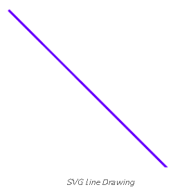
</p>
<!-- 09-image001.png - SVG Line Drawing -->
<div align="right">
  <b><a href="#toc">↥ back to top</a></b>
</div>
<!--~~~~~~~~~~~~~~~~~~~~~~~~~~~~~~~~~~~~~~~~~~-->
<h4>Example 2: Drawing a Circle</h4>
<!--~~~~~~~~~~~~~~~~~~~~~~~~~~~~~~~~~~~~~~~~~~-->
<p>In this example we uses the <mark>&lt;svg&gt;</mark> tag to draw a grey circle with a 
black border. The circle has a center at (80, 80) and a radius of 50.</p>

```
<!DOCTYPE html>
<html>

<head>
  <title>HTML SVG</title>
</head>

<body>
  <!-- html svg tag is used here -->
  <svg width="200" height="200">
    <circle cx="80" cy="80" 
    r="50" 
    stroke="black" 
    stroke-width="2" 
    fill="grey" />
  </svg>
</body>

</html>
```

<!--~~~~~~~~~~~~~~~~~~~~~~~~~~~~~~~~~~~~~~~~~~-->
<h5>Output</h5>
<!--~~~~~~~~~~~~~~~~~~~~~~~~~~~~~~~~~~~~~~~~~~-->
<!--~~~~~~~~~~~~~~~~~~~~~~~~~~~~~~~~~~~~~~~~~~~~~~~~~~~~~~~~~~~~~~~~~~~~~~~~~~~~~~~~~~~~~~~~~~~~-->
<!--~~~~~~~~~~~~~~~~~~~~~~~~~~~~~~~ svg 02 - svg circle drawing ~~~~~~~~~~~~~~~~~~~~~~~~~~~~~~~~-->
<p align="center">
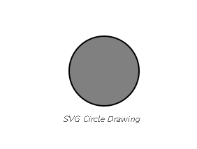
</p>
<!-- 09-image002.png - SVG Circle Drawing -->
<div align="right">
  <b><a href="#toc">↥ back to top</a></b>
</div>
<!--~~~~~~~~~~~~~~~~~~~~~~~~~~~~~~~~~~~~~~~~~~-->
<h4>Example 3: Drawing a Rectangle</h4>
<!--~~~~~~~~~~~~~~~~~~~~~~~~~~~~~~~~~~~~~~~~~~-->
<p>In this example we ses the &lt;svg&gt; tag to draw a blue rectangle with a black 
border. The rectangle has a width of 400 and a height of 100.</p>

```
<!DOCTYPE html>
<html>

<head>
  <title>HTML SVG</title>
</head>

<body>
  <!-- html svg tag is used here -->
  <svg width="400" height="100">
    <rect width="400" height="100" 
      style="fill: rgb(0, 0, 255);
      stroke-width: 10;
      stroke: rgb(0, 0, 0)" />
  </svg>
</body>

</html>
```

<!--~~~~~~~~~~~~~~~~~~~~~~~~~~~~~~~~~~~~~~~~~~-->
<h5>Output:</h5>
<!--~~~~~~~~~~~~~~~~~~~~~~~~~~~~~~~~~~~~~~~~~~-->
<!--~~~~~~~~~~~~~~~~~~~~~~~~~~~~~~~~~~~~~~~~~~~~~~~~~~~~~~~~~~~~~~~~~~~~~~~~~~~~~~~~~~~~~~~~~~~~-->
<!--~~~~~~~~~~~~~~~~~~~~~~~~~~~~~ svg 03 - svg rectangle drawing ~~~~~~~~~~~~~~~~~~~~~~~~~~~~~~~-->
<p align="center">
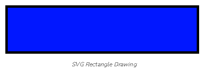
</p>
<!-- 09-image003.png - SVG Rectangle Drawing -->
<div align="right">
  <b><a href="#toc">↥ back to top</a></b>
</div>
<!--~~~~~~~~~~~~~~~~~~~~~~~~~~~~~~~~~~~~~~~~~~-->
<h4>Example 4: Drawing a Rounded Rectangle</h4>
<!--~~~~~~~~~~~~~~~~~~~~~~~~~~~~~~~~~~~~~~~~~~-->
<p>In this example we uses the &lt;svg&gt; tag to draw an orange rectangle with rounded 
corners, a black border, and 50% opacity, positioned at coordinates (80, 20).</p>

```
<!DOCTYPE html>
<html>

<head>
  <title>
    HTML SVG
  </title>
</head>

<body>
  <!-- html svg tag is used here -->
  <svg width="400" height="380">
    <rect x="80" y="20" rx="20" 
      ry="20" width="150" 
      height="150" 
      style="fill: orange;
      stroke: black;
      stroke-width: 2; 
      opacity: 0.5" />
  </svg>
</body>

</html>
```

<!--~~~~~~~~~~~~~~~~~~~~~~~~~~~~~~~~~~~~~~~~~~-->
<h5>Output:</h5>
<!--~~~~~~~~~~~~~~~~~~~~~~~~~~~~~~~~~~~~~~~~~~~~~~~~~~~~~~~~~~~~~~~~~~~~~~~~~~~~~~~~~~~~~~~~~~~~-->
<!--~~~~~~~~~~~~~~~~~~~~~~~~~ svg 04 - svg rounded rectangle drawing ~~~~~~~~~~~~~~~~~~~~~~~~~~~-->
<p align="center">
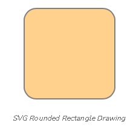
</p>
<!-- 09-image004.png - SVG Rounded Rectangle Drawing -->
<div align="right">
  <b><a href="#toc">↥ back to top</a></b>
</div>
<!--~~~~~~~~~~~~~~~~~~~~~~~~~~~~~~~~~~~~~~~~~~-->
<h4>Example 5: Drawing a Star</h4>
<!--~~~~~~~~~~~~~~~~~~~~~~~~~~~~~~~~~~~~~~~~~~-->
<p>In this example we uses the &lt;svg&gt; tag to draw a grey polygon with an orange 
border. The polygon is defined by a series of points and has a 5-pixel stroke width.</p>

```
<!DOCTYPE html>
<html>

<head>
  <title>HTML SVG</title>
</head>

<body>
  <!-- html svg tag is used here -->
  <svg width="300" height="200">
    <polygon points="100,10 40,198 190,78 10,78 160,198" 
      style="fill: grey; stroke: orange; 
      stroke-width: 5; fill-rule: evenodd" />
  </svg>
</body>

</html>
```

<!--~~~~~~~~~~~~~~~~~~~~~~~~~~~~~~~~~~~~~~~~~~-->
<h5>Output:</h5>
<!--~~~~~~~~~~~~~~~~~~~~~~~~~~~~~~~~~~~~~~~~~~-->
<!--~~~~~~~~~~~~~~~~~~~~~~~~~~~~~~~~~~~~~~~~~~~~~~~~~~~~~~~~~~~~~~~~~~~~~~~~~~~~~~~~~~~~~~~~~~~~-->
<!--~~~~~~~~~~~~~~~~~~~~~~~~~~~~~~~~ svg 05 - svg star drawing ~~~~~~~~~~~~~~~~~~~~~~~~~~~~~~~~~-->
<p align="center">

</p>
<!-- 09-image005.png - SVG Star Drawing-->
<div align="right">
  <b><a href="#toc">↥ back to top</a></b>
</div>
<!--~~~~~~~~~~~~~~~~~~~~~~~~~~~~~~~~~~~~~~~~~~-->
<h4>Example 6: Drawing a Logo</h4>
<!--~~~~~~~~~~~~~~~~~~~~~~~~~~~~~~~~~~~~~~~~~~-->
<p>In this example we create an ellipse filled with a linear gradient from white to 
green. It also includes text overlaid in white with the content “GeeksforGeeks” 
using the ARIAL font family.</p>

```
<!DOCTYPE html>
<html>

<body>
  <!-- html svg tag is used here -->
  <svg height="300" width="700">
    <defs>
      <linearGradient id="grad1" x1="0%" y1="0%" 
        x2="100%" y2="0%">
        <stop offset="0%" 
        style="stop-color:white; 
        stop-opacity: 1" />
        <stop offset="100%" 
        style="stop-color: green; 
        stop-opacity: 1" />
      </linearGradient>
    </defs>
    <ellipse cx="200" cy="100" rx="120" 
      ry="80" fill="url(#grad1)" />
    <text fill="#ffffff" font-size="22" 
      font-family="ARIAL" x="120" y="110">
      GeeksforGeeks
    </text>
  </svg>
</body>
  
</html>
```

<!--~~~~~~~~~~~~~~~~~~~~~~~~~~~~~~~~~~~~~~~~~~-->
<h5>Output:</h5>
<!--~~~~~~~~~~~~~~~~~~~~~~~~~~~~~~~~~~~~~~~~~~~~~~~~~~~~~~~~~~~~~~~~~~~~~~~~~~~~~~~~~~~~~~~~~~~~-->
<!--~~~~~~~~~~~~~~~~~~~~~~~~~ svg 06 - geeks-for-geeks logo using svg ~~~~~~~~~~~~~~~~~~~~~~~~~~-->
<p align="center">
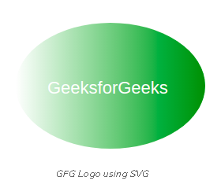
</p>
<!-- 09-image006.png - GFG Logo using SVG -->
<div align="right">
  <b><a href="#toc">↥ back to top</a></b>
</div>
<!--~~~~~~~~~~~~~~~~~~~~~~~~~~~~~~~~~~~~~~~~~~-->
<h3>SVG &lt;a&gt; Element</h3>
<!--~~~~~~~~~~~~~~~~~~~~~~~~~~~~~~~~~~~~~~~~~~-->
<p>The SVG <mark>&lt;a&gt;</mark> element creates a hyperlink within SVG graphics. It functions 
similarly to the HTML <mark>&lt;a&gt;</mark> element. It links to external resources or other parts 
of the SVG document.</p>
<!--~~~~~~~~~~~~~~~~~~~~~~~~~~~~~~~~~~~~~~~~~~-->
<h5>Syntax:</h5>
<!--~~~~~~~~~~~~~~~~~~~~~~~~~~~~~~~~~~~~~~~~~~-->

```
<a href="" 
  target="" 
  type="" 
  rel="" 
  download="">
</a>
```

<!--~~~~~~~~~~~~~~~~~~~~~~~~~~~~~~~~~~~~~~~~~~-->
<h4>SVG &lt;a&gt; Attributes</h4>
<!--~~~~~~~~~~~~~~~~~~~~~~~~~~~~~~~~~~~~~~~~~~-->
<div role="region" tabindex="0">
  <table>
    <caption>SVG &lt;a&gt; Attributes</caption>
    <thead>
      <tr>
        <th>Name</th>
        <th>Description</th>
      </tr>
    </thead>
    <tbody>
      <tr>
        <td>href</td>
        <td>It stands for hypertext reference and take the link to the other documents.</td>
      </tr>
      <tr>
        <td>download</td>
        <td>It instructs the browser to download a file.</td>
      </tr>
      <tr>
        <td>hreflang</td>
        <td>It is the human language of the ULR or in simple words the URL fragment that hyperlink point is the hreflang</td>
      </tr>
      <tr>
        <td>rel</td>
        <td>It tells the relationship between the target and source documents.</td>
      </tr>
      <tr>
        <td>target</td>
        <td>It tells about where the webpage is to be displayed.</td>
      </tr>
      <tr>
        <td>type</td>
        <td>I tells about the MIME type of the doucment linked with URL.</td>
      </tr>
      <tr>
        <td>ping</td>
        <td>It is the space-separated list of URLs.</td>
      </tr>
    </tbody>
  </table>
</div>
<!--~~~~~~~~~~~~~~~~~~~~~~~~~~~~~~~~~~~~~~~~~~-->
<h4>Examples of SVG &lt;a&gt; Element</h4>
<!--~~~~~~~~~~~~~~~~~~~~~~~~~~~~~~~~~~~~~~~~~~-->
<h5>Example 1:</h5>
<!--~~~~~~~~~~~~~~~~~~~~~~~~~~~~~~~~~~~~~~~~~~-->
<p>In this example we creates a green circle inside an SVG element. 
It’s wrapped with an anchor (&lt;a&gt;) tag, making it a clickable link that redirects to 
“geeksforgeeks.org” upon click.</p>

```
<!DOCTYPE html>
<html lang="en">

<head>
  <meta charset="UTF-8" />
  <title>SVG a Tag</title>
</head>

<body>
  <div style="width:300px; height:300px;">
    <h2>
      SVG &lt;a&gt; Tag
    </h2>

    <svg width="500" height="500">
      <a href="http://geeksforgeeks.org">
        <circle cx="150" cy="100" r="80" fill="green">
        </circle>
      </a>
    </svg>
  </div>
</body>

</html>
```

<div align="right">
  <b><a href="#toc">↥ back to top</a></b>
</div>
<!--~~~~~~~~~~~~~~~~~~~~~~~~~~~~~~~~~~~~~~~~~~-->
<h5>Output</h5>
<!--~~~~~~~~~~~~~~~~~~~~~~~~~~~~~~~~~~~~~~~~~~-->
<!--~~~~~~~~~~~~~~~~~~~~~~~~~~~~~~~~~~~~~~~~~~~~~~~~~~~~~~~~~~~~~~~~~~~~~~~~~~~~~~~~~~~~~~~~~~~~-->
<!--~~~~~~~~~~~~~~~~~~~~~~~~~~~~~~~ svg 07 - svg a tag example ~~~~~~~~~~~~~~~~~~~~~~~~~~~~~~~~~-->
<p align="center">
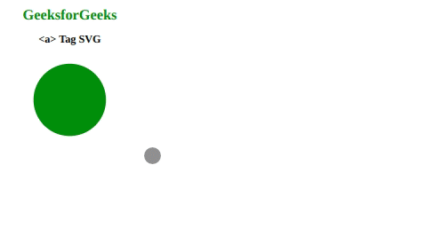
</p>
<!-- 09-image007.gif - SVG a tag example output -->
<!--~~~~~~~~~~~~~~~~~~~~~~~~~~~~~~~~~~~~~~~~~~-->
<h5>Example 2:</h5>
<!--~~~~~~~~~~~~~~~~~~~~~~~~~~~~~~~~~~~~~~~~~~-->
<p>In this example we defines a green rectangle within an SVG element. It’s encapsulated 
by an anchor (&lt;a&gt;) tag, creating a clickable area that redirects to another tab at 
“geeksforgeeks.org” using target blank upon click.</p>

```
<!DOCTYPE html>
<html lang="en">

<head>
    <title>SVG a Element</title>
</head>

<body>
  <div style="width:300px; height:300px;">
    <h2>
      &lt;a&gt; Tag SVG
    </h2>
    <svg width="500" height="500">
      <a href="http://geeksforgeeks.org" target="_blank">
        <rect x="80" y="30" 
          width="150" 
          height="80" 
          fill="green">
        </rect>
      </a>
    </svg>
  </div>
</body>
  
</html>
```

<!--~~~~~~~~~~~~~~~~~~~~~~~~~~~~~~~~~~~~~~~~~~-->
<h5>Output:</h5>
<!--~~~~~~~~~~~~~~~~~~~~~~~~~~~~~~~~~~~~~~~~~~-->
<!--~~~~~~~~~~~~~~~~~~~~~~~~~~~~~~~~~~~~~~~~~~~~~~~~~~~~~~~~~~~~~~~~~~~~~~~~~~~~~~~~~~~~~~~~~~~~-->
<!--~~~~~~~~~~~~~~~~~~~~~~~~~~~~~~~ svg 08 - svg a tag example ~~~~~~~~~~~~~~~~~~~~~~~~~~~~~~~~~-->
<p align="center">
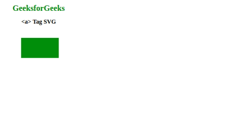
</p>
<!-- 09-image008.gif - SVG a tag example output -->
<div align="right">
  <b><a href="#toc">↥ back to top</a></b>
</div>
<!--~~~~~~~~~~~~~~~~~~~~~~~~~~~~~~~~~~~~~~~~~~-->
<h3>SVG &lt;animate&gt; Element</h3>
<!--~~~~~~~~~~~~~~~~~~~~~~~~~~~~~~~~~~~~~~~~~~-->
<p>SVG stands for Scalable Vector Graphic. It can be used to make graphics and animations 
like in HTML canvas.</p>

<p>The &lt;animate&gt; SVG element is used to animate an attribute or property of an 
element over time. It’s normally inserted inside the element which we want to animate.</p>
<!--~~~~~~~~~~~~~~~~~~~~~~~~~~~~~~~~~~~~~~~~~~-->
<h5>Syntax:</h5>
<!--~~~~~~~~~~~~~~~~~~~~~~~~~~~~~~~~~~~~~~~~~~-->

```
<animate attributeName="" values="" dur="" repeatCount="" />
```

<!--~~~~~~~~~~~~~~~~~~~~~~~~~~~~~~~~~~~~~~~~~~-->
<h5>Attributes:</h5>
<!--~~~~~~~~~~~~~~~~~~~~~~~~~~~~~~~~~~~~~~~~~~-->
<ul>
  <li><b>Animation Attributes</b>: Attributes used to give animation effects, exp timing attributes, event attributes, and value attributes, etc.</li>
  <li><b>Global Attributes</b>: some global attributes used like core attributes and styling attributes, etc.</li>
</ul>
<p>Below given are a few examples of the above element:</p>
<!--~~~~~~~~~~~~~~~~~~~~~~~~~~~~~~~~~~~~~~~~~~-->
<h5>Example 1:</h5>
<!--~~~~~~~~~~~~~~~~~~~~~~~~~~~~~~~~~~~~~~~~~~-->

```
<!DOCTYPE html>
<html>

<body>
  <svg viewBox="0 0 50 50">
    <rect width="10" height="10" fill="green">
      <animate attributeName="rx" values="0;20;0"
        dur="2s" repeatCount="10" />
    </rect>
  </svg>
</body>

</html>
```

<!--~~~~~~~~~~~~~~~~~~~~~~~~~~~~~~~~~~~~~~~~~~-->
<h5>Output:</h5>
<!--~~~~~~~~~~~~~~~~~~~~~~~~~~~~~~~~~~~~~~~~~~-->
<!--~~~~~~~~~~~~~~~~~~~~~~~~~~~~~~~~~~~~~~~~~~~~~~~~~~~~~~~~~~~~~~~~~~~~~~~~~~~~~~~~~~~~~~~~~~~~-->
<!--~~~~~~~~~~~~~~~~~~~~~~~ svg 09 - svg animate - rectangle to circle ~~~~~~~~~~~~~~~~~~~~~~~~~-->
<p align="center">

</p>
<!-- 09-image009.gif - svg animate - rectangle to circle -->
<div align="right">
  <b><a href="#toc">↥ back to top</a></b>
</div>
<!--~~~~~~~~~~~~~~~~~~~~~~~~~~~~~~~~~~~~~~~~~~-->
<h5>Example 2:</h5>
<!--~~~~~~~~~~~~~~~~~~~~~~~~~~~~~~~~~~~~~~~~~~-->

```
<!DOCTYPE html>
<html>
 
<body>
  <h1 style="color:green">
    GeeksforGeeks
  </h1>
  <h2>
    SVG animate element
  </h2>
  <svg viewBox="0 0 50 50">
    <rect width="7" height="7" fill="green">
      <animate attributeType="CSS" attributeName="opacity"
      from="1" to="0" dur="4s" repeatCount="indefinite" />
    </rect>
  </svg>
</body>

</html>
```

<!--~~~~~~~~~~~~~~~~~~~~~~~~~~~~~~~~~~~~~~~~~~-->
<h5>Output:</h5>
<!--~~~~~~~~~~~~~~~~~~~~~~~~~~~~~~~~~~~~~~~~~~-->
<!--~~~~~~~~~~~~~~~~~~~~~~~~~~~~~~~~~~~~~~~~~~~~~~~~~~~~~~~~~~~~~~~~~~~~~~~~~~~~~~~~~~~~~~~~~~~~-->
<!--~~~~~~~~~~~~~~~~~~~~~~~ svg 10 - svg animate - dark to light green ~~~~~~~~~~~~~~~~~~~~~~~~~-->
<p align="center">

</p>
<!-- 09-image010.gif - svg animate - dark to light green -->
<div align="right">
  <b><a href="#toc">↥ back to top</a></b>
</div>
<!--~~~~~~~~~~~~~~~~~~~~~~~~~~~~~~~~~~~~~~~~~~-->
<h3>SVG &lt;animateMotion&gt; Element</h3>
<!--~~~~~~~~~~~~~~~~~~~~~~~~~~~~~~~~~~~~~~~~~~-->
<p>SVG stands for Scalable Vector Graphic. It can be used to make graphics and animations 
like in HTML canvas.</p>

<p>The SVG &lt;animateMotion&gt; element let define how an element moves along a motion path.</p>
<!--~~~~~~~~~~~~~~~~~~~~~~~~~~~~~~~~~~~~~~~~~~-->
<h5>Syntax:</h5>
<!--~~~~~~~~~~~~~~~~~~~~~~~~~~~~~~~~~~~~~~~~~~-->

```
<animateMotion values="" dur="" repeatCount="" path="" />
```

<!--~~~~~~~~~~~~~~~~~~~~~~~~~~~~~~~~~~~~~~~~~~-->
<h5>Attributes:</h5>
<!--~~~~~~~~~~~~~~~~~~~~~~~~~~~~~~~~~~~~~~~~~~-->
<ul>
  <li><b>keyPoints</b>: This attribute indicates in the range [0, 1], how far is the object along 
    the path for each keyTimes associated values.</li>
  <li><b>path</b>: This attribute defines the path of the motion.</li>
  <li><b>rotate</b>: This attribute defines a rotation applied to the element animated along a path, 
    usually to make it point in the direction of the animation.</li>
  <li><b>Animation Attributes</b>: Attributes used to give animation effects, exp timing attributes, 
    event attributes, and value attributes, etc.</li>
  <li>Global Attributes</b>: some global attributes used like core attributes and styling attributes, etc.</li>
</ul>
<!--~~~~~~~~~~~~~~~~~~~~~~~~~~~~~~~~~~~~~~~~~~-->
<h5>Example:</h5>
<!--~~~~~~~~~~~~~~~~~~~~~~~~~~~~~~~~~~~~~~~~~~-->

```
<!DOCTYPE html>
<html>

<body>
  <svg width="1200" height="1200">
    <circle cx="60" cy="60" r="5" fill="green">
      <animateMotion dur="10s" repeatCount="indefinite"
      path="M20, 60 C20,
        -50 180, 150 180,
        60 C180-60 20,
        150 20, 60 z" />
    </circle>
  </svg>
</body>

</html>
```

<!--~~~~~~~~~~~~~~~~~~~~~~~~~~~~~~~~~~~~~~~~~~-->
<h5>Output:</h5>
<!--~~~~~~~~~~~~~~~~~~~~~~~~~~~~~~~~~~~~~~~~~~-->
<!--~~~~~~~~~~~~~~~~~~~~~~~~~~~~~~~~~~~~~~~~~~~~~~~~~~~~~~~~~~~~~~~~~~~~~~~~~~~~~~~~~~~~~~~~~~~~-->
<!--~~~~~~~~~~~~~~~~~~~~~~~~~~~~~~~ svg 11 - svg infinity ball ~~~~~~~~~~~~~~~~~~~~~~~~~~~~~~~~~-->
<p align="center">

</p>
<!-- 09-image011.gif - infinity ball -->
<div align="right">
  <b><a href="#toc">↥ back to top</a></b>
</div>
<!--~~~~~~~~~~~~~~~~~~~~~~~~~~~~~~~~~~~~~~~~~~-->
<h3>SVG &lt;animateTransform&gt; Element</h3>
<!--~~~~~~~~~~~~~~~~~~~~~~~~~~~~~~~~~~~~~~~~~~-->
<p>SVG stands for Scalable Vector Graphics. It defines vector-based graphics and animation like in HTML Canvas.</p>

<p>The animateTransform element animates a transformation attribute on its target 
element, thereby allowing animations to control translation, scaling, rotation, 
and/or skewing.</p>

<!--~~~~~~~~~~~~~~~~~~~~~~~~~~~~~~~~~~~~~~~~~~-->
<h5>Syntax:</h5>
<!--~~~~~~~~~~~~~~~~~~~~~~~~~~~~~~~~~~~~~~~~~~-->

```
<animateTransform attributeName=''transform''/>
```

<!--~~~~~~~~~~~~~~~~~~~~~~~~~~~~~~~~~~~~~~~~~~-->
<h5>Attribute:</h5>
<!--~~~~~~~~~~~~~~~~~~~~~~~~~~~~~~~~~~~~~~~~~~-->
<ul>
  <li><b>from</b>: Initial value of the attribute that will be modified during the animation.</li>
  <li><b>to</b>: Final value of the attribute that will be modified during the animation.</li>
  <li><b>type</b>: It defines the type of transformation, whose values change over time.</li>
  <li><b>dur</b>: Duration of the animation.</li>
  <li><b>repeatCount</b>: The number of times an animation will take place.</li>
  <li><b>repeatDur</b>: The total duration for repeating an animation.</li>
  <li><b>attributeName</b>: The name of the CSS property that is going to be animated.</li>
</ul>
<!--~~~~~~~~~~~~~~~~~~~~~~~~~~~~~~~~~~~~~~~~~~-->
<h5>Example:</h5>
<!--~~~~~~~~~~~~~~~~~~~~~~~~~~~~~~~~~~~~~~~~~~-->

```
<!DOCTYPE html>
<html>
  
<body>
  <svg width="120" height="120">
    <polygon points="60,30 90,90 30,90">
      <animateTransform attributeName="transform"
        attributeType="XML" type="rotate" 
        from="0 60 70" to="360 60 70"
        dur="10s" repeatCount="indefinite" />
    </polygon>
  </svg>
</body>
  
</html>
```

<!--~~~~~~~~~~~~~~~~~~~~~~~~~~~~~~~~~~~~~~~~~~-->
<h5>Output:</h5>
<!--~~~~~~~~~~~~~~~~~~~~~~~~~~~~~~~~~~~~~~~~~~-->
<!--~~~~~~~~~~~~~~~~~~~~~~~~~~~~~~~~~~~~~~~~~~~~~~~~~~~~~~~~~~~~~~~~~~~~~~~~~~~~~~~~~~~~~~~~~~~~-->
<!--~~~~~~~~~~~~~~~~~~~~~~~~~~~~ svg 12 - svg rotating rectangle ~~~~~~~~~~~~~~~~~~~~~~~~~~~~~~~-->
<p align="center">

</p>
<!-- 09-image012.gif - rotating rectangle -->
<div align="right">
  <b><a href="#toc">↥ back to top</a></b>
</div>
<!--~~~~~~~~~~~~~~~~~~~~~~~~~~~~~~~~~~~~~~~~~~-->
<h3>SVG Circle</h3>
<!--~~~~~~~~~~~~~~~~~~~~~~~~~~~~~~~~~~~~~~~~~~-->
<p>SVG Circle facilitates the &lt;circle&gt; element which can be utilized to create a 
circle. Basically, the &lt;circle&gt; element wrapped inside the &lt;svg&gt; element.</p>
<!--~~~~~~~~~~~~~~~~~~~~~~~~~~~~~~~~~~~~~~~~~~-->
<h5>Syntax</h5>
<!--~~~~~~~~~~~~~~~~~~~~~~~~~~~~~~~~~~~~~~~~~~-->

```
<svg>
  <circle cx="10" 
    cy="10" 
    r="30" 
    stroke="black" 
    stroke-width="3" 
    fill="red" />
</svg>
```

<!--~~~~~~~~~~~~~~~~~~~~~~~~~~~~~~~~~~~~~~~~~~-->
<h4>Attributes</h4
<!--~~~~~~~~~~~~~~~~~~~~~~~~~~~~~~~~~~~~~~~~~~-->
<p>The below are the attributes that can be used with the &lt;svg&gt; element</p>
<ul>
  <li>cx</b>: It defines the x-coordinate of the center of the circle.</li>
  <li><b>cy</b>: It defines the y-coordinate of the center of the circle.</li>
  <li><b>r</b>: It defines the radius of the circle.</li>
  <li><b>fill</b>: It specifies the color used to fill the circle (in this case, yellow).</li>
  <li><b>stroke-width</b>: It defines the width of the stroke (outline) of the circle.</li>
  <li><b>stroke</b>: It specifies the color of the stroke.</li>
  <li><b>Default Behavior</b>: If no fill parameter is used, the circle is filled with a 
    default color (generally black).</li>
</ul>
<!--~~~~~~~~~~~~~~~~~~~~~~~~~~~~~~~~~~~~~~~~~~-->
<h5>Example 1:</h5>
<!--~~~~~~~~~~~~~~~~~~~~~~~~~~~~~~~~~~~~~~~~~~-->
<p>In this example, we will implement code to see the SVG circle with the the help of 
above attributes.</p>

```
<!DOCTYPE html>
<html lang="en">

<head>
  <meta charset="UTF-8">
  <meta name="viewport" 
    content="width=device-width,
    initial-scale=1.0">
  <title>SVG to HTML</title>
  <link rel="stylesheet" 
    href="style.css">
</head>

<body>
  <div style="display: flex;
    flex-direction: column;
    justify-content: center; 
    align-items: center;
    height:100vh;">
    <h1 style="color: green;">
      GeeksforGeeks
    </h1>
    <p style="font-size: 20px">
      SVG Circle
    </p>

    <svg width="200"
      height="200" 
      style="border: 2px solid black;">
      <circle cx="95" 
        cy="95"
        r="70" 
        stroke="green" 
        stroke-width="5" 
        fill="yellowgreen" />
    </svg>
  </div>
  <script src="script.js"></script>
</body>

</html>
```

<!--~~~~~~~~~~~~~~~~~~~~~~~~~~~~~~~~~~~~~~~~~~-->
<h5>Output:</h5>
<!--~~~~~~~~~~~~~~~~~~~~~~~~~~~~~~~~~~~~~~~~~~-->
<!--~~~~~~~~~~~~~~~~~~~~~~~~~~~~~~~~~~~~~~~~~~~~~~~~~~~~~~~~~~~~~~~~~~~~~~~~~~~~~~~~~~~~~~~~~~~~-->
<!--~~~~~~~~~~~~~~~~~~~~ svg 13 - example svg circle from geeks-for-geeks ~~~~~~~~~~~~~~~~~~~~~~-->
<p align="center">
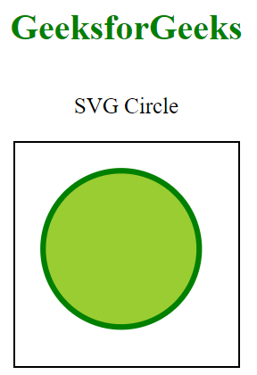
</p>
<!-- 09-image013.png - example svg circle from geeks 4 geeks -->
<div align="right">
  <b><a href="#toc">↥ back to top</a></b>
</div>
<!--~~~~~~~~~~~~~~~~~~~~~~~~~~~~~~~~~~~~~~~~~~-->
<h5>Example 2:</h5>
<!--~~~~~~~~~~~~~~~~~~~~~~~~~~~~~~~~~~~~~~~~~~-->
<p>In this example, we will show an SVG circle in HTML with the help of JavaScript.</p>

```
<!DOCTYPE html>
<html lang="en">

<head>
  <meta charset="UTF-8">
  <meta name="viewport" 
    content="width=device-width,
    initial-scale=1.0">
  <title>SVG to HTML</title>
  <link rel="stylesheet" href="style.css">
</head>

<body>
  <div style="display: flex; 
    flex-direction: column;
    justify-content: center;
    align-items: center;
    height:100vh;">
    <h1 style="color: green;">
      GeeksforGeeks
    </h1>
    <p style="font-size: 20px">
      SVG Circle
    </p>

    <svg width="200" 
      height="200" 
      style="border: 2px solid black;">
      <circle cx="95" 
              cy="95" 
               r="70" 
          stroke="blue" 
        stroke-width="5" />
    </svg>
  </div>
  <script src="script.js"></script>
</body>

</html>
```

<!--~~~~~~~~~~~~~~~~~~~~~~~~~~~~~~~~~~~~~~~~~~-->
<h5>Output:</h5>
<!--~~~~~~~~~~~~~~~~~~~~~~~~~~~~~~~~~~~~~~~~~~-->
<!--~~~~~~~~~~~~~~~~~~~~~~~~~~~~~~~~~~~~~~~~~~~~~~~~~~~~~~~~~~~~~~~~~~~~~~~~~~~~~~~~~~~~~~~~~~~~-->
<!--~~~~~~~~~~~~~~~~~~~~~~~ svg 14 -  black circle w/blue outer circle ~~~~~~~~~~~~~~~~~~~~~~~~~-->
<p align="center">
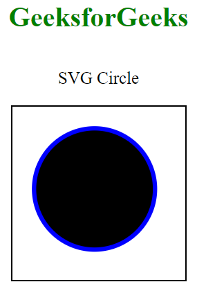
</p>
<!-- 09-image014.png - black circle w/blue outside -->
<div align="right">
  <b><a href="#toc">↥ back to top</a></b>
</div>
<!--~~~~~~~~~~~~~~~~~~~~~~~~~~~~~~~~~~~~~~~~~~-->
<h3>SVG &lt;clipPath&gt; Element</h3>
<!--~~~~~~~~~~~~~~~~~~~~~~~~~~~~~~~~~~~~~~~~~~-->
<p>The &lt;clipPath&gt; SVG element is used to define a clipping path that is to be used 
by the clip-path property. It works the same as clip-path in CSS. The clipPath element 
is used to put some restriction on a region such that anything drawn outside that region 
will neither be visible nor be drawn.</p>
<!--~~~~~~~~~~~~~~~~~~~~~~~~~~~~~~~~~~~~~~~~~~-->
<h5>Syntax</h5>
<!--~~~~~~~~~~~~~~~~~~~~~~~~~~~~~~~~~~~~~~~~~~-->

```
<clipPath> ... </clipPath>
```

<!--~~~~~~~~~~~~~~~~~~~~~~~~~~~~~~~~~~~~~~~~~~-->
<h5>Attributes</h5>
<!--~~~~~~~~~~~~~~~~~~~~~~~~~~~~~~~~~~~~~~~~~~-->
<p><b>clipPathUnits</b>: This attribute defines the coordinate system for the 
&lt;clipPath&gt; element’s content. Below given are a few examples of the function 
given above.</p>
<!--~~~~~~~~~~~~~~~~~~~~~~~~~~~~~~~~~~~~~~~~~~-->
<h5>Example 1:</h5>
<!--~~~~~~~~~~~~~~~~~~~~~~~~~~~~~~~~~~~~~~~~~~-->

```
<!DOCTYPE html>
<html lang="en">

<head>
  <meta charset="UTF-8" />
  <meta property="viewport" content=
    "width=device-width, initial-scale=1.0" />

  <title>SVG clipPath Element</title>

  <style>
    @keyframes animation1 {
      from {
        width: 4px;
        height: 4px;
      }

      to {
        width: 150px;
        height: 150px;
      }
    }

    rect {
      animation: animation1 10s ease-in-out;
    }
  </style>
</head>

<body>
  <div style="width: 300px; height: 300px;">

    <h1 style="color: green;">
      GeeksforGeeks
    </h1>
    <h2>
      SVG clipPath Element
    </h2>

    <svg width="500" height="500" 
      transform="translate(100, 0)">
      <clipPath id="gfg">
        <rect width="4" height="4"></rect>
      </clipPath>
      <path id="path" d="M10, 30 A20, 20, 0, 0,
        1, 50, 30 A20, 20, 0, 0, 1,
        90, 30 Q90, 60, 50, 90 Q10, 
        60, 10, 30 Z" />
      <use fill="green" clip-path="url(#gfg)" 
        href="#path" />
    </svg>
  </div>
</body>

</html>
```

<!--~~~~~~~~~~~~~~~~~~~~~~~~~~~~~~~~~~~~~~~~~~-->
<h5>Output:</h5>
<!--~~~~~~~~~~~~~~~~~~~~~~~~~~~~~~~~~~~~~~~~~~-->
<!--~~~~~~~~~~~~~~~~~~~~~~~~~~~~~~~~~~~~~~~~~~~~~~~~~~~~~~~~~~~~~~~~~~~~~~~~~~~~~~~~~~~~~~~~~~~~-->
<!--~~~~~~~~~~~~~~~~~~~~~~~~ svg 15 -  svg heart change blue to green ~~~~~~~~~~~~~~~~~~~~~~~~~~-->
<p align="center">

</p>
<!-- 09image015.gif - heart change black to green -->
<div align="right">
  <b><a href="#toc">↥ back to top</a></b>
</div>
<!--~~~~~~~~~~~~~~~~~~~~~~~~~~~~~~~~~~~~~~~~~~-->
<h5>Example 2:</h5>
<!--~~~~~~~~~~~~~~~~~~~~~~~~~~~~~~~~~~~~~~~~~~-->

```
<!DOCTYPE html>
<html lang="en">

<head>
  <meta charset="UTF-8" />
  <meta property="viewport" content=
    "width=device-width, initial-scale=1.0" />

  <title>SVG clipPath Element</title>

  <style>
    @keyframes star {
      from {
        r: 0
      }
      to {
        r: 500px
      }
    }
    #gfg circle {
      animation: star 25s ease;
    }
  </style>
</head>

<body>
  <div style="width:300px; height:300px;">
    <h1 style="color:green">
      GeeksforGeeks
    </h1>

    <h2>SVG clipPath Element</h2>

    <svg width="500" height="500"
      transform="translate(60, -40)">

      <clipPath id="gfg">
        <circle />
      </clipPath>

      <path id="star" d="
        M 85.000 105.000
        L 105.000 119.641
        L 102.321 95.000
        L 125.000 85.000
        L 102.321 75.000
        L 105.000 50.359
        L 85.000 65.000
        L 65.000 50.359
        L 67.679 75.000
        L 45.000 85.000
        L 67.679 95.000
        L 65.000 119.641
        z" />
      <use clip-path="url(#gfg)" 
        href="#star" fill="red" />
    </svg>
  </div>
</body>

</html>
```

<!--~~~~~~~~~~~~~~~~~~~~~~~~~~~~~~~~~~~~~~~~~~-->
<h5>Output</h5>
<!--~~~~~~~~~~~~~~~~~~~~~~~~~~~~~~~~~~~~~~~~~~-->
<!--~~~~~~~~~~~~~~~~~~~~~~~~~~~~~~~~~~~~~~~~~~~~~~~~~~~~~~~~~~~~~~~~~~~~~~~~~~~~~~~~~~~~~~~~~~~~-->
<!--~~~~~~~~~~~~~~~~~~~~~~~~ svg 16 -  svg transform star black to red ~~~~~~~~~~~~~~~~~~~~~~~~~-->
<p align="center">
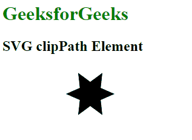
</p>
<!-- 09-image016.gif - transform black star to red -->
<div align="right">
  <b><a href="#toc">↥ back to top</a></b>
</div>
<!--~~~~~~~~~~~~~~~~~~~~~~~~~~~~~~~~~~~~~~~~~~~~~~~~~~~~~~~~~~~~~~~~~~~~~~~~~~~~~~~~~~~~~~~~~~~~-->
<h3>SVG defs Element</h3>
<!--~~~~~~~~~~~~~~~~~~~~~~~~~~~~~~~~~~~~~~~~~~~~~~~~~~~~~~~~~~~~~~~~~~~~~~~~~~~~~~~~~~~~~~~~~~~~-->
<p>The <mark>&lt;defs&gt;</mark> in SVG is used whenever we want a particular element to render only 
when required or when it is called. objects that are created inside <mark>&lt;defs&gt;</mark> element 
are not rendered directly they are needed to be called by <mark>&lt;use&gt;</mark> element to render 
them on the browser.</p>
<!--~~~~~~~~~~~~~~~~~~~~~~~~~~~~~~~~~~~~~~~~~~-->
<h5>Syntax:</h5>
<!--~~~~~~~~~~~~~~~~~~~~~~~~~~~~~~~~~~~~~~~~~~-->

```
<defs></defs>
```

<p><b>Property values:</b> It does not have any property values.</p>

<p>Below given are a few examples of the above function.</p>
<!--~~~~~~~~~~~~~~~~~~~~~~~~~~~~~~~~~~~~~~~~~~-->
<h5>Example 1:</h5>
<!--~~~~~~~~~~~~~~~~~~~~~~~~~~~~~~~~~~~~~~~~~~-->
<p>When &lt;defs&gt; is not called thus it is not executed.</p>

```
<!DOCTYPE html>
<html lang="en">
<head>
  <meta charset="UTF-8">
  <meta name="viewport"
        content="width=device-width, initial-scale=1.0">
  <title>Document</title>
</head>
<style>
  svg{
    background-color: green;
  }
</style>
<body>
  <h2>
    No Output only svg of size 100*100 is visible<br>
    and no circle stroke will be rendered</h2>
  <svg width="100px" height="100px">

    <!--this defs code will not be
        executed as it is not called-->
    <defs>
      <circle cx="50" cy="50" r="40"
        stroke="black"/>
    </defs>
  </svg>
</body>
</html>
```

<!--~~~~~~~~~~~~~~~~~~~~~~~~~~~~~~~~~~~~~~~~~~-->
<h5>Output:</h5>
<!--~~~~~~~~~~~~~~~~~~~~~~~~~~~~~~~~~~~~~~~~~~-->
<!--~~~~~~~~~~~~~~~~~~~~~~~~~~~~~~~~~~~~~~~~~~~~~~~~~~~~~~~~~~~~~~~~~~~~~~~~~~~~~~~~~~~~~~~~~~~~-->
<!--~~~~~~~~~~~~~~~~~~~~~~~~ svg 17 -  svg  ~~~~~~~~~~~~~~~~~~~~~~~~~-->
<p align="center">
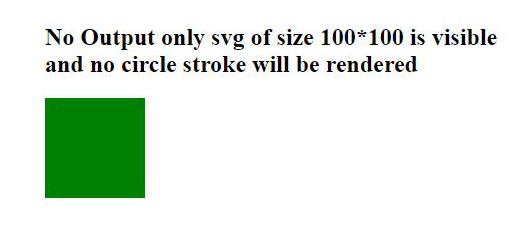
</p>
<!-- 09-image017.png -->
<div align="right">
  <b><a href="#toc">↥ back to top</a></b>
</div>
<!--~~~~~~~~~~~~~~~~~~~~~~~~~~~~~~~~~~~~~~~~~~-->
<h5>Example 2:</h5>
<!--~~~~~~~~~~~~~~~~~~~~~~~~~~~~~~~~~~~~~~~~~~-->

```
<!DOCTYPE html>
<html lang="en">
<head>
  <meta charset="UTF-8">
  <meta name="viewport"
    content="width=device-width, initial-scale=1.0">
  <title>Document</title>
</head>
<style>
svg{
  background-color: green;
}
</style> 
<body> 
  <svg width="100px" height="100px"> 
    <defs> 
      <circle id="ele" cx="50" cy="50"
        r="40" stroke="black"
        stroke-width="10"/> 
    </defs> 

    <!-- this defs code will not be executed 
         as it is not called using use -->
    <defs> 
      <circle id="ele" cx="50" cy="50"
        r="40" stroke="black"/> 
    </defs> 
    <use xlink:href="#ele"
      fill="url('#myGradient')" /> 
  </svg> 
</body> 
</html> 
```

<!--~~~~~~~~~~~~~~~~~~~~~~~~~~~~~~~~~~~~~~~~~~-->
<h5>Output:</h5>
<!--~~~~~~~~~~~~~~~~~~~~~~~~~~~~~~~~~~~~~~~~~~~~~~~~~~~~~~~~~~~~~~~~~~~~~~~~~~~~~~~~~~~~~~~~~~~~-->
<!--~~~~~~~~~~~~~~~~~~~~~~~~ svg 18 -  svg  ~~~~~~~~~~~~~~~~~~~~~~~~~-->
<p align="center">
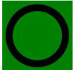
</p>
<!-- 09-image018.png -->
<div align="right">
  <b><a href="#toc">↥ back to top</a></b>
</div>
<!--~~~~~~~~~~~~~~~~~~~~~~~~~~~~~~~~~~~~~~~~~~-->
<h3>SVG &lt;desc&gt; Element</h3>
<!--~~~~~~~~~~~~~~~~~~~~~~~~~~~~~~~~~~~~~~~~~~-->
<p>The &lt;desc&gt; element in SVG is used to provide an accessible text description to 
any of the available SVG elements whether it is a container or graphic element.</p>

<p><b>Property Values</b>: It does not have any property values.</p>

<p>Below given are a few examples of the function given above.</p>
<!--~~~~~~~~~~~~~~~~~~~~~~~~~~~~~~~~~~~~~~~~~~-->
<h5>Example 1:</h5>
<!--~~~~~~~~~~~~~~~~~~~~~~~~~~~~~~~~~~~~~~~~~~-->
<p>The text inside the desc element is given in a circle element.</p>

```
<!DOCTYPE html>
<html lang="en">

<head>
  <meta charset="UTF-8">
  <meta name="viewport" path1tent=
    "width=device-width, initial-scale=1.0">
  <title>SVG desc Element</title>

  <style>
    svg {
      width: 200px;
      height: 200px;
      color: #ffffff;
      background-color: green;
    }
  </style>
</head>

<body>
  <svg>
    <circle cx="100" cy="100" r="80">
      <desc>Geeks for geeks</desc>
    </circle>
  </svg>
</body>

</html>
```

<!--~~~~~~~~~~~~~~~~~~~~~~~~~~~~~~~~~~~~~~~~~~-->
<h5>Output:</h5>
<!--~~~~~~~~~~~~~~~~~~~~~~~~~~~~~~~~~~~~~~~~~~-->
<p>Please note that the text is not shown in the output.</p>
<!--~~~~~~~~~~~~~~~~~~~~~~~~~~~~~~~~~~~~~~~~~~~~~~~~~~~~~~~~~~~~~~~~~~~~~~~~~~~~~~~~~~~~~~~~~~~~-->
<!--~~~~~~~~~~~~~~~~~~~~~~~~ svg 19 -  svg  ~~~~~~~~~~~~~~~~~~~~~~~~~-->
<p align="center">
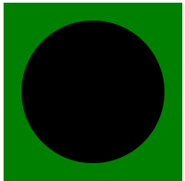
</p>
<!-- 09-image019.png -->
<div align="right">
  <b><a href="#toc">↥ back to top</a></b>
</div>
<!--~~~~~~~~~~~~~~~~~~~~~~~~~~~~~~~~~~~~~~~~~~-->
<h5>Example 2:</h5>
<!--~~~~~~~~~~~~~~~~~~~~~~~~~~~~~~~~~~~~~~~~~~-->
<p>The text inside the desc is given in a rectangle element.</p>

```
<!DOCTYPE html>
<html lang="en">

<head>
  <meta charset="UTF-8">
  <meta name="viewport" path1tent=
    "width=device-width, initial-scale=1.0">
  <title>SVG desc Element</title>

  <style>
    svg {
      width: 200px;
      height: 200px;
      color: black;
      background-color: green;
    }
  </style>
</head>

<body>
  <svg>
    <rect aria-describedby="info" 
      width="180" height="100" 
      x="10" y="50" fill="white" 
      stroke="black">
      <desc id="info">
        Geeks for geeks
      </desc>
    </rect>
  </svg>
</body>

</html>
```

<!--~~~~~~~~~~~~~~~~~~~~~~~~~~~~~~~~~~~~~~~~~~-->
<h5>Output:</h5>
<!--~~~~~~~~~~~~~~~~~~~~~~~~~~~~~~~~~~~~~~~~~~~~~~~~~~~~~~~~~~~~~~~~~~~~~~~~~~~~~~~~~~~~~~~~~~~~-->
<!--~~~~~~~~~~~~~~~~~~~~~~~~ svg 20 -  svg  ~~~~~~~~~~~~~~~~~~~~~~~~~-->
<p align="center">
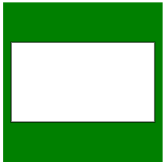
</p>
<!-- 09-image020.png -->
<div align="right">
  <b><a href="#toc">↥ back to top</a></b>
</div>
<!--~~~~~~~~~~~~~~~~~~~~~~~~~~~~~~~~~~~~~~~~~~-->
<h3>SVG Ellipse Element</h3>
<!--~~~~~~~~~~~~~~~~~~~~~~~~~~~~~~~~~~~~~~~~~~-->
<p>The SVG &lt;ellipse&gt; element is used to create an ellipse. The difference between circle and 
ellipse is that an ellipse has an x and a y radius that differs from each other, while a 
circle has equal x and y radius:</p>
<!--~~~~~~~~~~~~~~~~~~~~~~~~~~~~~~~~~~~~~~~~~~-->
<h5>Syntax:</h5>
<!--~~~~~~~~~~~~~~~~~~~~~~~~~~~~~~~~~~~~~~~~~~-->

```
<ellipse
  cx="x-axis co-ordinate"
  cy="y-axis co-ordinate" 
  rx="length" 
  ry="length" >    
</ellipse>
```

<!--~~~~~~~~~~~~~~~~~~~~~~~~~~~~~~~~~~~~~~~~~~-->
<h5>Attributes:</h5>
<!--~~~~~~~~~~~~~~~~~~~~~~~~~~~~~~~~~~~~~~~~~~-->
<ul>
  <li><b>cx:</b> x-axis co-ordinate of the center.</li>
  <li><b>cy:</b> y-axis co-ordinate of the center.</li>
  <li><b>rx:</b> x-axis radius of the ellipse.</li>
  <li><b>ry:</b> y-axis radius of the ellipse.</li>
</ul>
<!--~~~~~~~~~~~~~~~~~~~~~~~~~~~~~~~~~~~~~~~~~~-->
<h5>Example:</h5>
<!--~~~~~~~~~~~~~~~~~~~~~~~~~~~~~~~~~~~~~~~~~~-->

```
<html>
  <title>SVG Ellipse</title>
  <body>
    <svg width="400" height="400">
      <ellipse cx="100" cy="100" rx="90" ry="50" 
        stroke="black" stroke-width="2" fill="grey">
      </ellipse>
    </svg> 
  </body>
</html>
```

<!--~~~~~~~~~~~~~~~~~~~~~~~~~~~~~~~~~~~~~~~~~~-->
<h5>Output:</h5>
<!--~~~~~~~~~~~~~~~~~~~~~~~~~~~~~~~~~~~~~~~~~~~~~~~~~~~~~~~~~~~~~~~~~~~~~~~~~~~~~~~~~~~~~~~~~~~~-->
<!--~~~~~~~~~~~~~~~~~~~~~~~~ svg 21 -  svg  ~~~~~~~~~~~~~~~~~~~~~~~~~-->
<p align="center">
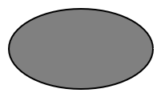
</p>
<!-- 09-image021.png -->
<div align="right">
  <b><a href="#toc">↥ back to top</a></b>
</div>
<!--~~~~~~~~~~~~~~~~~~~~~~~~~~~~~~~~~~~~~~~~~~-->
<h5>Example:</h5>
<!--~~~~~~~~~~~~~~~~~~~~~~~~~~~~~~~~~~~~~~~~~~-->
<p>Change the opacity.</h5>

```
<html>
  <title>SVG Ellipse</title>
  <body>
    <svg width="400" height="400">
      <ellipse cx="100" cy="100" rx="90" ry="50"
        stroke="black" stroke-width="2" fill="grey"
        opacity="0.5">     
      </ellipse>
    </svg>
  </body>
</html>
```

<!--~~~~~~~~~~~~~~~~~~~~~~~~~~~~~~~~~~~~~~~~~~-->
<h5>Output:</h5>
<!--~~~~~~~~~~~~~~~~~~~~~~~~~~~~~~~~~~~~~~~~~~-->
<!--~~~~~~~~~~~~~~~~~~~~~~~~~~~~~~~~~~~~~~~~~~~~~~~~~~~~~~~~~~~~~~~~~~~~~~~~~~~~~~~~~~~~~~~~~~~~-->
<!--~~~~~~~~~~~~~~~~~~~~~~~~ svg 22 -  svg  ~~~~~~~~~~~~~~~~~~~~~~~~~-->
<p align="center">
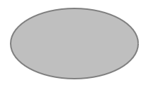
</p>
<!-- 09-image022.png -->
<div align="right">
  <b><a href="#toc">↥ back to top</a></b>
</div>
<!--~~~~~~~~~~~~~~~~~~~~~~~~~~~~~~~~~~~~~~~~~~-->
<h3>SVG &lt;feBlend&gt; Element</h3>
<!--~~~~~~~~~~~~~~~~~~~~~~~~~~~~~~~~~~~~~~~~~~-->
<p>SVG stands for Scalable Vector Graphic. It can be used to make graphics and animations 
like in HTML canvas.</p>

<p>&lt;feBlend&gt; element is used to combines two images or SVG fragments into a single 
graphic. It executes a pixel-wise combination of two input SVG fragments or images.</p>
<!--~~~~~~~~~~~~~~~~~~~~~~~~~~~~~~~~~~~~~~~~~~-->
<h5>Syntax:</h5>
<!--~~~~~~~~~~~~~~~~~~~~~~~~~~~~~~~~~~~~~~~~~~-->

```
 <feBlend in="" in2="" mode=""/>
```

<!--~~~~~~~~~~~~~~~~~~~~~~~~~~~~~~~~~~~~~~~~~~-->
<h5>Attributes:</h5>
<!--~~~~~~~~~~~~~~~~~~~~~~~~~~~~~~~~~~~~~~~~~~-->
<ul>
  <li><b>in</b> – It identifies input for the given filter primitive.</li>
  <li><b>in2</b> – It identifies the second input for the given filter primitive. It 
    takes on the same values as the ‘in’ attribute.</li>
  <li><b>mode</b> –  It defines the blending mode on the <feBlend> filter primitive. 
    If mode is not specified, the normal value is executed.</li>
</ul>
<!--~~~~~~~~~~~~~~~~~~~~~~~~~~~~~~~~~~~~~~~~~~-->
<h5>Example 1:</h5>
<!--~~~~~~~~~~~~~~~~~~~~~~~~~~~~~~~~~~~~~~~~~~-->

```
<!DOCTYPE html>
<html>

<body>
  <svg width="200" height="200">
    <defs>
      <filter id="spotlight">
        <feFlood result="floodFill"
          x="0" y="0" width="100%"
          height="100%" flood-color="green"
          flood-opacity="1" />
        <feBlend in="FillPaint"
          in2="floodFill" mode="multiply" />
      </filter>
    </defs>
    <rect x="40" y="40" width="100"
      height="100" style="stroke: #000000;
      fill: lightgreen;
      filter: url(#spotlight);" />
    <rect x="40" y="40" width="100" height="100"
      style="stroke: #000000; fill: green;" />
    <g fill="#FFFFFF" stroke="black" font-size="10"
      font-family="Verdana">
      <text x="50" y="90">GeeksForGeeks</text>
    </g>
  </svg>
</body>

</html>
```

<!--~~~~~~~~~~~~~~~~~~~~~~~~~~~~~~~~~~~~~~~~~~-->
<h5>Output:</h5>
<!--~~~~~~~~~~~~~~~~~~~~~~~~~~~~~~~~~~~~~~~~~~-->
<!--~~~~~~~~~~~~~~~~~~~~~~~~~~~~~~~~~~~~~~~~~~~~~~~~~~~~~~~~~~~~~~~~~~~~~~~~~~~~~~~~~~~~~~~~~~~~-->
<!--~~~~~~~~~~~~~~~~~~~~~~~~ svg 23 -  svg  ~~~~~~~~~~~~~~~~~~~~~~~~~-->
<p align="center">

</p>
<!-- 09-image023.png -->
<div align="right">
  <b><a href="#toc">↥ back to top</a></b>
</div>
<!--~~~~~~~~~~~~~~~~~~~~~~~~~~~~~~~~~~~~~~~~~~-->
<h5>Example 2:</h5>
<!--~~~~~~~~~~~~~~~~~~~~~~~~~~~~~~~~~~~~~~~~~~-->

```
<!DOCTYPE html> 
<html> 

<body> 
  <svg width="200" height="200"> 
    <defs> 
      <filter id="Screen"> 
        <feBlend mode="screen"
          in2="BackgroundImage"
          in="SourceGraphic" /> 
      </filter> 
    </defs> 
    <rect x="1" y="1" width="198"
      height="118" style="stroke: #000000; 
      fill: black; 
      filter: url(#Screen);" /> 
    <circle cx="100" cy="60" r="55"
      stroke="black" stroke-width="3"
      fill="Lightgreen" /> 
    <g fill="#FFFFFF" stroke="Green"
      font-size="10" c font-family="Verdana"> 
      <text x="60" y="62">GeeksForGeeks</text> 
    </g> 
  </svg> 
</body> 

</html> 
```

<!--~~~~~~~~~~~~~~~~~~~~~~~~~~~~~~~~~~~~~~~~~~-->
<h5>Output:</h5>
<!--~~~~~~~~~~~~~~~~~~~~~~~~~~~~~~~~~~~~~~~~~~-->
<!--~~~~~~~~~~~~~~~~~~~~~~~~~~~~~~~~~~~~~~~~~~~~~~~~~~~~~~~~~~~~~~~~~~~~~~~~~~~~~~~~~~~~~~~~~~~~-->
<!--~~~~~~~~~~~~~~~~~~~~~~~~ svg 24 -  svg  ~~~~~~~~~~~~~~~~~~~~~~~~~-->
<p align="center">
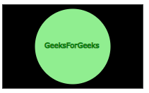
</p><!-- 09-image024.png -->
<div align="right">
  <b><a href="#toc">↥ back to top</a></b>
</div>
<!--~~~~~~~~~~~~~~~~~~~~~~~~~~~~~~~~~~~~~~~~~~-->
<h3>SVG &lt;feComponentTransfer&gt; Element</h3>
<!--~~~~~~~~~~~~~~~~~~~~~~~~~~~~~~~~~~~~~~~~~~-->
<p>SVG stands for Scalable Vector Graphic. It can be used to make graphics and animations like in HTML canvas.</p>
<p>&lt;feComponentTransfer&gt; element implements color manipulations on each color channel separately.</p>
<p>The four color channel of this element are &lt;feFuncR&gt;, &lt;feFuncG&gt;,&lt;feFuncB&gt;, and 
  &lt;feFuncA&gt;.</p>
<p>While performing color manipulations the element should only have one child element of each type.</p>
<!--~~~~~~~~~~~~~~~~~~~~~~~~~~~~~~~~~~~~~~~~~~-->
<h5>Syntax:</h5>
<!--~~~~~~~~~~~~~~~~~~~~~~~~~~~~~~~~~~~~~~~~~~-->
&lt;feComponentTransfer in=""&gt;

----
&lt;/feComponentTransfer&gt;

<!--~~~~~~~~~~~~~~~~~~~~~~~~~~~~~~~~~~~~~~~~~~-->
<h5>Attributes :</h5>
<!--~~~~~~~~~~~~~~~~~~~~~~~~~~~~~~~~~~~~~~~~~~-->
<p>in – It store input for the given primitive.</p>
<!--~~~~~~~~~~~~~~~~~~~~~~~~~~~~~~~~~~~~~~~~~~-->
<h5>Example 1:</h5>
<!--~~~~~~~~~~~~~~~~~~~~~~~~~~~~~~~~~~~~~~~~~~-->

```
<html>
<title>SVG Filter</title>
<body>

  <svg width="640" height="550" viewBox="0 0 640 550">
    <defs>
      <filter id="new" filterUnits="objectBoundingBox" x="0%" y="0%" width="100%" height="100%">
        <feComponentTransfer>
          <feFuncA type="table" tableValues="0 0 1 1"/>
          <feFuncB type="table" tableValues="0 1 0 1"/>
          <feFuncG type="table" tableValues="1 1 0 0"/>
          <feFuncR type="table" tableValues="0 0 1 0"/>
        </feComponentTransfer>
      </filter> 
    </defs>
    <image x="10" y="10" width="280" height="350" preserveAspectRatio="true"
      xlink:href="C:/Users/pc/Desktop/gfg/Capture25.png"/> 
    <image x="310" y="10" width="280" height="350" preserveAspectRatio="true"
      filter="url(#new)" xlink:href="C:/Users/pc/Desktop/gfg/Capture25.png"/>
  </svg>

</body>
</html>
```

<!--~~~~~~~~~~~~~~~~~~~~~~~~~~~~~~~~~~~~~~~~~~-->
<h5>Output:</h5>
<!--~~~~~~~~~~~~~~~~~~~~~~~~~~~~~~~~~~~~~~~~~~-->
<!--~~~~~~~~~~~~~~~~~~~~~~~~~~~~~~~~~~~~~~~~~~~~~~~~~~~~~~~~~~~~~~~~~~~~~~~~~~~~~~~~~~~~~~~~~~~~-->
<!--~~~~~~~~~~~~~~~~~~~~~~~~ svg 25 -  svg  ~~~~~~~~~~~~~~~~~~~~~~~~~-->
<p align="center">

</p>
<!-- 09-image025.png -->
<div align="right">
  <b><a href="#toc">↥ back to top</a></b>
</div>
<!--~~~~~~~~~~~~~~~~~~~~~~~~~~~~~~~~~~~~~~~~~~-->
<h5>Example 2:</h5>
<!--~~~~~~~~~~~~~~~~~~~~~~~~~~~~~~~~~~~~~~~~~~-->

```
<html>
<title>SVG Filter</title>
<body>

  <svg width="640" height="550" viewBox="0 0 640 550">
    <defs>
      <filter id="new" filterUnits="objectBoundingBox" x="0%" y="0%" width="100%" height="100%">
        <feComponentTransfer in="BackgroundImage" result="A">
        <feFuncA type="discrete" tableValues="0 0 1 1"/>
        <feFuncB type="discrete" tableValues="0.0 0.6 0.1 0.0"/>
        <feFuncG type="discrete" tableValues="1 0.5 0.5 0.5"/>
        <feFuncR type="discrete" tableValues="0.5 1 1 1.0"/>
        </feComponentTransfer>
      </filter>
    </defs>

    <image x="10" y="10" width="280" height="350" preserveAspectRatio="true"
      xlink:href="C:/Users/pc/Desktop/gfg/Capture82.png"/>
    <image x="310" y="10" width="280" height="350" preserveAspectRatio="true" filter="url(#new)"
      xlink:href="C:/Users/pc/Desktop/gfg/Capture82.png"/>
  </svg>

</body>
</html>
```

<!--~~~~~~~~~~~~~~~~~~~~~~~~~~~~~~~~~~~~~~~~~~-->
<h5>Output:</h5>
<!--~~~~~~~~~~~~~~~~~~~~~~~~~~~~~~~~~~~~~~~~~~-->
<!--~~~~~~~~~~~~~~~~~~~~~~~~~~~~~~~~~~~~~~~~~~~~~~~~~~~~~~~~~~~~~~~~~~~~~~~~~~~~~~~~~~~~~~~~~~~~-->
<!--~~~~~~~~~~~~~~~~~~~~~~~~ svg 26 -  svg  ~~~~~~~~~~~~~~~~~~~~~~~~~-->
<p align="center">

</p>
<!-- 09-image026.png -->
<div align="right">
  <b><a href="#toc">↥ back to top</a></b>
</div>
<!--~~~~~~~~~~~~~~~~~~~~~~~~~~~~~~~~~~~~~~~~~~-->
<h5>Example 3:</h5>
<!--~~~~~~~~~~~~~~~~~~~~~~~~~~~~~~~~~~~~~~~~~~-->

```
<html>
<title>SVG Filter</title>
<body>

  <svg width="640" height="550" viewBox="0 0 640 550">
    <defs>
      <filter id="new" filterUnits="objectBoundingBox" x="0%" y="0%" width="100%" height="100%">
        <feComponentTransfer in="BackgroundImage" result="A">
          <feFuncA type="table" tableValues="0 0 1 1"/>
          <feFuncB type="discrete" tableValues="0 1 1 0"></feFuncB>
          <feFuncG type="gamma" amplitude="3" exponent="3" offset="0"></feFuncG>
          <feFuncR type="linear" slope="1.5" intercept="2"></feFuncR>
        </feComponentTransfer>
      </filter> 
    </defs> 

    <image x="10" y="10" width="280" height="350" preserveAspectRatio="true"
      xlink:href="C:/Users/pc/Desktop/gfg/Capture26.png"/>
    <image x="310" y="10" width="280" height="350" preserveAspectRatio="true" filter="url(#new)"
      xlink:href="C:/Users/pc/Desktop/gfg/Capture26.png"/>
  </svg>

</body> 
</html> 
```

<!--~~~~~~~~~~~~~~~~~~~~~~~~~~~~~~~~~~~~~~~~~~-->
<h5>Output:</h5>
<!--~~~~~~~~~~~~~~~~~~~~~~~~~~~~~~~~~~~~~~~~~~-->
<!--~~~~~~~~~~~~~~~~~~~~~~~~~~~~~~~~~~~~~~~~~~~~~~~~~~~~~~~~~~~~~~~~~~~~~~~~~~~~~~~~~~~~~~~~~~~~-->
<!--~~~~~~~~~~~~~~~~~~~~~~~~ svg 27 -  svg  ~~~~~~~~~~~~~~~~~~~~~~~~~-->
<p align="center">
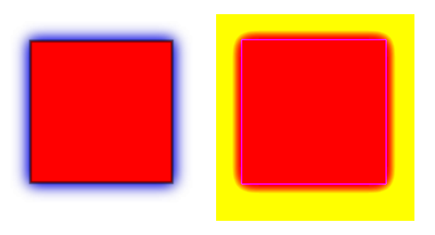
</p>
<!-- 09-image027.png -->
<div align="right">
  <b><a href="#toc">↥ back to top</a></b>
</div>
<!--~~~~~~~~~~~~~~~~~~~~~~~~~~~~~~~~~~~~~~~~~~-->
<h3>SVG &lt;feConvolveMatrix&gt; Element</h3>
<!--~~~~~~~~~~~~~~~~~~~~~~~~~~~~~~~~~~~~~~~~~~-->
<p>SVG stands for Scalable Vector Graphic. It can be used to make graphics and animations 
like in HTML canvas.</p>

<p>The &lt;feConvolveMatrix&gt; SVG filter primitive changes pixels in the input image 
with neighboring pixels to produce a resulting image.</p>
<!--~~~~~~~~~~~~~~~~~~~~~~~~~~~~~~~~~~~~~~~~~~-->
<h5>Syntax:</h5>
<!--~~~~~~~~~~~~~~~~~~~~~~~~~~~~~~~~~~~~~~~~~~-->

```
<feConvolveMatrix in="" order="" kernelMatrix="" divisor="" 
  bias="" targetX="" targetY="" edgeMode="" kernelUnitLength=""
  preserveAlpha="" />
```

<!--~~~~~~~~~~~~~~~~~~~~~~~~~~~~~~~~~~~~~~~~~~-->
<h5>Attributes:</h5>
<!--~~~~~~~~~~~~~~~~~~~~~~~~~~~~~~~~~~~~~~~~~~-->
<ul>
  <li><b>in</b> – It stores input for the given primitive.</li>
  <li><b>order</b> – It tests the size of the matrix to be used by the filter element. 
    By default, it is  3 X 3.</li>
  <li><b>kernelMatrix</b> – It defines the list of numbers that form the kernel matrix.</li>
  <li><b>divisor</b> –  It defines the sum of values of the kernel matrix. By default, 
    it is set to 1.</li>
  <li><b>bias</b> – It sets the range of the filter.  By default, it is set to 0.</li>
  <li><b>targetX</b> – It shifts the convolution matrix horizontally. (Range –  0 &lt;= 
    targetX &lt; orderX).</li>
  <li><b>targetY</b> –  It shifts the convolution matrix vertically.  (Range –  0 &lt;= 
    targetY &lt; orderY).</li>
  <li><b>kernelUnitLength</b> – It tells the intended distance between successive columns 
    and rows in the kernelMatrix. The intended distance is represented in current filter 
    units. The default value is 1.</li>
  <li><b>preserveAlpha</b> – It value is either true or false. It indicates whether the 
    convolution will only apply to the alpha and color channels. The default value is false.</li>
</ul>
<!--~~~~~~~~~~~~~~~~~~~~~~~~~~~~~~~~~~~~~~~~~~-->
<h5>Example 1:</h5>
<!--~~~~~~~~~~~~~~~~~~~~~~~~~~~~~~~~~~~~~~~~~~-->

```
<!DOCTYPE html> 
<html> 

<body>
  <svg width="100%" height="220"> 
    <defs> 
      <filter id="convolve"> 
        <feConvolveMatrix kernelMatrix= 
          "1 5 -1 -1 0 4 0 0 -1" /> 
      </filter> 
    </defs> 

    <rect x="40" y="40" width="100"
      height="100"
      filter: url(#convolve) style= 
      "stroke: #000000; 
      fill: darkgreen;" /> 

    <g fill="#FFFFFF" stroke="black"
      font-size="10" font-family="Verdana"> 

      <text x="50" y="90"
        filter="url(#convolve)"> 
        GeeksForGeeks 
      </text> 
    </g> 
  </svg> 
</body> 

</html> 
```

<!--~~~~~~~~~~~~~~~~~~~~~~~~~~~~~~~~~~~~~~~~~~-->
<h5>Output:</h5>
<!--~~~~~~~~~~~~~~~~~~~~~~~~~~~~~~~~~~~~~~~~~~-->
<!--~~~~~~~~~~~~~~~~~~~~~~~~~~~~~~~~~~~~~~~~~~~~~~~~~~~~~~~~~~~~~~~~~~~~~~~~~~~~~~~~~~~~~~~~~~~~-->
<!--~~~~~~~~~~~~~~~~~~~~~~~~ svg 28 -  svg  ~~~~~~~~~~~~~~~~~~~~~~~~~-->
<p align="center">

</p>
<!-- 09-image028.png -->
<div align="right">
  <b><a href="#toc">↥ back to top</a></b>
</div>
<!--~~~~~~~~~~~~~~~~~~~~~~~~~~~~~~~~~~~~~~~~~~-->
<h5>Example 2:</h5>
<!--~~~~~~~~~~~~~~~~~~~~~~~~~~~~~~~~~~~~~~~~~~-->

```
<!DOCTYPE html> 
<html> 
<title>SVG Filter</title> 

<body>
  <svg width="100%" height="220"> 
    <defs> 
      <filter id="convolve"> 
        <feConvolveMatrix kernelMatrix
        ="-7 -10 -15 -10 10 -1 0 0 -1" /> 
      </filter> 
    </defs> 

    <rect x="1" y="1" width="198"
      height="118"
      style="stroke: #000000; 
        fill: none; 
        filter: url(#convolve);" /> 

    <circle cx="100" cy="60" r="55"
      stroke="black" stroke-width="3"
      fill="Lightgreen"
      filter: url(#convolve) /> 

    <g fill="#FFFFFF" stroke="black"
      font-size="10" font-family="Verdana"> 
      <text x="60" y="62" filter="url(#convolve)"> 
        GeeksForGeeks</text> 
    </g> 
  </svg> 
</body> 

</html> 
```

<!--~~~~~~~~~~~~~~~~~~~~~~~~~~~~~~~~~~~~~~~~~~-->
<h5>Output:</h5>
<!--~~~~~~~~~~~~~~~~~~~~~~~~~~~~~~~~~~~~~~~~~~-->
<!--~~~~~~~~~~~~~~~~~~~~~~~~~~~~~~~~~~~~~~~~~~~~~~~~~~~~~~~~~~~~~~~~~~~~~~~~~~~~~~~~~~~~~~~~~~~~-->
<!--~~~~~~~~~~~~~~~~~~~~~~~~ svg 29 -  svg  ~~~~~~~~~~~~~~~~~~~~~~~~~-->
<p align="center">
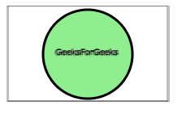
</p>
<!-- 09-image029.png -->
<div align="right">
  <b><a href="#toc">↥ back to top</a></b>
</div>
<!--~~~~~~~~~~~~~~~~~~~~~~~~~~~~~~~~~~~~~~~~~~-->
<h3>SVG feDiffuseLighting Element</h3>
<!--~~~~~~~~~~~~~~~~~~~~~~~~~~~~~~~~~~~~~~~~~~-->
<p>The SVG &lt;feDiffuseLighting&gt; filter primitive lights an image using the alpha 
channel as a bump map. Using diffuse lighting the sides of the object facing the light 
are brighter and the sides facing away are darker and in shadow.</p>
<!--~~~~~~~~~~~~~~~~~~~~~~~~~~~~~~~~~~~~~~~~~~-->
<h5>Syntax :</h5>
<!--~~~~~~~~~~~~~~~~~~~~~~~~~~~~~~~~~~~~~~~~~~-->

```
<feDiffuseLighting> Contents... </feDiffuseLighting>
```

<!--~~~~~~~~~~~~~~~~~~~~~~~~~~~~~~~~~~~~~~~~~~-->
<h5>Attributes:</h5>
<!--~~~~~~~~~~~~~~~~~~~~~~~~~~~~~~~~~~~~~~~~~~-->
<ul>
  <li><b>in</b> —The in attribute identifies input for the given filter primitive.</li>
  <li><b>surfaceScale</b> — It represents the height of the surface. Its value is multiplied by the alpha value. Default value is 1.</li>
  <li><b>diffuseConstant</b> — It is a non-negative number whose default value is 1.</li>
  <li><b>kernelUnitLength</b> — It tells the intended distance between successive columns and rows in the kernelMatrix. The intended distance is represented in current filter units. Default value is 1.</li>
</ul>
<!--~~~~~~~~~~~~~~~~~~~~~~~~~~~~~~~~~~~~~~~~~~-->
<h5>Example 1:</h5>
<!--~~~~~~~~~~~~~~~~~~~~~~~~~~~~~~~~~~~~~~~~~~-->

```
<!DOCTYPE html> 
<html> 

<body>
  <svg viewBox="0 0 1000 1000"> 
    <filter id="lightMe2"> 
      <feDiffuseLighting in="SourceGraphic"
        surfaceScale="1" diffuseConstant="2"
        kernelUnitLength="2"> 

        <fePointLight x="80" y="80" z="40" /> 

        <feDistantLight azimuth="240"
          elevation="20" /> 
      </feDiffuseLighting> 

      <feComposite in="SourceGraphic" in2="light"
        operator="arithmetic" k1="1" k2="0"
        k3="0" k4="0" /> 
    </filter> 

    <rect x="20" y="20" width="200" height="200"
      fill="green"
      style="filter: url(#lightMe2);" /> 
  </svg> 
</body> 

</html>
```

<!--~~~~~~~~~~~~~~~~~~~~~~~~~~~~~~~~~~~~~~~~~~-->
<h5>Output:</h5>
<!--~~~~~~~~~~~~~~~~~~~~~~~~~~~~~~~~~~~~~~~~~~-->
<!--~~~~~~~~~~~~~~~~~~~~~~~~~~~~~~~~~~~~~~~~~~~~~~~~~~~~~~~~~~~~~~~~~~~~~~~~~~~~~~~~~~~~~~~~~~~~-->
<!--~~~~~~~~~~~~~~~~~~~~~~~~ svg 30 -  svg  ~~~~~~~~~~~~~~~~~~~~~~~~~-->
<p align="center">
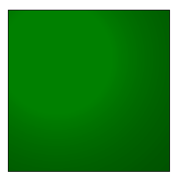
</p>
<!-- 09-image030.png -->
<div align="right">
  <b><a href="#toc">↥ back to top</a></b>
</div>
<!--~~~~~~~~~~~~~~~~~~~~~~~~~~~~~~~~~~~~~~~~~~-->
<h5>Example 2:</h5>
<!--~~~~~~~~~~~~~~~~~~~~~~~~~~~~~~~~~~~~~~~~~~-->

```
<!DOCTYPE html>
<html>

<body>
  <svg viewBox="0 0 1000 1000">
    <filter id="lightMe3">
      <feDiffuseLighting in="BackgroundImage"
        surfaceScale="4" diffuseConstant="2"
        kernelUnitLength="2">

        <feSpotLight x="30" y="20" z="30"
          limitingConeAngle="40"
          pointsAtX="200" pointsAtY="200"
          pointsAtZ="0" />

        <fePointLight x="80" y="80" z="40" />
      </feDiffuseLighting>

      <feComposite in="SourceGraphic"
        in2="light" operator="arithmetic"
        k1="1" k2="0" k3="0" k4="0" />
    </filter>

    <rect x="20" y="20" width="200" height="200"
      fill="blue"
      style="filter: url(#lightMe3);" />
  </svg>
</body>

</html>
```

<!--~~~~~~~~~~~~~~~~~~~~~~~~~~~~~~~~~~~~~~~~~~-->
<h5>Output:</h5>
<!--~~~~~~~~~~~~~~~~~~~~~~~~~~~~~~~~~~~~~~~~~~-->
<!--~~~~~~~~~~~~~~~~~~~~~~~~~~~~~~~~~~~~~~~~~~~~~~~~~~~~~~~~~~~~~~~~~~~~~~~~~~~~~~~~~~~~~~~~~~~~-->
<!--~~~~~~~~~~~~~~~~~~~~~~~~ svg 31 -  svg  ~~~~~~~~~~~~~~~~~~~~~~~~~-->
<p align="center">
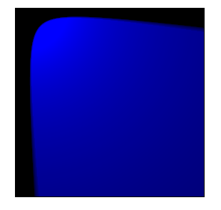
</p>
<!-- 09-image031.png -->
<div align="right">
  <b><a href="#toc">↥ back to top</a></b>
</div>
<!--~~~~~~~~~~~~~~~~~~~~~~~~~~~~~~~~~~~~~~~~~~-->
<h3>SVG &lt;feDisplacementMap&gt; Element</h3>
<!--~~~~~~~~~~~~~~~~~~~~~~~~~~~~~~~~~~~~~~~~~~-->
<p>SVG stands for Scalable Vector Graphic. It can be used to make graphics and animations 
like in HTML canvas.</p>

<p>The &lt;feDisplacementMap&gt; SVG filter primitive is use to spatially displace the 
image content using a displacement map. It takes two inputs to produce one result. 
The image content to displace is specified in the “in2” attribute. The content to 
which displacement effect is applied is reserved in “in” attribute.</p>
<!--~~~~~~~~~~~~~~~~~~~~~~~~~~~~~~~~~~~~~~~~~~-->
<h5>Syntax:</h5>
<!--~~~~~~~~~~~~~~~~~~~~~~~~~~~~~~~~~~~~~~~~~~-->

```
<feDisplacementMap in2="" in="" scale="" 
  xChannelSelector="" yChannelSelector=""/>
```
    
<!--~~~~~~~~~~~~~~~~~~~~~~~~~~~~~~~~~~~~~~~~~~-->
<h5>Attributes:</h5>
<!--~~~~~~~~~~~~~~~~~~~~~~~~~~~~~~~~~~~~~~~~~~-->
<ul>
  <li><b>in</b> – It identifies input for the given filter primitive.</li>
  <li><b>in2</b> – It identifies the second input for the given filter primitive. It 
    works exactly like the in attribute.</li>
  <li><b>scale</b> – It defines the displacement scale factor to be used on a 
    &lt;feDisplacementMap&gt; filter primitive.</li>
  <li><b>xChannelSelector</b> -It indicates which color channel from in2 to used to 
    displace the pixels in ‘in’ along the x-axis.</li>
  <li><b>yChannelSelector</b> – Itindicates which color channel from in2 to used to 
    displace the pixels in ‘in’ along the y-axis.</li>
</ul>
<!--~~~~~~~~~~~~~~~~~~~~~~~~~~~~~~~~~~~~~~~~~~-->
<h5>Example 1:</h5>
<!--~~~~~~~~~~~~~~~~~~~~~~~~~~~~~~~~~~~~~~~~~~-->

```
<!DOCTYPE html> 
<html> 

<body> 
  <svg width="200" height="200"
    viewBox="0 0 220 220"> 

    <filter id="displacementFilter"> 
      <feTurbulence type="turbulence"
        baseFrequency="1"
        numOctaves="2"
        result="turbulence" /> 
      <feDisplacementMap in2="turbulence"
        in="SourceGraphic" scale="50"
        xChannelSelector="R"
        yChannelSelector="B" /> 
    </filter> 

    <circle cx="100" cy="100" r="100"
      stroke="green" style= 
      "filter: url(#displacementFilter)" /> 
  </svg> 
</body> 

</html> 
```

<!--~~~~~~~~~~~~~~~~~~~~~~~~~~~~~~~~~~~~~~~~~~-->
<h5>Output:</h5>
<!--~~~~~~~~~~~~~~~~~~~~~~~~~~~~~~~~~~~~~~~~~~-->
<!--~~~~~~~~~~~~~~~~~~~~~~~~~~~~~~~~~~~~~~~~~~~~~~~~~~~~~~~~~~~~~~~~~~~~~~~~~~~~~~~~~~~~~~~~~~~~-->
<!--~~~~~~~~~~~~~~~~~~~~~~~~ svg 32 -  svg  ~~~~~~~~~~~~~~~~~~~~~~~~~-->
<p align="center">

</p>
<!-- 09-image032.png -->
<div align="right">
  <b><a href="#toc">↥ back to top</a></b>
</div>
<!--~~~~~~~~~~~~~~~~~~~~~~~~~~~~~~~~~~~~~~~~~~-->
<h5>Example 2:</h5>
<!--~~~~~~~~~~~~~~~~~~~~~~~~~~~~~~~~~~~~~~~~~~-->

```
<!DOCTYPE html>
<html>

<body>
  <svg width="200" height="200"
    viewBox="0 0 220 220">

    <filter id="displacementFilter">

      <feTurbulence type="turbulence"
        baseFrequency="5" numOctaves="2"
        result="turbulence" />

      <feDisplacementMap in2="abc"
        in="SourceGraphic" scale="200"
        xChannelSelector="B"
        yChannelSelector="R" />
    </filter>

    <rect width="250" height="250" style
      ="filter: url(#displacementFilter)" />
  </svg> 
</body> 

</html> 
```

<!--~~~~~~~~~~~~~~~~~~~~~~~~~~~~~~~~~~~~~~~~~~-->
<h5>Output:</h5>
<!--~~~~~~~~~~~~~~~~~~~~~~~~~~~~~~~~~~~~~~~~~~-->
<!--~~~~~~~~~~~~~~~~~~~~~~~~~~~~~~~~~~~~~~~~~~~~~~~~~~~~~~~~~~~~~~~~~~~~~~~~~~~~~~~~~~~~~~~~~~~~-->
<!--~~~~~~~~~~~~~~~~~~~~~~~~ svg 33 -  svg  ~~~~~~~~~~~~~~~~~~~~~~~~~-->
<p align="center">
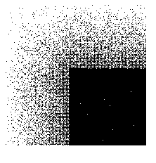
</p>
<!-- 09-image033.png -->
<div align="right">
  <b><a href="#toc">↥ back to top</a></b>
</div>
<!--~~~~~~~~~~~~~~~~~~~~~~~~~~~~~~~~~~~~~~~~~~~~~~~~~~~~~~~~~~~~~~~~~~~~~~~~~~~~~~~~~~~~~~~~~~~~-->
<!--~~~~~~~~~~~~~~~~~~~~~~~~~~~~~~~~~~~~~~~~~~~~~~~~~~~~~~~~~~~~~~~~~~~~~~~~~~~~~~~~~~~~~~~~~~~~-->
<h3>Next group goes here</h3>
<!--~~~~~~~~~~~~~~~~~~~~~~~~~~~~~~~~~~~~~~~~~~~~~~~~~~~~~~~~~~~~~~~~~~~~~~~~~~~~~~~~~~~~~~~~~~~~-->
<!--~~~~~~~~~~~~~~~~~~~~~~~~~~~~~~~~~~~~~~~~~~~~~~~~~~~~~~~~~~~~~~~~~~~~~~~~~~~~~~~~~~~~~~~~~~~~-->
<!-- W3 Schools tutorial for basic svg tag -->
<!--~~~~~~~~~~~~~~~~~~~~~~~~~~~~~~~~~~~~~~~~~~-->
<!-- 09-image001.png - svg line drawing. -->
<!--~~~~~~~~~~~~~~~~~~~~~~~~~~~~~~~~~~~~~~~~~~-->
<h3>What is SVG?</h3>
<!--~~~~~~~~~~~~~~~~~~~~~~~~~~~~~~~~~~~~~~~~~~-->
<ul>
  <li><p>SVG stands for Scalable Vector Graphics.</p></li>
  <li><p>SVG is used to define vector-based graphics for the Web.</p></li>
  <li><p>SVG defines graphics in XML format</p></li>
  <li><p>Each element and attribute in SVG files can be animated</p></li>
  <li><p>SVG is a W3C recommendation</p></li>
  <li><p>SVG integrates with other standards, such as CSS, DOM, XSL and JavaScript</p></li>
</ul>
<!--~~~~~~~~~~~~~~~~~~~~~~~~~~~~~~~~~~~~~~~~~~-->
<h4>The &lt;svg&gt; Element</h4>
<!--~~~~~~~~~~~~~~~~~~~~~~~~~~~~~~~~~~~~~~~~~~-->
<p>The HTML &lt;svg&gt; element is a container for SVG graphics.</p>

<p>SVG has several methods for drawing paths, rectangles, circles, polygons, text, and 
much more.</p>

<!--~~~~~~~~~~~~~~~~~~~~~~~~~~~~~~~~~~~~~~~~~~-->
<h3>SVG Circle</h3>
<!--~~~~~~~~~~~~~~~~~~~~~~~~~~~~~~~~~~~~~~~~~~-->
<svg 09-w3-image001>

```
<!DOCTYPE html>
<html>
<body>

<svg width="100" height="100">
  <circle cx="50" cy="50" r="40" stroke="green" stroke-width="4" fill="yellow" />
</svg>

</body>
</html>
```

<!--~~~~~~~~~~~~~~~~~~~~~~~~~~~~~~~~~~~~~~~~~~-->
<h3>SVG Rectangle</h3>
<!--~~~~~~~~~~~~~~~~~~~~~~~~~~~~~~~~~~~~~~~~~~-->
<svg 09-w3-image002>

```
<svg width="400" height="120">
  <rect x="10" y="10" width="200" height="100" stroke="red" stroke-width="6" fill="blue" />
</svg>
```

<!--~~~~~~~~~~~~~~~~~~~~~~~~~~~~~~~~~~~~~~~~~~-->
<h3>SVG Rectangle with Opacity and Rounded Corners</h3>
<!--~~~~~~~~~~~~~~~~~~~~~~~~~~~~~~~~~~~~~~~~~~-->
<svg 09-w3-image003>

```
<svg width="400" height="180">
  <rect x="50" y="20" rx="20" ry="20" width="150" height="150"
  style="fill:red;stroke:black;stroke-width:5;opacity:0.5" />
</svg>
```

<!--~~~~~~~~~~~~~~~~~~~~~~~~~~~~~~~~~~~~~~~~~~-->
<h3>SVG Star</h3>
<!--~~~~~~~~~~~~~~~~~~~~~~~~~~~~~~~~~~~~~~~~~~-->
<svg 09-w3-image004>

```
<svg width="300" height="200">
  <polygon points="100,10 40,198 190,78 10,78 160,198"
  style="fill:lime;stroke:purple;stroke-width:5;fill-rule:evenodd;" />
</svg>
```

<!--~~~~~~~~~~~~~~~~~~~~~~~~~~~~~~~~~~~~~~~~~~-->
<h3>SVG Gradient Ellipse and Text</h3>
<!--~~~~~~~~~~~~~~~~~~~~~~~~~~~~~~~~~~~~~~~~~~-->
<svg 09-w3-image005>

```
<svg height="130" width="500">
  <defs>
    <linearGradient id="grad1">
      <stop offset="0%" stop-color="yellow" />
      <stop offset="100%" stop-color="red" />
    </linearGradient>
  </defs>
  <ellipse cx="100" cy="70" rx="85" ry="55" fill="url(#grad1)" />
  <text fill="#ffffff" font-size="45" font-family="Verdana" x="50" y="86">SVG</text>
  Sorry, your browser does not support inline SVG.
</svg>
```

<!--~~~~~~~~~~~~~~~~~~~~~~~~~~~~~~~~~~~~~~~~~~-->
<h3>Differences Between SVG and Canvas</h3>
<!--~~~~~~~~~~~~~~~~~~~~~~~~~~~~~~~~~~~~~~~~~~-->
<ul>
  <li>SVG is a language for describing 2D graphics in XML, while Canvas draws 2D graphics, on 
    the fly (with JavaScript).</li>
  <li>SVG is XML based, which means that every element is available within the SVG DOM. You 
    can attach JavaScript event handlers to SVG graphics.</li>
  <li>In SVG, each drawn shape is remembered as an object. If attributes of an SVG object are 
    changed, the browser can automatically re-render the shape.</li>
  <li>Canvas is rendered pixel by pixel. In canvas, once the graphic is drawn, it is forgotten 
    by the browser. If its position should be changed, the entire scene needs to be redrawn, 
    including any objects that might have been covered by the graphic.</li>
</ul>
<!--~~~~~~~~~~~~~~~~~~~~~~~~~~~~~~~~~~~~~~~~~~-->
<h3>Comparison of SVG and Canvas</h3>
<!--~~~~~~~~~~~~~~~~~~~~~~~~~~~~~~~~~~~~~~~~~~-->
<p>The table below shows some important differences between Canvas and SVG:</p>
<div role="region" tabindex="0">
  <table>
    <caption>Comparison of SVG and Canvas</caption>
    <thead>
      <tr>
        <th>SVG</th>
        <th>Canvas</th>
      </tr>
    </thead>
    <tbody>
      <tr>
        <td>Resolution independent</td>
        <td>Resolution dependent.</td>
      </tr>
      <tr>
        <td>Support for event handlers</td>
        <td>No support for event handlers.</td>
      </tr>
      <tr>
        <td>Good text rendering capabilities</td>
        <td>Poor text rendering capabilities.</td>
      </tr>
      <tr>
        <td>Slow rendering if complex</td>
        <td>You can save the resulting image as .png or .jpg.</td>
      </tr>
      <tr>
        <td>Not suited for game applications</td>
        <td>Well suited for graphic-intensive games.</td>
      </tr>
    </tbody>
  </table>
</div>
<!--~~~~~~~~~~~~~~~~~~~~~~~~~~~~~~~~~~~~~~~~~~-->
<h4>Creating SVG Images</h4>
<!--~~~~~~~~~~~~~~~~~~~~~~~~~~~~~~~~~~~~~~~~~~-->
<p>SVG images can be created with any text editor, or with a drawing program, like Inkscape.</p>

<p>For you to learn the concept and basics of SVG, this tutorial will just use plain text to teach you SVG.</p>

<p>The next page shows how to embed an SVG image directly into an HTML page!</p>

```
<!DOCTYPE html>
<html>
<body>

<h1>My first SVG</h1>

<svg width="100" height="100" xmlns="http://www.w3.org/2000/svg">
  <circle cx="50" cy="50" r="40" stroke="green" stroke-width="4" fill="yellow" />
</svg>

</body>
</html>
```

<!--~~~~~~~~~~~~~~~~~~~~~~~~~~~~~~~~~~~~~~~~~~-->
<!--svg-002.png-->
<!--~~~~~~~~~~~~~~~~~~~~~~~~~~~~~~~~~~~~~~~~~~-->
<h5>SVG Code explanation:</h5>
<!--~~~~~~~~~~~~~~~~~~~~~~~~~~~~~~~~~~~~~~~~~~-->
<ul>
  <li>Start with the &lt;svg&gt; root element.</li>
  <li>The width and height of the SVG image is defined with the width and height attributes.</li>
  <li>Since SVG is an XML dialect, always bind the namespace correctly with the xmlns attribute.</li>
  <li>The namespace "http://www.w3.org/2000/svg" identifies SVG elements inside an HTML document.</li>
  <li>The &lt;circle&gt; element is used to draw a circle.</li>
  <li>The cx and cy attributes define the x and y coordinates of the center of the circle. If omitted, 
    the circle's center is set to (0, 0).</li>
  <li>The r attribute defines the radius of the circle.</li>
  <li>The stroke and stroke-width attributes control how the outline of a shape appears. We set the 
    outline of the circle to a 4px green "border".</li>
  <li>The fill attribute refers to the color inside the circle. We set the fill color to yellow.</li>
  <li>The closing &lt;/svg&gt; tag closes the SVG image.</li>
</ul>

<blockquote>
Note: Since SVG is written in XML, remember this:

All elements must be properly closed
XML is case-sensitive, so write all SVG elements and attributes in same case. We prefer lower-case
Place all attribute values in SVG inside quotes (even if they are numbers)
</blockquote>

```
<!DOCTYPE html>
<html>
<body>

<svg width="150" height="100" xmlns="http://www.w3.org/2000/svg">
  <rect width="100%" height="100%" fill="green" />
  <circle cx="75" cy="50" r="40" fill="yellow" />
  <text x="75" y="60" font-size="30" text-anchor="middle" fill="red">SVG</text>
</svg>

</body>
</html>
```

<!--~~~~~~~~~~~~~~~~~~~~~~~~~~~~~~~~~~~~~~~~~~-->
<!--svg-003.png-->
<!--~~~~~~~~~~~~~~~~~~~~~~~~~~~~~~~~~~~~~~~~~~-->
<h5>SVG Code explanation:</h5>
<!--~~~~~~~~~~~~~~~~~~~~~~~~~~~~~~~~~~~~~~~~~~-->
<ul>
  <li>Start with the <mark>&lt;svg&gt;</mark> root element, define the width and height, 
    and proper namespace.</li>
  <li>The <mark>&lt;rect&gt;</mark> element is used to draw a rectangle.</li>
  <li>The width and height of the rectangle is set to 100% of the width/height of the 
    <mark>&lt;svg&gt;</mark> element.</li>
  <li>Set the fill color of the rectangle to green.</li>
  <li>The <mark>&lt;circle&gt;</mark> element is used to draw a circle.</li>
  <li>The <mark>cx</mark> and <mark>cy</mark> attributes define the x and y coordinates 
    of the center of the circle.</li>
  <li>The <mark>r</mark> attribute defines the radius of the circle.</li>
  <li>We set the fill color of the circle to yellow.</li>
  <li>The <mark>&lt;text&gt;</mark> element is used to draw a text.</li>
  <li>The <mark>x</mark> and <mark>y</mark> attributes define the x and y coordinates of 
    the center of the text.</li>
  <li>The <mark>font-size</mark> attribute defines the font size of the text.</li>
  <li>The <mark>text-anchor</mark> attribute defines where we want the midpoint (of the 
    text) to be.</li>
  <li>The <mark>fill</mark> attribute defines the color of the text.</li>
  <li>Write "SVG" as the text to show.</li>
  <li>Close the SVG image with <mark>&lt;/svg&gt;</mark>.</li>
</ul>
<!--~~~~~~~~~~~~~~~~~~~~~~~~~~~~~~~~~~~~~~~~~~-->
<h4>SVG Shapes</h4>
<!--~~~~~~~~~~~~~~~~~~~~~~~~~~~~~~~~~~~~~~~~~~-->
<p>SVG has some predefined shape elements that can be used by developers:</p>

<ul>
  <li>Rectangle <mark>&lt;rect&gt;</mark></li>
  <li>Circle <mark>&lt;circle&gt;</mark></li>
  <li>Ellipse <mark>&lt;ellipse&gt;</mark></li>
  <li>Line <mark>&lt;line&gt;</mark></li>
  <li>Polyline <mark>&lt;polyline&gt;</mark></li>
  <li>Polygon <mark>&lt;polygon&gt;</mark></li>
  <li>Path <mark>&lt;path&gt;</mark></li>
</ul>

<p>The following chapters will explain each element, starting with the <mark>&lt;rect&gt;</mark> element.</p>
<!--~~~~~~~~~~~~~~~~~~~~~~~~~~~~~~~~~~~~~~~~~~-->
<h4>SVG Rectangle - &lt;rect&gt;</h4>
<!--~~~~~~~~~~~~~~~~~~~~~~~~~~~~~~~~~~~~~~~~~~-->
<p>The <mark>&lt;rect&gt;</mark> element is used to create a rectangle and variations of a rectangle shape.</p>

<p>The <mark>&lt;rect&gt;</mark> element has six basic attributes to position and shape the rectangle:</p>
<div role="region" tabindex="0">
  <table>
    <caption>SVG Rectangle - &lt;rect&gt;</caption>
    <thead>
      <tr>
        <th>Attribute</th>
        <th>Description</th>
      </tr>
    </thead>
    <tbody>
      <tr>
        <td><b>width</b></td>
        <td>Required. The width of the rectangle.</td>
      </tr>
      <tr>
        <td><b>height</b></td>
        <td>Required. The height of the rectangle.</td>
      </tr>
      <tr>
        <td>x</td>
        <td>The x-position for the top-left corner of the rectangle.</td>
      </tr>
      <tr>
        <td>y</td>
        <td>The y-position for the top-left corner of the rectangle.</td>
      </tr>
      <tr>
        <td>rx</td>
        <td>The x radius of the corners of the rectangle (used to round the corners). Default is 0.</td>
      </tr>
      <tr>
        <td>ry</td>
        <td>The y radius of the corners of the rectangle (used to round the corners). Default is 0.</td>
      </tr>
    </tbody>
  </table>
</div>
<!--~~~~~~~~~~~~~~~~~~~~~~~~~~~~~~~~~~~~~~~~~~-->
<h4>An SVG Rectangle</h4>
<!--~~~~~~~~~~~~~~~~~~~~~~~~~~~~~~~~~~~~~~~~~~-->
<p>This example creates a rectangle with the six basic attributes and a fill color:</p>

```
<svg width="300" height="130" xmlns="http://www.w3.org/2000/svg">
  <rect width="200" height="100" x="10" y="10" rx="20" ry="20" fill="blue" />
</svg>
```

<!--svg-004.png-->

<!--~~~~~~~~~~~~~~~~~~~~~~~~~~~~~~~~~~~~~~~~~~-->
<h5>Code explanation:</h5>
<!--~~~~~~~~~~~~~~~~~~~~~~~~~~~~~~~~~~~~~~~~~~-->
<ul>
  <li>The <mark>width</mark> and <mark>height</mark> attributes of the <mark>&lt;rect&gt;</mark> 
    element define the height and the width of the rectangle.</li>
  <li>The <mark>x</mark> and <mark>y</mark> attributes defines the x- and y-position of the 
    top-left corner of the rectangle (x="10" places the rectangle 10px from the left margin 
    and y="10" places the rectangle 10px from the top margin) in the SVG canvas.</li>
  <li>The <mark>rx</mark> and <mark>ry</mark> attributes defines the radius of the 
    corners of the rectangle.</li>
  <li>The <mark>fill</mark> attribute defines the fill color of the rectangle.</li>
</ul>
<!--~~~~~~~~~~~~~~~~~~~~~~~~~~~~~~~~~~~~~~~~~~-->
<h4>A Rectangle With Border</h4>
<!--~~~~~~~~~~~~~~~~~~~~~~~~~~~~~~~~~~~~~~~~~~-->
<p>Let's look at another example that contains some new attributes:</p>

```
<svg width="320" height="130" xmlns="http://www.w3.org/2000/svg">
  <rect width="300" height="100" x="10" y="10" style="fill:rgb(0,0,255);stroke-width:3;stroke:red" />
</svg>
```

<!--~~~~~~~~~~~~~~~~~~~~~~~~~~~~~~~~~~~~~~~~~~-->
<h5>Code explanation:</h5>
<!--~~~~~~~~~~~~~~~~~~~~~~~~~~~~~~~~~~~~~~~~~~-->
<ul>
  <li>The <mark>style</mark> attribute is used to define CSS properties for the rectangle.</li>
  <li>The CSS <mark>fill</mark> property defines the fill color of the rectangle.</li>
  <li>The CSS <mark>stroke-width</mark> property defines the width of the border of the rectangle.</li>
  <li>The CSS <mark>stroke</mark> property defines the color of the border of the rectangle.</li>
</ul>
<!--~~~~~~~~~~~~~~~~~~~~~~~~~~~~~~~~~~~~~~~~~~-->
<h4>A Rectangle With Opacity</h4>
<!--~~~~~~~~~~~~~~~~~~~~~~~~~~~~~~~~~~~~~~~~~~-->
<p>Let's look at another example that contains some new attributes:</p>

```
<svg width="300" height="170" xmlns="http://www.w3.org/2000/svg">
  <rect width="150" height="150" x="10" y="10"
  style="fill:blue;stroke:pink;stroke-width:5;fill-opacity:0.1;stroke-opacity:0.9" />
</svg>
```

<!--~~~~~~~~~~~~~~~~~~~~~~~~~~~~~~~~~~~~~~~~~~-->
<!-- svg-006.png -->
<!--~~~~~~~~~~~~~~~~~~~~~~~~~~~~~~~~~~~~~~~~~~-->
<h5>Code explanation:</h5>
<!--~~~~~~~~~~~~~~~~~~~~~~~~~~~~~~~~~~~~~~~~~~-->
<ul>
  <li>The CSS <mark>fill-opacity</mark> property defines the opacity of the fill color (legal range: 0 to 1)</li>
  <li>The CSS <mark>stroke-opacity</mark> property defines the opacity of the stroke color (legal range: 0 to 1)</li>
</ul>
<!--~~~~~~~~~~~~~~~~~~~~~~~~~~~~~~~~~~~~~~~~~~-->
<h4>Another Rectangle With Opacity</h4>
<!--~~~~~~~~~~~~~~~~~~~~~~~~~~~~~~~~~~~~~~~~~~-->
<p>Define the opacity for the whole element:</p>

```
<svg width="300" height="170" xmlns="http://www.w3.org/2000/svg">
  <rect width="150" height="150" x="10" y="10"
  style="fill:blue;stroke:pink;stroke-width:5;opacity:0.5" />
</svg>
```

<!--~~~~~~~~~~~~~~~~~~~~~~~~~~~~~~~~~~~~~~~~~~-->
<!--svg-007.png-->
<!--~~~~~~~~~~~~~~~~~~~~~~~~~~~~~~~~~~~~~~~~~~-->
<h5>Code explanation:</h5>
<!--~~~~~~~~~~~~~~~~~~~~~~~~~~~~~~~~~~~~~~~~~~-->
<ul>
  <li>The CSS <mark>opacity</mark> property defines the opacity value for the whole 
    element (legal range: 0 to 1).</li>
</ul>
<!--~~~~~~~~~~~~~~~~~~~~~~~~~~~~~~~~~~~~~~~~~~-->
<h4>A Rectangle With Rounded Corners</h4>
<!--~~~~~~~~~~~~~~~~~~~~~~~~~~~~~~~~~~~~~~~~~~-->
<p>Last example, create a rectangle with rounded corners:</p>

```
<svg width="300" height="170" xmlns="http://www.w3.org/2000/svg">
  <rect width="150" height="150" x="10" y="10" rx="20" ry="20"
  style="fill:red;stroke:black;stroke-width:5;opacity:0.5" />
</svg>
```

<!--~~~~~~~~~~~~~~~~~~~~~~~~~~~~~~~~~~~~~~~~~~-->
<!--svg-008.png-->
<!--~~~~~~~~~~~~~~~~~~~~~~~~~~~~~~~~~~~~~~~~~~-->
<h4>SVG Circle - &lt;circle&gt;</h4>
<!--~~~~~~~~~~~~~~~~~~~~~~~~~~~~~~~~~~~~~~~~~~-->
<p>The &lt;circle&gt; element is used to create a circle.</p>

<p>The &lt;circle&gt; element has three basic attributes to position and set the size of the circle:</p>
<div role="region" tabindex="0">
  <table>
    <caption>SVG Circle - &lt;circle&gt;</caption>
    <thead>
      <tr>
        <th>Attribute</th>
        <th>Description</th>
      </tr>
    </thead>
    <tbody>
      <tr>
        <td>r</td>
        <td>Required. The radius of the circle.</td>
      </tr>
      <tr>
        <td>cx</td>
        <td>The x-axis center of the circle. Default is 0.</td>
      </tr>
      <tr>
        <td>cy</td>
        <td>The y-axis center of the circle. Default is 0.</td>
      </tr>
    </tbody>
  </table>
</div>
<!--~~~~~~~~~~~~~~~~~~~~~~~~~~~~~~~~~~~~~~~~~~-->
<h4>An SVG Circle</h4>
<!--~~~~~~~~~~~~~~~~~~~~~~~~~~~~~~~~~~~~~~~~~~-->
<p>The following example creates a circle:</p>

```
<svg height="100" width="100" xmlns="http://www.w3.org/2000/svg">
  <circle r="45" cx="50" cy="50" fill="red" />
</svg>
```

<!--~~~~~~~~~~~~~~~~~~~~~~~~~~~~~~~~~~~~~~~~~~-->
<!--svg-009.png-->
<!--~~~~~~~~~~~~~~~~~~~~~~~~~~~~~~~~~~~~~~~~~~-->
<h5>Code explanation:</h5>
<!--~~~~~~~~~~~~~~~~~~~~~~~~~~~~~~~~~~~~~~~~~~-->
<ul>
  <li>The <mark>r</mark> attribute defines the radius of the circle.</li>
  <li>The <mark>cx</mark> and <mark>cy</mark> attributes define the x- and y-axes center 
    of the circle. If they are omitted, the circle's center is set to (0,0).</li>
  <li>The <mark>fill</mark> attribute defines the color of the circle.</li>
</ul>
<!--~~~~~~~~~~~~~~~~~~~~~~~~~~~~~~~~~~~~~~~~~~-->
<h4>An SVG Circle with Border</h4>
<!--~~~~~~~~~~~~~~~~~~~~~~~~~~~~~~~~~~~~~~~~~~-->
<p>The following example creates a circle with border:</p>

```
<svg height="100" width="100" xmlns="http://www.w3.org/2000/svg">
  <circle r="45" cx="50" cy="50" fill="red" stroke="green" stroke-width="3" />
</svg>
```

<!--~~~~~~~~~~~~~~~~~~~~~~~~~~~~~~~~~~~~~~~~~~-->
<!--svg-010.png-->
<!--~~~~~~~~~~~~~~~~~~~~~~~~~~~~~~~~~~~~~~~~~~-->
<h5>Code explanation:</h5>
<!--~~~~~~~~~~~~~~~~~~~~~~~~~~~~~~~~~~~~~~~~~~-->
<ul>
  <li>The <mark>stroke</mark> attribute defines the color of the border around the circle.</li>
  <li>The <mark>stroke-width</mark> attribute defines the width of the border around the circle.</li>
</ul>
<!--~~~~~~~~~~~~~~~~~~~~~~~~~~~~~~~~~~~~~~~~~~-->
<h4>An SVG Circle with Opacity</h4>
<!--~~~~~~~~~~~~~~~~~~~~~~~~~~~~~~~~~~~~~~~~~~-->
<p>The following example creates a circle with opacity:</p>

```
<svg height="100" width="100" xmlns="http://www.w3.org/2000/svg">
  <circle r="45" cx="50" cy="50" fill="red" stroke="green" stroke-width="3" opacity="0.5" />
</svg>
```

<!--~~~~~~~~~~~~~~~~~~~~~~~~~~~~~~~~~~~~~~~~~~-->
<!--svg-011.png-->
<!--~~~~~~~~~~~~~~~~~~~~~~~~~~~~~~~~~~~~~~~~~~-->
<h5>Code explanation:</h5>
<!--~~~~~~~~~~~~~~~~~~~~~~~~~~~~~~~~~~~~~~~~~~-->
<ul>
  <li>The <mark>opacity</mark> attribute defines the opacity of the circle.</li>
</ul>
<!--~~~~~~~~~~~~~~~~~~~~~~~~~~~~~~~~~~~~~~~~~~~~~~~~~~~~~~~~~~~~~~~~~~~~~~~~~~~~~~~~~~~~~~~~~~~~-->
<h2 id="10-html-canvas">10. HTML Canvas</h2>
<!--~~~~~~~~~~~~~~~~~~~~~~~~~~~~~~~~~~~~~~~~~~~~~~~~~~~~~~~~~~~~~~~~~~~~~~~~~~~~~~~~~~~~~~~~~~~~-->
Using <canvas>, here's how you might draw a black box with rounded corners and a 2-pixel white
stroke:

```
function draw() {
  var canvas = document.getElementById('draw-in-me');
  if (canvas.getContext) {
    var ctx = canvas.getContext('2d');
    ctx.beginPath();
    ctx.moveTo(120.0, 32.0);
    ctx.bezierCurveTo(120.0, 36.4, 116.4, 40.0, 112.0, 40.0);
    ctx.lineTo(8.0, 40.0);
    ctx.bezierCurveTo(3.6, 40.0, 0.0, 36.4, 0.0, 32.0);
    ctx.lineTo(0.0, 8.0);
    ctx.bezierCurveTo(0.0, 3.6, 3.6, 0.0, 8.0, 0.0);
    ctx.lineTo(112.0, 0.0);
    ctx.bezierCurveTo(116.4, 0.0, 120.0, 3.6, 120.0, 8.0);
    ctx.lineTo(120.0, 32.0);
    ctx.closePath();
    ctx.fill();
    ctx.lineWidth = 2.0;
    ctx.strokeStyle = "rgb(255, 255, 255)";
    ctx.stroke();
  }
}
window.onload = draw;
```

<!-- image 10-image001.png -->
<!--~~~~~~~~~~~~~~~~~~~~~~~~~~~~~~~~~~~~~~~~~~~~~~~~~~~~~~~~~~~~~~~~~~~~~~~~~~~~~~~~~~~~~~~~~~~~-->
<h2 id="11-html-storage">11. HTML Storage</h2>
<!--~~~~~~~~~~~~~~~~~~~~~~~~~~~~~~~~~~~~~~~~~~~~~~~~~~~~~~~~~~~~~~~~~~~~~~~~~~~~~~~~~~~~~~~~~~~~-->

<!--~~~~~~~~~~~~~~~~~~~~~~~~~~~~~~~~~~~~~~~~~~~~~~~~~~~~~~~~~~~~~~~~~~~~~~~~~~~~~~~~~~~~~~~~~~~~-->
<h2 id="12-html-apis">12. HTML APIs</h2>
<!--~~~~~~~~~~~~~~~~~~~~~~~~~~~~~~~~~~~~~~~~~~~~~~~~~~~~~~~~~~~~~~~~~~~~~~~~~~~~~~~~~~~~~~~~~~~~-->
<p>All browsers have a set of built-in Web APIs to support complex operations, and to help accessing data.</p>

<p>Here are some of the main HTML5 APIs:</p>

<ol>
  <li>1. Geolocation API - This API is used to access the current location of a user (with latitude and longitude).</li>
  <li>2. Drag and Drop API - This API enables you to use drag-and-drop features in browsers.</li>
  <li>3. Web Storage API - This API has mechanisms to let browsers store key/value pairs (in a more intuitive way than cookies).</li>
  <li>4. Web Workers API - This API allows a JavaScript to run in the background, without affecting the performance of the page. Users can continue to do whatever they want: clicking, selecting things, etc., while the web worker runs in the background.</li>
  <li>5. Server-Sent Events API - This API allows a web page to automatically get updates from a server.</li>
  <li>6. Canvas API - This API lets you draw graphics, on the fly, via JavaScript.</li>
</ol>
<!--~~~~~~~~~~~~~~~~~~~~~~~~~~~~~~~~~~~~~~~~~~~~~~~~~~~~~~~~~~~~~~~~~~~~~~~~~~~~~~~~~~~~~~~~~~~~-->
<h3>Third Party APIs</h3>
<!--~~~~~~~~~~~~~~~~~~~~~~~~~~~~~~~~~~~~~~~~~~~~~~~~~~~~~~~~~~~~~~~~~~~~~~~~~~~~~~~~~~~~~~~~~~~~-->
<p>Third party APIs are not built into your browser.</p>

<p>To use these APIs, you will have to download the code from the Web.</p>
<!--~~~~~~~~~~~~~~~~~~~~~~~~~~~~~~~~~~~~~~~~~~-->
<h4>Examples:</h4>
<!--~~~~~~~~~~~~~~~~~~~~~~~~~~~~~~~~~~~~~~~~~~-->
<ul>
  <li>YouTube API - Allows you to display videos on a web site.</li>
  <li>Twitter API - Allows you to display Tweets on a web site.</li>
  <li>Facebook API - Allows you to display Facebook info on a web site.</li>
</ul>

<p><b>HTML Geolocation API</b> - The Geolocation API is used to access the user's current location.
Since this can compromise privacy, the location is not available unless the user approves it.</p>
<!--~~~~~~~~~~~~~~~~~~~~~~~~~~~~~~~~~~~~~~~~~~-->
<h4>Example</h4>
<!--~~~~~~~~~~~~~~~~~~~~~~~~~~~~~~~~~~~~~~~~~~-->

```
<script>
const x = document.getElementById("demo");

function getLocation() {
  if (navigator.geolocation) {
    navigator.geolocation.getCurrentPosition(success, error);
  } else {
    x.innerHTML = "Geolocation is not supported by this browser.";
  }
}

function success(position) {
  x.innerHTML = "Latitude: " + position.coords.latitude +
  "<br>Longitude: " + position.coords.longitude;
}

function error() {
  alert("Sorry, no position available.");
}
</script>
```

<!--~~~~~~~~~~~~~~~~~~~~~~~~~~~~~~~~~~~~~~~~~~-->
<h4>Example explained:</h4>
<!--~~~~~~~~~~~~~~~~~~~~~~~~~~~~~~~~~~~~~~~~~~-->
<ul>
  <li>Check if Geolocation is supported</li>
  <li>If Geolocation is supported, run the getCurrentPosition() method. If not, display a message to the user</li>
  <li>The success() function outputs the user's location in latitude and longitude</li>
  <li>The error() function alerts a text if the browser retrieves an error in getCurrentPosition()</li>
</ul>

<p>The second parameter of the getCurrentPosition() method is used to handle errors. It 
specifies a function to run if it fails to get the user's location.</p>
<!--~~~~~~~~~~~~~~~~~~~~~~~~~~~~~~~~~~~~~~~~~~-->
<h4>Example</h4>
<!--~~~~~~~~~~~~~~~~~~~~~~~~~~~~~~~~~~~~~~~~~~-->

```
function error(error) {
  switch(error.code) {
    case error.PERMISSION_DENIED:
      x.innerHTML = "User denied the request for Geolocation."
      break;
    case error.POSITION_UNAVAILABLE:
      x.innerHTML = "Location information is unavailable."
      break;
    case error.TIMEOUT:
      x.innerHTML = "The request to get user location timed out."
      break;
    case error.UNKNOWN_ERROR:
      x.innerHTML = "An unknown error occurred."
      break;
  }
}
```

```
<!DOCTYPE html>
<html>
<body>
<h1>HTML Geolocation</h1>
<p>Click the button to get your coordinates.</p>

<button onclick="getLocation()">Try It</button>

<p id="demo"></p>

<script>
const x = document.getElementById("demo");

function getLocation() {
  if (navigator.geolocation) {
    navigator.geolocation.getCurrentPosition(success, error);
  } else { 
    x.innerHTML = "Geolocation is not supported by this browser.";
  }
}

function success(position) {
  x.innerHTML = "Latitude: " + position.coords.latitude + 
  "<br>Longitude: " + position.coords.longitude;
}

function error(error) {
  switch(error.code) {
    case error.PERMISSION_DENIED:
      x.innerHTML = "User denied the request for Geolocation."
      break;
    case error.POSITION_UNAVAILABLE:
      x.innerHTML = "Location information is unavailable."
      break;
    case error.TIMEOUT:
      x.innerHTML = "The request to get user location timed out."
      break;
    case error.UNKNOWN_ERROR:
      x.innerHTML = "An unknown error occurred."
      break;
  }
}
</script>

</body>
</html>
```

<!--~~~~~~~~~~~~~~~~~~~~~~~~~~~~~~~~~~~~~~~~~~-->
<h3>Location-specific Information</h3>
<!--~~~~~~~~~~~~~~~~~~~~~~~~~~~~~~~~~~~~~~~~~~-->
<p>Geolocation is also very useful for location-specific information, like:</p>
<ul>
  <li>Up-to-date local information</li>
  <li>Showing Points-of-interest near the user</li>
  <li>Turn-by-turn navigation (GPS)</li>
</ul>
<!--~~~~~~~~~~~~~~~~~~~~~~~~~~~~~~~~~~~~~~~~~~-->
<h3>The getCurrentPosition() Method - Return Data</h3>
<!--~~~~~~~~~~~~~~~~~~~~~~~~~~~~~~~~~~~~~~~~~~-->
<p>The getCurrentPosition() method returns an object on success. The latitude, longitude and 
accuracy properties are always returned. The other properties are returned if available:</p>
<div role="region" tabindex="0">
  <table>
    <caption>The getCurrentPosition() Method - Return Data</caption>
    <thead>
      <tr>
        <th>Property</th>
        <th>Returns</th>
      </tr>
    </thead>
    <tbody>
      <tr>
        <td>coords.latitude</td>
        <td>The latitude as a decimal number (always returned)</td>
      </tr>
      <tr>
        <td>coords.longitude </td>
        <td>The longitude as a decimal number (always returned)</td>
      </tr>
      <tr>
        <td>coords.accuracy</td>
        <td>The accuracy of position (always returned)</td>
      </tr>
      <tr>
        <td>coords.altitude </td>
        <td>The altitude in meters above the mean sea level (returned if available)</td>
      </tr>
      <tr>
        <td>coords.altitudeAccuracy</td>
        <td>The altitude accuracy of position (returned if available)</td>
      </tr>
      <tr>
        <td>coords.heading</td>
        <td>The heading as degrees clockwise from North (returned if available)</td>
      </tr>
      <tr>
        <td>coords.speed </td>
        <td>The speed in meters per second (returned if available)</td>
      </tr>
      <tr>
        <td>timestamp</td>
        <td>The date/time of the response (returned if available).</td>
      </tr>
    </tbody>
  </table>
</div>
<!--~~~~~~~~~~~~~~~~~~~~~~~~~~~~~~~~~~~~~~~~~~-->
<h3>Geolocation Object - Other interesting Methods</h3>
<!--~~~~~~~~~~~~~~~~~~~~~~~~~~~~~~~~~~~~~~~~~~-->
<p>The Geolocation object also has other interesting methods:</p>
<ul>
  <li><b>watchPosition()</b> - Returns the current location of the user and continues to return 
    updated location as the user moves (like the GPS in a car).</li>
  <li><b>clearWatch()</b> - Stops the watchPosition() method.</li>
</ul>  
<p>The example below shows the watchPosition() method. You need an accurate GPS device to test 
this (like a smartphone):</p>
<!--~~~~~~~~~~~~~~~~~~~~~~~~~~~~~~~~~~~~~~~~~~-->
<h4>Example</h4>
<!--~~~~~~~~~~~~~~~~~~~~~~~~~~~~~~~~~~~~~~~~~~-->

```
<script>
const x = document.getElementById("demo");

function getLocation() {
  if (navigator.geolocation) {
    navigator.geolocation.watchPosition(success, error);
  } else {
    x.innerHTML = "Geolocation is not supported by this browser.";
  }
}

function success(position) {
  x.innerHTML = "Latitude: " + position.coords.latitude +
  "<br>Longitude: " + position.coords.longitude;
}

function error(error) {
  switch(error.code) {
    case error.PERMISSION_DENIED:
      x.innerHTML = "User denied the request for Geolocation."
      break;
    case error.POSITION_UNAVAILABLE:
      x.innerHTML = "Location information is unavailable."
      break;
    case error.TIMEOUT:
      x.innerHTML = "The request to get user location timed out."
      break;
    case error.UNKNOWN_ERROR:
      x.innerHTML = "An unknown error occurred."
      break;
  }
}
</script>
```

<!--~~~~~~~~~~~~~~~~~~~~~~~~~~~~~~~~~~~~~~~~~~~~~~~~~~~~~~~~~~~~~~~~~~~~~~~~~~~~~~~~~~~~~~~~~~~~-->
<h2 id="13-html-dragndrop">13. HTML Drag and Drop API</h2>
<!--~~~~~~~~~~~~~~~~~~~~~~~~~~~~~~~~~~~~~~~~~~~~~~~~~~~~~~~~~~~~~~~~~~~~~~~~~~~~~~~~~~~~~~~~~~~~-->
<p>The HTML Drag and Drop API enables an element to be dragged and dropped.</p>
<!--~~~~~~~~~~~~~~~~~~~~~~~~~~~~~~~~~~~~~~~~~~-->
<h4>HTML Drag and Drop API Example</h4>
<!--~~~~~~~~~~~~~~~~~~~~~~~~~~~~~~~~~~~~~~~~~~-->
<p>The example below is a simple drag and drop example:</p>
<!--~~~~~~~~~~~~~~~~~~~~~~~~~~~~~~~~~~~~~~~~~~-->
<h4>Example</h4>
<!--~~~~~~~~~~~~~~~~~~~~~~~~~~~~~~~~~~~~~~~~~~-->

```
<!DOCTYPE HTML>
<html>
<head>
<script>
function dragstartHandler(ev) {
  ev.dataTransfer.setData("text", ev.target.id);
}

function dragoverHandler(ev) {
  ev.preventDefault();
}

function dropHandler(ev) {
  ev.preventDefault();
  const data = ev.dataTransfer.getData("text");
  ev.target.appendChild(document.getElementById(data));
}
</script>
</head>
<body>

<div id="div1" ondrop="dropHandler(event)" ondragover="dragoverHandler(event)"></div>


</body>
</html>
```

<!--~~~~~~~~~~~~~~~~~~~~~~~~~~~~~~~~~~~~~~~~~~-->
<h4>Make an Element Draggable</h4>
<!--~~~~~~~~~~~~~~~~~~~~~~~~~~~~~~~~~~~~~~~~~~-->
<p>First of all: To make an element draggable, set the draggable attribute to true:</p>

```

```

<p>or:</p>

```
<p id="p1" draggable="true">Draggable text</p>
```

<!--~~~~~~~~~~~~~~~~~~~~~~~~~~~~~~~~~~~~~~~~~~-->
<h4>What to Drag - ondragstart and setData()</h4>
<!--~~~~~~~~~~~~~~~~~~~~~~~~~~~~~~~~~~~~~~~~~~-->
<p>Then, specify what should happen when the element is dragged.</p>

<p>In the example above, the ondragstart attribute of the  element calls a function (dragstartHandler(ev)), that specifies what data to be dragged.</p>

<p>The dataTransfer.setData() method sets the data type and the value of the dragged data:</p>

```
function dragstartHandler(ev) {
  ev.dataTransfer.setData("text", ev.target.id);
}
```

<p>In this case, the data type is "text" and the value is the id of the draggable element ("img1").</p>

<!--~~~~~~~~~~~~~~~~~~~~~~~~~~~~~~~~~~~~~~~~~~-->
<h4>Where to Drop - ondragover</h4>
<!--~~~~~~~~~~~~~~~~~~~~~~~~~~~~~~~~~~~~~~~~~~-->
<p>The ondragover attrribute of the <div> element calls a function (dragoverHandler(ev)), that specifies where the dragged data can be dropped.</p>

<p>By default, data/elements cannot be dropped in other elements. To allow a drop, we must prevent the default handling of the element.</p>

<p>This is done by calling the preventDefault() method for the ondragover event:</p>

```
function dragoverHandler(ev) {
  ev.preventDefault();
}
```

<h4>Do the Drop - ondrop</h4>
<p>When the dragged data is dropped, a drop event occurs.</p>

<p>In the example above, the ondrop attribute of the <div> element calls a function, dropHandler(event):</p>

```
function dropHandler(ev) {
  ev.preventDefault();
  const data = ev.dataTransfer.getData("text");
  ev.target.appendChild(document.getElementById(data));
}
```

<!--~~~~~~~~~~~~~~~~~~~~~~~~~~~~~~~~~~~~~~~~~~-->
<h4>Code explained:</h4>
<!--~~~~~~~~~~~~~~~~~~~~~~~~~~~~~~~~~~~~~~~~~~-->
<ul>
  <li>Call preventDefault() to prevent the browser default handling of the data (default is open as link on drop)</li>
  <li>Get the dragged data with the dataTransfer.getData() method. This method will return any data that was set to the same type in the setData() method</li>
  <li>The dragged data is the id of the dragged element ("img1")</li>
  <li>Append the dragged element into the drop element</li>
</ul>
<!--~~~~~~~~~~~~~~~~~~~~~~~~~~~~~~~~~~~~~~~~~~-->
<h4>Example</h4>
<!--~~~~~~~~~~~~~~~~~~~~~~~~~~~~~~~~~~~~~~~~~~-->
<p>How to drag and drop an &lt;h1&gt; element to a &lt;div&gt; element:</p>

```
<script>
function dragstartHandler(ev) {
  ev.dataTransfer.setData("text", ev.target.id);
}

function dragoverHandler(ev) {
  ev.preventDefault();
}

function dropHandler(ev) {
  ev.preventDefault();
  const data = ev.dataTransfer.getData("text");
  ev.target.appendChild(document.getElementById(data));
}
</script>
</head>
<body>

<div id="div1" ondrop="dropHandler(event)" ondragover="dragoverHandler(event)"></div>

<h1 id="h1" draggable="true" ondragstart="dragstartHandler(event)">W3Schools.com</h1>
```

<!--~~~~~~~~~~~~~~~~~~~~~~~~~~~~~~~~~~~~~~~~~~~~~~~~~~~~~~~~~~~~~~~~~~~~~~~~~~~~~~~~~~~~~~~~~~~~-->
<h2>HTML Web Storage API</h2>
<!--~~~~~~~~~~~~~~~~~~~~~~~~~~~~~~~~~~~~~~~~~~~~~~~~~~~~~~~~~~~~~~~~~~~~~~~~~~~~~~~~~~~~~~~~~~~~-->
<h3>What is HTML Web Storage?</h3>
<!--~~~~~~~~~~~~~~~~~~~~~~~~~~~~~~~~~~~~~~~~~~-->
<p>With web storage, applications can store data locally within the user's browser.</p>

<p>Before HTML5, application data had to be stored in cookies, included in every server request. Web storage is more secure, and large amounts of data can be stored locally, without affecting website performance.</p>

<p>Unlike cookies, the storage limit is far larger (at least 5MB) and information is never transferred to the server.</p>

<p>Web storage is per origin (per domain and protocol). All pages, from one origin, can store and access the same data.</p>
<!--~~~~~~~~~~~~~~~~~~~~~~~~~~~~~~~~~~~~~~~~~~-->
<h2>Web Storage API Objects</h2>
<!--~~~~~~~~~~~~~~~~~~~~~~~~~~~~~~~~~~~~~~~~~~-->
<p>Web storage provides two objects for storing data in the browser:</p>
<ul>
  <li><b>window.localStorage</b> - stores data with no expiration date (data is not lost when the browser tab is closed)</li>
  <li><b>window.sessionStorage</b> - stores data for one session (data is lost when the browser tab is closed)</li>
</ul>
<!--~~~~~~~~~~~~~~~~~~~~~~~~~~~~~~~~~~~~~~~~~~-->
<h4>Example</h4>
<!--~~~~~~~~~~~~~~~~~~~~~~~~~~~~~~~~~~~~~~~~~~-->

```
<script>
const x = document.getElementById("result");
if (typeof(Storage) !== "undefined") {
  x.innerHTML = "Your browser supports Web storage!";
} else {
  x.innerHTML = "Sorry, no Web storage support!";
}
</script>
```

<!--~~~~~~~~~~~~~~~~~~~~~~~~~~~~~~~~~~~~~~~~~~-->
<h3>The localStorage Object</h3>
<!--~~~~~~~~~~~~~~~~~~~~~~~~~~~~~~~~~~~~~~~~~~-->
<p>The localStorage object stores the data with no expiration date. The data will not be lost 
when the browser is closed, and will be available the next day, week, or year.</p>
<!--~~~~~~~~~~~~~~~~~~~~~~~~~~~~~~~~~~~~~~~~~~-->
<h4>Example - Use <b>localStorage to set and retrieve name and value pairs:</h4>
<!--~~~~~~~~~~~~~~~~~~~~~~~~~~~~~~~~~~~~~~~~~~-->
<h4>Example explained:</h4>
<!--~~~~~~~~~~~~~~~~~~~~~~~~~~~~~~~~~~~~~~~~~~-->
<ul>
  <li>Use the localStorage.setItem() method to create name/value pairs</li>
  <li>Use the localStorage.getItem() method to retrieve the values set</li>
  <li>Retrieve the value of "lastname" and insert it into an element with id="result"</li>
  <li>Retrieve the value of "bgcolor" and insert it into the style backgroundColor 
    of the element with id="result"</li>
</ul>
<p>The syntax for removing the "lastname" localStorage item is as follows:</p>
<pre>localStorage.removeItem("lastname");</pre>
<!--~~~~~~~~~~~~~~~~~~~~~~~~~~~~~~~~~~~~~~~~~~-->
<h3>Counting Clicks with localStorage</h3>
<!--~~~~~~~~~~~~~~~~~~~~~~~~~~~~~~~~~~~~~~~~~~-->
<p>The following example counts the number of times a user has clicked a button. In this 
code the value string is converted to a number to be able to increase the counter:</p>
<!--~~~~~~~~~~~~~~~~~~~~~~~~~~~~~~~~~~~~~~~~~~-->
<h4>Example</h4>
<!--~~~~~~~~~~~~~~~~~~~~~~~~~~~~~~~~~~~~~~~~~~-->

```
<script>
function clickCounter() {
  const x = document.getElementById("result");
  if (typeof(Storage) !== "undefined") {
    if (localStorage.clickcount) {
      localStorage.clickcount = Number(localStorage.clickcount)+1;
    } else {
      localStorage.clickcount = 1;
    }
    x.innerHTML = "You have clicked the button " + localStorage.clickcount + " time(s)!";
  } else {
    x.innerHTML = "Sorry, no Web storage support!";
  }
}
</script>
```

<!--~~~~~~~~~~~~~~~~~~~~~~~~~~~~~~~~~~~~~~~~~~-->
<h4>sessionStorage Object</h4>
<!--~~~~~~~~~~~~~~~~~~~~~~~~~~~~~~~~~~~~~~~~~~-->


```
<script>
const x = document.getElementById("result");

if (typeof(Storage) !== "undefined") {
  // Store
  localStorage.setItem("lastname", "Smith");
  localStorage.setItem("bgcolor", "yellow");
  // Retrieve
  x.innerHTML = localStorage.getItem("lastname");
  x.style.backgroundColor = localStorage.getItem("bgcolor");
} else {
  x.innerHTML = "Sorry, no Web storage support!";
}
</script>
```

<!--~~~~~~~~~~~~~~~~~~~~~~~~~~~~~~~~~~~~~~~~~~-->
<h3>The sessionStorage Object</h3>
<!--~~~~~~~~~~~~~~~~~~~~~~~~~~~~~~~~~~~~~~~~~~-->
<p>The sessionStorage object is equal to the localStorage object, except that it stores the data 
for only one session! The data is deleted when the user closes the specific browser tab.</p>
<!--~~~~~~~~~~~~~~~~~~~~~~~~~~~~~~~~~~~~~~~~~~-->
<h3>Counting Clicks with sessionStorage</h3>
<!--~~~~~~~~~~~~~~~~~~~~~~~~~~~~~~~~~~~~~~~~~~-->
<p>The following example counts the number of times a user has clicked a button, in the current session:</p>
<!--~~~~~~~~~~~~~~~~~~~~~~~~~~~~~~~~~~~~~~~~~~-->
<h4>Example</h4>
<!--~~~~~~~~~~~~~~~~~~~~~~~~~~~~~~~~~~~~~~~~~~-->

```
<script>
function clickCounter() {
  const x = document.getElementById("result");
  if (typeof(Storage) !== "undefined") {
    if (sessionStorage.clickcount) {
      sessionStorage.clickcount = Number(sessionStorage.clickcount)+1;
    } else {
      sessionStorage.clickcount = 1;
    }
    x.innerHTML = "You have clicked the button " + sessionStorage.clickcount + " time(s) in this session!";
  } else {
    x.innerHTML = "Sorry, no Web storage support!";
  }
}
</script>
```

<!--~~~~~~~~~~~~~~~~~~~~~~~~~~~~~~~~~~~~~~~~~~~~~~~~~~~~~~~~~~~~~~~~~~~~~~~~~~~~~~~~~~~~~~~~~~~~-->
<h2 id="14-html-webworker">14. HTML Web Workers API</h2>
<!--~~~~~~~~~~~~~~~~~~~~~~~~~~~~~~~~~~~~~~~~~~~~~~~~~~~~~~~~~~~~~~~~~~~~~~~~~~~~~~~~~~~~~~~~~~~~-->
<p>A web worker is an external JavaScript file that runs in the background, without affecting the 
performance of the page.</p>
<!--~~~~~~~~~~~~~~~~~~~~~~~~~~~~~~~~~~~~~~~~~~-->
<h3>What is a Web Worker?</h3>
<!--~~~~~~~~~~~~~~~~~~~~~~~~~~~~~~~~~~~~~~~~~~-->
<p>When executing scripts in an HTML page, the page becomes unresponsive until the script is finished.</p>

<p>A web worker is an external JavaScript file that runs in the background, independently of other 
scripts, without affecting the performance of the page. You can continue to do whatever you want: 
clicking, selecting things, etc., while the web worker runs in the background.</p>

<p>Web workers are useful for heavy code that can't be run on the main thread, without causing long 
tasks that make the page unresponsive.</p>
<!--~~~~~~~~~~~~~~~~~~~~~~~~~~~~~~~~~~~~~~~~~~-->
<h4>Web Workers API Example</h4>
<!--~~~~~~~~~~~~~~~~~~~~~~~~~~~~~~~~~~~~~~~~~~-->
<p>The example below creates a simple web worker that count numbers in the background:</p>
<!--~~~~~~~~~~~~~~~~~~~~~~~~~~~~~~~~~~~~~~~~~~-->
<h4>Example</h4>
<!--~~~~~~~~~~~~~~~~~~~~~~~~~~~~~~~~~~~~~~~~~~-->

```
<!DOCTYPE html>
<html>
<body>

<h1>Web Worker API</h1>

<p>Count numbers: <output id="result"></output></p>
<button onclick="startWorker()">Start Worker</button> 
<button onclick="stopWorker()">Stop Worker</button>

<script>
let w;

function startWorker() {
  const x = document.getElementById("result");
  if(typeof(Worker) !== "undefined") {
    if(typeof(w) == "undefined") {
      w = new Worker("demo_workers.js");
    }
    w.onmessage = function(event) {
      x.innerHTML = event.data;
    };
  } else {
    x.innerHTML = "Sorry! No Web Worker support.";
  }
}

function stopWorker() { 
  w.terminate();
  w = undefined;
}
</script>

</body>
</html>
```

<!--~~~~~~~~~~~~~~~~~~~~~~~~~~~~~~~~~~~~~~~~~~-->
<h4>Check Web Worker API Support</h4>
<!--~~~~~~~~~~~~~~~~~~~~~~~~~~~~~~~~~~~~~~~~~~-->
<p>Before using web worker, we can quickly check browser support:</p>

<!--~~~~~~~~~~~~~~~~~~~~~~~~~~~~~~~~~~~~~~~~~~-->
<h4>Example</h4>
<!--~~~~~~~~~~~~~~~~~~~~~~~~~~~~~~~~~~~~~~~~~~-->

```
<script>
const x = document.getElementById("result");
if(typeof(Worker) !== "undefined") {
  x.innerHTML = "Your browser support Web Workers!";
} else {
  x.innerHTML = "Sorry, your browser does not support Web Workers.";
}
</script>
```

<!--~~~~~~~~~~~~~~~~~~~~~~~~~~~~~~~~~~~~~~~~~~-->
<h4>Create a .js Web Worker File</h4>
<!--~~~~~~~~~~~~~~~~~~~~~~~~~~~~~~~~~~~~~~~~~~-->
<p>Now, let's create a web worker in an external JavaScript file.</p>

<p>Here we create a script that counts. The script is stored in the "demo_workers.js" file:</p>

```
var i = 0;

function timedCount() {
  i = i + 1;
  postMessage(i);
  setTimeout("timedCount()",500);
}

timedCount();

```

<p>Note: The important part of the code above is the postMessage() method - which is used to post messages back to the HTML page.</p>

<!--~~~~~~~~~~~~~~~~~~~~~~~~~~~~~~~~~~~~~~~~~~-->
<h3>Create a Web Worker Object</h3>
<!--~~~~~~~~~~~~~~~~~~~~~~~~~~~~~~~~~~~~~~~~~~-->
<p>Once we have created the .js web worker file, we can call it from an HTML page.</p>

<p>The following lines checks if a worker (w) already exists, if not - it creates a new web worker object and points to the .js file: "demo_workers.js":</p>

```
if (typeof(w) == "undefined") {
  w = new Worker("demo_workers.js");
}
```

<p>Then we can SEND and RETRIEVE messages from the web worker.</p>

<p>Data is sent between web workers and the main thread via a system of messages - both 
sides send their messages using the postMessage() method, and respond to messages via 
the onmessage event handler.</p>

<p>Add an onmessage event listener to the web worker object.</p>

```
w.onmessage = function(event){
  document.getElementById("result").innerHTML = event.data;
};
```

<!--~~~~~~~~~~~~~~~~~~~~~~~~~~~~~~~~~~~~~~~~~~-->
<h3>Terminate a Web Worker</h3>
<!--~~~~~~~~~~~~~~~~~~~~~~~~~~~~~~~~~~~~~~~~~~-->
<p>When a web worker object is created, it will continue to listen for messages until it 
is terminated.</p>

<p>To terminate a web worker object, and free browser/computer resources, use the 
terminate() method:</p>

```
w.terminate();
```

<!--~~~~~~~~~~~~~~~~~~~~~~~~~~~~~~~~~~~~~~~~~~-->
<h3>Reuse the Web Worker</h3>
<!--~~~~~~~~~~~~~~~~~~~~~~~~~~~~~~~~~~~~~~~~~~-->
<p>If you set the web worker variable to undefined, after it has been terminated, you can reuse the worker/code:</p>

```
w = undefined;
```

<!--~~~~~~~~~~~~~~~~~~~~~~~~~~~~~~~~~~~~~~~~~~-->
<h3>Full Web Worker Example</h3>
<!--~~~~~~~~~~~~~~~~~~~~~~~~~~~~~~~~~~~~~~~~~~-->
<p>We have already seen the Web Worker code in the .js file.</p>

<p>Below is the full code for the HTML page:</p>

<h4>Example</h4>

```
<!DOCTYPE html>
<html>
<body>

<p>Count numbers: <output id="result"></output></p>
<button onclick="startWorker()">Start Worker</button>
<button onclick="stopWorker()">Stop Worker</button>

<script>
let w;

function startWorker() {
  const x = document.getElementById("result");
  if (typeof(Worker) !== "undefined") {
    if (typeof(w) == "undefined") {
      w = new Worker("demo_workers.js");
    }
    w.onmessage = function(event) {
      x.innerHTML = event.data;
    };
  } else {
    x.innerHTML = "Sorry! No Web Worker support.";
  }
}

function stopWorker() {
  w.terminate();
  w = undefined;
}
</script>

</body>
</html>
```

<!--~~~~~~~~~~~~~~~~~~~~~~~~~~~~~~~~~~~~~~~~~~-->
<h3>Web Workers and the DOM</h3>
<!--~~~~~~~~~~~~~~~~~~~~~~~~~~~~~~~~~~~~~~~~~~-->
<p>Since web workers are in external .js files, they do not have access to the following JavaScript objects:</p>

<ul>
  <li>The window object</li>
  <li>The document object</li>
  <li>The parent object</li>
</ul>
<!--~~~~~~~~~~~~~~~~~~~~~~~~~~~~~~~~~~~~~~~~~~~~~~~~~~~~~~~~~~~~~~~~~~~~~~~~~~~~~~~~~~~~~~~~~~~~-->
<h2 id="html-serversent-events">xx.  HTML Server-Sent Events API</h2>
<!--~~~~~~~~~~~~~~~~~~~~~~~~~~~~~~~~~~~~~~~~~~~~~~~~~~~~~~~~~~~~~~~~~~~~~~~~~~~~~~~~~~~~~~~~~~~~-->
<p>The Server-Sent Events (SSE) API enables pushing messages/updates from a server to 
the web page via HTTP connection.</p>
<!--~~~~~~~~~~~~~~~~~~~~~~~~~~~~~~~~~~~~~~~~~~-->
<h3>Server-Sent Events - One Way Messaging</h3>
<!--~~~~~~~~~~~~~~~~~~~~~~~~~~~~~~~~~~~~~~~~~~-->
<p>A server-sent event is when a web page automatically gets messages/updates from a server.</p>

<p>Normally, a web page has to request data from the server, but with server-sent events, 
the updates are pushed automatically.</p>

<p>Examples: Facebook/Twitter updates, stock market updates, news feeds, sport results, etc.</p>
<!--~~~~~~~~~~~~~~~~~~~~~~~~~~~~~~~~~~~~~~~~~~-->
<h3>Receive Server-Sent Event Notifications</h3>
<!--~~~~~~~~~~~~~~~~~~~~~~~~~~~~~~~~~~~~~~~~~~-->
<p>The EventSource object is used to receive server-sent event notifications:</p>
<!--~~~~~~~~~~~~~~~~~~~~~~~~~~~~~~~~~~~~~~~~~~-->
<h4>Example</h4>
<!--~~~~~~~~~~~~~~~~~~~~~~~~~~~~~~~~~~~~~~~~~~-->

```
<script>
const x = document.getElementById("result");
// Check browser support for SSE
if(typeof(EventSource) !== "undefined") {
  var source = new EventSource("demo_sse.php");
  source.onmessage = function(event) {
    x.innerHTML += event.data + "<br>";
  };
} else {
  x.innerHTML = "Sorry, no support for server-sent events.";
}
</script>
```

<!--~~~~~~~~~~~~~~~~~~~~~~~~~~~~~~~~~~~~~~~~~~-->
<h4>Example explained:</h4>
<!--~~~~~~~~~~~~~~~~~~~~~~~~~~~~~~~~~~~~~~~~~~-->
<ul>
  <li>Create a new EventSource object, and specify the URL of the page sending the updates (in 
    this example "demo_sse.php")</li>
  <li>Each time an update is received, the onmessage event occurs</li>
  <li>When an onmessage event occurs, put the received data into the element with id="result"</li>
</ul>
<!--~~~~~~~~~~~~~~~~~~~~~~~~~~~~~~~~~~~~~~~~~~-->
<h4>Check Browser Support</h4>
<!--~~~~~~~~~~~~~~~~~~~~~~~~~~~~~~~~~~~~~~~~~~-->
<p>In the tryit example above there were some extra lines of code to check browser 
support for server-sent events:</p>

```
if(typeof(EventSource) !== "undefined") {
  // Yes! Server-sent events support!
  // Some code.....
} else {
  // Sorry! No server-sent events support..
}
```

<!--~~~~~~~~~~~~~~~~~~~~~~~~~~~~~~~~~~~~~~~~~~-->
<h4>Server-Side Code Example</h4>
<!--~~~~~~~~~~~~~~~~~~~~~~~~~~~~~~~~~~~~~~~~~~-->
<p>For the example above to work, you need a server capable of sending data updates (like 
PHP or ASP).</p>

<pThe server-side event stream syntax is simple. Set the "Content-Type" header to 
"text/event-stream". Now you can start sending event streams.</p>

<p>Code in PHP (demo_sse.php):</p>

```
<?php
header('Content-Type: text/event-stream');
header('Cache-Control: no-cache');

$time = date('r');
echo "data: The server time is: {$time}\n\n";
flush();
?>
```

<p>Code in ASP (VB) (demo_sse.asp):</p>

```
<%
Response.ContentType = "text/event-stream"
Response.Expires = -1
Response.Write("data: The server time is: " & now())
Response.Flush()
%>
```

<!--~~~~~~~~~~~~~~~~~~~~~~~~~~~~~~~~~~~~~~~~~~-->
<h4>Code explained:</h4>
<!--~~~~~~~~~~~~~~~~~~~~~~~~~~~~~~~~~~~~~~~~~~-->
<ul>
  <li>Set the "Content-Type" header to "text/event-stream"</li>
  <li>Specify that the page should not cache</li>
  <li>Output the data to send (Always start with "data: ")</li>
  <li>Flush the output data back to the web page</li>
</ul>
<!--~~~~~~~~~~~~~~~~~~~~~~~~~~~~~~~~~~~~~~~~~~-->
<h4>The EventSource Object</h4>
<!--~~~~~~~~~~~~~~~~~~~~~~~~~~~~~~~~~~~~~~~~~~-->
<p>In the examples above we used the onmessage event to get messages. But other events are also available:</p>
<div role="region" tabindex="0">
  <table>
    <caption>The EventSource Object</caption>
    <thead>
      <tr>
        <th>Event</th>
        <th>Description</th>
      </tr>
    </thead>
    <tbody>
      <tr>
        <td>onopen</td>
        <td>When a connectoin to the server is opened.</td>
      </tr>
      <tr>
        <td>onmessage</td>
        <td>When a message is received.</td>
      </tr>
      <tr>
        <td>onerror</td>
        <td>When an error occurs.</td>
      </tr>
    </tbody>
  </table>
</div>
<!--~~~~~~~~~~~~~~~~~~~~~~~~~~~~~~~~~~~~~~~~~~~~~~~~~~~~~~~~~~~~~~~~~~~~~~~~~~~~~~~~~~~~~~~~~~~~-->
<!--
<div role="region" tabindex="0">
  <table>
    <caption>Caption goes here</caption>
    <thead>
      <tr>
        <th><b><mark></mark></b></th>
        <th><b><mark></mark></b></th>
      </tr>
    </thead>
    <tbody>
      <tr>
        <td><b><mark></mark></b></td>
        <td>.</td>
      </tr>
      <tr>
        <td><b><mark></mark></b></td>
        <td>.</td>
      </tr>
      <tr>
        <td><b><mark></mark></b></td>
        <td>.</td>
      </tr>
    </tbody>
  </table>
</div>
-->
<!--~~~~~~~~~~~~~~~~~~~~~~~~~~~~~~~~~~~~~~~~~~~~~~~~~~~~~~~~~~~~~~~~~~~~~~~~~~~~~~~~~~~~~~~~~~~~-->

<!--~~~~~~~~~~~~~~~~~~~~~~~~~~~~~~~~~~~~~~~~~~~~~~~~~~~~~~~~~~~~~~~~~~~~~~~~~~~~~~~~~~~~~~~~~~~~-->

<!--~~~~~~~~~~~~~~~~~~~~~~~~~~~~~~~~~~~~~~~~~~~~~~~~~~~~~~~~~~~~~~~~~~~~~~~~~~~~~~~~~~~~~~~~~~~~-->

<!--~~~~~~~~~~~~~~~~~~~~~~~~~~~~~~~~~~~~~~~~~~~~~~~~~~~~~~~~~~~~~~~~~~~~~~~~~~~~~~~~~~~~~~~~~~~~-->

<!--~~~~~~~~~~~~~~~~~~~~~~~~~~~~~~~~~~~~~~~~~~~~~~~~~~~~~~~~~~~~~~~~~~~~~~~~~~~~~~~~~~~~~~~~~~~~-->
<h2 id="15-html-access">15. HTML Accessibility</h2>
<!--~~~~~~~~~~~~~~~~~~~~~~~~~~~~~~~~~~~~~~~~~~~~~~~~~~~~~~~~~~~~~~~~~~~~~~~~~~~~~~~~~~~~~~~~~~~~-->

<div align="right">
  <b><a href="#toc">↥ back to top</a></b>
</div>
<!--~~~~~~~~~~~~~~~~~~~~~~~~~~~~~~~~~~~~~~~~~~~~~~~~~~~~~~~~~~~~~~~~~~~~~~~~~~~~~~~~~~~~~~~~~~~~-->
<h2 id="16-misc">16. Miscellaneous</h2>
<!--~~~~~~~~~~~~~~~~~~~~~~~~~~~~~~~~~~~~~~~~~~~~~~~~~~~~~~~~~~~~~~~~~~~~~~~~~~~~~~~~~~~~~~~~~~~~-->
<footer>
  <h6>Date created: ~ 4/1/2025<br/>
  <h6>Prior editted: 5/1/2025 +6pm<br/>
  <h6>Last editted: 5/2/2025 +11am<br/>
  <h6>Last editted: 5/4/2025 +12pm</h6>
  <h6>Last editted: 5/6/2025 +12pm</h6>
  <h6>Last editted: 5/9/2025 +9am</h6>
  <p>The End...</p>
  
<div align="right">
  <b><a href="#toc">↥ back to top</a></b>
</div>
</footer>
</body>
</html>
